1. Samples of six different brands of diet/imitation margarine were analyzed to determine the level of physiologically active polyunsaturated fatty acids (PAPFUA, in percentages), resulting in the following data: (see the table on page 437 exercise 26) Use ANOVA to test for differences among the true average PAPFUA percentages for the different brands. What is the test statistic value for this analysis?
 
work:
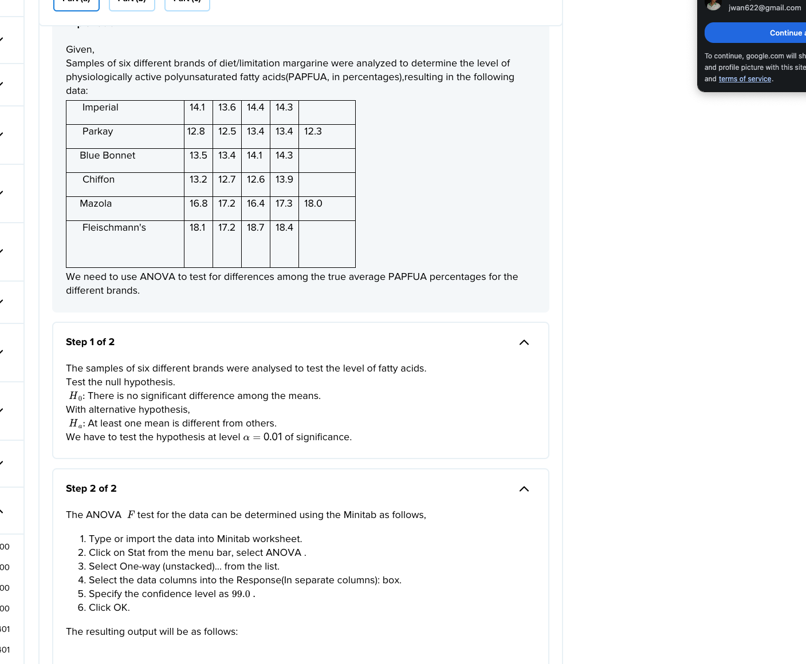

df = I - 1
df for num

answer: 79.26 is the F stat

2. In an experiment to compare the quality of four different brands of magnetic recording tape, five 2400-ft reels of each brand (A-D) were selected and the number of flaws in each reel was determined. (See page 437 exercise 32) It is believed that the number of flaws has approximately a Poisson distribution for each brand. Analyze the data at level .01 to see whether the expected number of flaws per reel is the same for each brand. Select all statements that are true.

work:
https://www.vaia.com/en-us/textbooks/math/probability-and-statistics-for-engineering-and-sciences-9th/the-analysis-of-variance/q32e-in-an-experiment-to-compare-the-quality-of-four-differe/

we need to:
1. get 2/3 of SST, SSTr, SSE because the third one is found by the fundamental equaltiy: SST = SSTr + SSE
2. remember that SST and SSTr subtract values from the grand total squared which is denoted by X dot dot ^2 in the shortcut formula.
3. then you can find MST and MSE which uses df of I - 1 and I(J - 1) respectively. that's our F statistic.

- [ ] H0 cannot be rejected
- [ ] We should reject H0
- [ ] The expected number of flaws per reel seem to depend upon the brand of tape.
- [ ] The test statistic is 3.23
- [ ] The MSTr is 1.84
 
answer:
- [x] H0 cannot be rejected

3. Consider the accompanying data on plant growth after the application of five different types of growth hormone. (See the table on page 407 exercise 18) Perform an F test at level alpha = .05. Select all statements that are true.
Group of answer choices

- [ ] We reject H0
- [ ] We fail to reject the null hypothesis
- [ ] The test statistic is equal to 3.49
- [ ] There appears to be no difference in the average growth with application of the different growth harmones.
- [ ] The MSTr is 5.0075

work:
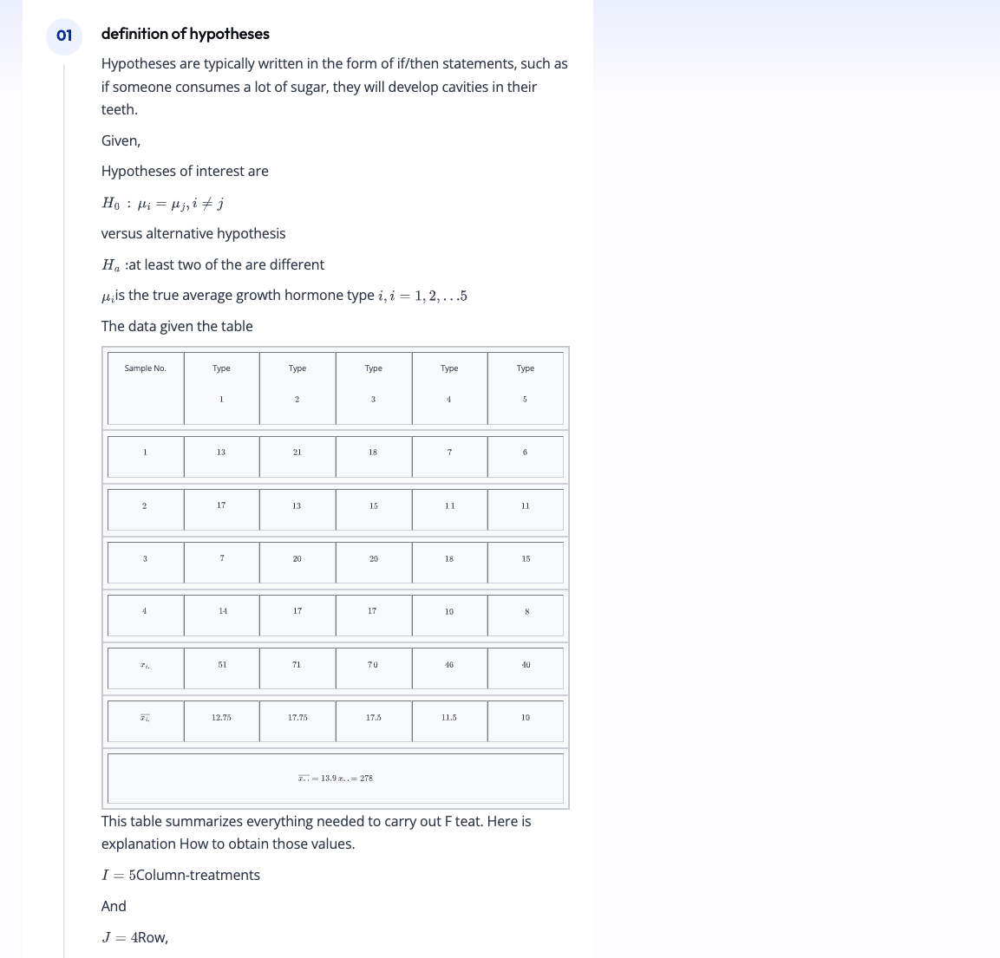
these are teh calcs we need:
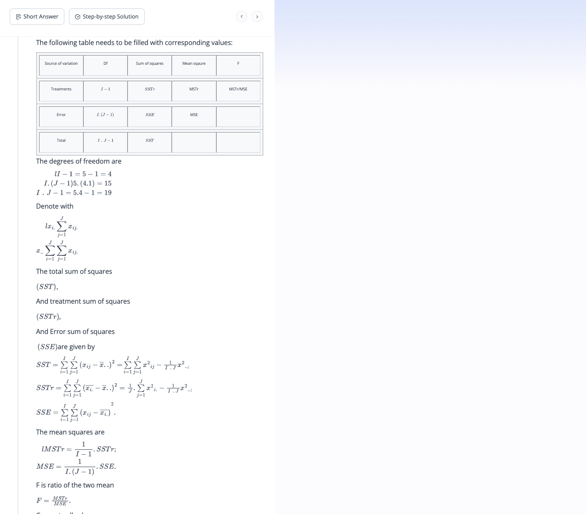

actual calcs:
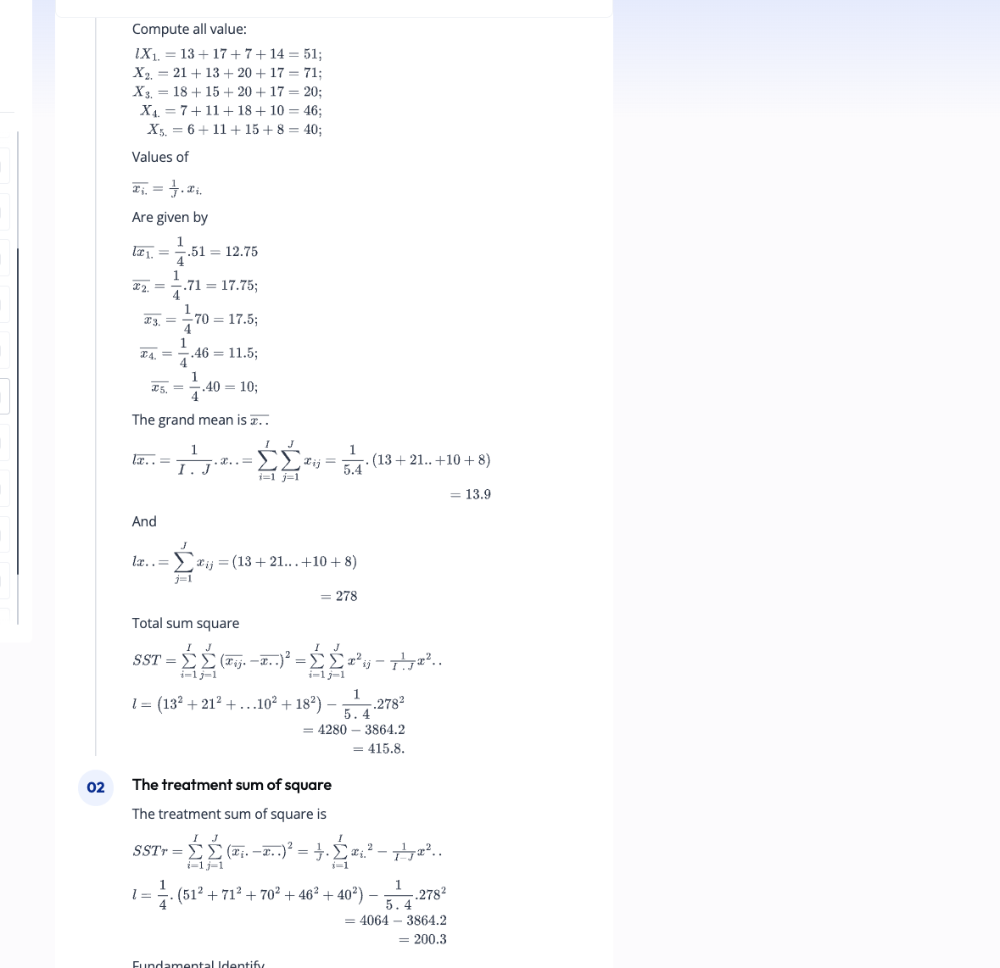

final calcs:
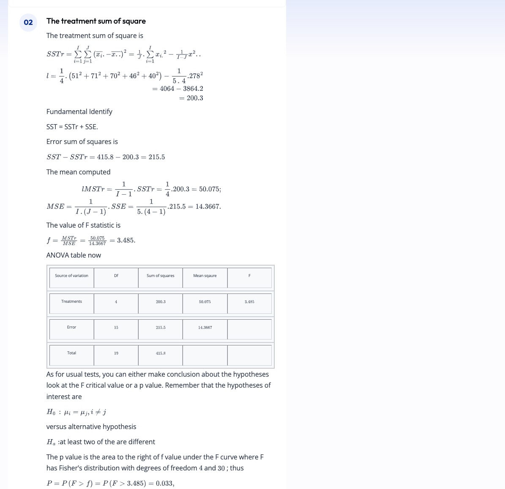

Yes, the F-test in ANOVA and the Tukey's honestly significant difference (Tukey's HSD) test can sometimes lead to what appears to be conflicting results. The F-test in ANOVA determines whether there are any statistically significant differences between the means of various groups, but it does not tell you which specific groups differ.

If the F-test is significant, you know at least one group is different, but you don't know how many or which ones. That’s where post hoc tests like Tukey's come in—they tell you which specific groups are different.

Here's where the conflict might arise: The F-test might indicate there is a difference somewhere, but then Tukey’s HSD might not find any pairwise differences that are statistically significant. This situation could happen due to a few reasons:

1. **Sample Size**: Tukey's test adjusts for multiple comparisons and might not detect small differences if the sample size is not large enough.
   
2. **Distribution of Differences**: The overall ANOVA might be significant if there is one very large difference and several small or non-significant differences. Tukey’s test, however, might not find the smaller differences significant.
   
3. **Variability**: If there is high variability within groups, it might be harder for the Tukey's test to detect differences, even if the overall ANOVA is significant.
   
4. **Power**: The F-test might have enough power to detect an overall effect, but Tukey's HSD, which is a more conservative test, might not have enough power to detect specific differences, especially if they are subtle.

In summary, the F-test in ANOVA is a global test that tells you if there’s at least one significant difference, while Tukey’s HSD is a multiple comparison test that tells you where those differences are. They're answering slightly different questions, which is why their results can sometimes seem at odds.

answer:
even though the f test allows us to reject null, there isn't a difference in the average growth with application of the different growth hormones

 

4. The article 'Origin of Precambrian Iron Formations' (Econ. Geology, 1964: 1025-1057) reports the following data on total Fe for four types of iron formation (1 = carbonate, 2 = silicate, 3 = magnetite, 4 = hematite). (See the table on page 422 exercise 6) Carry out an analysis of variance F test at significance level .01, and summarize the results in an ANOVA table. What is the test statistic value?

work:
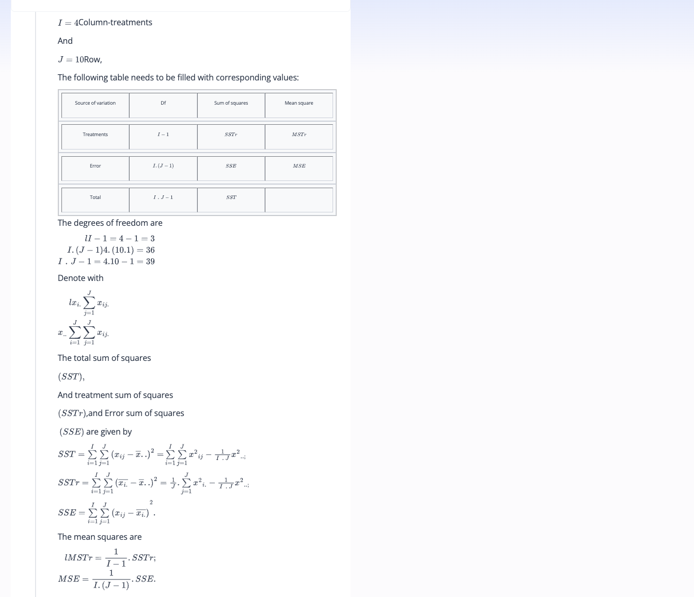

some work:
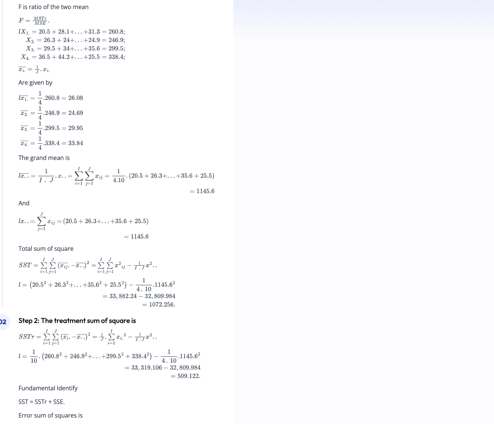

some of the calcs here are wrong. Remember J = 10 and I = 4 and there are some typos in the vaia coursework. 

sees like the grand mean = every value added up = 1145.6

for calculate SSTr = we need to  to divide that by I*J. we also need to find the value of each value squared, sum that all up, and divide by J
then calculate the SST to find the SSE. the SST is easiser to find! the fundamental equality is `SST = SSTr - SSE.`
- we find that SST = 1072.256 and SSTr = 509.122 so SSE = 556.134
- then find the MSTR = 509.112 / I - 1 = 169.7073
- then find the MSE = 563.123 / (I(J-1)) = 15.6246

- The F stat is 169.7073/15.6426 = 10.849 

final work:
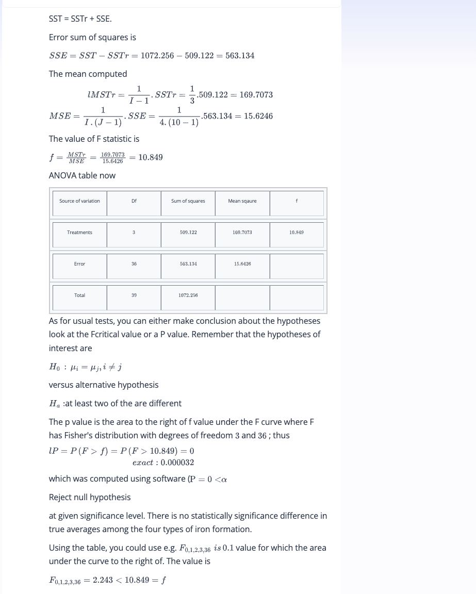
The f stat we need to lookup has 2 inputs, the two degeres of freedom which are 3 and 36 which are I - 1 and I(J-1) respectively. J = 10 btw.
answer:

the F stat is 10.849 which is than the cutoff 2.243

 

5. Although tea is the world's most widely consumed beverage after water, little is known about its nutritional value. Folacin is the only B vitamin present in any significant amount in tea, and recent advances in assay methods have made accurate determination of folacin content feasible. Consider the accompanying data on folacin content for randomly selected specimens of the four leading brands of green tea. (See the table on page 437 exercise number 27) (Data is based on 'Folacin Content of Tea,' J. of the Amer. Dietetic Assoc., 1983: 627-632.) Does this data suggest that true average folacin content is the same for all brands? Carry out a test using alpha = .05. How many total degrees of freedom do you have in this problem?

work:
I = 4
df = 3
total = 24
df = 24 - 4 = 20

20 + 3 = 23

answer:
23
 

6. In an experiment to compare the tensile strengths of I = 5 different types of copper wire, J = 4 samples of each type were used. The between-samples and within-samples estimates of sigma^2 were computed as MSTr = 2673.3 and MSE = 1094.2, respectively. Use the F test at level .05 to test H_0: mu_1 = mu_2 = mu_3 = mu_4 = mu_5 versus H_a: at least two mu_i's are unequal. Will H0 be rejected?
Group of answer choices

No

Yes

Not enough information

work:
the critical value of F for α = 0.05 with 4 and 15 degrees of freedom is approximately 3.056.. I looked this up in the back. Our f stat given MSTr and MSE = 2.443. We do not reject.

answer: 
No
 

7. In an experiment to compare the tensile strengths of I = 5 different types of copper wire, J = 4 samples of each type were used. The between-samples and within-samples estimates of sigma^2 were computed as MSTr = 2673.3 and MSE = 1094.2, respectively. Use the F test at level .05 to test H_0: mu_1 = mu_2 = mu_3 = mu_4 = mu_5 versus H_a: at least two mu_i's are unequal. Compute the correct test statistic.
 

8. Use Tukey's procedure on the data in Example 10.3 to identify differences in true average bond strengths among the five protocols. Select all statements that are true.
Group of answer choices

The critical Q value is around 4.04

The critical Q value is around 2.95

The mean shear bond strength for treatments 1 and 5 are significantly different, but no others.

None of the mean shear bond strentgths are significantly different.

The mean shear bond strength for treatments 2 and 4 are not significantly different.

work:
To determine if the mean bond strength is different between any of the groups, we will use the Tukey Honest Significant Difference (HSD) test, which is appropriate when we have rejected the null hypothesis in an ANOVA test and want to find out which specific groups' means are significantly different from each other.

Q is alpha = 0.05, I = 5, I(J-1) = 45. Q is about 4. 

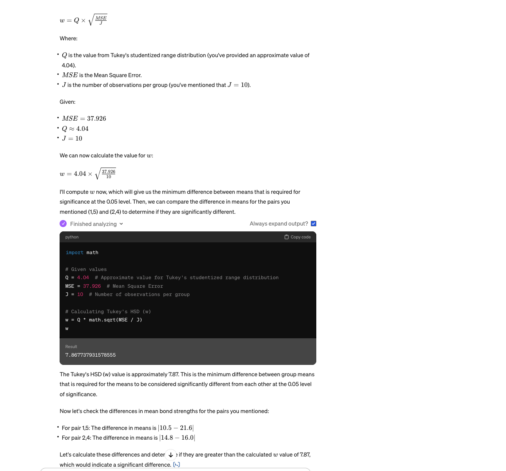

answer:
1 and 5 are different. Q is about 4.

 

9. The article 'Origin of Precambrian Iron Formations' (Econ. Geology, 1964: 1025-1057) reports the following data on total Fe for four types of iron formation (1 = carbonate, 2 = silicate, 3 = magnetite, 4 = hematite). (See the table on page 422 exercise 6) Carry out an analysis of variance F test at significance level .01, and summarize the results in an ANOVA table. There are 46 total degrees of freedom.
Group of answer choices

- [ ] True
- [ ] False

work:

work:

some work:

some of the calcs here are wrong. Remember J = 10 and I = 4 and there are some typos in the vaia coursework. 

sees like the grand mean = every value added up = 1145.6

for calculate SSTr = we need to  to divide that by I*J. we also need to find the value of each value squared, sum that all up, and divide by J
then calculate the SST to find the SSE. the SST is easiser to find! the fundamental equality is `SST = SSTr - SSE.`
- we find that SST = 1072.256 and SSTr = 509.122 so SSE = 556.134
- then find the MSTR = 509.112 / I - 1 = 169.7073
- then find the MSE = 563.123 / (I(J-1)) = 15.6246

- The F stat is 169.7073/15.6426 = 10.849 

final work:

The f stat we need to lookup has 2 inputs, the two degeres of freedom which are 3 and 36 which are I - 1 and I(J-1) respectively. J = 10 btw.

answer:
False, there are 39?
 

10. Consider the accompanying data on plant growth after the application of five different types of growth hormone. (See the table on page 407 exercise 18) What happens when Tukey's procedure is applied? Select all statements that are true.
Group of answer choices

- [ ] The critical Q value is around 4.37
- [ ] The most extreme difference exceeds the test statistic.
- [ ] The differences in sample means are judged to be insignificant.
- [ ] The critical Q value is around 2.18
- [ ] The most extreme difference is 7.75

work:
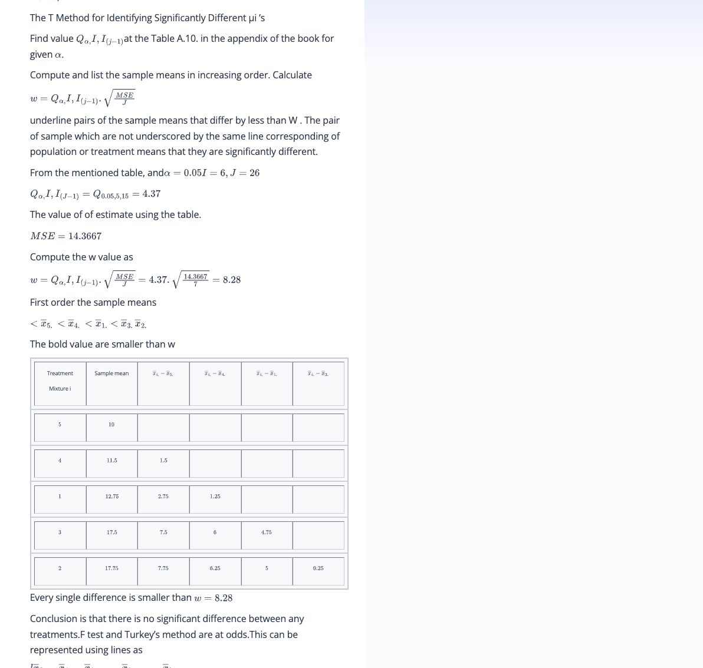

btw 8.28 is right for the w. the equation should be 4.37*sqrt(14.3367/4)

answer:

 

11. A study of the properties of metal plate-connected trusses used for roof support ('Modeling Joints Made with Light-Gauge Metal Connector Plates,' Forest Products J., 1979: 39-44) yielded the following observations on axial-stiffness index (kips/in.) for plate lengths 4, 6, 8, 10, and 12 in: (see the table on page 422 exercise 8) Does variation in plate length have any effect on true average axial stiffness? State and test the relevant hypotheses using analysis of variance with alpha = .01. Select all statements that are true.
Group of answer choices

We reject H0

We fail to reject the null hypothesis

The test statistic is equal to 10.48

There are no differences in the true average axial stiffness for the different plate lengths.

The MSTr is 10,998.14

work:

Total Sum of Squares (SST): This represents the total variation in the data and is given by 

∑∑x ij^2 minus the square of the sum of all observations divided by the total number of observations.
Sum of Squares Between (SSB): This represents the variation due to the interaction between the groups and is calculated by taking the sum of the square of the sum of each group's observations divided by the number of observations in that group, minus the square of the sum of all observations divided by the total number of observations. This is SSTr in the book.
Sum of Squares Within (SSW): This represents the variation within each group and is calculated by subtracting SSB from SST.
Degrees of Freedom (df): For SSB, it's the number of groups minus one (I−1), and for SSW, it's the total number of observations minus the number of groups (IJ−I).
Mean Square Between (MSB) and Mean Square Within (MSW): MSB is SSB divided by its df, and MSW is SSW divided by its df.

# Data provided for each group
data = {
    4: [309.2, 409.5, 311.0, 326.5, 316.8, 349.8, 309.7],
    6: [402.1, 347.2, 361.0, 404.5, 331.0, 348.9, 381.7],
    8: [392.4, 366.2, 351.0, 357.1, 409.9, 367.3, 382.0],
    10: [346.7, 452.9, 461.4, 433.1, 410.6, 384.2, 362.6],
    12: [407.4, 441.8, 419.9, 410.7, 473.4, 441.2, 465.8]
}

# Number of observations per group (J) and number of groups (I)
J = 7
I = len(data)

# Calculating the grand total of all observations and the total number of observations
grand_total = sum([sum(values) for values in data.values()])
total_observations = I * J

# The given total sum of squares (SST)
SST_provided = 5241420.79

# Calculating Sum of Squares Total (SST) using the given hint
SST = SST_provided - (grand_total**2 / total_observations)

# Sum of Squares Between (SSB)
SSB = sum((sum(values)**2 / J) for values in data.values()) - (grand_total**2 / total_observations)

# Sum of Squares Within (SSW)
SSW = SST - SSB

# Degrees of freedom between (I - 1) and within (total_observations - I)
df_between = I - 1
df_within = total_observations - I

# Mean Square Between (MSB) and Mean Square Within (MSW)
MSB = SSB / df_between
MSW = SSW / df_within

# F-statistic
F_statistic = MSB / MSW

# p-value from the F-statistic and degrees of freedom
p_value = 1 - stats.f.cdf(F_statistic, df_between, df_within)

# Organizing the results into an ANOVA table format
anova_table = {
    'Source of Variation': ['Between Groups', 'Within Groups', 'Total'],
    'Sum of Squares': [SSB, SSW, SST],
    'Degrees of Freedom': [df_between, df_within, df_between + df_within],
    'Mean Square': [MSB, MSW, ''],
    'F-Statistic': [F_statistic, '', ''],
    'p-value': [p_value, '', '']
}

anova_table

 

12. In an experiment to compare the tensile strengths of I = 5 different types of copper wire, J = 4 samples of each type were used. The between-samples and within-samples estimates of sigma^2 were computed as MSTr = 2673.3 and MSE = 1094.2, respectively. Use the F test at level .05 to test H_0: mu_1 = mu_2 = mu_3 = mu_4 = mu_5 versus H_a: at least two mu_i's are unequal. What can be said about the P-value for the test?
Group of answer choices

0.05 < P-value < 0.10

0.01 < P-value < 0.04

0.025 < P-value < 0.03

None of the P-values ranges are correct.
 

13. The article 'Origin of Precambrian Iron Formations' (Econ. Geology, 1964: 1025-1057) reports the following data on total Fe for four types of iron formation (1 = carbonate, 2 = silicate, 3 = magnetite, 4 = hematite). (See the table on page 401 exercise 6) Carry out an analysis of variance F test at significance level .01, and summarize the results in an ANOVA table. Select all statements that are true.
Group of answer choices

- [x] We reject H0
- [x] The total sum of squares is 1,072.256.
- [ ] We do not reject H0.
- [x] The total mean square is 15.643
- [x] At least two of the four means differ.

work:
similar to problem 4

some work:

some of the calcs here are wrong. Remember J = 10 and I = 4 and there are some typos in the vaia coursework. 

sees like the grand mean = every value added up = 1145.6

for calculate SSTr = we need to divide that by I*J. we also need to find the value of each value squared, sum that all up, and divide by J
then calculate the SST to find the SSE. the SST is easiser to find! the fundamental equality is `SST = SSTr - SSE.`

- we find that SST = 1072.256 and SSTr = 509.122 so SSE = 556.134
- then find the MSTR = 509.112 / I - 1 = 169.7073
- then find the MSE = 563.123 / (I(J-1)) = 15.6246
- The F stat is 169.7073/15.6426 = 10.849 

final work:

The f stat we need to lookup has 2 inputs, the two degeres of freedom which are 3 and 36 which are I - 1 and I(J-1) respectively. J = 10 btw.

answer:

 

14. Consider the following summary data on the modulus of elasticity (x 10^6 psi) for lumber of three different grades [in close agreement with values in the article 'Bending Strength and Stiffness of Second-Growth Douglas-Fir Dimension Lumber' (Forest Products J., 1991: 35-43), except that the sample sizes there were larger]: (see the table on page 422 exercise 5) Use this data and a significance level of .01 to test the null hypothesis of no difference in mean modulus of elasticity for the three grades. Select all statements that are true.
Group of answer choices

The MSTr is 0.1143

The MSE is 0.066

We fail to reject the null hypothesis

The test statistic is 1.73

We reject the null hypothesis
 

15. The article 'Origin of Precambrian Iron Formations' (Econ. Geology, 1964: 1025-1057) reports the following data on total Fe for four types of iron formation (1 = carbonate, 2 = silicate, 3 = magnetite, 4 = hematite). (See the table on page 422 exercise 6) Carry out an analysis of variance F test at significance level .01, and summarize the results in an ANOVA table. What is the 'Treatments' sum of squares?
 
work:
https://www.vaia.com/en-us/textbooks/math/probability-and-statistics-for-engineering-and-sciences-9th/the-analysis-of-variance/q6e-the-article-origin-of-precambrian-iron-formationsecongeo/

answer:
509.122

16. Samples of six different brands of diet/imitation margarine were analyzed to determine the level of physiologically active polyunsaturated fatty acids (PAPFUA, in percentages), resulting in the following data: (see the table on page 416 exercise 26) Compute upper CI for pair (1,4).
 
work:
this is for 1 and 3.
Note Q takes I and I(J-1)
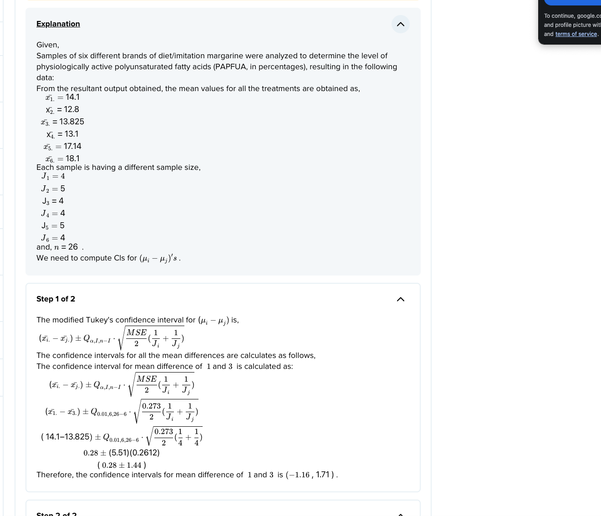

https://brainly.com/textbook-solutions/q-26-samples-different-brands-diet-imitation-margarine-16#q-26-samples-different-brands-diet-imitation-margarine-7

17. Samples of six different brands of diet/imitation margarine were analyzed to determine the level of physiologically active polyunsaturated fatty acids (PAPFUA, in percentages), resulting in the following data: (see the table on page 416 exercise 26) Compute upper CI for pair (2,5).

work:
https://brainly.com/textbook-solutions/q-26-samples-different-brands-diet-imitation-margarine-16#q-26-samples-different-brands-diet-imitation-margarine-7
 

18. Although tea is the world's most widely consumed beverage after water, little is known about its nutritional value. Folacin is the only B vitamin present in any significant amount in tea, and recent advances in assay methods have made accurate determination of folacin content feasible. Consider the accompanying data on folacin content for randomly selected specimens of the four leading brands of green tea. (See the table on page 437 exercise number 27) (Data is based on 'Folacin Content of Tea,' J. of the Amer. Dietetic Assoc., 1983: 627-632.) Does this data suggest that true average folacin content is the same for all brands? Carry out a test using alpha = .05. What is your sum of squares for your treatment source?

work:
we use n = 24 and the formula on page 412. 
We use the SSTr formula which squares the sum of each group - 1/n the square of the grand mean.
# Calculate SSTr using the formula provided
# (1/Ji) * sum(xi.)^2 - (1/n) * grand_mean^2

answer:
23.50
 

19. Although tea is the world's most widely consumed beverage after water, little is known about its nutritional value. Folacin is the only B vitamin present in any significant amount in tea, and recent advances in assay methods have made accurate determination of folacin content feasible. Consider the accompanying data on folacin content for randomly selected specimens of the four leading brands of green tea. (See the table on page 416 exercise number 27) (Data is based on 'Folacin Content of Tea,' J. of the Amer. Dietetic Assoc., 1983: 627-632.) Does this data suggest that true average folacin content is the same for all brands? Perform a multiple comparisons analysis to identify significant differences among brands. Compute lower CI for pair (1,2).

work:
conf interval equation: mean of sample 1 - mean of sample 2 - w <= actual mean1 - actual mean 2 <= mean of sample 1 - mean of sample 2 + w

α=0.05 (the significance level)
I=4 (the number of groups)
n−I=20 (the degrees of freedom for error)
J1=7 (number of observations in group 1)
J2=5 (number of observations in group 2)
J3=6 (number of observations in group 3)

I think we need the formula on 402. 

Steps:
- We calculate MSE from SST = SSTr - SSE.
- Then we calculate Q which is 3.96 from the A-10 appendix using m = 4 and v = 20
- Then we calculate w which is 2.3697
- the ci lower = mean1 - mean2 - w
- the ci upper = mean1 - mean2 + w
- mean1 = 8.27142
- mean2 = 7.5
- MSE = 2.088

How do we calculate MSE?

Total Sum of Squares (SST): This is a measure of the total variability in the data. It is calculated as the sum of the squared differences between each observation and the overall mean.

Sum of Squares for Treatment (SSTr): This reflects the variability between the different groups (treatments). It is calculated as the sum of the squared differences between each group's mean and the overall mean, weighted by the size of the group.

Sum of Squares for Error (SSE): This reflects the variability within the groups. It is calculated as SST minus SSTr.

Mean Square Error (MSE): This is the average of the SSE and is calculated by dividing the SSE by its associated degrees of freedom, which is typically the total number of observations minus the number of groups.

for MSE calc:

df = 20
SST = 65.273
SSTr = 23.495
grand mean = 7.0166
therefore SSE = 41.7776

Then take SSE which we derived from SST = SSTr - SSE and divide by 20 = 2.0888 = MSE

answer: 
lowerci for pair 1,2 = -1.598271428571427

 

20. Although tea is the world's most widely consumed beverage after water, little is known about its nutritional value. Folacin is the only B vitamin present in any significant amount in tea, and recent advances in assay methods have made accurate determination of folacin content feasible. Consider the accompanying data on folacin content for randomly selected specimens of the four leading brands of green tea. (See the table on page 416 exercise number 27) (Data is based on 'Folacin Content of Tea,' J. of the Amer. Dietetic Assoc., 1983: 627-632.) Does this data suggest that true average folacin content is the same for all brands? Perform a multiple comparisons analysis to identify significant differences among brands. Compute lower CI for pair (1,3).

work:
- mean3 = 6.35
- use the rest from above
- mean1 = 8.27142
- MSE = 2.088

answer:
-0.448271
