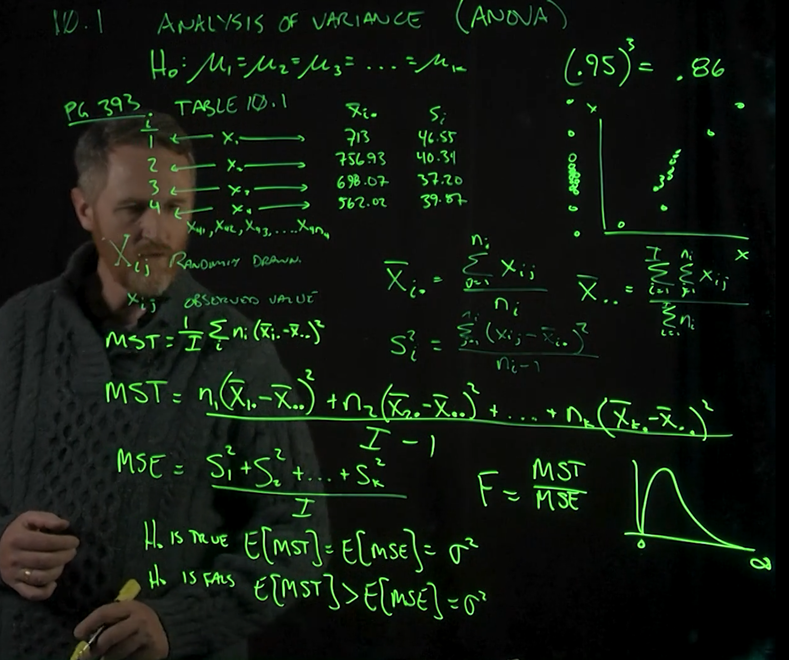
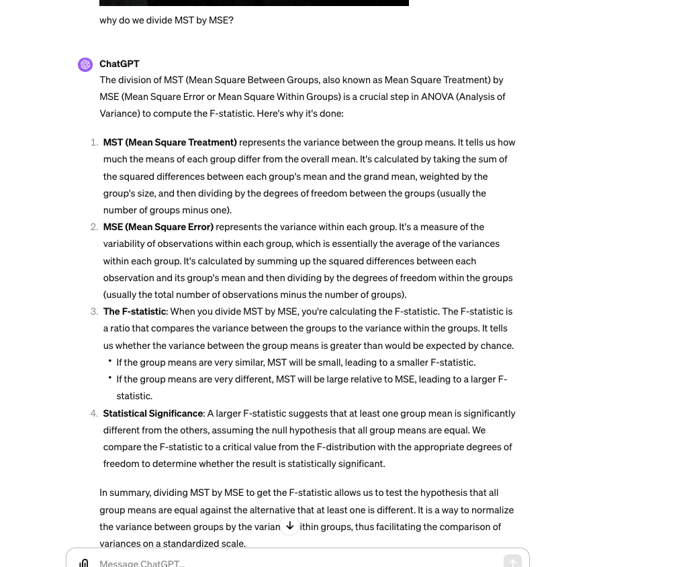
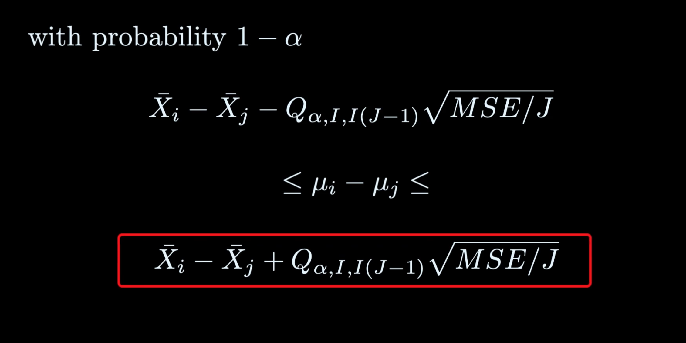
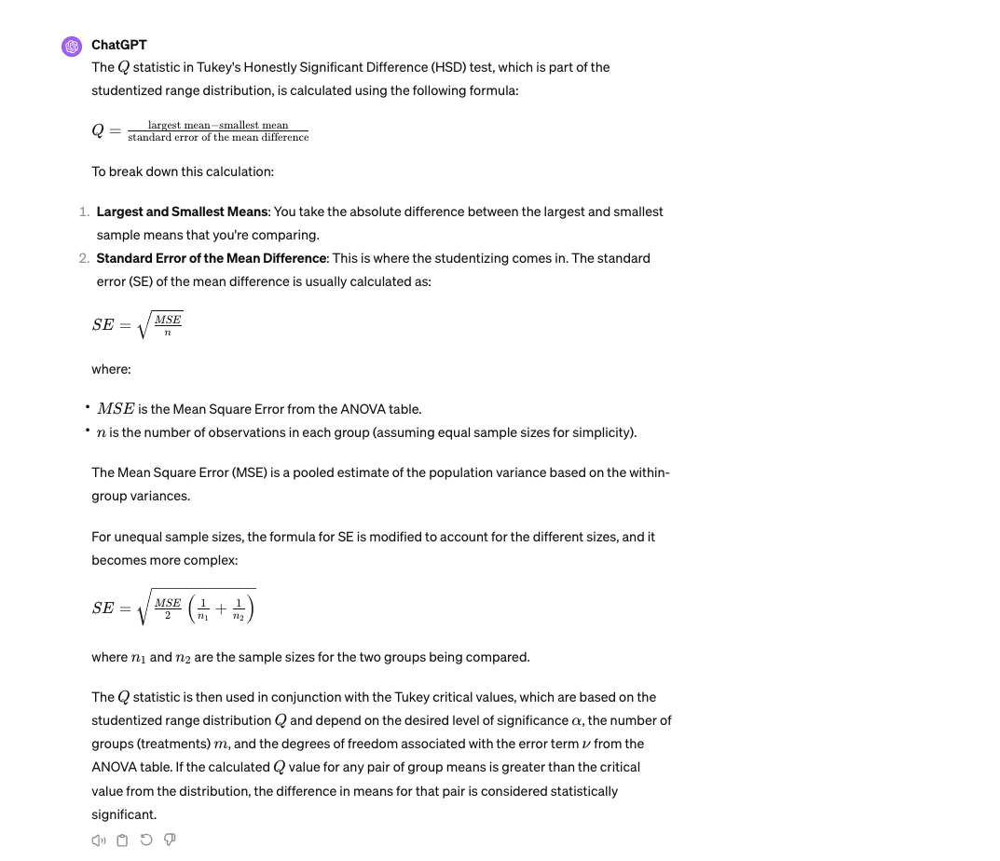
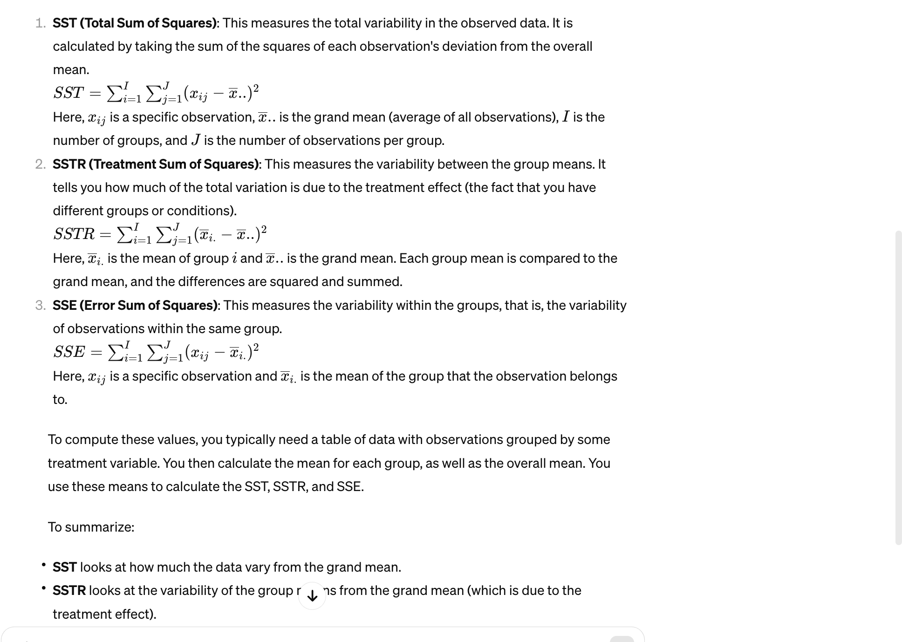
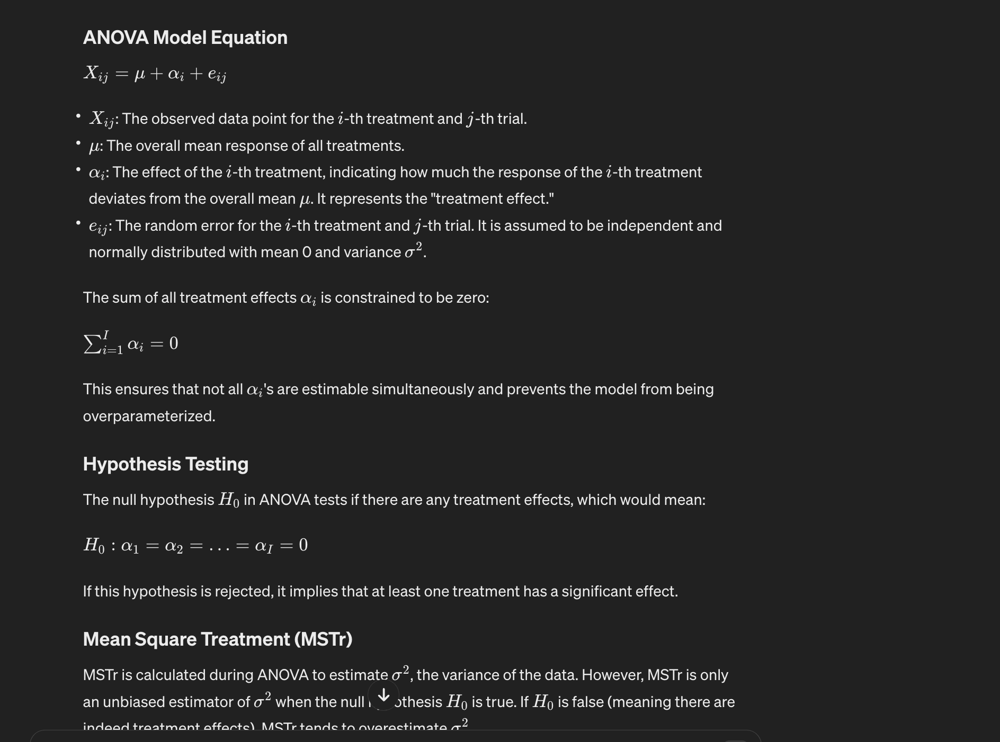
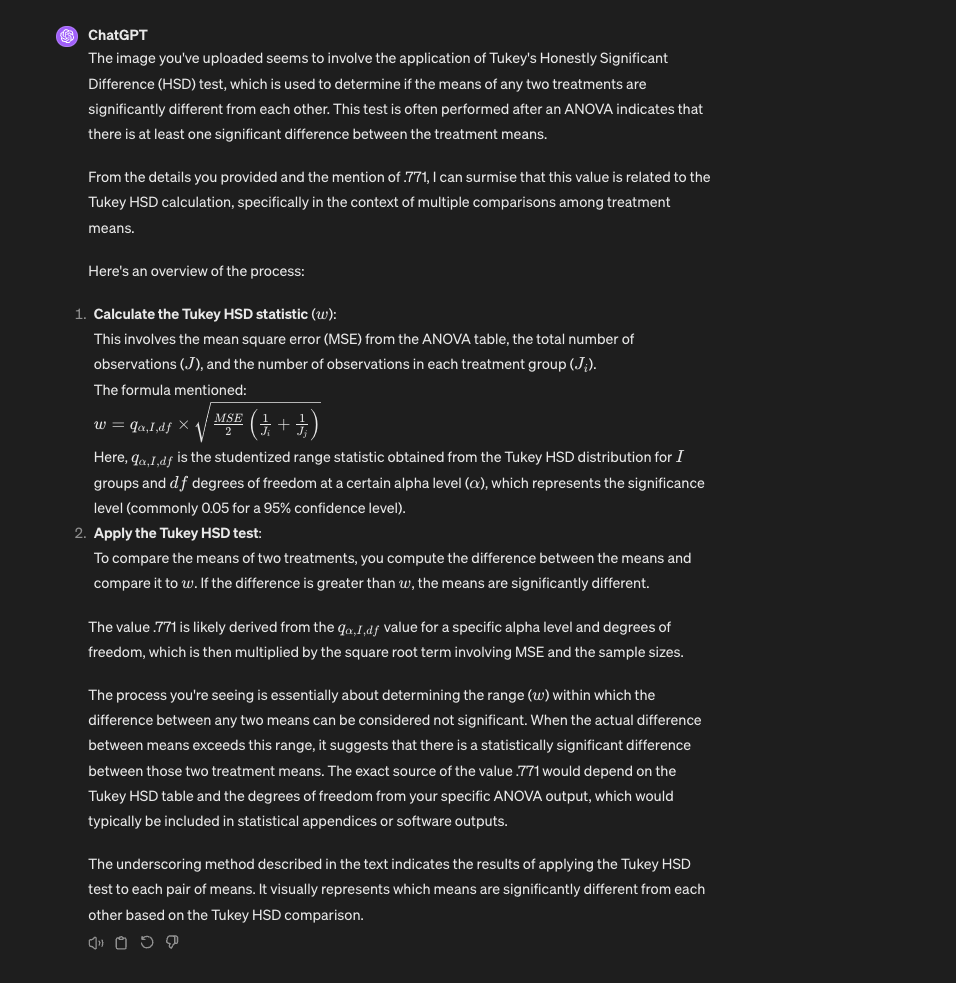

# Topics

- Anova Single factor analysis of variance
- finding the F stat in an anova test (problem 4 in the homework is good). look at my own notes.

# Notes

Another type of hypothesis test. It's testing that the mean of 1 = mean of 2 = mean of 3...

Why not use 2 sample t-test? if you have a 5% error, that means 95% likelihood of being correct in the test. But likelihood of being right 95% to the third power if we have 3 test, now has a bigger error. IF we repeat t tests, the error gets bigger. so what we do is explain the variance in data using Anova.

Analysis of variance prevents this increase of errors from happening. With anova, trying to explain some the variance away to factors. This is used when we go from 2 samples to 3! Maybe instead of concatenating the error, is one different from the other? I hate how this is explain in the hopkins lecture. literally chatgpt is probably better. the coursework is a waste of time. IF anyone is reading this, do not go to hopkins. It sucks

## Example

Say you have 4 samples, with their means and sample std_deviations. All different. 

Usaully waht you'll see, is that maybe one group is different than the others. What we're looking for, is any of these different from the others? But we don't want to concatenate the error. We want a consolidated test instead doing 3 t tests that might consolidate the errors. Because if you do t tests, at 5% error, meaning 95% correct, 95% * 95% is only like 84% so the error goes up. We don't want to do that. 

### Some notation
Xbar_i. is the average of ALL values in sample i. the i refers to the sample number. the . implies every element in that sample 
X_ij is ... i refers to which sample. j is the individual datapoints in i. So it could be all the datapoints j in sample i.
xbar_.. is the grand mean, average of all values.

the above notation makes sense now.

i is the number of samples
j is the number of elements in each sample

The F-statistic is a ratio that compares the variance between the groups to the variance within the groups. It tells us whether the variance between the group means is greater than would be expected by chance.

## Key parts about the F statistic:

- If the group means are very similar, MST will be small, leading to a smaller F-statistic.
- If the group means are very different, MST will be large relative to MSE, leading to a larger F-statistic.

## MST Mean square treatment
- treatment refers to each set of data. treatment is used because the methods was first used for agriculture industry for fertilizer.
- average weight variance of each treatment.

# MSE

The errors of the whole averaged.

How to Calculate MSE:
The MSE is calculated by dividing the Sum of Squares Error (SSE) by its associated degrees of freedom. The SSE is the sum of squared differences between each observation and its group mean. The degrees of freedom for the error is typically the total number of observations minus the number of groups.

# The f test

divide MST/MSE
 
# Point of Anova

does one of these variances explain the variance of the whole? There's a variance of the dataset which is the MSE on the denominator and the MST is on top which is the weighted average variance 

Does one the treatments explain the overall variance of the group

Notice the alternative is that MST > MSE. The question is the variance in the treatments is > than the variance of the dataset. Once is different than the others.

## How to use Anova Table

How to Use an ANOVA Table:
An ANOVA table is used to summarize the components necessary to perform ANOVA. Here's a step-by-step usage:

Calculate Sum of Squares: Calculate the total sum of squares, the sum of squares due to treatment, and the sum of squares due to error.
Assign Degrees of Freedom: Assign degrees of freedom to treatment and error based on the number of groups and the number of observations per group.
Calculate Mean Squares: Calculate MSTr and MSE by dividing the respective sums of squares by their degrees of freedom.
Calculate the F-statistic: Divide MSTr by MSE to get the F-statistic.
Compare F-statistic to Critical Value: Use the F-statistic and its degrees of freedom to find the critical value from the F-distribution table. If the F-statistic is larger than the critical value, you reject the null hypothesis, suggesting there are statistically significant differences between the group means.
By following these steps, you can determine whether the differences in means across groups in your dataset are significant or could have occurred by random chance.

## From chatgpt

The ANOVA (Analysis of Variance) and the t-test are both statistical methods used to compare means across groups, but they differ in the number of groups they are designed to handle and the specifics of their hypotheses.

### t-test

The t-test is used to determine if there are significant differences between the means of two groups. There are three main types of t-tests:

1. **One-sample t-test:** Compares the mean of a single group against a known standard or theoretical mean.
2. **Independent two-sample t-test:** Compares the means of two independent groups (e.g., men vs. women, treatment vs. control).
3. **Paired sample t-test:** Compares the means of the same group at two different times (e.g., before and after an intervention).

A t-test produces a t-statistic, which is used to determine if the groups are significantly different from each other. The calculation considers the difference in means, the variability of the data, and the sample size.

### ANOVA

ANOVA is used when comparing the means of three or more groups. While the t-test can technically be used multiple times to compare multiple groups pairwise, this increases the risk of Type I errors (false positives). ANOVA controls for this risk by testing the null hypothesis that all group means are equal.

- **One-way ANOVA:** Used to test for differences among three or more groups based on a single independent variable (factor).
- **Two-way ANOVA or higher:** Used to test for differences when there are two or more independent variables, and can also assess the interaction effects between these factors.

ANOVA produces an F-statistic, a ratio of the variability between the group means to the variability within the groups. A significant F-statistic indicates that at least one group mean is different from the others, prompting further investigation with post-hoc tests to determine the specific group differences.

### Key Differences

- **Number of Groups:** t-test is used for comparing two groups, whereas ANOVA is used for three or more groups.
- **Risk of Type I Errors:** Multiple t-tests increase the chance of a Type I error, whereas ANOVA controls for this risk by comparing all groups simultaneously.
- **Statistical Metric:** t-test uses the t-statistic, while ANOVA uses the F-statistic.
- **Post-hoc Analysis:** If ANOVA shows a significant difference, further tests are needed to identify which specific groups differ, whereas the t-test directly indicates which two groups are different.

In summary, whether you use a t-test or ANOVA depends on the number of groups you are comparing and the specifics of your research question. ANOVA can handle comparisons among multiple groups at once and is the appropriate choice when dealing with more than two groups to avoid increased error rates associated with multiple t-tests.

## What is an F statistic here?

F-statistic: This is the ratio of MSTr to MSE. It is used to test the null hypothesis that the group means are equal. A significant F-value suggests that there are differences between group means that are not likely due to chance.

# Mulitple comparison procedure
Relationship with ANOVA:
After running an ANOVA and finding a significant F-value, we know that at least one group mean is different from the others, but we don't know which ones specifically. That's where Tukey's HSD and the Q statistic come in.

Tukey's HSD test compares all possible pairs of means to determine which specific means are significantly different from each other. The test uses the studentized range distribution to determine significance.

So say we find a difference with Anova? We use Mulitple comparison procedure.

for each sample mean if you have multiple sample means, create a conf interval:

If one of the intervals does not contain 0, that mean and sample are likely different.

Once we find that one is different due to a high F statistic, we want to know how are the samples clustered?

From chatgpt:

Q: Represents the studentized range statistic, which is used for hypothesis testing when comparing three or more means. It is particularly used in the context of the Tukey's HSD (Honest Significant Difference) test, which is a post-hoc analysis following ANOVA. The studentized range statistic is the range of the sample means divided by an estimate of the standard error of the means.
m: Represents the number of groups or treatments being compared in the ANOVA test.
ν: Represents the degrees of freedom associated with the error term or the within-groups variance. It is used to estimate the population variance based on the sample data.

We want confidence intervals for each sample now.
We could use a studentized range distribution which has a paramter called Q that has 3 inputs: alpha, m, and v. m and v are degress of freedom. Similiar to F test.

## How do use the T method Q and W values?

Q is the critical value here. This is called the T method, there's another probability distribution. The Q is used to calculate the W statistic which is teh amount we add/subtract to the sample mean to create the confidence interval. W = Q * sqrt(MSE/J) where J is the number of observations total. That's the W. We then add W to each x_bar and lookup the overlaps.

## Using the T Method, Q, and W Values:
In the context of Tukey's test:

The Q statistic is calculated from the data and compared to a critical value from the studentized range distribution, which is dependent on the significance level (α), the number of groups (m), and the error degrees of freedom (ν).

The critical value from the studentized range distribution is often represented as Q_α,m,ν. If the calculated Q statistic is greater than the critical value Q_α,m,ν , then the difference between those two means is considered statistically significant.

The W value usually refers to the width of the confidence interval around the mean difference. It's used to establish a range within which we can be confident that the true mean difference lies.

To perform a Tukey HSD test after an ANOVA, you would:

Calculate the Q statistic for each pair of group means.
Compare each Q statistic to the critical value from the studentized range distribution table or through a statistical software function.
Determine the pairs of means that are significantly different based on whether their Q statistic exceeds the critical value.
Use the W value to interpret the size of the mean differences and establish confidence intervals.

## SST and SSTr and SSE

To summarize:

SST looks at how much the data vary from the grand mean.
SSTR looks at the variability of the group means from the grand mean (which is due to the treatment effect).
SSE looks at the variability within each group, ignoring the treatment effect.

Remember that j refes to each observation within each group i.

Also notice that SST and SSTr subtract a value from the grand mean. whereas SSE subtracts a value from the mean of a specific group/sample.

## Individual vs simultaneuos confidence intervals

When you calculate a single 95% confidence interval (CI) for a parameter, there's a 95% chance that this interval contains the true parameter value.
If you calculate two independent 95% CIs (for different parameters or from different samples), the probability that both intervals correctly contain their true parameters is 
0.95 × 0.95 =  0.9025
0.95 × 0.95 = 0.9025, or 90.25%.
With three independent 95% CIs, this joint probability drops to 
0.95^3 ≈ 0.857 or 85.7%.
The more intervals you calculate, the lower the simultaneous confidence level becomes because the chance that all intervals correctly capture their parameters decreases.

 Tukey's method accounts for this when making multiple comparisons to maintain a desired overall confidence level.

## Anova model equation

 ANOVA uses MSTr to evaluate whether there are significant differences between treatment means. If MSTr is significantly greater than the Mean Square Error (MSE), it suggests that the variability between treatment means is more than what would be expected by random chance, indicating significant treatment effects. The ANOVA model thus helps to understand whether observed differences in data are due to the treatments applied or merely due to random variation.

## Tukey HSD stat

## Sometimes f test and tukey are at odds

Yes, the F-test in ANOVA and the Tukey's honestly significant difference (Tukey's HSD) test can sometimes lead to what appears to be conflicting results. The F-test in ANOVA determines whether there are any statistically significant differences between the means of various groups, but it does not tell you which specific groups differ.

If the F-test is significant, you know at least one group is different, but you don't know how many or which ones. That’s where post hoc tests like Tukey's come in—they tell you which specific groups are different.

Here's where the conflict might arise: The F-test might indicate there is a difference somewhere, but then Tukey’s HSD might not find any pairwise differences that are statistically significant. This situation could happen due to a few reasons:

1. **Sample Size**: Tukey's test adjusts for multiple comparisons and might not detect small differences if the sample size is not large enough.
   
2. **Distribution of Differences**: The overall ANOVA might be significant if there is one very large difference and several small or non-significant differences. Tukey’s test, however, might not find the smaller differences significant.
   
3. **Variability**: If there is high variability within groups, it might be harder for the Tukey's test to detect differences, even if the overall ANOVA is significant.
   
4. **Power**: The F-test might have enough power to detect an overall effect, but Tukey's HSD, which is a more conservative test, might not have enough power to detect specific differences, especially if they are subtle.

In summary, the F-test in ANOVA is a global test that tells you if there’s at least one significant difference, while Tukey’s HSD is a multiple comparison test that tells you where those differences are. They're answering slightly different questions, which is why their results can sometimes seem at odds.

## GOod problems to review

Problem 4 (my notes are good) about anova and the process of finding hte F statistic
