1. The data in the table on page 440 exercise 18 resulted from an experiment to investigate whether yield from a certain chemical process depended either on the formulation of a particular input or on mixer speed. A statistical computer package gave SS(form) = 2253.44, SS(Speed) = 230.81, SS(Form*Speed) = 18.58, and SSE = 71.87. Does yield appear to depend on either formulation or speed?

Group of answer choices

- [ ] Both formulation and speed appear to have a highly statistically significant effect on yield.
- [ ] Only formulation and not speed appear to have a highly statistically significant effect on yield.
- [ ] Only speed and not formulation appear to have a highly statistically significant effect on yield.
- [ ] Neither formulation nor speed appear to have a highly statistically significant effect on yield.


work:
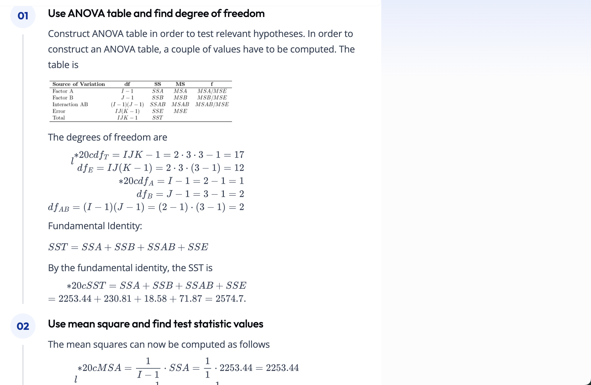

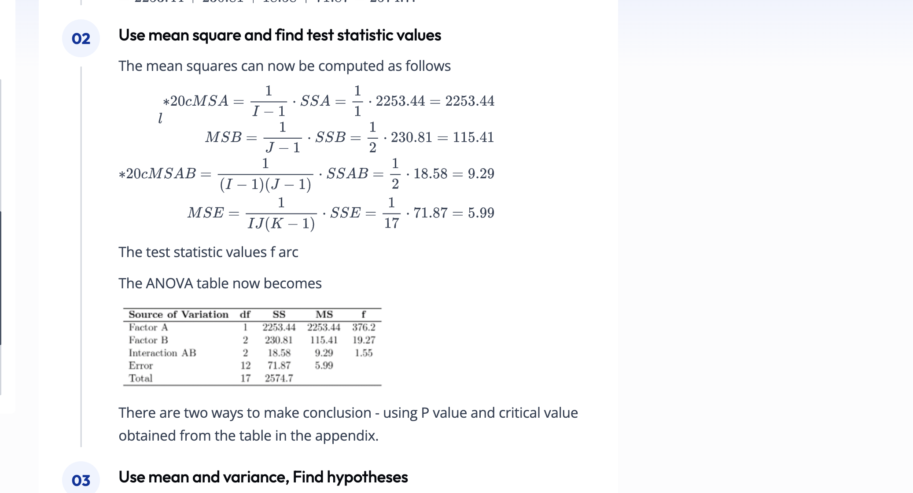

use a F calculator here: https://stattrek.com/online-calculator/f-distribution

the F stat for Factor A is 376.2 which is huge. The cutoff for F is F(0.05, 1, 12)... the 1 comes from the fact there are 2 formulations so the df = 1 and 12 is the df for the error term which is I*J*(K-1) = 3*2*2 = 12

So we reject the null for A and it has an effect on yield.

Speed F stat is at 19.27 is alaso greater than the F cutoff of F(0.05, 2, 12) (2 degrees of freedom for B) = 3.89 so we reject B too the null.

The P value of AB (the interaction) is 0.25 which is above the 0.05 cutof so we don't reject the null. The F value was too low so no interaction between A and B

answer:

Both formulation and speed appear to be statistically significant.


2. A study was carried out to compare the writing lifetimes of four premium brands of pens. It was thought that the writing surface might affect lifetime, so three different surfaces were randomly selected. A writing machine was used to ensure that conditions were otherwise homogeneous (e.g., constant pressure and a fixed angle). The table on page 441 exercise 22 shows the two lifetimes (min) obtained for each brand–surface combination. Carry out an appropriate analysis, and select all statements that are true.


- [ ] Interaction between brand and writing surface has no significant effect on the lifetime of the pen.
- [ ] Since neither f_A nor f_B is greater than its respective critical value, we can conclude that neither the surface nor the brand of pen has a significant effect on the writing lifetime.
- [ ] The MSE is 684.67
- [ ] The MSE is 1350.04


work:

```python3
import pandas as pd
import statsmodels.api as sm
from statsmodels.formula.api import ols

# Your data
data = {
    'Brand': ['Brand1', 'Brand1', 'Brand2', 'Brand2', 'Brand3', 'Brand3', 'Brand4', 'Brand4'],
    'Surface1': [709, 659, 668, 685, 659, 685, 698, 650],
    'Surface2': [713, 726, 722, 740, 666, 684, 704, 666],
    'Surface3': [660, 645, 692, 720, 678, 750, 686, 733]
}

# Convert the data to a pandas DataFrame
df = pd.DataFrame(data)

# Melt the DataFrame so it's in the right format for ANOVA
df_melted = df.melt(id_vars=['Brand'], var_name='Surface', value_name='Lifetime')

# Perform two-way ANOVA
model = ols('Lifetime ~ C(Brand) + C(Surface) + C(Brand):C(Surface)', data=df_melted).fit() # lifeetime (the value) approx equals these 3 effects
anova_results = sm.stats.anova_lm(model, typ=2)

print(anova_results)
```


You'll see that the p values are pretty high and the MSE si 684.67. Run it in a python3 interpreter and download the packages.


answer:
- [x] Interaction between brand and writing surface has no significant effect on the lifetime of the pen.
- [x] Since neither f_A nor f_B is greater than its respective critical value, we can conclude that neither the surface nor the brand of pen has a significant effect on the writing lifetime.
- [x] The MSE is 684.67


3. In a study of processes used to remove impurities from cellulose goods ("Optimization of Rope-Range Bleaching of Cellulosic Fabrics," Textile Research J., 1976: 493-496), the data on page 462 problem #40 resulted from a 2^4 experiment involving the desizing process. The four factors were enzyme concentration (A), pH (B), temperature (C), and time (D). Which main effect(s) appear to be significant?
Group of answer choices

- [ ] A
- [ ] B
- [ ] C
- [ ] D
- [ ] None of the main effects are significant

work:

the 2^4 looks at all factors individually and in conjunction to deteremine effects.

For part (a), Yates' algorithm is a method for manually calculating the sums of squares in a factorial design ANOVA. It simplifies the process of finding sums of squares without having to construct the entire ANOVA table. It involves arranging the treatment totals in a specific order, then repeatedly halving and differencing the totals to find the main effects and interaction effects. Unfortunately, implementing Yates’ algorithm is beyond the scope of what we can directly execute in this environment due to its procedural nature and our execution constraints.

just do it in code python3:

```python3
# The dataset is similar to the one we previously used, but now includes two replicates.
# The provided data also corresponds to a 2^4 factorial design.

import pandas as pd
import statsmodels.api as sm
from statsmodels.formula.api import ols

# Creating the dataset
data_set = {
    'Enzyme': [0.5, 0.75, 0.5, 0.75, 0.5, 0.75, 0.5, 0.75, 0.5, 0.75, 0.5, 0.75, 0.5, 0.75, 0.5, 0.75],
    'pH': [6.0, 6.0, 7.0, 7.0, 6.0, 6.0, 7.0, 7.0, 6.0, 6.0, 7.0, 7.0, 6.0, 6.0, 7.0, 7.0],
    'Temperature': [60.0, 60.0, 60.0, 60.0, 70.0, 70.0, 70.0, 70.0, 60.0, 60.0, 60.0, 60.0, 70.0, 70.0, 70.0, 70.0],
    'Time': [6, 6, 6, 6, 6, 6, 6, 6, 8, 8, 8, 8, 8, 8, 8, 8],
    'Replicate1': [9.72, 9.80, 10.13, 11.80, 12.70, 11.96, 11.38, 11.80, 13.15, 10.60, 10.37, 11.30, 13.05, 11.15, 12.70, 13.20],
    'Replicate2': [13.50, 14.04, 11.27, 11.30, 11.37, 12.05, 9.92, 11.10, 13.00, 12.37, 12.00, 11.64, 14.55, 15.00, 14.10, 16.12]
}

# Create a DataFrame
df_yates = pd.DataFrame(data_set)

# We need to "melt" the repeated measures from wide form to long form
df_melted_yates = pd.melt(df_yates, id_vars=['Enzyme', 'pH', 'Temperature', 'Time'], var_name='Replicate', value_name='Starch')

# Convert all factors to categorical
for factor in ['Enzyme', 'pH', 'Temperature', 'Time', 'Replicate']:
    df_melted_yates[factor] = df_melted_yates[factor].astype('category')

# Run the ANOVA
model_yates = ols('Starch ~ Enzyme * pH * Temperature * Time', data=df_melted_yates).fit()
anova_results_yates = sm.stats.anova_lm(model_yates, typ=2)

print(anova_results_yates)
```

The main effects (Enzyme, pH, Temperature, Time) and their interaction effects are listed, with their respective sum of squares (sum_sq), degrees of freedom (df), F-statistics (F), and p-values (PR(>F)).

The only factor that shows a statistically significant effect is Time, with a p-value of 0.027998, which suggests that the length of the desizing process significantly affects the percentage of starch by weight.

The interaction between Temperature and Time has a p-value of 0.101346, which is close to the conventional significance level of 0.05 and may suggest a borderline significant interaction effect.

answer:
just D

answer:


4. In an experiment to assess the effects of curing time (factor A) and type of mix (factor B) on the compressive strength of hardened cement cubes, three different curing times were used in combination with four different mixes, with three observations obtained for each of the 12 curing time–mix combinations. The resulting sums of squares were computed to be SSA = 30,763.0, SSB = 34,185.6, SSE = 97,436.8, and SST = 205,966.6. Test H0_B: beta_1 = beta_2 = beta_3 = beta_4 = 0 versus Ha_B: at least one beta_j not equal 0 using a level .05 test. Select all statements that are true.

Group of answer choices
- [ ] H0_B is rejected at the 0.01 level
- [ ] The test statistic is in the rejection region
- [ ] There are a combined 40 degrees of freedom
- [ ] None of these statements are true

work:
3 observations for each of the IJ combos... that's the 3 observations.
so K = 3

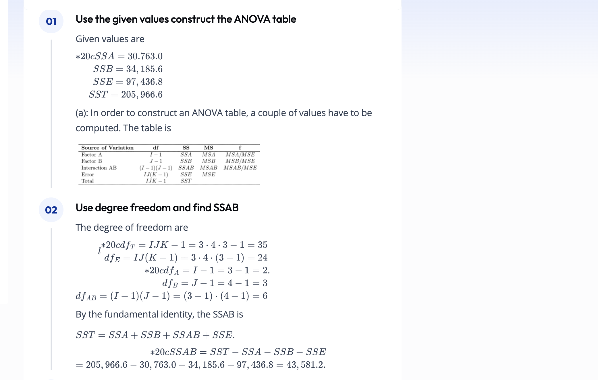
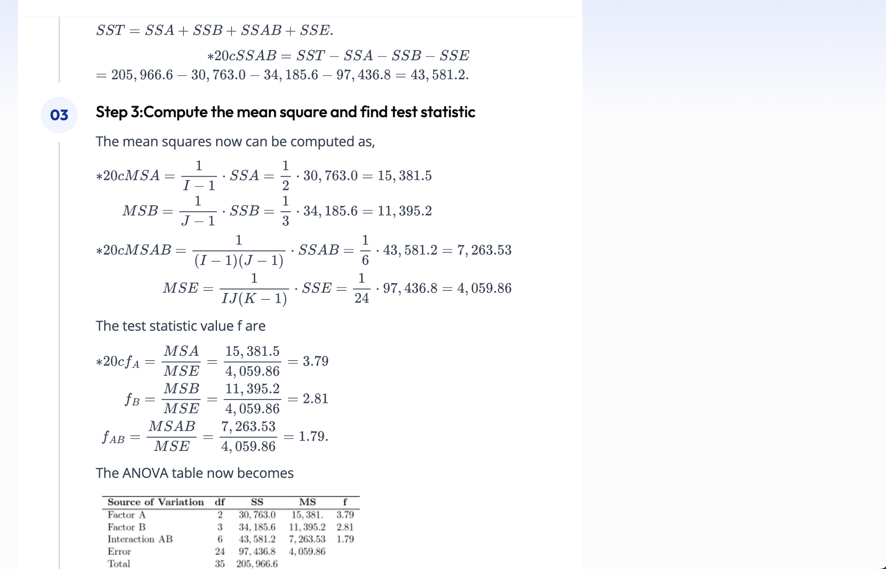

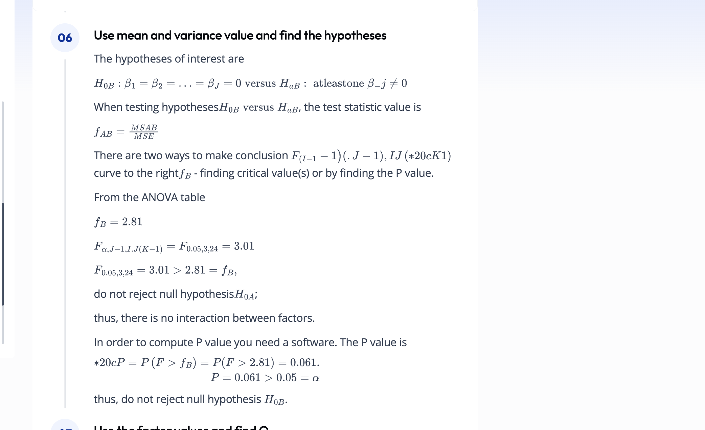

answer:


5. A particular county employs three assessors who are responsible for determining the value of residential property in the county. To see whether these assessors differ systematically in their assessments, 5 houses are selected, and each assessor is asked to determine the market value of each house. With factor A denoting assessors (I = 3) and factor B denoting houses (J = 5), suppose SSA = 11.7, SSB = 113.5, and SSE = 25.6. Test H_0: alpha_1 = alpha_2 = alpha_3 = 0 at level .05. and select all statements that are true (H_0 states that there are no systematic differences among assessors.)

Group of answer choices

- [ ] The absolute difference between MSA and MSB is less that 2.
- [ ] The test statistic is not significant at the 0.05 significance level.
- [ ] The test statistic is 2.87.
- [ ] None of these statements are true

work:
http://euclid.trentu.ca/356/reading/as5356_08s.pdf

Test the hypothesis that there are no systematic differences among assessors. Assessors correspond to the A factor, so we test the hypothesis of no differences using the F-statistic 
MSA / MSE = (11.7 / 2) / (25.67 / 8) = 1.82
which has a P-value of .2231, so that the null hypothesis is not rejected at α = .05. 

Hence there is no systematic difference among assessors. (Alternatively,we compare with the critical F(.05,2,8) = 4.459, 

so we fail to reject

answer:
- [x] The test statistic is not significant at the 0.05 significance level.

(b) Explain why a randomized block experiment with only 5 houses was used rather than a one-way ANOVA experiment involving  a total of 15 different houses with each assessor asked to assess 5 different houses(a different group of 5 for each assessor). Blocking was introduced to reduce variance.Variability due to house effect could have made us believe that there are significant differences in assessors.

6. The following summary quantities were computed from an experiment involving four levels of nitrogen (A), two times of planting (B), and two levels of potassium (C) ("Use and Misuse of Multiple Comparison Procedures," Agronomy J., 1977: 205–208). Only one observation (N content, in percentage, of corn grain) was made for each of the 16 combinations of levels. SSA = .22625, SSAB = .004325, SSBC = .000625, SSC = .0036, SSB = .000025, SSAC = .00065, SST = .2384. Assume that there are no three-way interaction effects, so that MSABC is a valid estimate of variance, and test at level .05 for interaction and main effects. Select all statements that are true.

Group of answer choices
- [ ] The only statistically significant effect at the level .05 is the factor A main effect
- [ ] Factor B main effect shows a statistically significant effect at the level .05
- [ ] Interaction effects AB and AC are statistically significant at any level
- [ ] None of these statements are true

work:
SST = SSA + SSB + SSAB + SSE is the identify we will use to get SSE.

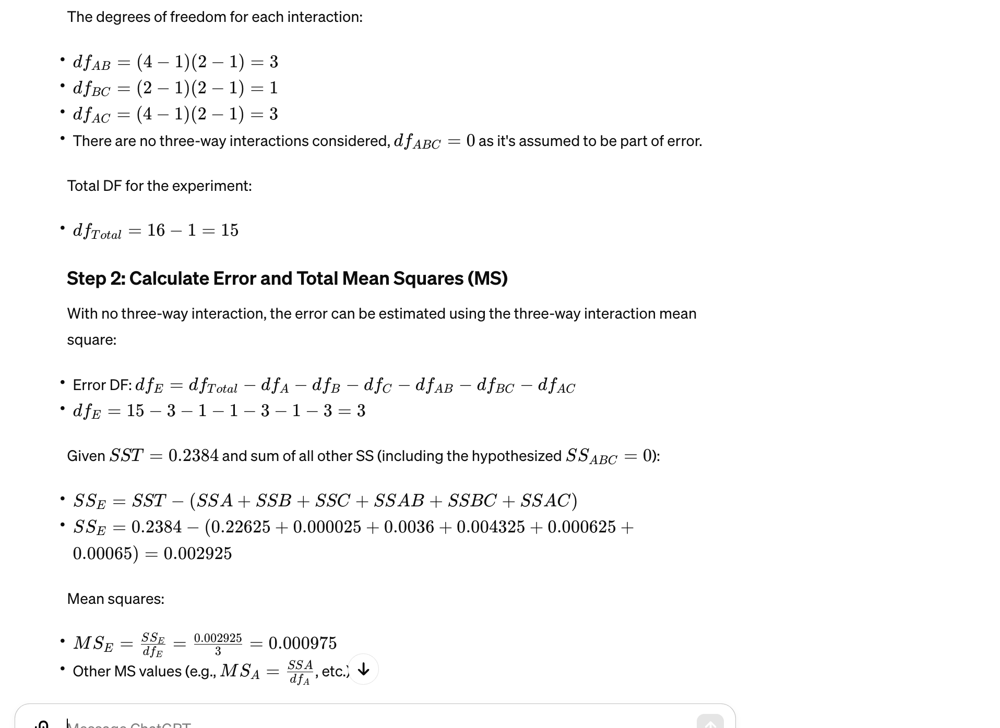

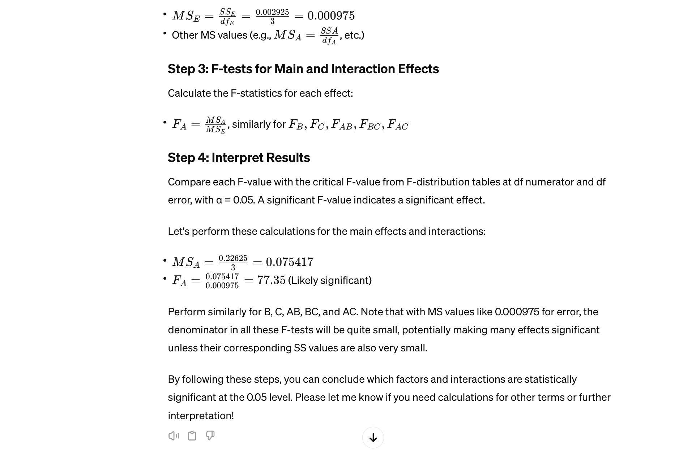

to determine which statements are true regarding the significance of interaction and main effects, we need to compute the Mean Squares (MS) for each effect and compare them with the Mean Square of the ABC interaction, which is considered an estimate of the error variance since there's an assumption that there are no three-way interactions.

The Mean Square (MS) for each effect is calculated by dividing the Sum of Squares (SS) by the degrees of freedom (df) associated with that effect. For main effects:

A: 3 degrees of freedom (since there are 4 levels, df = 4 - 1)
B: 1 degree of freedom (since there are 2 levels, df = 2 - 1)
C: 1 degree of freedom (since there are 2 levels, df = 2 - 1)
For interaction effects:

AB: df = df(A) * df(B) = 3 * 1 = 3
AC: df = df(A) * df(C) = 3 * 1 = 3
BC: df = df(B) * df(C) = 1 * 1 = 1
ABC: Since we assume there are no three-way interactions, the degrees of freedom for ABC would be df(A) * df(B) * df(C) = 3 * 1 * 1 = 3, and this will serve as an estimate of the error variance.
Given the SST (Total Sum of Squares) is .2384, we can calculate the MSE (Mean Square for Error) using the MS for ABC:

MSABC = SSABC / df(ABC)
Since we are given SSABC = .000625 and df(ABC) = 3, we can calculate MSABC.

Afterward, we would compare the MS for each main effect and interaction effect against MSABC to test for significance. If MS for an effect is greater than MSABC, it may be considered statistically significant.

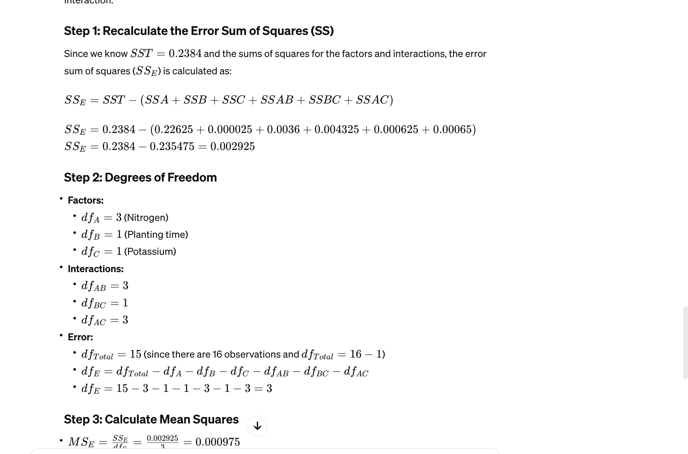

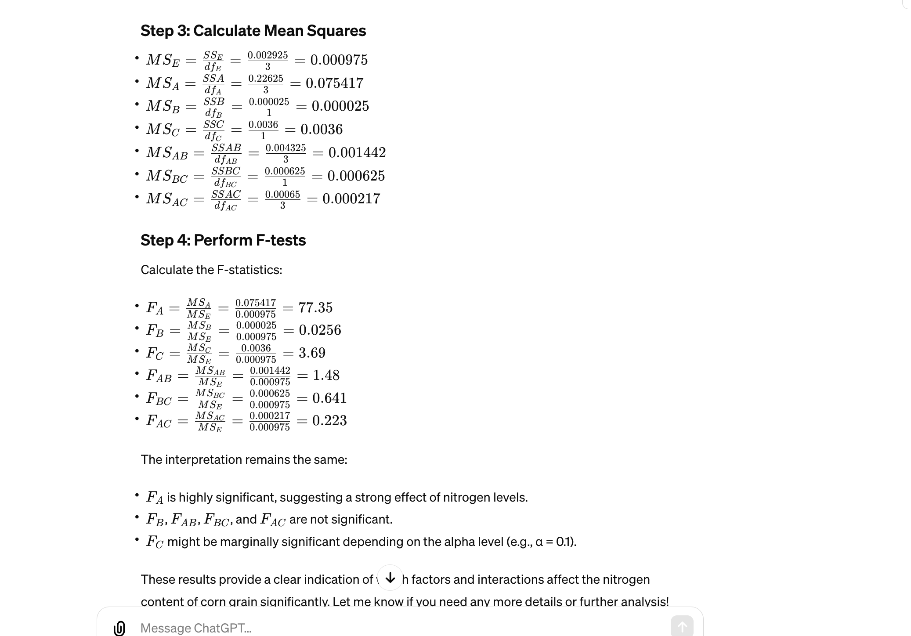

key parts of this problem are:
-dfError is 3 and we find this by doing dfTotal - dfA - dfB - dfC - dfAB - dfBC - dfAC = 3

- MSe is the denominator for every F value. For ex: F_A = MS_A/MS_E = 0.0751417/0.000975 = 77.35


answer:

7. The data on page 462 problem #42 on power consumption in electric-furnace heats (kW consumed per ton of melted product) resulted from a 24 factorial experiment with three replicates (“Studies on a 10-cwt Arc Furnace,” J. of the Iron and Steel Institute, 1956: 22). The factors were nature of roof (A, low/high), power setting (B, low/high), scrap used (C, tube/plate), and charge (D, 700 lb/1000 lb). Construct the ANOVA table, and test all hypotheses of interest using alpha = .01. How many interaction effects are significant?

Group of answer choices

- [ ] 3
- [ ] 4
- [ ] 2
- [ ] None of the interaction effects are significant

work:

basically, find the MSE, find the SS, and then find the F. Here's the data: USe anova or yates.

data = {
    "(1)": [866, 862, 800],
    "a": [946, 800, 840],
    "b": [774, 834, 746],
    "ab": [709, 789, 646],
    "c": [1017, 990, 954],
    "ac": [1028, 906, 977],
    "bc": [817, 783, 771],
    "abc": [829, 806, 691],
    "d": [988, 808, 650],
    "ad": [966, 976, 876],
    "bd": [702, 658, 650],
    "abd": [784, 700, 596],
    "cd": [922, 808, 868],
    "acd": [1056, 870, 908],
    "bcd": [798, 726, 700],
    "abcd": [752, 714, 714]
}


```python3
data = {
    "(1)": [866, 862, 800],
    "a": [946, 800, 840],
    "b": [774, 834, 746],
    "ab": [709, 789, 646],
    "c": [1017, 990, 954],
    "ac": [1028, 906, 977],
    "bc": [817, 783, 771],
    "abc": [829, 806, 691],
    "d": [988, 808, 650],
    "ad": [966, 976, 876],
    "bd": [702, 658, 650],
    "abd": [784, 700, 596],
    "cd": [922, 808, 868],
    "acd": [1056, 870, 908],
    "bcd": [798, 726, 700],
    "abcd": [752, 714, 714]
}
# Step 1: Calculate MSE
total_squares = 0
total_n = 0

for key, values in data.items():
    group_mean = np.mean(values)
    group_squares = sum((x - group_mean) ** 2 for x in values)
    total_squares += group_squares
    total_n += len(values)

# Total degrees of freedom within groups (n - k)
degrees_of_freedom_mse = total_n - len(data)
MSE_fresh = total_squares / degrees_of_freedom_mse

# Step 2: Calculate overall mean and SS for each factor
overall_mean_fresh = np.mean([item for sublist in data.values() for item in sublist])
ss_results_fresh = {}
for key, values in data.items():
    group_mean = np.mean(values)
    ss_fresh = len(values) * (group_mean - overall_mean_fresh) ** 2
    ss_results_fresh[key] = ss_fresh

# Step 3: Calculate F-statistics
f_statistics_fresh = {key: ss / MSE_fresh for key, ss in ss_results_fresh.items()}

from scipy.stats import f
f_critical = f.ppf(0.99, df1=1, df2=32)

MSE_fresh, ss_results_fresh, f_statistics_fresh, f_critical


```

**generally what we need to do is find the MSE, the SS for each factor, and then the F statistic. Yates or anova, whatever, the point is teh find the MSE, the SS, and then the F**


8. Four different coatings are being considered for corrosion protection of metal pipe. The pipe will be buried in three different types of soil. To investigate whether the amount of corrosion depends either on the coating or on the type of soil, 12 pieces of pipe are selected. Each piece is coated with one of the four coatings and buried in one of the three types of soil for a fixed time, after which the amount of corrosion (depth of maximum pits, in .0001 in.) is determined. The data appears in the table on page 431 exercise #2. Compute {beta_hat}_1 - {beta_hat}_3 to 2 decimal places.


9. A particular county employs three assessors who are responsible for determining the value of residential property in the county. To see whether these assessors differ systematically in their assessments, 5 houses are selected, and each assessor is asked to determine the market value of each house. With factor A denoting assessors (I = 3) and factor B denoting houses (J = 5), suppose SSA = 11.7, SSB = 113.5, and SSE = 25.6. Explain why a randomized block experiment with only 5 houses was used rather than a one-way ANOVA experiment involving a total of 15 different houses, with each assessor asked to assess 5 different houses (a different group of 5 for each assessor).
Group of answer choices

- [ ] Otherwise extraneous variation associated with houses would tend to interfere with our ability to assess assessor effects. If there really was a difference between assessors, house variation might have hidden such a difference.
- [ ] An observed difference between assessors might have been due just to variation among houses and the manner in which assessors were allocated to homes.
- [ ] Otherwise extraneous variation associated with houses would tend to interfere with our ability to assess assessor effects. If there really was a difference between assessors, house variation is pretty good at revealing such a difference. 

None of the statements are true.

work:
(b) Explain why a randomized block experiment with only 5 houses was used rather than a one-way ANOVA experiment involving  a total of 15 different houses with each assessor asked to assess 5 different houses(a different group of 5 for each assessor). Blocking was introduced to reduce variance.Variability due to house effect could have made us believe that there are significant differences in assessors.


answer:
- [x] Otherwise extraneous variation associated with houses would tend to interfere with our ability to assess assessor effects. If there really was a difference between assessors, house variation might have hidden such a difference.
- [x] An observed difference between assessors might have been due just to variation among houses and the manner in which assessors were allocated to homes.


10. Four different coatings are being considered for corrosion protection of metal pipe. The pipe will be buried in three different types of soil. To investigate whether the amount of corrosion depends either on the coating or on the type of soil, 12 pieces of pipe are selected. Each piece is coated with one of the four coatings and buried in one of the three types of soil for a fixed time, after which the amount of corrosion (depth of maximum pits, in .0001 in.) is determined. The data appears in the table on page 431 exercise #2. Compute mu_hat to 2 decimal places.

work: mu_hat is grand mean
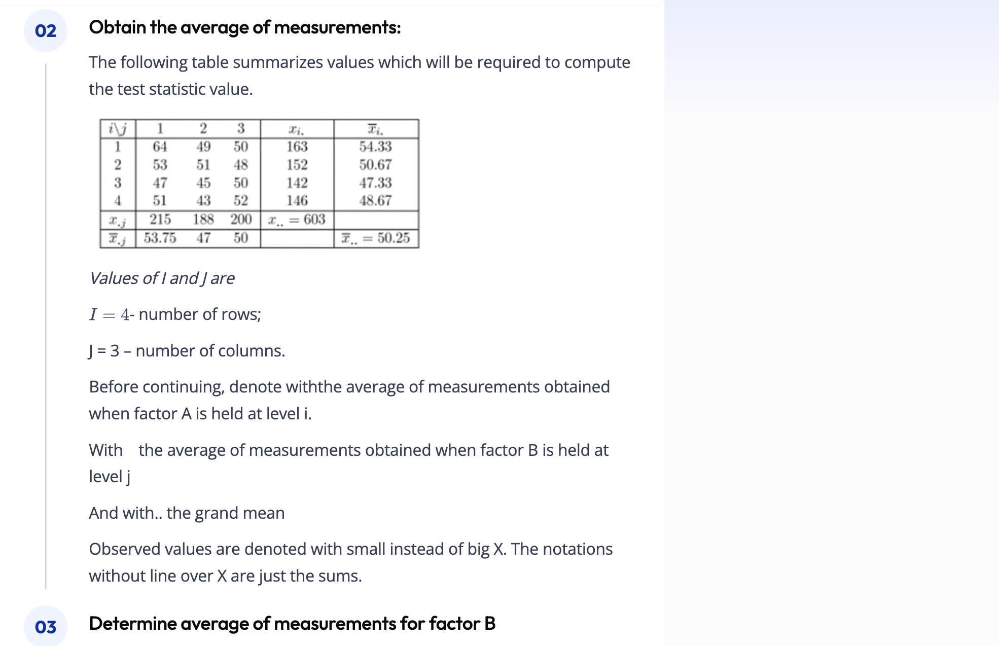

answer:
50.25


11. In an experiment to assess the effects of curing time (factor A) and type of mix (factor B) on the compressive strength of hardened cement cubes, three different curing times were used in combination with four different mixes, with three observations obtained for each of the 12 curing time–mix combinations. The resulting sums of squares were computed to be SSA = 30,763.0, SSB = 34,185.6, SSE = 97,436.8, and SST = 205,966.6. Test at level .05 the null hypothesis H0_A: alpha_1 = alpha_2 = alpha_3 = 0 (factor A main effects are absent) against Ha_A: at least one alpha_i is not equal 0. Select all true statements.

Group of answer choices:
- [ ] H0_A is rejected at level 0.05
- [ ] H0_A is not rejected at any level
- [ ] The test statistic is 3.79
- [ ] The test statistic is 3.40


work:
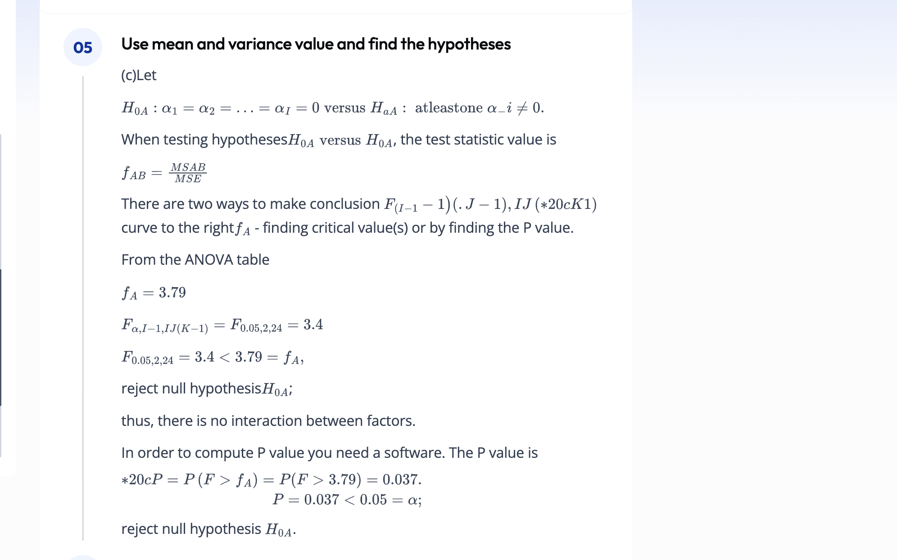

answer:
- [x] H0_A is rejected at level 0.05
- [x] The test statistic is 3.79


12. Four different coatings are being considered for corrosion protection of metal pipe. The pipe will be buried in three different types of soil. To investigate whether the amount of corrosion depends either on the coating or on the type of soil, 12 pieces of pipe are selected. Each piece is coated with one of the four coatings and buried in one of the three types of soil for a fixed time, after which the amount of corrosion (depth of maximum pits, in .0001 in.) is determined. The data appears in the table on page 431 exercise #2. Assuming the validity of the additive model, carry out the ANOVA analysis using an ANOVA table to see whether the amount of corrosion depends on either the type of coating used or the type of soil. Use alpha = .05 and select all statements that are true.
Group of answer choices

- [ ] Since both test statistics are greater than the appropriate critical value, neither H0A nor H0B is rejected.
- [ ] Since neither test statistic is greater than the appropriate critical value, neither H0A nor H0B is rejected.
- [ ] SSA - SSB = -7.92
- [ ] MSE = 20.53
- [ ] SST = SSA + SSB

work:
link: https://www.vaia.com/en-us/textbooks/math/probability-and-statistics-for-engineering-and-sciences-9th/multifactor-analysis-of-variance/q2e-four-different-coatings-are-being-considered-for-corrosi/


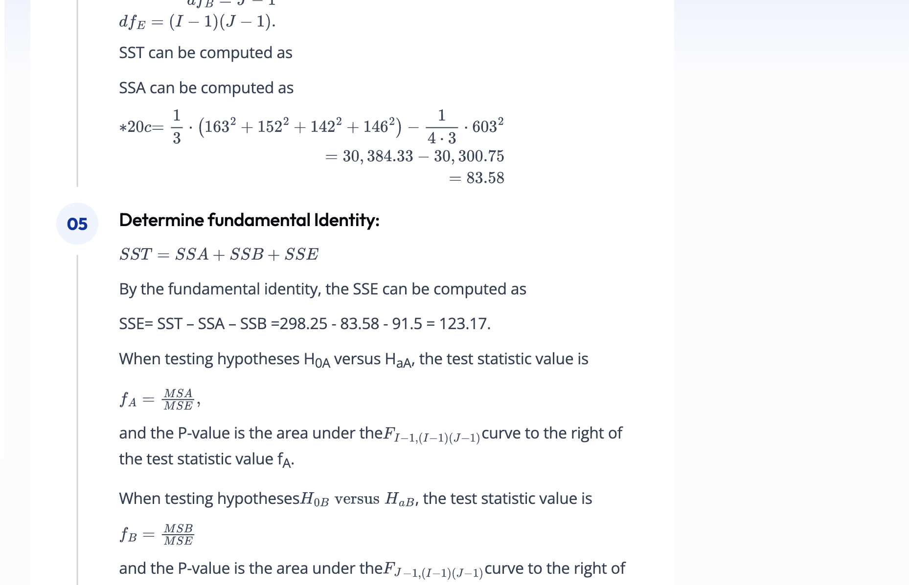
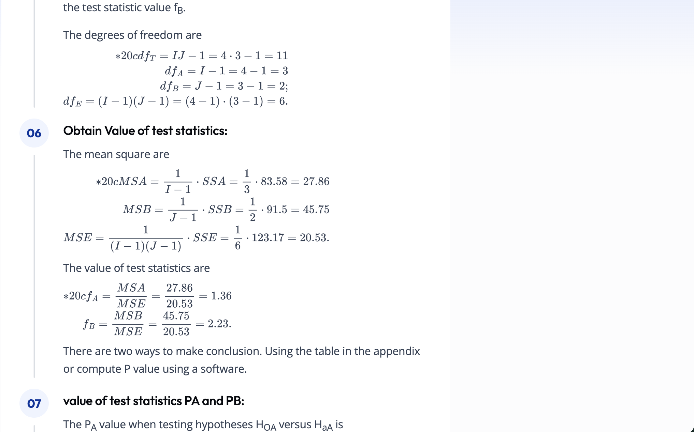
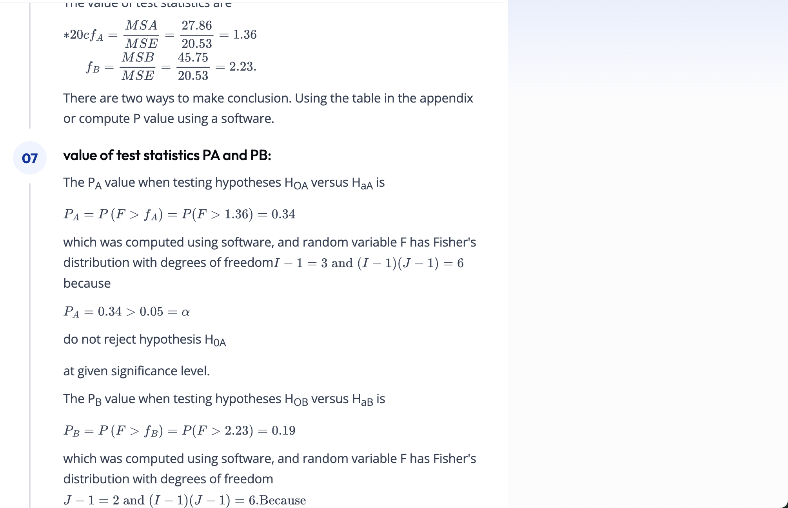

finally the values for f and p:
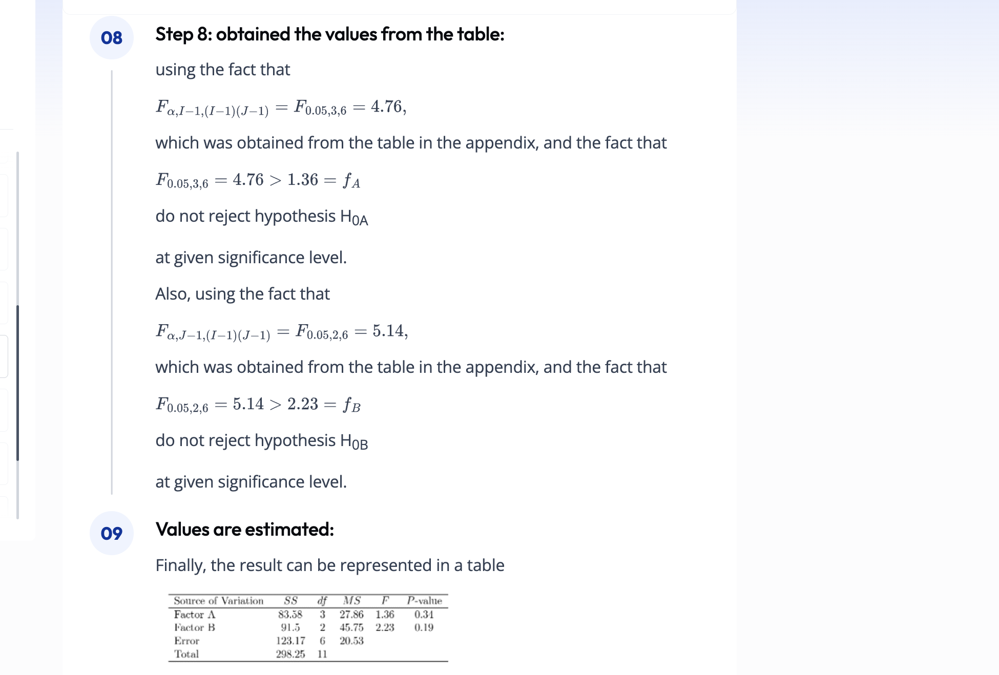

answer:
- [ ] Since neither test statistic is greater than the appropriate critical value, neither H0A nor H0B is rejected.
- [ ] SSA - SSB = -7.92
- [ ] MSE = 20.53


13. The data on page 462 problem #42 on power consumption in electric-furnace heats (kW consumed per ton of melted product) resulted from a 24 factorial experiment with three replicates (“Studies on a 10-cwt Arc Furnace,” J. of the Iron and Steel Institute, 1956: 22). The factors were nature of roof (A, low/high), power setting (B, low/high), scrap used (C, tube/plate), and charge (D, 700 lb/1000 lb). Construct the ANOVA table, and test all hypotheses of interest using alpha = .01. Which main effects are significant?
Group of answer choices

A

B

C

D

None of the main effects are significant


14. Suppose that in the experiment described in Exercise 6 on page 431, the five houses had actually been selected at random from among those of a certain age and size, so that factor B is random rather than fixed. Test H_0: sigma^2_B = 0 versus H_a: sigma^2_B > 0 using a level .01 test. Select all statements that are true.
Group of answer choices

We reject H0 and conclude that the variance of factor B is greater than 0

The test statistic is 2.72. 

MSE = 3.20

All the statements are true.


15. The data in the table on page 440 exercise 18 resulted from an experiment to investigate whether yield from a certain chemical process depended either on the formulation of a particular input or on mixer speed. A statistical computer package gave SS(form) = 2253.44, SS(Speed) = 230.81, SS(Form*Speed) = 18.58, and SSE = 71.87. Does there appear to be interaction between the factors?
Group of answer choices

- [ ] There appears to be no interaction between the two factors.
- [ ] There appears to be interaction between the two factors.
- [ ] There is not enough information to decide.


work:


use a F calculator here: https://stattrek.com/online-calculator/f-distribution

the F stat for Factor A is 376.2 which is huge. The cutoff for F is F(0.05, 1, 12)... the 1 comes from the fact there are 2 formulations so the df = 1 and 12 is the df for the error term which is I*J*(K-1) = 3*2*2 = 12

So we reject the null for A and it has an effect on yield.

Speed F stat is at 19.27 is alaso greater than the F cutoff of F(0.05, 2, 12) (2 degrees of freedom for B) = 3.89 so we reject B too the null.

Answer: 
- The P value of AB (the interaction) is 0.25 which is above the 0.05 cutof so we don't reject the null. The F value was too low so no interaction between A and B
 

16.  The data in the table on page 440 exercise 18 resulted from an experiment to investigate whether yield from a certain chemical process depended either on the formulation of a particular input or on mixer speed. A statistical computer package gave SS(form) = 2253.44, SS(Speed) = 230.81, SS(Form*Speed) = 18.58, and SSE = 71.87. Calculate beta_3 - beta_ 1 + alpha_1 to 2 decimal places using the estimates of the main effects.

work:
so alpha_1 = 187.03333 by adding up all the values in the top half and dividing by 9.

grand mean = 175.844

alpha_1 = 187.0333 - 175.844 = 11.19
beta_1 = 177.83333 - 175.844 = 1.99
beta_3 = 178.8833 - 175.844 = 3.0393

answer:
3.0393 - 1.99 + 11.19 = 12.24

17. In a study of processes used to remove impurities from cellulose goods ("Optimization of Rope-Range Bleaching of Cellulosic Fabrics," Textile Research J., 1976: 493-496), the data on page 462 problem #40 resulted from a 2^4 experiment involving the desizing process. The four factors were enzyme concentration (A), pH (B), temperature (C), and time (D). How many interaction effect are deemed significant at the 0.05 level?
Group of answer choices

- [ ] 1
- [ ] 2
- [ ] 3
- [ ] None of the interactions are significant


18. In an experiment to assess the effects of curing time (factor A) and type of mix (factor B) on the compressive strength of hardened cement cubes, three different curing times were used in combination with four different mixes, with three observations obtained for each of the 12 curing time–mix combinations. The resulting sums of squares were computed to be SSA = 30,763.0, SSB = 34,185.6, SSE = 97,436.8, and SST = 205,966.6. Test at level .05 the null hypothesis H0_AB: all gamma_ij’s = 0 (no interaction of factors) against Ha_AB: at least one gamma_ij not equal 0. Select all statements that are true.
Group of answer choices

- [ ] H0_AB cannot be rejected.
- [ ] We conclude that no interaction is present.
- [ ] The test statistic is not significant.
- [ ] None of these statements are correct.

work:

https://www.vaia.com/en-us/textbooks/math/probability-and-statistics-for-engineering-and-sciences-9th/multifactor-analysis-of-variance/q16e-in-an-experiment-to-assess-the-effects-of-curing-time-f/

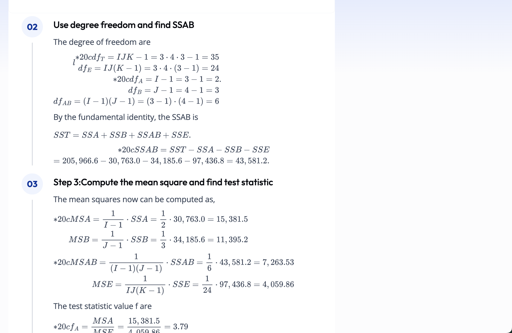
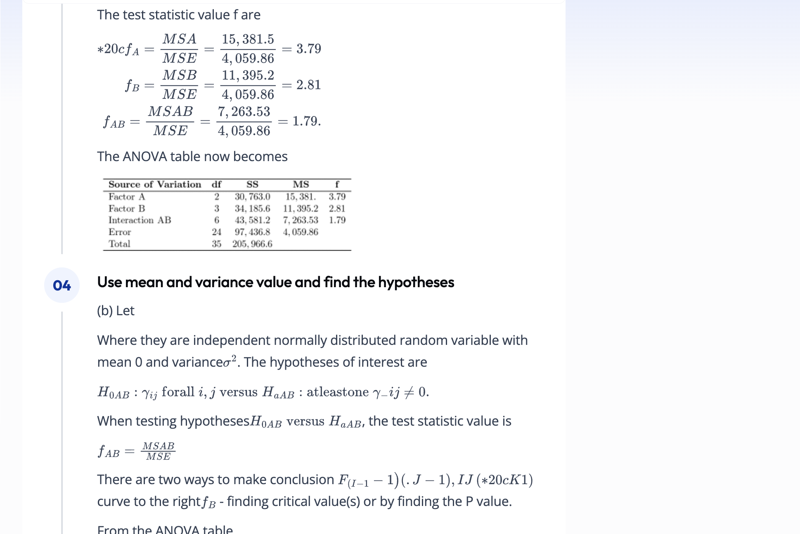
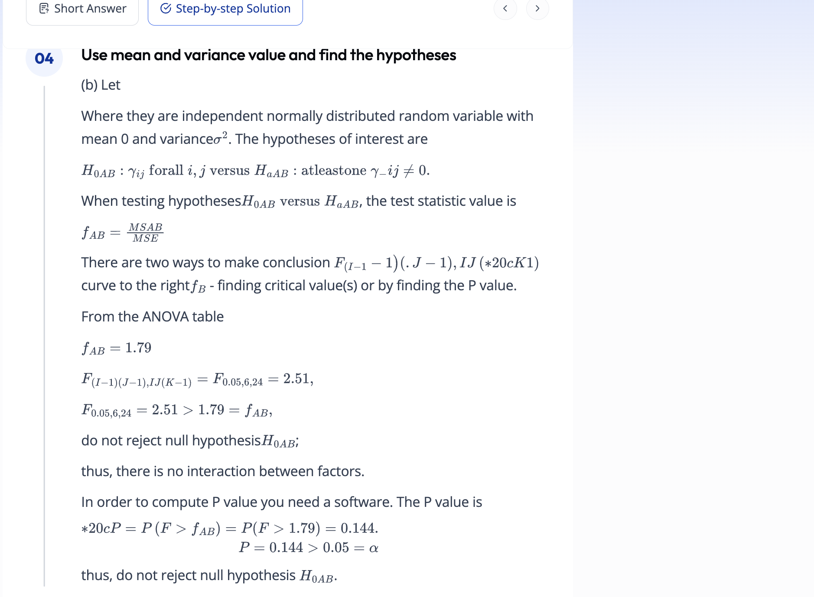

answer:
- [x] H0_AB cannot be rejected.
- [x] We conclude that no interaction is present.
- [x] The test statistic is not significant.
 

19. The article “An Analysis of Variance Applied to Screw Machines” (Industrial Quality Control, 1956: 8–9) describes an experiment to investigate how the length of steel bars was affected by time of day (A), heat treatment applied (B), and screw machine used (C). The three times were 8:00 A.M., 11:00 A.M., and 3:00 P.M., and there were two treatments and four machines (a 3 3 2 3 4 factorial experiment), resulting in the accompanying data [coded as 1000(length 2 4.380), which does not affect the analysis]. Sums of squares include SSAB = 1.646, SSAC = 71.021, SSBC = 1.542, SSE = 447.500, and SST = 1037.833. Select all statements that are true.
Group of answer choices

No interaction effects are significant at level .05.

Factor B and C main effects are significant at the level .05.

Factor A and C main effects are significant at the level .05.

Factors AC interaction effect is significant at level .05.
 

20. Four different coatings are being considered for corrosion protection of metal pipe. The pipe will be buried in three different types of soil. To investigate whether the amount of corrosion depends either on the coating or on the type of soil, 12 pieces of pipe are selected. Each piece is coated with one of the four coatings and buried in one of the three types of soil for a fixed time, after which the amount of corrosion (depth of maximum pits, in .0001 in.) is determined. The data appears in the table on page 431 exercise #2. Compute {alpha_hat}_1 - {alpha_hat}_4 to 2 decimal places.

work:
null is that alpha and beta = 0

https://www.vaia.com/en-us/textbooks/math/probability-and-statistics-for-engineering-and-sciences-9th/multifactor-analysis-of-variance/q2e-four-different-coatings-are-being-considered-for-corrosi/


