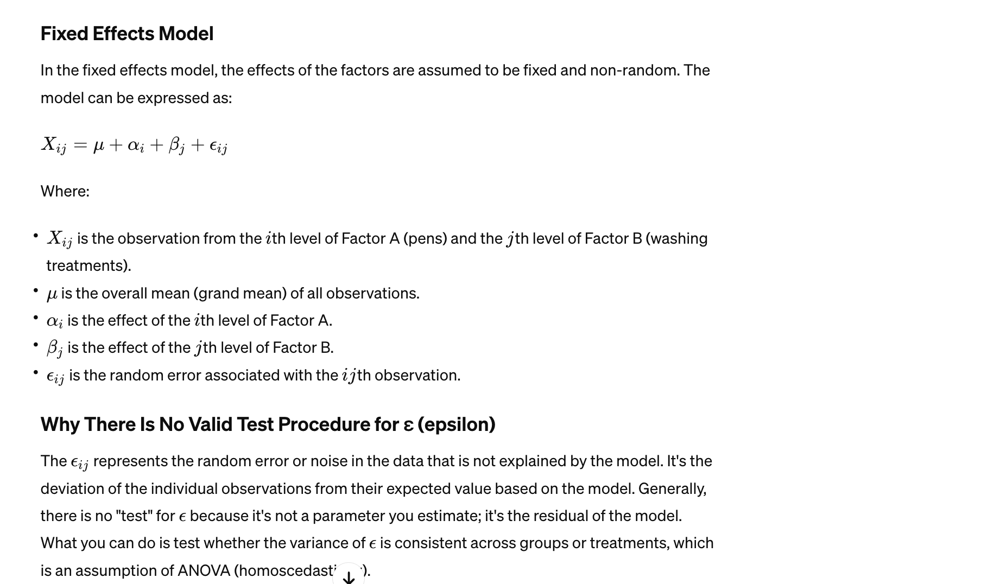
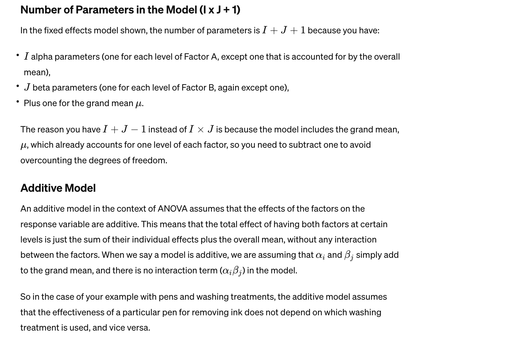
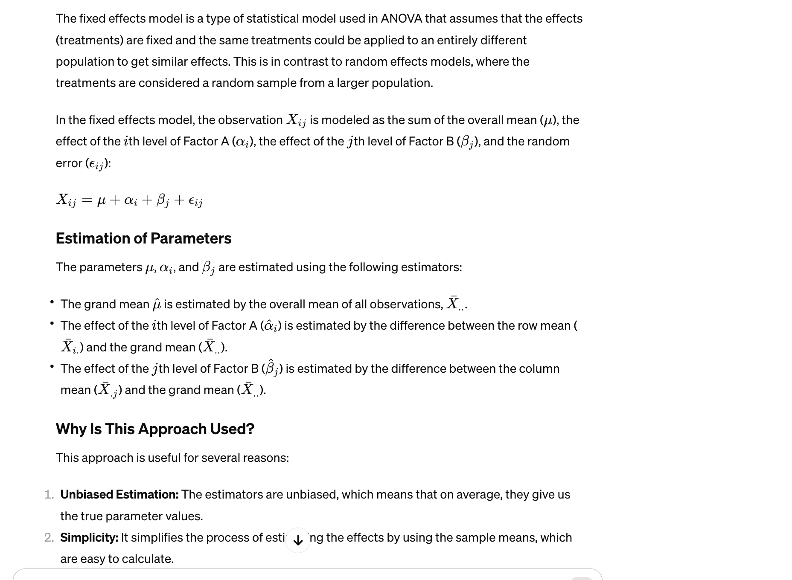
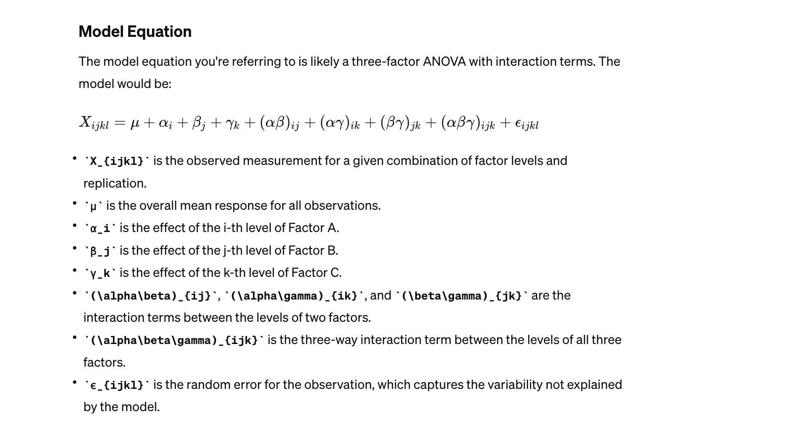
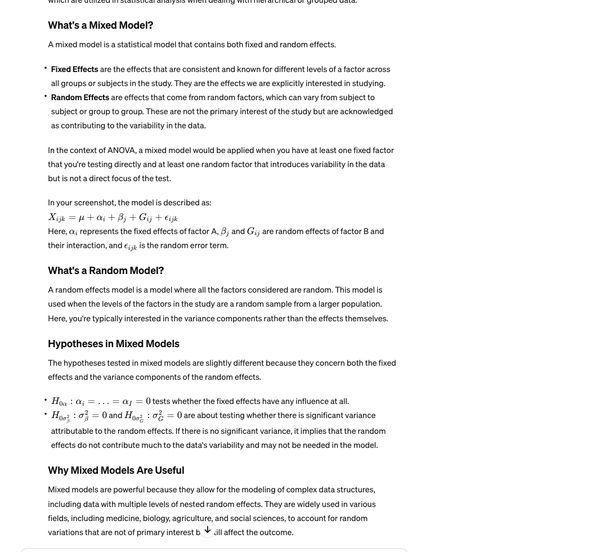
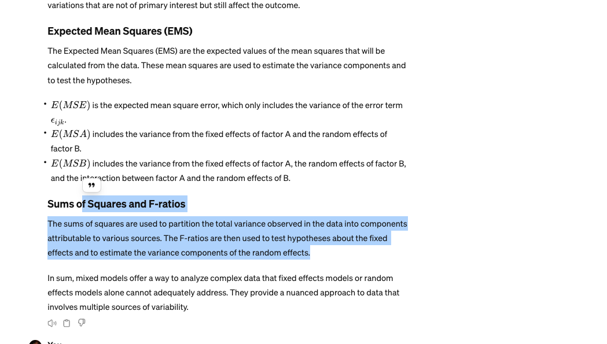
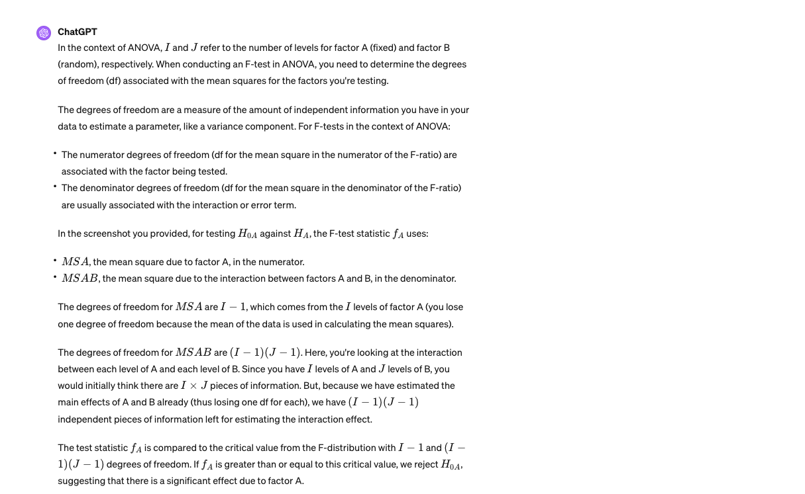
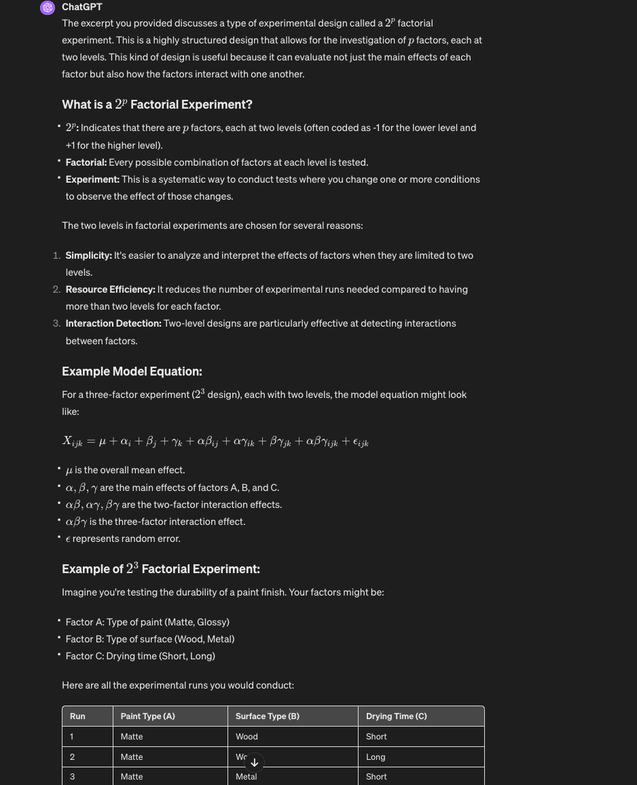
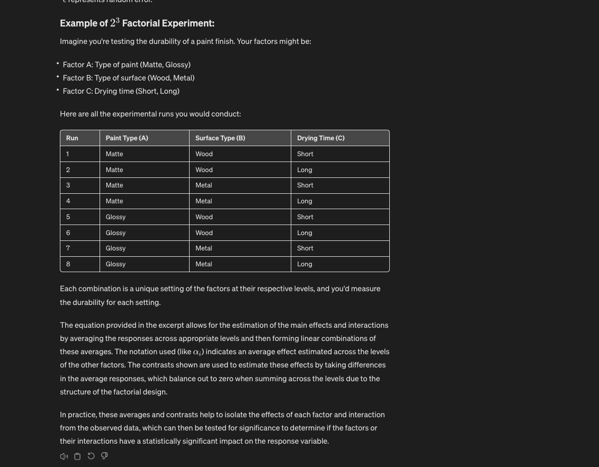

# Multifactor analysis of Variacne using Anova

## Terms
- level vs factor. Each factor has many levels.
- A factor is a treatment

So the factors, or treatments, can now be several. Still using anova.

## REview

Using Tukey's procedure, they've calculated "w" which is the minimum difference required for two means to be considered significantly different. The calculation uses the Q statistic from the studentized range distribution and the mean square of the error (MSE) from the ANOVA table. Then, pairwise comparisons are made between all brands, and the differences are compared against "w" to see if they are significant.

# Two treatments to start

I = factor(treatment) A
J = factor B

I*J total levels or pairs of the two factors.

## chatgpt explanation

The image you've shared is from a presentation, likely on the topic of multifactor ANOVA, which is also known as two-way ANOVA or factorial ANOVA. This type of ANOVA is used when researchers want to study the effect of two or more independent variables on a single dependent variable. In the context of the image:

I - factor (A): This refers to the first independent variable or factor in the study. Each level of this factor is represented by 'I'.
J - factor (B): This refers to the second independent variable or factor. Each level of this factor is represented by 'J'.
I × J: This represents the interaction between the two factors. An interaction effect occurs when the effect of one factor depends on the level of the other factor.
In a multifactor ANOVA, we don't just look at the main effects of each factor independently; we also consider the interaction between them. The main effects are the separate impacts of each factor on the dependent variable, while the interaction effect reveals whether the two factors affect the dependent variable differently when combined than when they are considered separately.

For instance, if Factor A is the type of exercise (e.g., cardio, strength, mixed) and Factor B is the diet type (e.g., low-carb, high-protein, vegan), a multifactor ANOVA would not only assess the individual effects of exercise and diet on weight loss but also whether the combination of a specific type of exercise and diet leads to a different outcome than expected based on their individual effects alone.

In the context of ANOVA, a "level" refers to the specific values or categories that an independent variable (factor) can take. Each level is a different condition or category within a factor that is being tested to see its effect on the dependent variable.

So, if Factor A is the type of exercise, the levels would be:

Level 1: Cardio-focused exercise
Level 2: Strength training
Level 3: Mixed (Cardio + Strength)

These levels are the specific groups that you are comparing in your analysis. When conducting a multifactor ANOVA, you are interested in seeing how each level of each factor affects the dependent variable, as well as how the combination of levels from different factors affects it.

Each level of Factor A will be tested in combination with each level of Factor B. If Factor B (diet type) has levels like low-carb, high-protein, and vegan, then you will have a total of 3 (levels for Factor A) × 3 (levels for Factor B) = 9 different combinations to analyze in your two-way ANOVA.

## Notes

X.j without the bar is the sum. - this is summing all i with j fixed. This used in tensors.

### Fixed effets model

The column mean (X̄.j) is the average of all the observations in a particular column of your data matrix. Each column corresponds to a level of one of your factors in the experiment. For example, if each column represents a different washing treatment, then the column mean would be the average effectiveness of that particular treatment across all the levels of the other factor (pens in your case).

Additive model: So in the case of your example with pens and washing treatments, the additive model assumes that the effectiveness of a particular pen for removing ink does not depend on which washing treatment is used, and vice versa.

The additive fixed effects model is a simpler model that does not consider interactions between factors. If interactions are present, you would need to use a model that includes interaction terms, which would be a two-way ANOVA with interaction, not just an additive model.

fixed effects:

In ANOVA, this model helps us partition the total variability in the data into variability due to Factor A (α), Factor B (β), and random error (ϵ), allowing us to test for the significance of each factor's effect on the outcome variable.

By calculating these estimators and using ANOVA tests, we can determine whether the differences in the mean responses among the levels of each factor are significant or whether they might be due to random variation. This informs us whether our factors have a significant effect on the dependent variable, which in your context, seems to be about ink removal efficacy.

## Error values

It is important to check that the error values have constant variance and are normal. That's a key assumption here in the test. We're testing the residuals of the error values. 

## Interaction

sometimes a factor might behave differently in the presence of another. 

## 3 factor Anova

How do we do this? We could do a 2 factor anova but alter it for 3 factors in Excel.

i,j,k,l in a 3 factor model:

i, j, k, and l refer to the indices for the levels of different factors in an experimental design.

In a three-factor model, i, j, and k would typically represent the levels of factors A, B, and C, respectively.

l would typically represent the replication within each combination of i, j, and 

In a fixed effects model for ANOVA:

Main Effects: The α, β, and γ terms represent the main effects of each factor, which is the average change in response when switching between levels of that factor, holding all other factors constant.

Interaction Effects: The terms like (\alpha\beta)_{ij}, (\alpha\gamma)_{ik}, and (\beta\gamma)_{jk} represent the interaction effects between the factors. An interaction effect occurs when the effect of one factor on the response variable depends on the level of another factor.

Three-way Interaction: The (\alpha\beta\gamma)_{ijk} term represents the three-way interaction between all three factors. This term captures how the combination of all three factors together influences the response variable.

## Error analysis

The error terms ε_ijkl must satisfy certain assumptions for the ANOVA model to be valid:

Normality: Errors should be normally distributed for each combination of the factor levels.
Constant Variance (Homoscedasticity): Errors should have constant variance across all combinations of factor levels.
Independence: Errors should be independent of each other.
Importance of Error Analysis
Error analysis is vital because it tells us whether the model is adequate and whether our inferences, such as the significance of main effects and interactions, are reliable. The assumption of normally distributed errors with constant variance is foundational for the F-tests used in ANOVA to be valid. If these assumptions are violated, the p-values and confidence intervals from ANOVA might not be accurate. This is why residual analysis, including plots of residuals vs. fitted values and normal probability plots, is a standard part of the diagnostic process in ANOVA and regression modeling.

## Anova table explained for 3 factors

Source of Variation: This column lists the factors tested in the ANOVA, including main effects (A, B, C), interactions between two factors (AB, AC, BC), and the three-way interaction (ABC).

Degrees of Freedom (df): Degrees of freedom are the number of values in the final calculation of a statistic that are free to vary. For a single factor, the df is the number of levels of the factor minus one. For interactions, it's the product of the df's of the factors involved. For error, it's the total number of observations minus the total number of groups formed by the factors.

Sum of Squares (SS): This represents the variability due to each source, calculated by summing the squared differences from the mean.

Mean Square (MS): This is the SS divided by its corresponding df. It represents the average variability due to each source.

F-Value: This is the MS of the factor divided by the MS of the error. It shows the ratio of variance explained by the factor to the variance within the groups (error).

P-Value: This tells us the probability of observing such an F-value if the null hypothesis that there is no effect of that factor is true. A low p-value (typically less than 0.05) suggests the factor has a significant effect on the dependent variable.

Understanding Degrees of Freedom:
For factor A, if it has 2 levels, the df would be 2−1=1.
For factor B, also with 2 levels, the df would also be 2−1=1.
For factor C, with 2 levels, the df is 2−1=1.
For interaction AB, the df is the product of the df's of A and B, so 1×1=1.

The same logic applies to AC, BC, and ABC.

## Yates method

Yates' method is a way to calculate factorial ANOVA by hand for a 2x2 factorial design. It's a systematic approach that simplifies the calculation of main effects and interactions by ordering the data in a specific way and using addition and subtraction to compute the SS values. However, Yates' method isn't necessary for larger designs or when using statistical software.

# Factorial experiments

large number of factor experiments, not just 2 or 3. IF you have a bunch of factors and each are continuous variables. 

What can we do to be more efficient about collecting data. For each factor of data, we can collect two levels. A- is the low level and A+ is the high level. The idea here is that if they're no different, no need to collect more levels. 

Sparsity of effects: a three factor interactino is not going to be significant unless the individual factors are significant. Higher order effects are less likely. 

Block so introduce a confounding variable? Do different experiemnts on different days to introduce the confounding variable of time. 

## Randomized block experiments

In a randomized block design, subjects or experimental units are divided into blocks based on certain characteristics (such as humidity levels in the example given). These characteristics are called blocking factors and are used to control for variability that is not the primary interest of the experiment but could affect the response variable.

By controlling for these blocking factors, you can more accurately detect differences in the response variable due to the primary factor of interest (in this case, the brand of dehumidifier).

How It Works:
Blocking: You first group your subjects or experimental units into blocks. Each block is homogeneous with respect to the blocking factor (e.g., similar humidity levels).

Randomization: Within each block, you randomly assign different treatments (e.g., brands of dehumidifier) to the subjects or units.

## Mixed models

A mixed model is a statistical model that contains both fixed and random effects.

Fixed Effects are the effects that are consistent and known for different levels of a factor across all groups or subjects in the study. They are the effects we are explicitly interested in studying.
Random Effects are effects that come from random factors, which can vary from subject to subject or group to group. These are not the primary interest of the study but are acknowledged as contributing to the variability in the data.
In the context of ANOVA, a mixed model would be applied when you have at least one fixed factor that you're testing directly and at least one random factor that introduces variability in the data but is not a direct focus of the test.

In your screenshot, the model is described as:
`X_ijk = μ + α_i + β_j + G_ij + ϵ_ijk`

Here, `α_i` represents the fixed effects of factor A,
β_j and G_ij are random effects of factor B and their interaction, and ϵ_ijk is the random error term.

## squared means

The sums of squares are used to partition the total variance observed in the data into components attributable to various sources. The F-ratios are then used to test hypotheses about the fixed effects and to estimate the variance components of the random effects.

In sum, mixed models offer a way to analyze complex data that fixed effects models or random effects models alone cannot adequately address. 

## Degrees of freedom

The numerator degrees of freedom (df for the mean square in the numerator of the F-ratio) are associated with the factor being tested.
The denominator degrees of freedom (df for the mean square in the denominator of the F-ratio) are usually associated with the interaction or error term.
In the screenshot you provided, for testing

H_0A and H_A against, the F-test statistic 

f_A uses:

MSA, the mean square due to factor A, in the numerator.
MSAB, the mean square due to the interaction between factors A and B, in the denominator.

The degrees of freedom for MSA are I−1, which comes from the I levels of factor A (you lose one degree of freedom because the mean of the data is used in calculating the mean squares).

## Notation. What is uij?

So μ_ij is the expected mean response when Factor A is at level i and Factor B is at level j. It's essentially the average value you would expect to observe in the data for that specific combination of factor levels, assuming there's no interaction or other effects influencing the response.

# Stupid Latin squares

The Latin Square is arranged so that each level of Factor C appears once in each row and once in each column. Factor C is often referred to as the "treatment" in the context of the Latin Square. In the example provided, Factor C would correspond to different treatments or conditions being tested across the Latin Square, such as different levels of relative humidity in an experiment on abrasion resistance of leather.

In the table provided in the second screenshot, you see numbers 1 through 6 in the cells. These numbers represent the levels of Factor C (treatments) assigned to each cell of the Latin Square. Each number (level of Factor C) appears exactly once in each row and each column, meeting the requirement of the Latin Square design.

So, in the provided data:

Factor A (the rows) could be different stores or time periods.
Factor B (the columns) could be different display configurations or days of the week.
Factor C (indicated by the numbers in the cells) represents the specific treatment applied, such as a specific level of relative humidity.
The point of this design is to control for the effects of Factors A and B while testing the effect of Factor C on the response variable, which in the example given is abrasion resistance. This design helps ensure that the results for Factor C are not confounded by the row or column effects.

## 2 factor experiments

# 2^p factor experiments

p is the number of factors. could be 3

Yes, Yates' method, also known as the Yates' algorithm, is a systematic approach for analyzing factorial designs, specifically 
2^p factorial experiments. It's used to calculate the sums of squares for main effects, interactions, and the total sum of squares (SST), which are all necessary components for conducting an ANOVA.

Here's how Yates' method contributes to determining the F-statistic:

Ordering of Runs: Yates' method starts with the responses ordered in a specific way, often following the standard order of treatments in a 
2^p factorial design. This order reflects the binary nature of the treatment combinations.

Calculation of Sums of Squares:
- Yates' algorithm proceeds to calculate the sum of squares associated with each effect by a series of mathematical operations that partition the total variability in the responses.
- For main effects and interactions, the method uses a sequence of adding and subtracting the ordered responses to compute the effects.
- Once the effects are computed, their squares are summed and divided by a scaling factor to get the sums of squares for those effects.

Total Sum of Squares (SST):
- The total sum of squares represents the overall variability in the data.
- It's computed as the sum of the squared differences between each observation and the overall mean.

Sum of Squares for Error (SSE):
- The sum of squares for error measures the residual variability not explained by the model.
- It can be calculated by subtracting the sum of squares due to all the estimated effects from SST.

F-Statistic:
- The F-statistic is calculated for each main effect and interaction to test whether it is statistically significant.
- The F-statistic for an effect is the mean square of that effect (sum of squares divided by its degrees of freedom) divided by the mean square for error (SSE divided by its degrees of freedom).

Yates' method simplifies the calculation of these sums of squares, making it easier to perform an ANOVA by hand or understand the underlying calculations in a 2^p factorial design. However, the specific calculation of the F-statistic requires further steps beyond Yates' method to determine the mean squares for each source of variation and then to compute the F-ratistics.

## Blocking

Purpose of Blocking:
- To increase the precision of the experiment by controlling for variation from known or suspected nuisance factors.
- To enable the experiment to be more manageable by dealing with fewer experimental units at a time.
- To ensure that the comparisons of interest are made within blocks of homogeneous units, thereby reducing the error variance and increasing the sensitivity of the experiment.
 
In the example provided, the ABC interaction is confounded with the blocks. This means that any variability due to the interaction of factors A, B, and C is mixed in with the variability due to the blocks. Since the higher-order interaction (in this case, the three-factor interaction ABC) is often of less interest and more difficult to interpret, it is intentionally confounded with the block effect.

The sum of squares for blocks (SSB) is calculated using the total of all responses within each block.

This is done by taking the square of the total response in each block, dividing by the number of observations in each block, summing these for all blocks, and then subtracting the square of the grand total divided by the total number of observations.
In the example provided, you can see how the SSB is calculated using the block totals, and the other sums of squares for main effects and interactions are calculated using Yates' method.

By controlling for blocks in this way, the analysis can focus on the main effects and two-factor interactions, which are assumed to be the most relevant for interpretation in this experimental setup.

### Purpose of blocking:

In the example provided, the ABC interaction is confounded with the blocks. This means that any variability due to the interaction of factors A, B, and C is mixed in with the variability due to the blocks. Since the higher-order interaction (in this case, the three-factor interaction ABC) is often of less interest and more difficult to interpret, it is intentionally confounded with the block effect.

By confounding the ABC interaction with blocks, the experimenter accepts that they will not be able to separately estimate this interaction effect. Instead, the effect of blocks includes both the block variability and the ABC interaction.

The experimental runs are divided into two blocks in such a way that each block contains a set of treatments where ABC interaction effect is constant across all treatments within a block.

To enable the experiment to be more manageable by dealing with fewer experimental units at a time.

