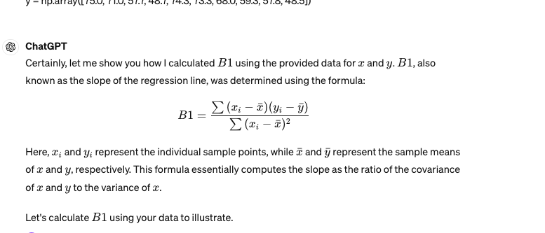
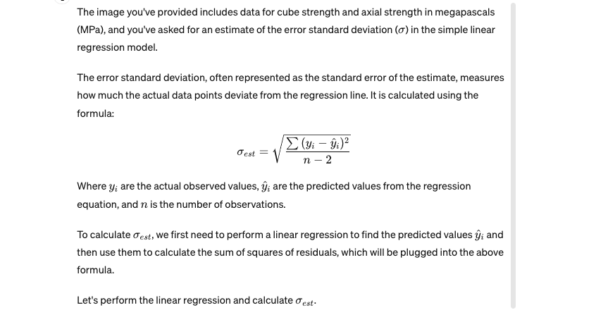
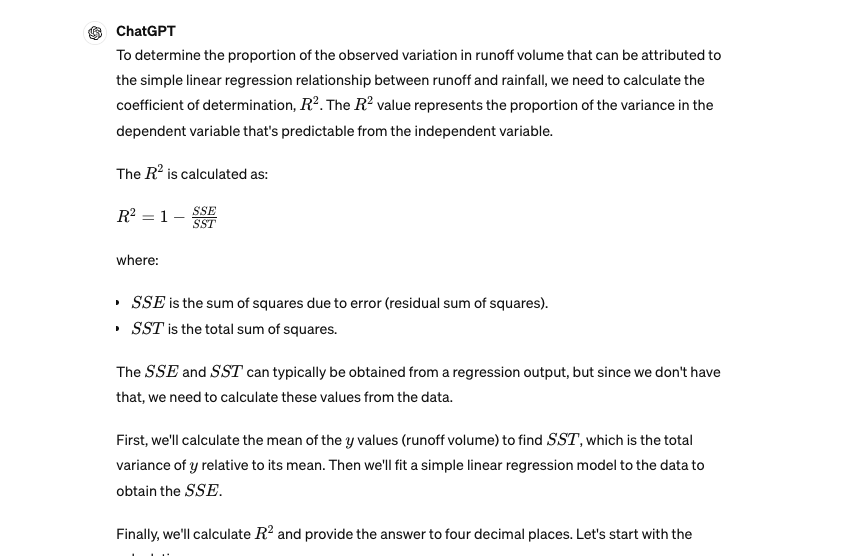

# Some formulas:

so if
r^2 = 1 - (SSE/SST)
slope estimate B1_hat = 	Sxy/Sxx
OR
b1 = (sum_xy - n * mean_x * mean_y) / (sum_x_squared - n * mean_x**2)

b1 is also cov_xy / var_x


for samples of pairs:
r = Sxy / sqrt(Sxx * Syy)


Sxx =   # ∑(xi - x̄)²
Syy = # ∑(yi - ȳ)²

SSE_formula = sum_yi_squared - (intercept * sum_yi) - (slope * sum_xiyi)


1."Astringency is the quality in a wine that makes the wine drinker's mouth feel slightly rough, dry, and puckery. The paper 'Analysis of Tannins in Red Wine Using Multiple Methods: Correlation with Perceived Astringency' (Amer. J. of Enol. and Vitic., 2006: 481-485) reported on an investigation to assess the relationship between perceived astringency and tannin concentration using various analytic methods. Page 506 problem 46 lists data provided by the authors on x = tannin concentration by protein precipitation and y = perceived astringency as determined by a panel of tasters. Calclate the coefficient of determination to four decimal places."

answer:
0.8364


2. "The article 'Characterization of Highway Runoff in Austin, Texas, Area' (J. of Envir. Engr., 1998: 131-137) gave a scatter plot, along with the least squares line, of x = rainfull volume (m^3) and y = runoff volume (m^3) for a particular location. The data values located on page 488 problem 16 were read from the plot. Calculate a point estimate of the slope of the population regression line to four decimal places."


answer:
0.827
 

3. "The article 'Characterization of Highway Runoff in Austin, Texas, Area' (J. of Envir. Engr., 1998: 131-137) gave a scatter plot, along with the least squares line, of x = rainfull volume (m^3) and y = runoff volume (m^3) for a particular location. The data values located on page 488 problem 16 were read from the plot. Calculate a point estimate of the intercept of the population regression line to four decimal places."

answer:
-1.1283
 

4. "The article 'Increases in Steroid Binding Globulins Induced by Tamoxifen in Patients with Carcinoma of the Breast' (J. of Endocrinology, 1978: 219-226) reports data on the effects of the drug tamoxifen on change in the level of cortisol-binding globulin (CBG) of patients during treatment. With age = x and CBG = y, summary values are found on page 517 problem 64. In a regression analysis of y on x, what proportion of variation in change of cortisol-binding globulin level could be explained by variation in patient age within the sample? Give answer to three decimal places."

work:

S_xy = 
# Given summary values
n = 26  # number of observations
sum_x = 1613  # Σx_i
sum_y = 281.9  # Σy_i
sum_xy = 16731  # Σx_i*y_i

# Calculate S_xy using the formula
S_xy = sum_xy - (sum_x * sum_y / n)

-757.6423076923056


So using the r formula for sample pairs:

r = Sxy / sqrt(Sxx * Syy)
S_xx = 3756.96  # sum of (x - x_mean)^2
S_yy = 465.34   # sum of (y - y_mean)^2

= -757.6423076923056 / sqrt(3756.96 * 465.34) = -0.5730

answer: 


-0.5730


5. "For the past decade, rubber powder has been used in asphalt cement to improve performance. The article 'Experimental Study of Recycled Rubber-Filled High-Strength Concrete' (Magazine of Concrete Res., 2009: 549-556) includes a regression of y = axial strength (MPa) on strength (MPa) based on the sample data on page 488 problem 18. Select all statements that are true."


work:


# Calculating each part of the slope formula separately for clarity

# Calculate the mean of x and y
mean_x = np.mean(x)
mean_y = np.mean(y)

# Calculate the deviations from the mean for x and y
deviations_x = x - mean_x
deviations_y = y - mean_y

# Calculate the covariance between x and y, which is the numerator of the slope formula
cov_xy = np.sum(deviations_x * deviations_y)

# Calculate the variance of x, which is the denominator of the slope formula
var_x = np.sum(deviations_x**2)

# Now, we can calculate the slope (b1)
b1_calculated = cov_xy / var_x

# Let's show all these intermediate values
mean_x, mean_y, deviations_x, deviations_y, cov_xy, var_x, b1_calculated


b1_calculated = cov_xy / var_x

# Recalculate the slope (B1) using the provided data
b1 = np.sum((x - mean_x) * (y - mean_y)) / np.sum((x - mean_x)**2)
b1

cov_xy (the top part of b1 calc) The sum of the products of the corresponding values in deviations_x and deviations_y, which is  605.838

Group of answer choices

- [ ] A one-MPa increase in cube strength is associated with a 0.872 MPa increase in the predicted axial strength for these asphalt samples.
- [ ] A one-MPa increase in cube strength is associated with a 0.725 MPa increase in the predicted axial strength for these asphalt samples.
- [ ] A one-MPa increase in cube strength is associated with a 0.187 MPa increase in the predicted axial strength for these asphalt samples.
- [ ] A one-MPa increase in cube strength is associated with a 0.637 MPa increase in the predicted axial strength for these asphalt samples.
- [x] None of the statements are true.
 

6. "The article 'Characterization of Highway Runoff in Austin, Texas, Area' (J. of Envir. Engr., 1998: 131-137) gave a scatter plot, along with the least squares line, of x = rainfull volume (m^3) and y = runoff volume (m^3) for a particular location. The data values located on page 488 problem 16 were read from the plot. Calculate a point estimate of the true average runoff volume when rainfall volume is 50 to four decimal places."

answer:
40.2204
 

7. "The article 'Exhaust Emissions from Four-Stroke Lawn Mower Engines' (J. of the Air and Water Mgmnt. Assoc., 4. 1997: 945-952) reported data from a study in which both a baseline gasoline mixture and a reformulated gasoline were used. Consider the observations on age (yr) and NO_x emissions (g/kWh) located on page 475 problem number 2. Which of the following statements are true?"


- [ ] Age does not seem to be a particularly useful predictor of NO_x emission.
- [ ] As the age of the lawn mower increased the emissions also increase.
- [ ] There is no clear pattern amongst the variables.
- [ ] All statements are correct
- [ ] None of the statements are correct

work:
To answer your question about whether the statements about the relationship between the age of the lawn mower and NOx emissions are correct, let's analyze the provided data using the statistical computations you've mentioned.

First, let's calculate the correlation between 'Age' and 'NO_x' emissions (assuming 'NO_x' emissions to be represented by both 'Baseline' and 'Reformulated' values). This will help us understand if there is a linear relationship between the age of the lawn mower and the emissions. The correlation coefficient \( r \) and the slope \( b1 \) will be computed using the formulas provided.

I'll start by computing the necessary values:
- \( \sum{(x_i - \bar{x})^2} \) (Sxx)
- \( \sum{(y_i - \bar{y})^2} \) (Syy)
- \( \sum{(x_i - \bar{x})(y_i - \bar{y})} \) (Sxy)

where \( x \) is the 'Age' and \( y \) will be computed separately for 'Baseline' and 'Reformulated' as 'NO_x' emissions. This will allow us to assess the correlation for both cases. Let's compute these values and interpret the results.

Based on the calculations:

- **Sxx** (Sum of squares of differences from the mean Age): \( 298.90 \)
- **Syy** (Sum of squares of differences from the mean for Baseline and Reformulated NOx emissions): \( 25.94 \) and \( 46.40 \), respectively.
- **Sxy** (Sum of products of differences for Age and NOx emissions for Baseline and Reformulated): \( -46.71 \) and \( -58.48 \), respectively.

The correlation coefficients (\( r \)) and slope estimates (\( b1 \)) are:
- **Baseline**:
  - \( r = -0.53 \)
  - \( b1 = -0.16 \)
- **Reformulated**:
  - \( r = -0.50 \)
  - \( b1 = -0.20 \)

The negative correlation coefficients for both 'Baseline' and 'Reformulated' emissions suggest a moderate negative linear relationship between the 'Age' of the engine and NOx emissions. This indicates that as the age of the engine increases, the NOx emissions decrease, contrary to the expectation that emissions would increase.

Considering the provided statements:

1. **"Age does not seem to be a particularly useful predictor of NOx emission."**
   - This is partially true as there is a moderate correlation, but it might not be strong enough to use 'Age' alone as a predictor for emissions without considering other factors.
   
2. **"As the age of the lawn mower increased the emissions also increase."**
   - This statement is false. The correlation and slope indicate a decrease in emissions with increased age.
   
3. **"There is no clear pattern amongst the variables."**
   - This is false. There is a clear, though moderate, negative correlation indicating a pattern of decrease in emissions with increase in age.

4. **"All statements are correct"** and **"None of the statements are correct"**
   - Given the analysis, the most accurate statement is that "None of the statements are correct" since two are false and one is only partially true.

Therefore, based on the data and analysis, "None of the statements are correct" is the best choice.


answer:
None of the statements is correct
 

8. "The Turbine Oil Oxidation Test (TOST) and the Rotating Bomb Oxidation Test (RBOT) are two different procedures for evaluating the oxidation stability of steam turbine oils. The article 'Dependence of Oxidation Stability of Steam Turbine Oil on Base Oil Composition' (J. of the Society of Tribologists and Lubrication Engrs., Oct. 1997: 19-24) reported the observations on page 516 problem 58 on x = TOST time (hr) and y = RBOT time (min) for 12 oil specimens. Carry out a test of hypotheses to decide whether RBOT time and TOST time are linearly related. Select all statements that are true."


- [x] The null hypothesis should be rejected.
- [ ] The test statistic is 0.58
- [ ] Rho is hard to calculate.
- [ ] All statements are correct
- [ ] None of the statements are correct
 

9. "One factor in the development of tennis elbow, a malady that strikes fear in the hearts of all serious tennis players, is the impact-induced vibration of the racket-and-arm system at ball contact. It is well known that the likelihood of getting tennis elbow depends on various properties of the racket used. Consider the scatter plot of x = racket resonance frequency (Hz) and y = sum of peak-to-peak acceleration (a characteristic of arm vibration, in m/sec/sec) for n = 23 different rackets ('Transfer of Tennis Racket Vibrations into the Human Forearm,' Medicine and Science in Sports and Exercise, 1992: 1134-1140). Select the true statements about the features of the data and scatter plot found on page 476 problem number 6."


- [x] As the resonance frequency increases the sum of peak-to-peak acceleration tends to decrease.
- [ ] There appears to be no linear relationship between racket resonance frequency and sum of peak-to-peak acceleration.
- [ ] There are three tennis rackets that appear to differ from the other 21 rackets.
- [ ] All statements are correct
- [ ] None of the statements are correct
 

10. "A number of studies have shown lichens (certain plants composed of an alga and a fungus) to be excellent bioindicators of air pollution. The article 'The Epiphytic Lichen Hypogymnia Physodes as a Biomonitor of Atmospheric Nitrogen and Sulphur Deposition in Norway' (Envir. Monitoring and Assessment, 1993: 27-47) gives the data on page 489 problem 20 (read from a graph) on x = NO_3 wet deposition (g N/m2) and y = lichen (% dry weight). The author used simple linear regression to analyze the data. Calculate an estimate of sigma to four decimal places."
# Given standard error of the estimate (sigma)
sigma = 0.1932

 
answer:
sigma = 0.1932


11. "A study to assess the capability of subsurface flow wetland systems to remove biochemical oxygen demand (BOD) and various other chemical constituents resulted in the data on page 475 problem number 4 on x = BOD mass loading (kg/ha/d) and y = BOD mass removal (kg/ha/d) ('Subsurface Flow Wetlands-A Performance Evaluation,' Water Envir. Res., 1995: 244-247). Select all statements that are true?"


- [x] There is a strong linear relationship between BOD mass loading and BOD mass removal.
- [x] As the loading increases, so does the removal.
- [x] There is one observation that appears not to match the liner pattern.
- [ ] As the loading increases, the removal does not increase.
- [ ] Every observation matches the liner pattern.
 

work:
To address the statements regarding the relationship between BOD mass loading and BOD mass removal, we'll first construct a scatter plot of the provided data. By visualizing the data, we can comment on the linearity and pattern of the relationship, as well as identify any outliers or observations that do not match the pattern.

We'll follow these steps:

Plot the scatter plot using the data provided.
Assess the pattern of the points to determine if there's a linear relationship.
Look for any outliers that do not fit the linear pattern.
Construct boxplots for both mass loading and mass removal to look at the distribution and comment on any interesting features.


```python3
import matplotlib.pyplot as plt

# Given data
data = {
    'BOD_mass_loading': [3, 8, 10, 11, 13, 16, 27, 30, 35, 37, 38, 44, 103, 142],
    'BOD_mass_removal': [4, 7, 8, 8, 10, 11, 16, 26, 21, 9, 31, 30, 75, 90]
}

# Creating a DataFrame
df_bod = pd.DataFrame(data)

# Scatter plot for BOD mass loading vs. BOD mass removal
plt.figure(figsize=(10, 6))
plt.scatter(df_bod['BOD_mass_loading'], df_bod['BOD_mass_removal'], color='blue')
plt.title('Scatter Plot of BOD Mass Loading vs. BOD Mass Removal')
plt.xlabel('BOD Mass Loading (kg/ha/d)')
plt.ylabel('BOD Mass Removal (kg/ha/d)')
plt.grid(True)
plt.show()

# Boxplots for BOD mass loading and BOD mass removal
fig, axes = plt.subplots(1, 2, figsize=(12, 6))

# Boxplot for BOD mass loading
axes[0].boxplot(df_bod['BOD_mass_loading'])
axes[0].set_title('Boxplot of BOD Mass Loading')
axes[0].set_ylabel('BOD Mass Loading (kg/ha/d)')

# Boxplot for BOD mass removal
axes[1].boxplot(df_bod['BOD_mass_removal'])
axes[1].set_title('Boxplot of BOD Mass Removal')
axes[1].set_ylabel('BOD Mass Removal (kg/ha/d)')

plt.tight_layout()
plt.show()
```

answer


12. "For the past decade, rubber powder has been used in asphalt cement to improve performance. The article 'Experimental Study of Recycled Rubber-Filled High-Strength Concrete' (Magazine of Concrete Res., 2009: 549-556) includes a regression of y = axial strength (MPa) on strength (MPa) based on the sample data on page 488 problem 18. Calculate an estimate of the error standard deviation, sigma, in the simple linear regression model to three decimal places."

work:

from scipy.stats import linregress

# Provided data from the image
cube_strength = [112.3, 97.0, 92.7, 86.0, 102.0, 99.2, 95.8, 103.5, 89.0, 86.7]
axial_strength = [75.0, 71.0, 57.7, 48.7, 74.3, 73.3, 68.0, 59.3, 57.8, 48.5]

# Perform linear regression
regression_results = linregress(cube_strength, axial_strength)

# Get the slope (m), intercept (b), and r-value (for the coefficient of determination)
slope = regression_results.slope
intercept = regression_results.intercept
r_value = regression_results.rvalue

# Calculate predicted y values
predicted_y = [slope * x + intercept for x in cube_strength]

# Calculate the residuals (differences between observed and predicted values)
residuals = [y - y_hat for y, y_hat in zip(axial_strength, predicted_y)]

# Calculate the sum of the squares of the residuals
ss_res = sum(res**2 for res in residuals)

# Calculate the standard error of the estimate (sigma_est)
n = len(cube_strength)  # Number of observations
sigma_est = (ss_res / (n - 2))**0.5

# Return the slope, coefficient of determination (r-squared), and sigma_est
slope, r_value**2, sigma_est


answer:

6.625
 

13. "The article 'Characterization of Highway Runoff in Austin, Texas, Area' (J. of Envir. Engr., 1998: 131-137) gave a scatter plot, along with the least squares line, of x = rainfull volume (m^3) and y = runoff volume (m^3) for a particular location. The data values located on page 488 problem 16 were read from the plot. Calculate a point estimate of the standard deviation sigma to two decimal places."
5.24
 

14. "The article 'Some Field Experience in the Use of an Accelerated Method in Estimating 28-Day Strength of Concrete' (J. of Amer. Concrete Institute, 1969: 895) considered regressing y = 28-day standard-cured strength (psi) against x = accelerated strength (psi). Suppose the equation of the true regression line is y = 1800 + 1.3x. Suppose that the standard deviation of the random deviation epsilon is 350 psi. Consider making two independent observations on 28-day strength, the first for an accelerated strength of 2000 and the second for x = 2500. What is the probability that the second observation will exceed the first by more than 1000 psi?"
 
answer:
0.2397

15. "The article 'Characterization of Highway Runoff in Austin, Texas, Area' (J. of Envir. Engr., 1998: 131-137) gave a scatter plot, along with the least squares line, of x = rainfull volume (m^3) and y = runoff volume (m^3) for a particular location. The data values located on page 488 problem 16 were read from the plot. Select the statements that are true."


- [x] The scatterplot shows a strong linear relationship between rainfall volume and runoff volume.
- [ ] The scatterplot does not show a strong linear relationship between rainfall volume and runoff volume.
- [x] The scatterplot validates the use of the simple linear regression
- [ ] There are three outliers present in the scatterplot.
- [ ] There are five outliers present in the scatterplot.
 

16. "The article 'Increases in Steroid Binding Globulins Induced by Tamoxifen in Patients with Carcinoma of the Breast' (J. of Endocrinology, 1978: 219-226) reports data on the effects of the drug tamoxifen on change in the level of cortisol-binding globulin (CBG) of patients during treatment. With age = x and CBG = y, summary values are found on page 517 problem 64. Compute a 90% CI lower-bound for the true correlation coefficient rho to four decimal places."

work:
find r^2 -> then Std error -> lower bound of confidence interval
# Corrected values for Sxx and Syy
Sxx = 3756.96  # ∑(xi - x̄)²
Syy = 465.34  # ∑(yi - ȳ)²

# Recalculate Sxy using the corrected values
Sxy = sum_xiyi - n * mean_x * mean_y

# Calculate the correlation coefficient r
r = Sxy / np.sqrt(Sxx * Syy)

# t value for 90% CI for one-tailed test
t_value = t.ppf(1 - 0.10, n - 2)

# Calculate the standard error of r (SE_r)
SE_r = np.sqrt((1 - r**2) / (n - 2))

# Calculate the lower bound of the 90% confidence interval for r
lower_bound_r = r - t_value * SE_r

lower_bound_r, SE_r, r
 

answer:
-0.3839

17. "For the past decade, rubber powder has been used in asphalt cement to improve performance. The article 'Experimental Study of Recycled Rubber-Filled High-Strength Concrete' (Magazine of Concrete Res., 2009: 549-556) includes a regression of y = axial strength (MPa) on strength (MPa) based on the sample data on page 488 problem 18. Calculate the coefficient of determination (r^2) to three decimal places."

work:

# Data for x and y
x = np.array([112.3, 97.0, 92.7, 86.0, 102.0, 99.2, 95.8, 103.5, 89.0, 86.7])
y = np.array([75.0, 71.0, 57.7, 48.7, 74.3, 73.3, 68.0, 59.3, 57.8, 48.5])

# Sample size
n = x.size

# Means of x and y
mean_x = np.mean(x)
mean_y = np.mean(y)

# Sum of squares of x and y
Sxx = np.sum((x - mean_x)**2)
Syy = np.sum((y - mean_y)**2)

# Sum of products of x and y
Sxy = np.sum((x - mean_x) * (y - mean_y))

# Calculate the slope (b1) and intercept (b0) for the least squares line
b1 = Sxy / Sxx
b0 = mean_y - b1 * mean_x

# Calculate the estimated y values
y_est = b0 + b1 * x

# Calculate the Sum of Squares due to Regression (SSR) and the Total Sum of Squares (SST)
SSR = np.sum((y_est - mean_y)**2)
SST = Syy

# Calculate the Coefficient of Determination (r^2)
r_squared = SSR / SST

# Calculate the Standard Error of Estimate (sigma_estimate or s)
SSE = np.sum((y - y_est)**2)
sigma_estimate = np.sqrt(SSE / (n - 2))

r_squared, SSE, SSR, SST, sigma_estimate


answer: 

0.630048
 

18. "The article 'Characterization of Highway Runoff in Austin, Texas, Area' (J. of Envir. Engr., 1998: 131-137) gave a scatter plot, along with the least squares line, of x = rainfull volume (m^3) and y = runoff volume (m^3) for a particular location. The data values located on page 488 problem 16 were read from the plot. What proportion of the obsserved variation in runoff volume can be attributed to the simple linear regression relationship between runoff and rainfall? Give answer to four decimal places."


work:



```python3
import numpy as np

# Given data
rainfall_volume = [5, 12, 14, 17, 23, 30, 40, 47, 55, 67, 72, 81, 96, 112, 127]
runoff_volume = [4, 10, 13, 15, 15, 25, 27, 46, 38, 46, 53, 70, 82, 99, 100]

# Calculating mean of the runoff volume
mean_runoff = np.mean(runoff_volume)

# Calculating SST (total sum of squares)
SST = sum([(y_i - mean_runoff) ** 2 for y_i in runoff_volume])

# Performing simple linear regression to find the regression line
slope, intercept = np.polyfit(rainfall_volume, runoff_volume, 1)

# Calculating the predicted runoff volume using the regression line
predicted_runoff = [intercept + slope * x_i for x_i in rainfall_volume]

# Calculating SSE (residual sum of squares)
SSE = sum([(y_i - y_hat) ** 2 for y_i, y_hat in zip(runoff_volume, predicted_runoff)])

# Calculating R-squared (coefficient of determination)
R_squared = 1 - SSE/SST

SST, SSE, R_squared

```


answer: 
0.9753
 

19. "Mist (airborne droplets or aerosols) is generated when metal-removing fluids are used in machining operations to cool and lubricate the tool and workpiece. Mist generation is a concern to OSHA, which has recently lowered substantially the workplace standard. The article 'Variables Affecting Mist Generaton from Metal Removal Fluids' (Lubrication Engr., 2002: 10-17) gave the data on page 498 prblem 36 on x = fluid-flow velocity for a 5% soluble oil (cm/sec) and y = the extent of mist droplets having diameters smaller than 10 mm (mg/m3). Calculate the (alpha = 0.01) upper-bound confidence interval for beta_1, the slope parameter for relationship between the mist droplets and fluid flow velocity to eight decimal places."
 
answer:
0.0009

20. "The article 'Some Field Experience in the Use of an Accelerated Method in Estimating 28-Day Strength of Concrete' (J. of Amer. Concrete Institute, 1969: 895) considered regressing y = 28-day standard-cured strength (psi) against x = accelerated strength (psi). Suppose the equation of the true regression line is y = 1800 + 1.3x. Suppose that the standard deviation of the random deviation epsilon is 350 psi. What is the probability that the observed value of 28-day strength will exceed 5000 psi when the value of accelerated strength is 2000?"


work:

# Given values for the regression equation and standard deviation of the random deviation
accelerated_strength = 2000
predicted_strength = 1800 + 1.3 * accelerated_strength
observed_value_threshold = 5000
std_dev_epsilon = 350

# Calculating the Z-score
z_score = (observed_value_threshold - predicted_strength) / std_dev_epsilon

# Calculating the probability that the observed value exceeds 5000 psi using the standard normal distribution
probability_exceeding = 1 - norm.cdf(z_score)

predicted_strength, z_score, probability_exceeding


answer:
0.043238132
