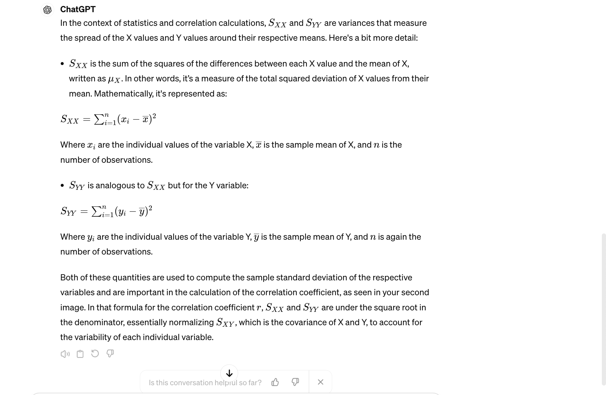
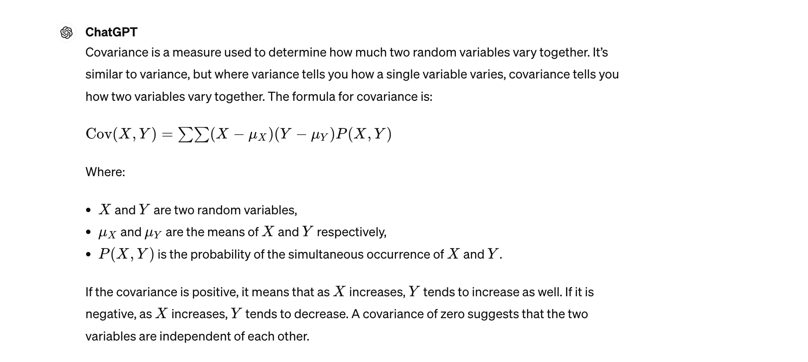

# Topics

## Linear regression SLR Model
Trying to explain y with x. finding a relationship between variables

## Assumptions of linear regression
- a linear relationship between X and Y, not exponential. You'd have to transform it by taking a log transformation
- the error term is normally distributed. If you fit the line properly, the error term sums to 0
- constant variance

## Inference about the slope
- when looking at a set of data and you fit a line, there's an error in them. IF you remove a data point, the line changes.

the null is B1 = 0. Beta is the slope. If it's a flat line. That means if X changes, Y does not change at all. No explanation/slope between X and Y. X is not related to Y if slope is 0. The null hypothesis is this

The test statistic is (B1 - 0 )/ Std-dev of Beta 1. What's the std_dev of the slope though? Waht is the standard deviation of Beta 1, the slope.

## Correlation
- positive, negative, no correlation. You can see that in a linear regressoin of two variables.

pattern of change over time.

What is r? It's the variance of X and Y together divided by the variance of X and the variance of Y independently

`S_xy / sqrt(Sxx) * sqrt(Syy)`

+1 is a perfectly positive relationship, -1 is a perfectly negative one.

This number is from -1 to 1 which reflects the positive or negative correlation. If residual is 0, then r = 1. r^2 is a indicator of model goodness.

## Covariance of X and Y

when we have two variables x and y, we want to know how the variables vary together.

# Some formulas:

so if
r^2 = 1 - (SSE/SST)
slope estimate B1_hat = 	Sxy/Sxx
OR
b1 = (sum_xy - n * mean_x * mean_y) / (sum_x_squared - n * mean_x**2)
OR
calculate b1 this way:

deviations_x = x - mean_x
deviations_y = y - mean_y

Sxy = np.sum(deviations_x * deviations_y)
Sxx = np.sum(deviations_x**2)
b1_alternative = Sxy / Sxx

b0:
b0 = mean_y - b1 * mean_x
SSE = sum_y_i_squared - b0 * sum_y - b1 * sum_xy

sigma_estimate = np.sqrt(sse / (n - 2))

for samples of pairs:
r = Sxy / sqrt(Sxx * Syy)
