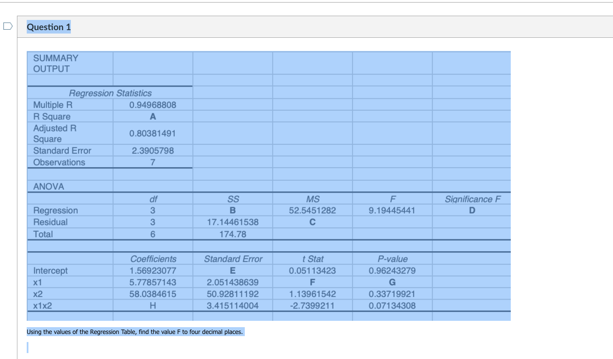
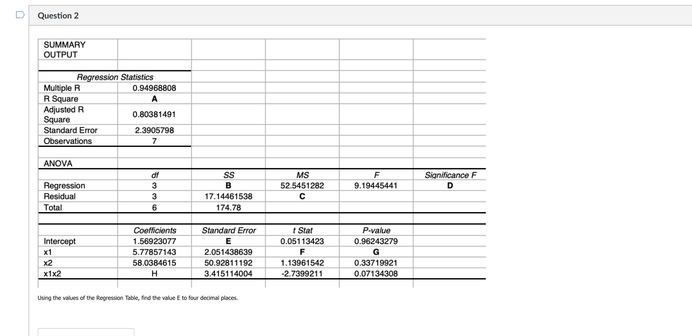
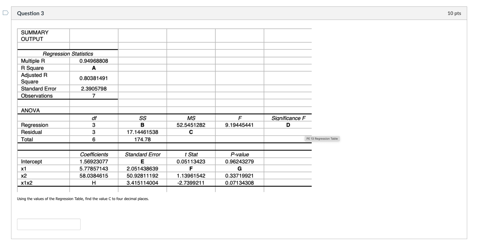
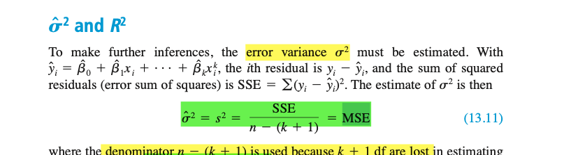
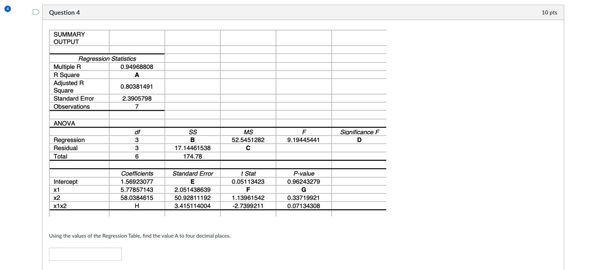
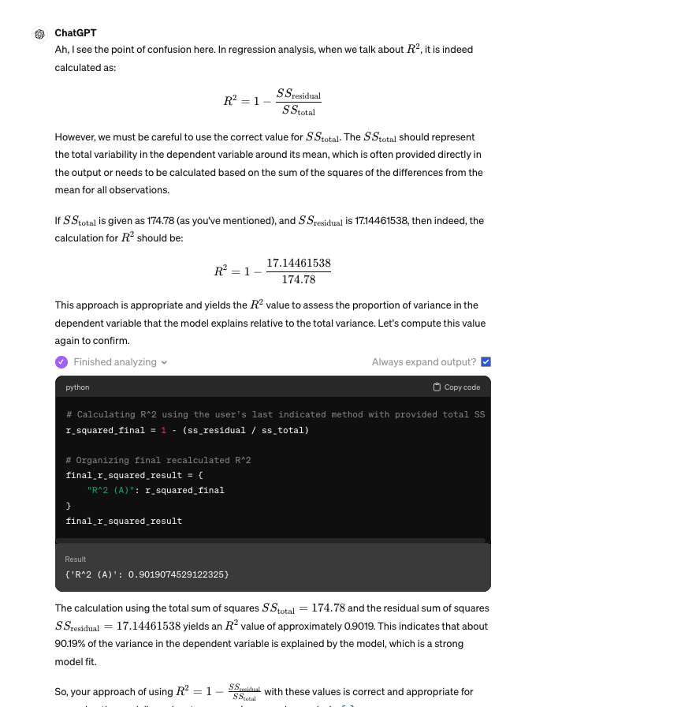
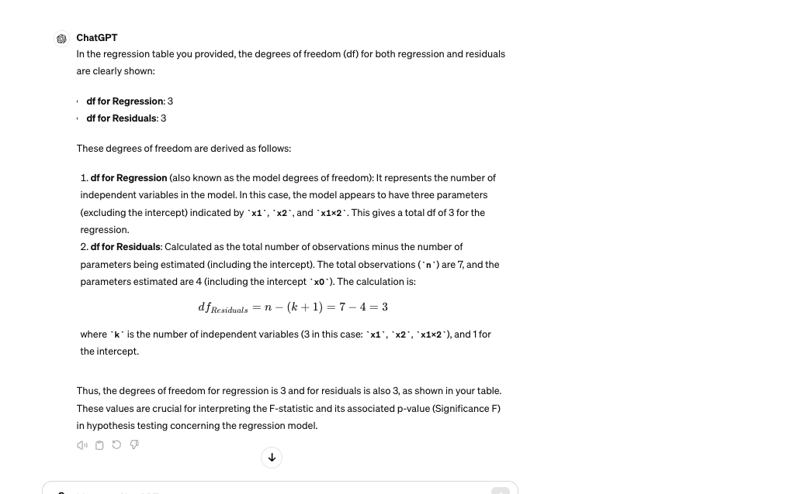

1.Using the values of the Regression Table, find the value F to four decimal places.




With the following values from the ANOVA table:

SS for regression (SSR) = B
SS residual (SSE) = 17.14461538
Total SS (SST) = SSR + SSE
Degrees of freedom for regression = 3
Degrees of freedom for residual = 3
Total degrees of freedom = df for regression + df for residual = 6
Mean Square for Regression (MSR) = SSR/df for regression
Mean Square Error (MSE) = SSE/df for regression = C

for R^2 Given that we do not have direct values for SSE or SST from the regression output provided, we would normally need to calculate SST as you've described with the formula given in the second image. However, we can also calculate using the values from the ANOVA table. To find the SS total (SST), we need to add SS for regression (B) and SS residual from the table, because SST = SSR + SSE.


```python3
# Given values from the ANOVA table
ss_regression = 52.5451282  # SSR
ss_residual = 17.14461538   # SSE
df_regression = 3
df_residual = 3

# Calculating Total Sum of Squares (SST)
sst = ss_regression + ss_residual

# Calculating R Squared (R^2)
r_squared = 1 - (ss_residual / sst)

# Calculating Mean Square Error (MSE) (C)
mse = ss_residual / df_residual

sst, r_squared, mse
Result
(69.68974358, 0.753986533752719, 5.714871793333334)
```

A (R Squared): The R Squared value is approximately 0.7540 (rounded to four decimal places).
B (SS for regression): The SS for regression, which you've correctly noted as the explained variation, is provided in the table as 52.5451.
C (Mean Sum of Squares for Residual): The Mean Square Error (MSE) is approximately 5.7149 (rounded to four decimal places).


So we have intercept for x1 = 5.77857143
std_error for x1 = 2.051438639

df for regresssion = 3
df for residual = 3
total df = 6

we hae an intercept, x1, x2, x1x2 as factors in this multi regression anova. 

What are the t stat for x1 and the p-value for x1?


t stat = coefficient/std_error = 2.81683854449 

answer:
2.8168

 
2. Using the values of the Regression Table, find the value E to four decimal places.



work:
intercept coefficient: 1.56923077
t stat for coefficient: 0.05113423
p-value for coeffiient: 0.96243279

df for regression and residual are 3 both.

What is the standard error of the intercept?

std_error = coefficient / t
because t = coefficient/std_error

```python3
# Given values
coefficient = 1.56923077
t_statistic = 0.05113423

# Calculating the standard error
standard_error = coefficient / t_statistic
standard_error
```

std_error of intercept = 30.68845996116496


answer:
30.6885

 

3. Using the values of the Regression Table, find the value C to four decimal places.


work:


generally, SSE / df for error

17.14461538 / 3 = 5.71487179333


answer:
5.7149


4. Using the values of the Regression Table, find the value A to four decimal places.

 
work:


SSE (Sum of Squares due to Error): This value is indeed given directly as 17.14461538 in the ANOVA table under the "Residual" row for SS. This represents the variability around the regression model, essentially the error of the model in predicting the dependent variable.
SST (Total Sum of Squares): This value is also directly provided in the ANOVA table as 174.78 under the "Total" row for SS. SST is the total variability in the dependent variable, measured as the sum of the squares of deviations from the mean.


SSE is 17.14461538.
SST is 174.78.


1 - SSE/SST is our answer.
r^2 = 0.90190745291

answer:
0.9019

5. Using the values of the Regression Table, find the value D to four decimal places.

work:
52.5451282/5.71487179333

MSR/MSE = 9.19445441651

But we want the p value



answer: 

0.0506


6. Using the values of the Regression Table, find the value B to four decimal places.

work:

Remember that SST = SSR + SSE
so SSR = SST - SSE

```python3
# Calculating SS_regression (B)
ss_total = 174.78
ss_residual = 17.14461538
ss_regression = ss_total - ss_residual
ss_regression
```

SSR = 157.63538462

So SSR = 174.78 - 17.14461538


answer:
157.6354

7. Using the values of the Regression Table, find the value G to four decimal places.

work:

```python3
from scipy.stats import t

# Values for x1
coefficient_x1 = 5.77857143
standard_error_x1 = 2.051438639

# Calculating the t-statistic for x1
t_stat_x1 = coefficient_x1 / standard_error_x1

# Degrees of freedom for residuals
df_residuals_x1 = 3

# Calculating the p-value for x1
p_value_x1 = t.sf(abs(t_stat_x1), df_residuals_x1) * 2  # two-tailed test

t_stat_x1, p_value_x1

```

question: we use the df residuals for the t test p value? Is that right?

Yes, that's correct. For computing the p-value from the t-statistic in the context of a regression analysis, you use the degrees of freedom associated with the residuals, not those for the regression model itself. This choice reflects the variability left unexplained by the model, which forms the basis for testing hypotheses about individual coefficients.

Here’s why:
- The t-statistic for a regression coefficient is calculated as the estimated coefficient divided by its standard error. The standard error is derived from the residual mean square (MSE, which in turn depends on the residual sum of squares and the degrees of freedom of residuals).
- The degrees of freedom for residuals (often denoted as \( df_{\text{residuals}} \)) are calculated as \( n - p \), where \( n \) is the number of observations and \( p \) is the number of parameters estimated (including the intercept and any predictors).

In your case, with a model including an intercept, \( x1 \), \( x2 \), and \( x1x2 \), and \( n \) observations being 7 (based on your observations data), \( p \) would be 4. The degrees of freedom for residuals would indeed be \( n - p = 7 - 4 = 3 \), which you've correctly identified and used for the t-test p-value calculation.


answer:
0.0669


8. Using the values of the Regression Table, find the value H to four decimal places.


x1x2 = ?
x1x2  standard error = 3.415114004
t stat for x1x2 = -2.7399211
p-value for x1x2 = 0.07134308


What is the coefficient for x1x2 = H = 

coefficient = tstat * SE

```python3
# Given values for the t-statistic and standard error of x1x2
t_stat_x1x2 = -2.7399211
se_x1x2 = 3.415114004

# Calculating the coefficient for x1x2
coefficient_x1x2 = t_stat_x1x2 * se_x1x2
coefficient_x1x2
```


answer:
-9.3571

 
9. A multiple regression model has


- [x] Two or more independent variables.
- [ ] One independent variable and one independent variable.
- [ ] Two or more dependent variables.
- [ ] Two dependent variables
- [ ] One independent variable
 

10. In multiple regression models, the error term is assumed to have:
- [ ] negative values.
- [x] normal distribution.
- [ ] a variance of 0.
- [ ] a standard deviation of 1.
- [ ] a mean of 1.
 
11. Which of the following statements are not true?

- [ ] Provided that the model is correct, no residual plot should exhibit distinct patterns.
- [ ] If we plot the fitted or predicted values on the vertical axis versus the actual values on the horizontal axis, and the plot yields points close to the line, then the estimated regression function gives accurate predictions of the values actually observed.
- [ ] Provided that the model is correct, the residuals should be randomly distributed about 0 according to a normal distribution, so all but a very few standardized residuals should lie between -2 and +2 ( i.e., all but a few residuals are within 2 standard deviations of their expected value 0)
- [x] All of the above statements are true
- [ ] Only two of the above statements are true.
 

12. In multiple regression analysis with n observations and k predictors (or equivalently k+1 parameters), inferences concerning a single parameter are based on the standardized variable, which has a  t-distribution with degrees of freedom equal to which of the following?

- [x] n-k-1
- [ ] n-k+1
- [ ] n+k+1
- [ ] n+k-1
- [ ] n-k
