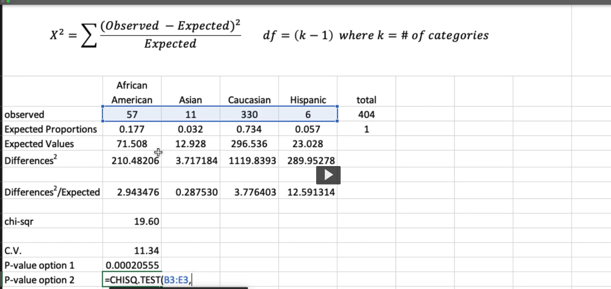

# Notes

Nonlinear models and multiple independent variables/multiple regression. still linear.

First order model - linear model, no indepedent variables are squared.
Second order models are when the independent variables are squared.
Third model is cubed.

First order model with interaction term - a variable may behave differently in the presence of another variable. You can multiple x1 and x2 together in the model.

when you have x1 and x2 and x1 * x2:

# Formula review

also b1 and b0

formulas for b1 and b0:

sxx and sxy and how they related to b1 and b0:

## How do you access the efficacy of the model we've chosen.

Maybe your r^2 is low... what can you do?

Maybe your assusmptions are wrong. Maybe you have a linear model when the data is an exponential model.

Plot the data to see if x residuals are normal and no relationship. This is model adaquacy. If not, we can trasnform the data using logs. Or use more 

Normal probability plot shouldn't be curved

fitted line plot shouldn't have a relationship. or any relationship that shows lack of independence.

Curvature in residuals means non linear plattern in the data. If you see it, you can corrrect it is taking the log of y. 

when you see a clear pattern, you don't believe a linear assumption of the independent and dependent variable is true. 

## Why transform the data using log?

The Normal Probability Plot you're showing indicates how well the data follows a normal distribution. The curvature in the plot suggests that the residuals (the differences between the observed and predicted values) do not spread normally around the line, which is an assumption for linear regression. This could indicate that a linear model is not appropriate for the data as is because the relationship between the variables is not linear.

Taking the log of y helps in this case because it's a way of transforming the data to better meet the assumptions of linear regression, which include linearity, constant variance, and normal distribution of errors. The transformation doesn't change the underlying values of y, but it changes the scale on which those values are measured, which can linearize relationships, stabilize variance, and make the distribution of the data more normal. For example, if the original data is exponentially growing, taking the log will turn that exponential growth into a linear relationship, which can be captured by a linear model.

The second set of plots in your images, presumably after the log transformation, shows a better alignment in the Normal Probability Plot, which suggests the log transformation has indeed made the residuals more normally distributed around a straight line, satisfying one of the key assumptions of linear regression.

A linear model fit post-transformation would be better because now the relationship between log(y) and the independent variables is closer to linear, meaning that the changes in the independent variables would have a proportional effect on log(y), and that's what linear regression models are good at capturing.

## Transforming how to

how to estimate alpha hat:

## Multiple regression model

Same, least square model. equate all partial derivatives to 0 to find the least squares of a multiple regression model. Use software.

What is B1 -- estimate in avg change of Y when x1 is changed by 1, with all over predictors held constant.

## Problem with R^2 in multiple regression model

Its value can be inflated by adding lots of predictors into the model even if most of these predictors are rather frivolous.

So the objec- tive in multiple regression is not simply to explain most of the observed y variation, but to do so using a model with relatively few predictors that are easily interpreted.

## Chi squared goodness fit test

we have proportions expected, actual values, and we're trying to see if the initial percentages were correct or if one is off. The ch-test stat is the sum of differences^2 / expected.

