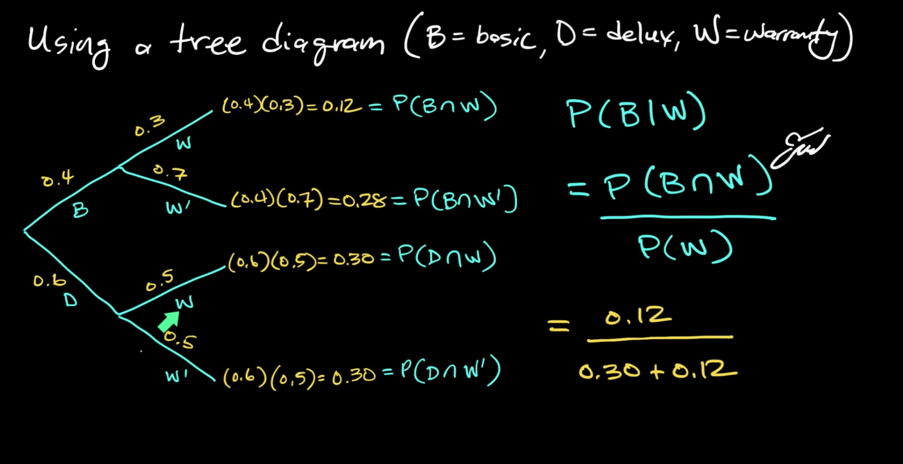
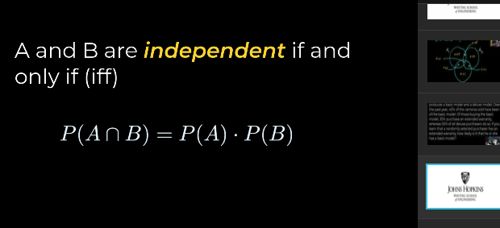
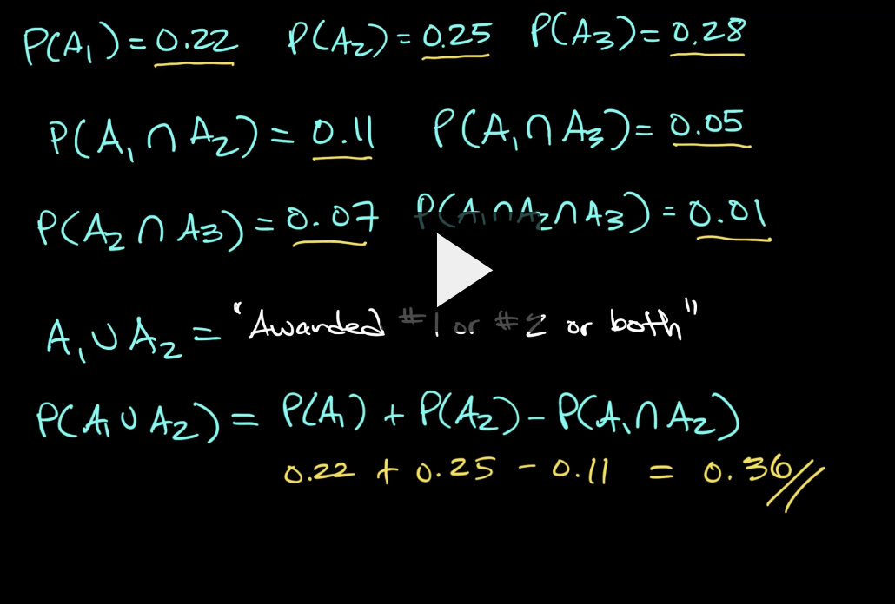
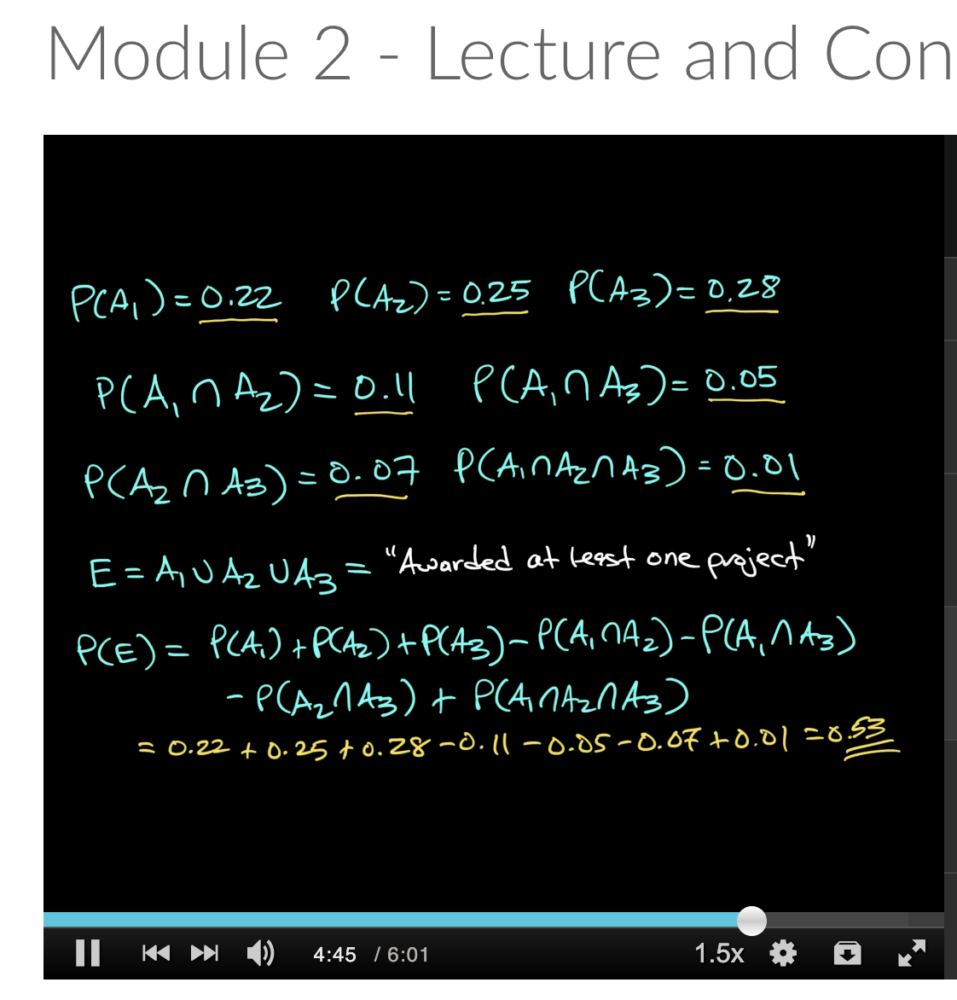
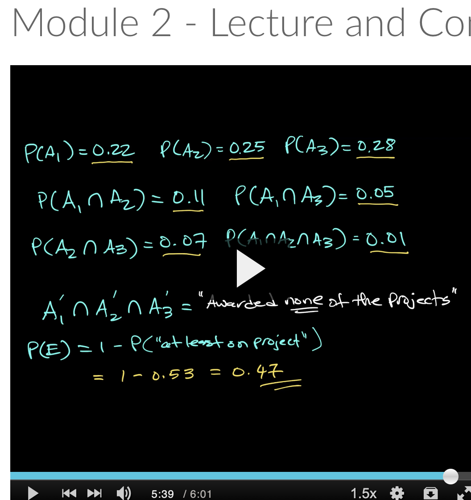
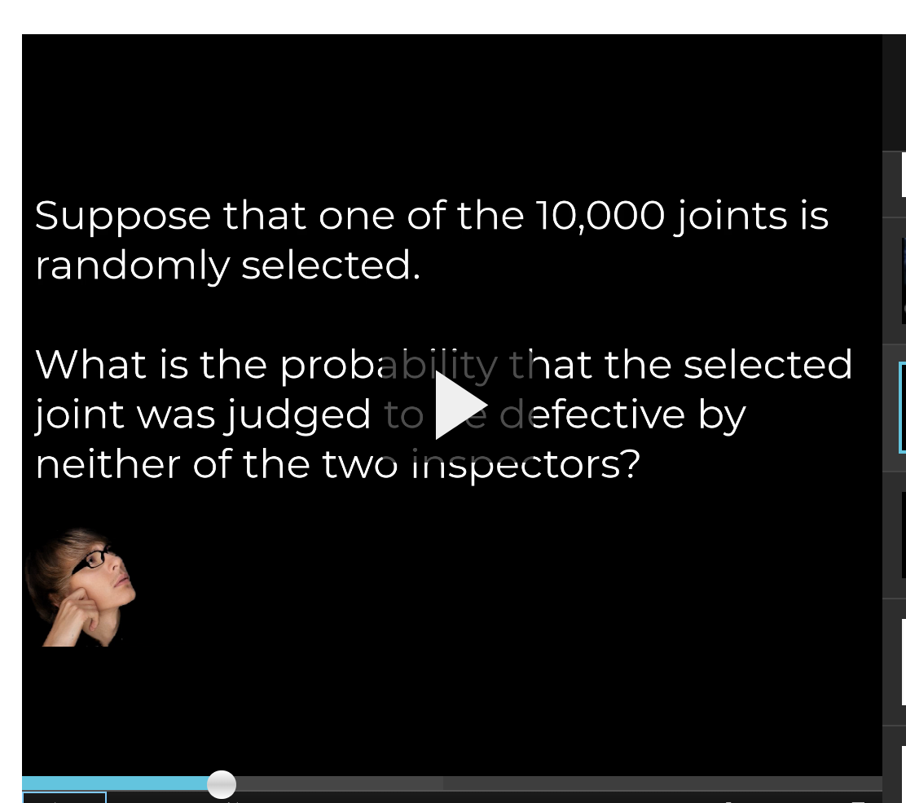
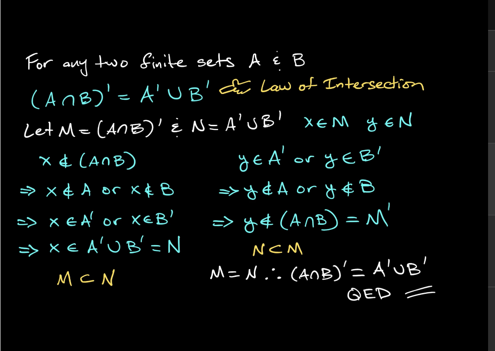
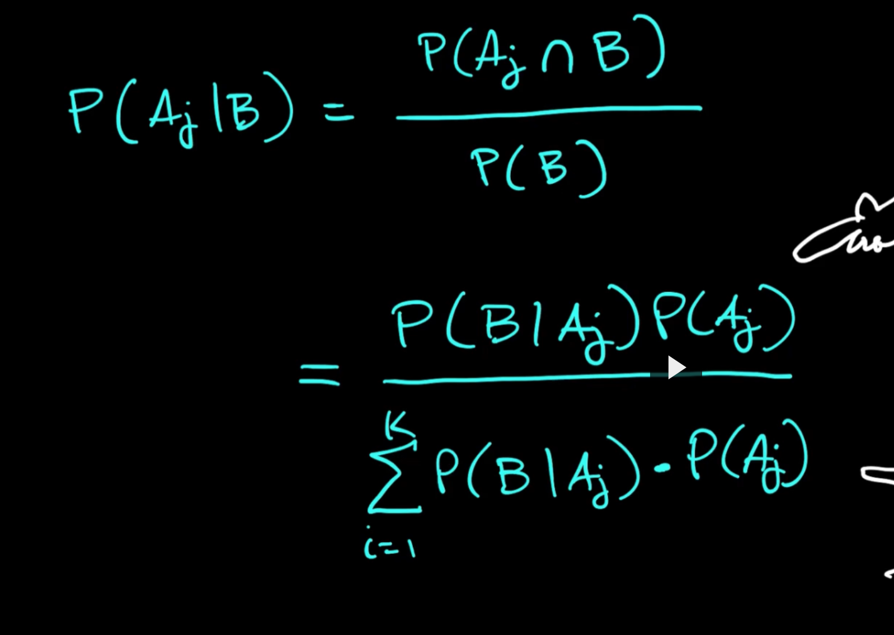

# Terms to Review
- Sample Space
- Events
- mutually exclusive events are not independent
- independent events.

- demorgan laws of probability.

events: 
- simple they can be made up of multiple observations. And outcome is how a simple event is evaulated and that needs to be singular. You need be looking for one singular outcome or collection of observations. An event is any collection (subset) of outcomes contained in the sample space S. 
- An event is simple if it consists of exactly one outcome and compound if it consists of more than one outcome.
- Consider an experiment in which each of three vehicles taking a particular freeway exit turns left (L) or right (R) at the end of the exit ramp. The eight possible outcomes that comprise the sample space are LLL, RLL, LRL, LLR, LRR, RLR, RRL, and RRR. Thus there are eight simple events, among which are E1 = {LLL}. So that {LLL} event is still simple even though it has multiple observations.
- A compound event would be the event that all three vehicles turn in the same direction. The event would be: {LLL, RRR}.

- **Addition rule** P(A or B) = P(A) + P(B) - P(A and B) and this can be rearranged.

- **product rule** is used for counting methods. it's the denominator often for things like dice rolls. Total number of ways is 6*6 = 36 and so the probability of rolling a 3 is 2/16.

- **permutations** are related... you need factorials for this. permutations are calculated as n! / (n-k)! where k is the number you're taking from n. Number of ways to pick 3 letter license plates is 26!/23! and that's how many ways where order matters you can take 3 letter license plates.

- **combinations** is where order doesn't matter meaning different arrangements still count as 1. It's the permutation formula divided again by k! so = n! / k!(n-k)!

Conditional probability = P(A|B) = P(A and B) / P(B) which is the probaiblity that A happens given that b has occurred.

For mutually exclusvie events like with coins, say A is heads and B is tails... P(A|b) = 0 since A and B are mutually exclusive.  = P(A and B) / P(B) = 0 because P(A and B) = 0.

Tree diagrams are great ways to see conditional probability. Make them when trying to figure out the probability of something happening given that something else has happened. 

But what if the events are independent and not conditional on each other? P(A|B) means that B changes the P(A) in some way. If the probability P(A|B) = P(A), then events are independent. 

# Example problems to review.

1. Example 2.23

- the word "least" should suggest to you that you need to add up the probabilities.

2. example 2.3 for a counting example and permutation problem

2. Non intuitive at first but it makes sense

You might ask why does the 2nd way of calculating this make sense. Why is it 95_c_5 on top?
- but why is it just 95C9/100C10? IF you think about it hard, it makes sense. if you add up all the ways you can do 95C9 for the last 9 beatles songs after the first 5 are chosen (and there’s only 1 way for this to happen) you should get the probability of the 5th song being a beatles song. It kind of makes sense. If you take into account all the ways 95C9 occurs, and there’s only 1 way for the last beatles song to be the 5th, and you divide it by the 100C10, you should get the probability that the last beatles song is 5th.

3. independence

events can be independent even if some of A is in the subset C. 
Events are dependent if: `P(A|C) = P(A)` but this can happen even if some of the elements of A are in C as in below.

- The two probabilites just need to be independent. C occuring just needs to not affect A... so if the probabilities are the same, who cares if C has elements of A.
- P(A) is the same regardless of whether B occured.
- also remember that mutually exclusive events are NOT independent.

## Laws to Remember

1. P(A or B) = P(A) + P(b) - P(A and B)
- you subtract because you added that middle part of the venn diagram twice.

Examples to review: Example 2.14

2. De Morgan's law: P(A' and B') = 1 - P(A or B)

3. More demorgans: P(B and A') = P(B) - P(A and B)

## Examples from video:

and 

neither:

2. for ELO or equally likely outcomes, you can just add up the events in the numerator / total number of outcomes to get the probability.

demorgan:

2 of them:

conditional probability:

