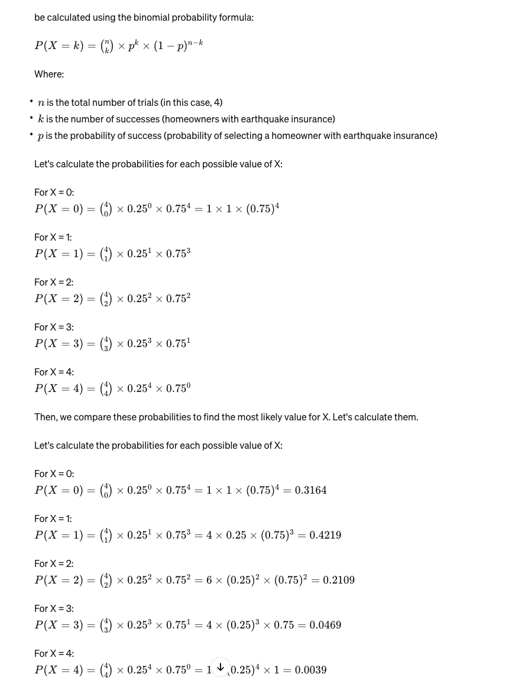

1. "Airlines sometimes overbook flights. Suppose that for a plane with 50 seats, 55 passengers have tickets. Define the random variable Y as the number of ticketed passengers who actually show up for the flight. The probability mass function of Y appears in the table on page 104 question 12. If you are the third person on the standby list (which means you will be the third one to get on the plane if there are any seats available after all ticketed passengers have been accommodated), what is this probability you will be able to take the flight? "

Work:
To calculate the probability that you, being the third person on the standby list, can take the flight, we need to consider the probability that at least 3 ticketed passengers do not show up. Since the plane has 50 seats and there are 55 ticketed passengers, we need to find the sum of the probabilities that at most 47 ticketed passengers show up (which corresponds to 8 or more passengers not showing up).

Using the probability mass function (pmf) given for Y (the number of ticketed passengers who show up), we calculate:
P(Y≤47) = P(Y=45) + P(Y=46) + P(Y=47) = 0.05 + 0.1 + 0.12 = 0.27

2. "Airlines sometimes overbook flights. Suppose that for a plane with 50 seats, 55 passengers have tickets. Define the random variable Y as the number of ticketed passengers who actually show up for the flight. The probability mass function of Y appears in the table on page 104 question 12. If you are the first person on the standby list (which means you will be the first one to get on the plane if there are any seats available after all ticketed passengers have been accommodated), what is the probability that you will be able to take the flight? " 

Work:
For you to be able to take the flight as the first person on the standby list, at least one ticketed passenger must not show up for the flight. In this case, we need to find the sum of the probabilities that at most 49 ticketed passengers show up.

P(Y≤49) = P(Y=45) + P(Y=46) + P(Y=47) + P(Y=48) + P(Y=49)
= 

3. "Some parts of California are particularly earthquake-prone. Suppose that in one metropolitan area, 25% of all homeowners are insured against earthquake damage. Four homeowners are to be selected at random; let X denote the number among the four who have earthquake insurance. What is the most likely value for X? [Hint: Let S denote a homeowner who has insurance and F one who does not. Then one possible outcome is SFSS, with probability (.25)(.75)(.25)(.25) and associated X value 3. There are 15 other outcomes.]"

work:

We're looking at a binomial distribution scenario where:

The number of trials (n) is 4 (since four homeowners are selected),
The probability of success (p), which in this case is a homeowner having earthquake insurance, is 0.25,
The random variable X represents the number of successes, which in this case is the number of homeowners with insurance among the four selected.

For the first question about homeowners and earthquake insurance, we are looking for the mode of the binomial distribution with parameters n=4 (number of trials or homeowners) and 
p=0.25 (probability of success, which in this case is a homeowner having insurance).

use the probability mass function for the binomial distribution:

nCk * p^k ( 1- p )^(n-k) is the formula. turns out 1 has the highest probability. n = 4 and p = 0.25

highest is x = 1

answer:
1

4. "Three couples and two single individuals have been invited to an investment seminar and have agreed to attend. Suppose the probability that any particular couple or individual arrives late is .4 (a couple will travel together in the same vehicle, so either both people will be on time or else both will arrive late). Assume that different couples and individuals are on time or late independently of one another. Let X = the number of people who arrive late for the seminar. Obtain the cumulative distribution function of X, and use it to calculate P(2 <= X <= 6)."

work:

Given:
this is odd because if 1 person is late, then it's just 2c1 ways of 1 individual being late.
If it's 2 people being late, it's either 1 couple or 2 individuals being late.
the couples act as a unit. n sort of equals 5. 

P(0) meaning nobody is late is just 0.4^5
P(1) meaning 1 individual is late so it's 2c1 because there are 2 individuals. 2c1 * 0.4 * 0.6^(5-1) = 0.1037
P(2) means 2 individuals are late OR 1 couple is late. the two individuals being late is 2c2 * (0.4)^2 * (0.60)^3 + couple being late which is 3c1 * (0.40)^1 * (0.60)^(5-1) = 0.1901
P(3) means  1 individual AND 1 couple are late: 2c1 * (0.40)^1 * 3c1 * (0.40)^1 * (0.60) ^ 3 = 0.2074
P(4) means 2 individuals and 1 couple are late OR 2 couples are late: (0.4)^2 * 3c1 (0.40)^1 * (0.60)^2 + (3c2)(0.40)^2 * (0.60)^3 = 0.1728
P(5) = 0.1382
P(6) means 2 individuals and 2 couples are late OR 3 coupels are late: 0.0691

notice the difference between AND and OR and that determines whether we add or subract.

etc. You have to calculate the pmf up to 6 which then allows you to calculate the cdf becaus the answer is F(6) - F(1) which is 0.9591 - 0.1813 = 0.7778.

https://www.vaia.com/en-us/textbooks/math/probability-and-statistics-for-engineering-and-sciences-9th/discrete-random-variables-and-probability-distributions/q20e-three-couples-and-two-single-individuals-have-been-invi/

5. "The pmf of the amount of memory X (GB) in a purchased flash drive was given in the table found on page 113 exercise number 29. Compute V(X) using the shortcut formula"

work:
formula: V(X)=E(X^2) - (E(X))^2

we need to calculate E(x) first. we also need E(X^2)

x=1,2,4,8,16
p(x) = 0.05 , 0.10 , 0.35 , 0.40 , 0.10

for find E(X), take each value of x and multiply it by the probability and sum it all up. = (1*0.05) + (2*0.10) + (4*0.35) etc = 6.45GB

to find E(X^2) you do: (1^2 * 0.05) + (2^2 * 0.10) + (4^2 * 0.35) = 57.25

shortcut formula: 57.25 - (6.25)^2 = 57.25 - 41.60 = 15.6475

6. Same question as above but using variance formula

7. "An appliance dealer sells three different models of upright freezers having 13.5, 15.9, and 19.1 cubic feet of storage space, respectively. Let X = the amount of storage space purchased by the next customer to buy a freezer. Suppose that X has the pmf denoted on page 113 exercise number 32. What is the variance of the price 25X - 8.5 paid by the next customer?"

8. "An appliance dealer sells three different models of upright freezers having 13.5, 15.9, and 19.1 cubic feet of storage space, respectively. Let X = the amount of storage space purchased by the next customer to buy a freezer. Suppose that X has the pmf denoted on page 113 exercise number 32. Compute E(X^2)"

9. "An appliance dealer sells three different models of upright freezers having 13.5, 15.9, and 19.1 cubic feet of storage space, respectively. Let X = the amount of storage space purchased by the next customer to buy a freezer. Suppose that X has the pmf denoted on page 113 exercise number 32. Compute V(X)"

