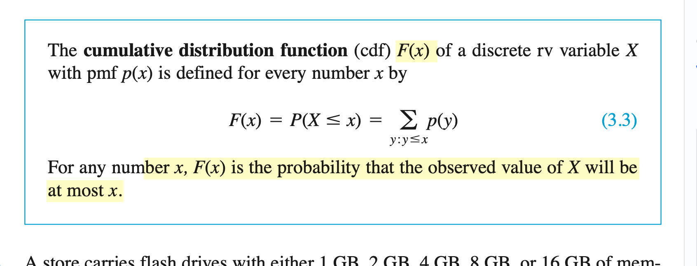
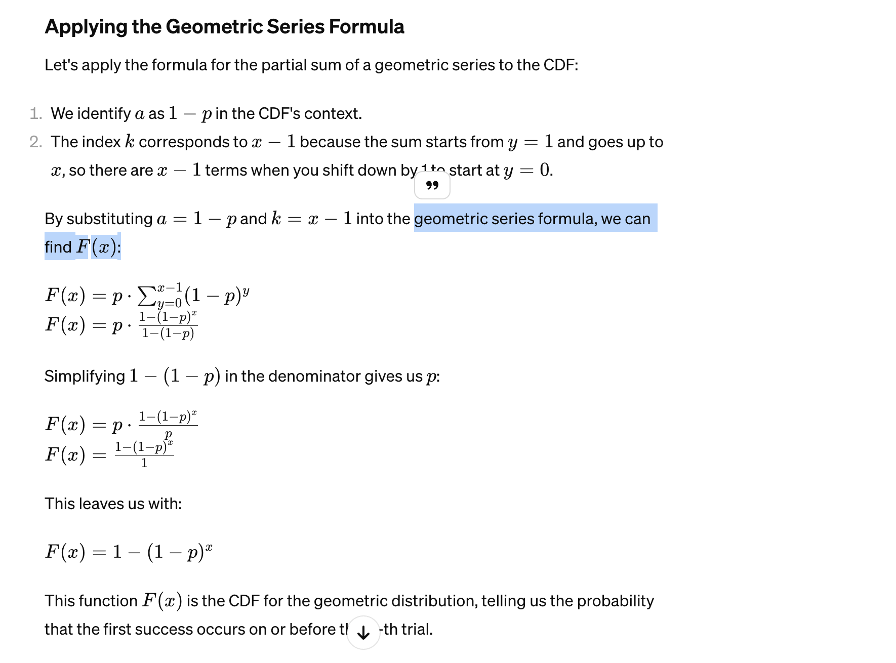
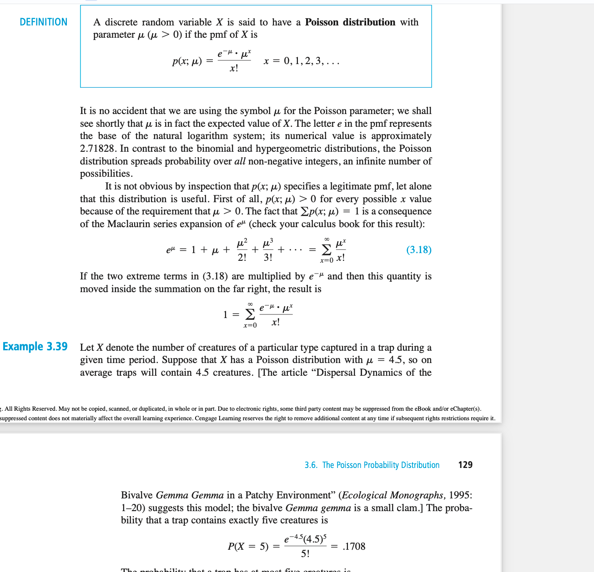

There are two fundamentally different types of random variables—discrete random variables and continuous random variables.

Random variables can be discrete and infinite. The definition of a continuous random variable is confusing but generally it's continuous if the set of possible values is all numbers in a single interval on the number line or infinite in extend -\inf to \inf.

# Cumulative probability function

remember this is the cumulative probability function so we have to add up these values. x is the value that we cumulate up to. y is a value less than x Look at the definition up.

Remember that if you're trying to find the P(2 <= X <= 5) then you have to do F(5) - F(1) because you don't want to subtract P(2) from the result.

When dealing with probabilities, the cdf = 1 - (1 - p)^x which is derived from the geometric series. The proof is here from chatgpt.

**Binomial model?**
The binomial distribution is the approximate probability model for sampling without replacement from a finite dichotomous (S–F) population provided the sample size n is small relative to the population size N; the hypergeometric distribution is the exact probability model for the number of S’s in the sample.

The binomial rv X is the number of S’s when the number n of trials is fixed, whereas the negative binomial distribution arises from fixing the number of S’s desired and letting the number of trials be random.

## Hypergeometric distribution

it is used when sampling without replacement but binomial is used for sampling with replacement or without replacement if the sample is very small relative to population size. That's because the chance of repicking is so small when n/N

Note on Sampling and the Binomial Distribution
The text also mentions that if the sampling was without replacement, but the ratio n/N is at most 0.05, the binomial distribution can be used to approximate probabilities involving the number of marked individuals in the sample. This is because when the sample size n is a very small fraction of the total population size 
N, the likelihood of recapturing an already captured individual is low, so the trials are approximately independent, a key assumption of the binomial distribution. meaning, replacement which is done in Binomial doesn't matter much since even if you replace, the % of recapturing is so low. So you can just use the binomial model when n/N is at most 0.05.
The binomial distribution is given by
b(x;n,p), where x is the number of successes (in this case, marked individuals in the sample),
n is the number of trials (sample size), and p is the probability of success on any given trial (the proportion of the population that is marked). When the sample size
n is small relative to N, and M/N (the true proportion of marked individuals in the population) is approximately equal to p, the binomial distribution can be a good approximation to the hypergeometric distribution (which would otherwise be used for sampling without replacement).

## Negative binomial model

The assumption is that the proportion of marked individuals in the recaptured sample (x/n) should be approximately the same as the proportion of marked individuals in the entire population (M/N). Using this proportionality: x/n = M/N

You can solve this equation for N, the total population size:
N = (M⋅n)/x

This equation is used to estimate the total population size based on the proportion of marked individuals recaptured.

## Poisson distribution

The binomial, hypergeometric, and negative binomial distributions were all derived by starting with an experiment consisting of trials or draws and applying the laws of probability to various outcomes of the experiment. There is no simple experiment on which the Poisson distribution is based, though we will shortly describe how it can be obtained by certain limiting operations

the above image shows the pmf which is the probability of a value at x. the u (the mean) is a paramter of the poisson distribution.

A Poisson distribution is a discrete probability distribution. It gives the probability of an event happening a certain number of times (k) within a given interval of time or space.

The Poisson distribution has only one parameter, λ (lambda), which is the mean number of events. The graph below shows examples of Poisson distributions with different values of λ.

A Poisson distribution is a discrete probability distribution, meaning that it gives the probability of a discrete (i.e., countable) outcome. For Poisson distributions, the discrete outcome is the number of times an event occurs, represented by k.

You can use a Poisson distribution to predict or explain the number of events occurring within a given interval of time or space. “Events” could be anything from disease cases to customer purchases to meteor strikes. The interval can be any specific amount of time or space, such as 10 days or 5 square inches.

You can use a Poisson distribution if:

Individual events happen at random and independently. That is, the probability of one event doesn’t affect the probability of another event.
You know the mean number of events occurring within a given interval of time or space. This number is called λ (lambda), and it is assumed to be constant.
When events follow a Poisson distribution, λ is the only thing you need to know to calculate the probability of an event occurring a certain number of times.

Mean and variance of a Poisson distribution
The Poisson distribution has only one parameter, called λ.

The mean of a Poisson distribution is λ.
The variance of a Poisson distribution is also λ.
In most distributions, the mean is represented by µ (mu) and the variance is represented by σ² (sigma squared). Because these two parameters are the same in a Poisson distribution, we use the λ symbol to represent both.

## Differences between Poisson and Binomial

While the Binomial distribution deals with experiments involving a fixed number of independent trials, the Poisson distribution focuses on events occurring over a fixed interval. Understanding their differences and knowing when to apply each distribution is crucial for accurate data analysis and modelling.

### Application Examples
Let's explore some practical examples to better understand the applications of these distributions.

### Binomial Distribution example
Suppose we have a bag containing red and blue balls, and we randomly select ten balls with replacement. The probability of selecting a red ball is 0.3. We can use the Binomial distribution to calculate the probability of getting a specific number of red balls, such as exactly three or at least seven.

### Poisson Distribution example
Consider a call center that receives an average of five customer calls per minute. Using the Poisson distribution, we can determine the probability of receiving a certain number of calls within a fixed time frame, such as exactly two calls in a five-minute interval.

### Binomial Distribution formula
The probability mass function (PMF) of the Binomial distribution can be calculated using the following formula:

P(X = k) = C(n, k) * p^k * (1-p)^(n-k)

Where:

P(X = k) - represents the probability of getting exactly k successes.
C(n, k) - is the number of combinations of n items taken k at a time.
p -  is the probability of success in a single trial.
n is the total number of trials.

### Poisson Distribution formula
The probability mass function (PMF) of the Poisson distribution can be calculated using the following formula:

`P(X = k) = (e^(-λ) * λ^k) / k!`

Where:

P(X = k) represents the probability of observing exactly k events.
λ is the average rate of events occurring within the given interval.
