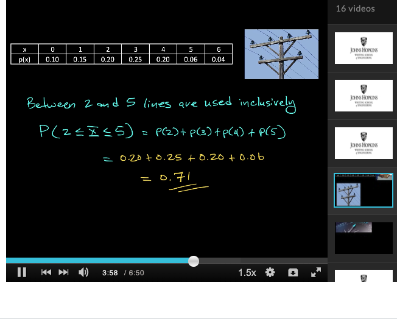

# Topics to cover:
- binomial distribution
- binomial model
- variance
- variance shortcut formula
- poisson distribution
- hypergeometric distribution
- Random Variables
- PMF probability mass function
- poisson process


# Notes

## Random variables
There are two fundamentally different types of random variables—discrete random variables and continuous random variables.


Random variables can be discrete and infinite. The definition of a continuous random variable is confusing but generally it's continuous if the set of possible values is all numbers in a single interval on the number line or infinite in extend -\inf to \inf.

Capitalized too. mapping from the real world to the number line
the lowercase x is a particular value of X.

X = {1 if you flip heads, 0 and if you flip tails}. 
Flipping coins has no numbers associated with it until we do the experiment.

The probability distribution of X says how the total probability of 1 is distributed among and allocated to the various possible of lowercase x values.

the PMF (probability mass function) is that. It shows probabilities of each value of x.

### Example
X is unknown amount of unbroken eggs in a egg carton. 
{1,2,3,4,5,6,7,8,9,10,11,12}
It's discrete too.

Notation: p(1) = the probability of the X value 1 = P(X = 1). the probability of the X random value = 1.
P(x) the probability being assigned to value x in general. 

### Another example2
we can say that p(1) = 0.2 which represents the p that a customer buys a desktop
so that P(0) is 0.8 a customer buys a laptop.
This would be a Bernoulli PMF with 2 points.

the PMF of any Bernoulli can be expressed this way P(0) = 1 - alpha and P(1) = alpha. or P(x,alpha) since alpha is an input. 


### Another example
what about a value up to x? This is the cdf, cumulative distributive function. You add it up.


p(x) is probability mass function, a pmf. but the graph cdf is a cumulative of the pmf. we add up the pmf to get the cdf... we accumulate.



Just add up P(2) + P(3) + P(4) + P(5)


### Another example from videos


at least 4 lines not in use means either 4 lines not in use, 5 lines not in use, 6 lines not in use. That means 0 lines in use, 1 lines in use, 2 lines in use which is why we add them up.


## Cumulative probability function


remember this is the cumulative probability function so we have to add up these values. x is the value that we cumulate up to. y is a value less than x Look at the definition up.

Remember that if you're trying to find the P(2 <= X <= 5) then you have to do F(5) - F(1) because you don't want to subtract P(2) from the result.

When dealing with probabilities, the cdf = 1 - (1 - p)^x which is derived from the geometric series. The proof is here from chatgpt.


## Binomial model
The binomial distribution is the approximate probability model for sampling without replacement from a finite dichotomous (S–F) population provided the sample size n is small relative to the population size N; the hypergeometric distribution is the exact probability model for the number of S’s in the sample.

The binomial rv X is the number of S’s when the number n of trials is fixed, whereas the negative binomial distribution arises from fixing the number of S’s desired and letting the number of trials be random.

gotta be independent for each trial. you need to replace most likely for this to happen! If you don't replace, not binomial!

mean: E(x) = np
V(X) = np(1-p) = npq
standard deviation = sqrt(npq) where q = 1 - p

## What Is Binomial Distribution?
Binomial distribution is a statistical distribution that summarizes the probability that a value will take one of two independent values under a given set of parameters or assumptions.

The underlying assumptions of binomial distribution are that there is only one outcome for each trial, each trial has the same probability of success, and each trial is mutually exclusive or independent of one another.

To start, the “binomial” in binomial distribution means two terms—the number of successes and the number of attempts. Each is useless without the other.

Binomial distribution is a common discrete distribution used in statistics, as opposed to a continuous distribution, such as normal distribution. This is because binomial distribution only counts two states, typically represented as 1 (for a success) or 0 (for a failure), given a number of trials in the data. Binomial distribution thus represents the probability for x successes in n trials, given a success probability p for each trial.


that's the PMF for a binomial model.

from chatgpt:


### example of binomial using the chart


###  KEY TAKEAWAYS
Binomial distribution is a statistical probability distribution that summarizes the likelihood that a value will take one of two independent values under a given set of parameters or assumptions.

The underlying assumptions of binomial distribution are that there is only one outcome for each trial, that each trial has the same probability of success, and that each trial is mutually exclusive or independent of one another.

Binomial distribution is a common discrete distribution used in statistics, as opposed to a continuous distribution, such as normal distribution.

A binomial distribution's expected value, or mean, is calculated by multiplying the number of trials (n) by the probability of successes (p), or `n × p`.


The binomial distribution formula helps to check the probability of getting “x” successes in “n” independent trials of a binomial experiment. To recall, the binomial distribution is a type of probability distribution in statistics that has two possible outcomes. In probability theory, the binomial distribution comes with two parameters n and p.

The probability distribution becomes a binomial probability distribution when it meets the following requirements.

- Each trial can have only two outcomes or the outcomes that can be reduced to two outcomes. These outcomes can be either a success or a failure.
- The trails must be a fixed number.
- The outcome of each trial must be independent of each others.
- And the success of probability must remain the same for each trial.


the formula involves combinations. and the right side is the number of successes * number of failures.


### Examples.

Example 1:

A coin is tossed 12 times. What is the probability of getting exactly 7 heads?

Solution:
Given that a coin is tossed 12 times. (i.e) n= 12
Thus, a probability pf gettig head in single toss = ½. (i.e) p = ½.
So, 1-p = 1-½ = ½.
We know that the binomial probability distribution is `P(r) = nCr · pr (1 − p)n−r`.
Now, we have to find the probability of getting exactly 7 heads.(i.e) r = 7.
Substituting the values in the binomial distribution formula, we get:

```
P(7) = 12C7 · (½)7 (½)12−7
P(7) =  792· (½)7 (½)5
P(7) = 792.(½)12
P(7) = 792 (1/4096)
P(7) = 0.193
```
Therefore, the probability of getting exactly 7 heads is 0.193.

## Hypergeometric distribution

binomial is without replacement and when n is small relative to N (population size)

from the video: Hypergeometric is the exact model of number of successes in the sample and not just an approximation. What does it mean by exact? very similar to binomial. population is N or finite, withoiut replacement acccording to my textbook, each individual is S or F and teh random variable ix X which is random successes from the sample.


### Example
16 milk containers, 6 underweight ones, sample of 5.  We use hypergeometric here.

So for P(2) = ((6c2) * (10C3)) / (16C5) = 0.412

it is used when sampling without replacement but binomial is used for sampling with replacement or without replacement if the sample is very small relative to population size. That's because the chance of repicking is so small when n/N


### Hypergeometric mean and variance


So in the milk example, the EV = n * M/N = 5*6/16 = 1.875


### Note on Sampling and the Binomial Distribution
The text also mentions that if the sampling was without replacement, but the ratio n/N is at most 0.05, the binomial distribution can be used to approximate probabilities involving the number of marked individuals in the sample. This is because when the sample size n is a very small fraction of the total population size 
N, the likelihood of recapturing an already captured individual is low, so the trials are approximately independent, a key assumption of the binomial distribution. meaning, replacement which is done in Binomial doesn't matter much since even if you replace, the % of recapturing is so low. So you can just use the binomial model when n/N is at most 0.05.
The binomial distribution is given by
b(x;n,p), where x is the number of successes (in this case, marked individuals in the sample),
n is the number of trials (sample size), and p is the probability of success on any given trial (the proportion of the population that is marked). When the sample size
n is small relative to N, and M/N (the true proportion of marked individuals in the population) is approximately equal to p, the binomial distribution can be a good approximation to the hypergeometric distribution (which would otherwise be used for sampling without replacement).


## Negative binomial model

The assumption is that the proportion of marked individuals in the recaptured sample (x/n) should be approximately the same as the proportion of marked individuals in the entire population (M/N). Using this proportionality: x/n = M/N

You can solve this equation for N, the total population size:
N = (M⋅n)/x

This equation is used to estimate the total population size based on the proportion of marked individuals recaptured.


The above equation isn't mentioned in the lectures because this course is trash.

Below the EV.


The random variable under question is number of Failures that preceded the rth success. The number of success is fixed as opposed to the binomial model. we're measuring failures.

r is the number of successes that are sought (two female children). chatgpt does a better job explaning this.


### Example problem with chatgpt

The problem described asks for the probability that a family has x male children (labeled 'F' for the purpose of this problem, which might be a typographical error as 'F' usually stands for female) before they have exactly two female children ('S'). The assumption is that the probability of having a male child, p, is 0.5.

The negative binomial distribution is given by the formula seen above.


X is the number of failures before the r-th success (in this context, 'failures' would be the number of male children born before the second female child).

p is the probability of success on each trial (the probability of a female birth in this case).

r is the number of successes that are sought (two female children).

In the image, they have used x for the number of male children and r is 2 (since the couple wants exactly two female children). So the formula is adjusted as:


### Example problem with chatgpt2

P(at most 4 children) so that implies 2 girls and 2 boys or 2 girls and 1 boy or 2 girls and 0 boys. the boys are the failure case.


### Connection between negative binomial model and geometric distribution?

The geometric distribution is actually a special case of the negative binomial distribution. While the negative binomial distribution counts the number of failures before a specified number of successes occurs, the geometric distribution counts the number of failures before the first success. In other words, if you set the number of successes r to 1 in a negative binomial distribution, you get a geometric distribution.


### Example showing that connection


if you set r (number of successes) = 1 which means it's the first success of when the drought ends, you get the geometric formula.


that shows us how the geometric and negative binomial are connected.


## Poisson distribution

The binomial, hypergeometric, and negative binomial distributions were all derived by starting with an experiment consisting of trials or draws and applying the laws of probability to various outcomes of the experiment. There is no simple experiment on which the Poisson distribution is based, though we will shortly describe how it can be obtained by certain limiting operations

Kind of like the number of arrivals you'll get into a bank over a period of time.

It's often used to approximate the binomial distribution


Interesting property is that the expected value of Poisson = variance of Poisson = mean.


the above image shows the pmf which is the probability of a value at x. the u (the mean) is a parameter of the poisson distribution.

If n is large and p is small, the binomial distribution approaches the poisson distribution which is p(x; mean)

A Poisson distribution is a discrete probability distribution. It gives the probability of an event happening a certain number of times (k) within a given interval of time or space.

The Poisson distribution has only one parameter, λ (lambda), which is the mean number of events. The graph below shows examples of Poisson distributions with different values of λ.

A Poisson distribution is a discrete probability distribution, meaning that it gives the probability of a discrete (i.e., countable) outcome. For Poisson distributions, the discrete outcome is the number of times an event occurs, represented by k.

You can use a Poisson distribution to predict or explain the number of events occurring within a given interval of time or space. “Events” could be anything from disease cases to customer purchases to meteor strikes. The interval can be any specific amount of time or space, such as 10 days or 5 square inches.

You can use a Poisson distribution if:

Individual events happen at random and independently. That is, the probability of one event doesn't affect the probability of another event.
You know the mean number of events occurring within a given interval of time or space. This number is called λ (lambda), and it is assumed to be constant.
When events follow a Poisson distribution, λ is the only thing you need to know to calculate the probability of an event occurring a certain number of times.


Mean and variance of a Poisson distribution
The Poisson distribution has only one parameter, called λ.

The mean of a Poisson distribution is λ.
The variance of a Poisson distribution is also λ.
In most distributions, the mean is represented by µ (mu) and the variance is represented by σ² (sigma squared). Because these two parameters are the same in a Poisson distribution, we use the λ symbol to represent both.

## Differences between Poisson and Binomial

While the Binomial distribution deals with experiments involving a fixed number of independent trials, the Poisson distribution focuses on events occurring over a fixed interval. Understanding their differences and knowing when to apply each distribution is crucial for accurate data analysis and modelling.

### Application Examples
Let's explore some practical examples to better understand the applications of these distributions.

### Binomial Distribution example
Suppose we have a bag containing red and blue balls, and we randomly select ten balls with replacement. The probability of selecting a red ball is 0.3. We can use the Binomial distribution to calculate the probability of getting a specific number of red balls, such as exactly three or at least seven.

### Poisson Distribution example
Consider a call center that receives an average of five customer calls per minute. Using the Poisson distribution, we can determine the probability of receiving a certain number of calls within a fixed time frame, such as exactly two calls in a five-minute interval.


### Binomial Distribution formula
The probability mass function (PMF) of the Binomial distribution can be calculated using the following formula:

P(X = k) = C(n, k) * p^k * (1-p)^(n-k)

Where:

P(X = k) - represents the probability of getting exactly k successes.
C(n, k) - is the number of combinations of n items taken k at a time.
p -  is the probability of success in a single trial.
n is the total number of trials.


### Poisson Distribution formula
The probability mass function (PMF) of the Poisson distribution can be calculated using the following formula:

`P(X = k) = (e^(-λ) * λ^k) / k!`

Where:

P(X = k) represents the probability of observing exactly k events.
λ is the average rate of events occurring within the given interval.


## Expected value:
- the EV may not even be a possible value. like the EV of a dice that's fair is 3.5 but that's not a real value


## Bernouli rnadom variable
the EV = sum of x times p(x)


## Example.

Do number 39.
