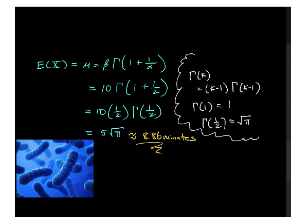
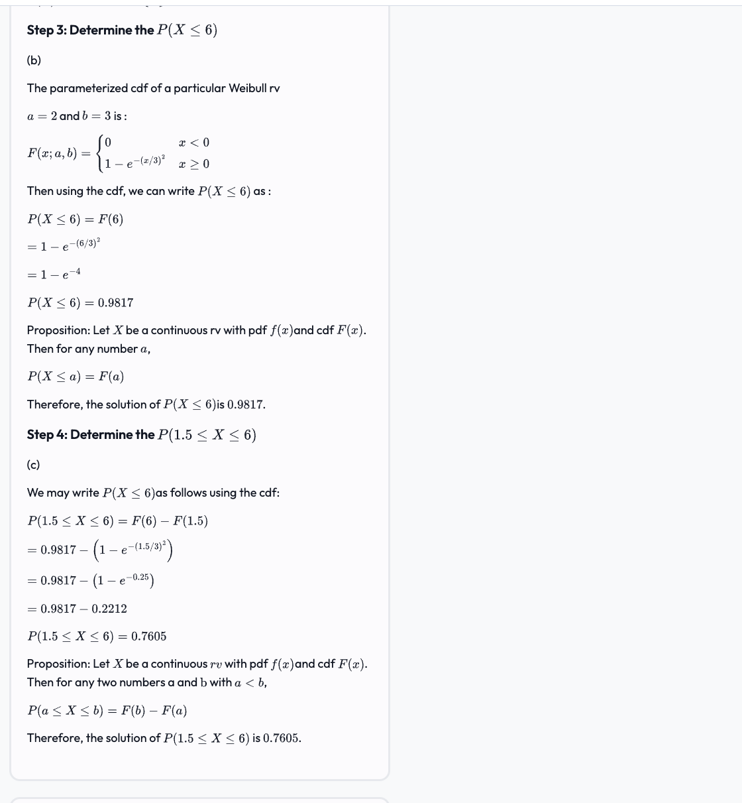

**1.**"The weekly demand for propane gas (in 1000s of gallons) from a particular facility is an rv X, with the pdf on page 151 exercise number 22. Which of the following is the cdf of X in the interval 1 <= x <= 2."

topic: cdf

work:

To find the cumulative distribution function (CDF) of X for the interval 1 ≤ x ≤ 2 based on the given probability density function (pdf), we need to integrate the pdf over the interval from the lower bound (which is 1) to x.

since the pdf is only defined for 1 ≤ x ≤ 2, we cannot find the cdf for x < 1. Instead, we will find the cdf for the interval [1, x]:

F(x) = P(X ≤ x) =   
∫[pdf(t) dt] from 1 to x  

Now, we will compute the integral:  
F(x) = ∫[2(1 - 1/t^2) dt] from 1 to x (remember integral of 1/t^2 is just - 1/t)   
F(x) = [2t + 2/t] from 1 to x

then plug in x and 1  
F(x) = (2x + 2/x) - (2 + 2/1)   
F(x) = 2x + 2/x - 4  
So, the cdf of X for the interval 1 ≤ x ≤ 2 is:  

answer:  
F(x) = 2x + 2/x - 4  

that's the cdf given the pdf in the question./

---------------
**2.**"The article 'Reliability of Domestic-Waste Biofilm Reactors' (J. of Envir. Engr., 1995: 785-790) suggests that substrate concentration (mg/cm^3) of influent to a reactor is normally distributed with mu = .30 and sigma = .06. Which statement characterizes the largest 5% of all concentration values?"

work:

The 95th percentile of a normal distribution corresponds to a point where 95% of the data falls below it. This percentile can be found using the z-score associated with 95% in a standard normal distribution, which is typically around 1.645. This value means that 95% of the values are below the z-score of 1.645 and the top 5% are above it.

Given the normal distribution has a mean (mu) of 0.30 and a standard deviation (sigma) of 0.06, you can calculate the 95th percentile using the z-score and these parameters.

The formula to calculate the value at the 95th percentile (c) is:

c = μ + (z × σ)

where
z is the z-score corresponding to the 95th percentile.
we multiply the std_dev by the z score of 1.645 to convert the standard normal to the nonnormal. We want to find the actual value here that corresponds to the z-score of 1.645.

The question provides us with two possible z-scores: +1.645 and -1.645. Since we are looking for the 95th percentile, which is in the upper tail of the distribution, we will use the positive z-score, which is +1.645.

Now, let's use the positive z-score to calculate the concentration value for the 95th percentile: we're finding the actual value

c =  0.30 + (1.645 × 0.06)

Let's compute this.
The concentration value at the 95th percentile, using the z-score of 1.645, is 0.3987 mg/cm³. Therefore, the largest 5% of all concentration values are above 0.3987 mg/cm³.

answer:
The correct statement is:
"The 95th percentile of the standard normal distribution satisfies Phi(z) = .95, from which z = 1.645. So, c = .30 + (1.645)(.06) = .3987. The largest 5% of all concentration values are above .3987 mg/cm³."

3. Construct a normal probability plot for the data found on page 187 problem 88. Which statement is true about the probability plot?
Group of answer choices

work:

4. "Suppose the reaction temperature X (in degrees Celsius) in a certain chemical process has a uniform distribution with A = -5 and B = 5. For k satisfying -5 < k < k + 4 < 5, compute P(k < X < k + 4)."

work: for a uniform distribution, the PDF is given by f(x) = 1/(b-a)
The uniform is just a straight line so take the width of the interval which is 4 over the width of the total distribution which si 10.

it's 4/10 = 0.4

answer:
0.4
5. Suppose the reaction temperature X (in degrees Celsius) in a certain chemical process has a uniform distribution with A = -5 and B = 5. Compute P(X < 0).

topic: uniform distribution

work:
the probability that X is less than 0 is the length from the lower bound to 0, divided by the total length of the distribution:

P(X < 0)= (0 - (-5)) / (5 − (−5)) = 5/10 = 0.5

answer:
0.5

6. "Let X denote the vibratory stress (psi) on a wind turbine blade at a particular wind speed in a wind tunnel. The article 'Blade Fatigue Life Assessment with Application to VAWTS' (J. of Solar Energy Engr., 1982: 107-111) proposes the Rayleigh distribution, with the pdf given on page 142 exercise number 4 as a model for the X distribution. Suppose theta = 100 (a value suggested by a graph in the article). What is the probability that X is at most 200? Compute to at least four decimal places."

topic: integral, cdf, calculus, u-sub

work:
The CDF is obtained by integrating the PDF from 0 to x.
plug in theta = 100 into the pdf function first. and then integrate using u-substitution

7. "Let X denote the vibratory stress (psi) on a wind turbine blade at a particular wind speed in a wind tunnel. The article 'Blade Fatigue Life Assessment with Application to VAWTS' (J. of Solar Energy Engr., 1982: 107-111) proposes the Rayleigh distribution, with the pdf given on page 142 exercise number 4 as a model for the X distribution. Suppose theta = 100 (a value suggested by a graph in the article). Suppose theta = 100 (a value suggested by a graph in the article). What is the probability that x is at least 200? Compute to at least four decimal places."

work:

8. "The weekly demand for propane gas (in 1000s of gallons) from a particular facility is an rv X, with the pdf on page 151 exercise number 22; Compute V(X) to at least four decimal places."
compute variance and show work.
work:
Notice that the EV multiple the pdf by X to get the EV. and then E(X^2) is found by multiplying the pdf by X^2

9."The weekly demand for propane gas (in 1000s of gallons) from a particular facility is an rv X, with the pdf on page 151 exercise number 22; Obtain an expression for the (100p)th percentile. What is the value of mu-tilda? Compute to at least two decimal places."

pg 147 in the book has a similar example

work:
In the context of probability and statistics, q represents the value at which a certain percentage of the probability distribution lies to the left of it. The cumulative distribution function (CDF) represents the probability that a random variable 

X will take a value less than or equal to q.

So when we integrate the probability density function (pdf) up to a certain point q, we are effectively calculating the probability that the random variable X is less than or equal to q. This integral gives us the CDF F(q).

For finding percentiles, including the median, we set the value of the CDF F(q) to the desired percentile in decimal form. The median is the 50th percentile, which is represented by 0.5 in decimal. Therefore, we solve the equation 

F(q)=0.5 to find the value of q that is the median. This value of q is the point at which half the probability mass is on either side, and thus, 50% of the observations fall below this value.

10. Let Z be a standard normal random variable and calculate P(0 <= Z <= 1) to at least four decimal places.

work:

The probability P(0 ≤ Z ≤ 1) for a standard normal random variable Z can be found using the cumulative distribution function (CDF) of the standard normal distribution, denoted as The probability P(0≤Z≤1) is the difference between the CDF evaluated at 1 and the CDF evaluated at 0:

P(0 ≤ Z ≤ 1)= Φ(1) − Φ(0)

0.8413 - 0.5000 P(0 <= Z <= 1) ≈ 0.3413

answer:
0.3413

11. Let Z be a standard normal random variable and calculate P(0 <= Z <= 2.17) to at least four decimal places.

work:

To calculate the probability for a standard normal random variable, you can use a standard normal table or a calculator with a standard normal function. Using a standard normal table or calculator, we can find the following values: P(Z <= 2.17) ≈ 0.9849 and P(Z < 0) = 0.5000. Now, subtract P(Z < 0) from P(Z <= 2.17) to find the probability between 0 and 2.17: 
P(0 <= Z <= 2.17) = 
P(Z <= 2.17) - P(Z < 0)
so 
P(0 <= Z <= 2.17) = 0.9849 - 0.5000 
P(0 <= Z <= 2.17) ≈ 0.4849
So, the probability that a standard normal random variable falls between 0 and 2.17 (inclusive) is approximately 0.4849, to at least four decimal places.

answer:
0.4849

12. Let Z be a standard normal random variable and calculate P(1.50 <= Z) to at least four decimal places.

work:
Notice that z is greater than 1.50 so we need to do 1 - P(z <= 1.50)
To calculate the probability for a standard normal random variable, you can use a standard normal table or a calculator with a standard normal function.

Using a standard normal table or calculator, we can find the following value:
P(Z <= 1.50) ≈ 0.9332

So, the probability that a standard normal random variable is less than or equal to 1.50 is approximately 0.9332, to at least four decimal places.

P(1.50 <= Z) = 1 - P(Z <= 1.50)
P(1.50 <= Z) = 1 - 0.9332
P(1.50 <= Z) ≈ 0.0668

answer:
 0.0668

So, the probability that a standard normal random variable is greater than or equal to 1.50 is approximately 0.0668, to at least four decimal places.

14.  "The article 'Reliability of Domestic-Waste Biofilm Reactors' (J. of Envir. Engr., 1995: 785-790) suggests that substrate concentration (mg/cm^3) of influent to a reactor is normally distributed with mu = .30 and sigma = .06. What is the probability that the concentration exceeds .25? Compute to at least four decimal places.

work:
Z = X − μ / stddev

we first need to standardize the normal distribution. The given mean (μ) is 0.30 and the standard deviation (σ) is 0.06 where

X is the concentration value of interest (0.25 mg/cm³ in this case)
μ is the mean concentration (0.30 mg/cm³), and
σ is the standard deviation (0.06 mg/cm³).

After calculating the Z-score, we can find the probability that the concentration exceeds 0.25 mg/cm³ by calculating 1 - zi(Z) since we're trying to find the upper bound 

(Z) is the cumulative distribution function (CDF) for the standard normal distribution at the calculated Z-score.

Let's calculate the Z-score for 
X = 0.25 mg/cm³ and then find the corresponding probability.

The Z-score for a concentration of 0.25 mg/cm³ is approximately -0.8333. Therefore, the probability that the concentration exceeds 0.25 mg/cm³ is approximately 0.7977 to at least four decimal places.

answer: 0.7977

15. "The Rockwell hardness of a metal is determined by impressing a hardened point into the surface of the metal and then measuring the depth of penetration of the point. Suppose the Rockwell hardness of a particular alloy is normally distributed with mean 70 and standard deviation 3. (Rockwell hardness is measured on a continuous scale.) If the acceptable range is between 67 and 75 and the hardness of each of ten randomly selected specimens is independently determined, what is the expected number of acceptable specimens among the ten? Compute to at least three decimal places."

work:
so mean = 70
std dev = 3

To find the expected number of acceptable specimens, we first need to find the probability of a specimen being acceptable. An acceptable specimen has a Rockwell hardness between 67 and 75.

First, let's find the z-scores for the given hardness values (67 and 75) using the standard normal distribution:

For 67: z1 = (X - μ) / σ z1 = (67 - 70) / 3 
so  z1 ≈ -1
For 75: z2 = (X - μ) / σ z2 = (75 - 70) / 3 
so z2 ≈ 1.67

Now, we can find the probability using a standard normal table or calculator:P(67 <= X <= 75) = 
P(-1 <= Z <= 1.67) = 
P(67 <= X <= 75) = 
P(Z <= 1.67) - P(Z <= -1) 
using z table
P(67 <= X <= 75) ≈ 0.9525 - 0.1587 
P(67 <= X <= 75) ≈ 0.7938

Now, let's find the expected number of acceptable specimens. Since the hardness of each of ten randomly selected specimens is independently determined, we can multiply the probability of a specimen being acceptable by the number of specimens (10) to find the expected number of acceptable specimens:
Expected number of acceptable specimens = Number of specimens * Probability of a specimen being acceptable 
Expected number of acceptable specimens = 10 * 0.7938 
Expected number of acceptable specimens ≈ 7.94, to at least three decimal places.
So, the expected number of acceptable specimens among the ten is approximately 7.94.

answer:
7.94

16. Suppose that 10% of all steel shafts produced by a certain process are nonconforming but can be reworked (rather than having to be scrapped). Consider a random sample of 200 shafts, and let X denote the number among these that are nonconforming and can be reworked. What is the (approximate) probability that X is Less than 30? Compute to at least four decimal places."
https://homework.study.com/explanation/suppose-that-10-of-all-steel-shafts-produced-by-a-certain-process-are-nonconforming-but-can-be-reworked-rather-than-having-to-be-scrapped-consider-a-random-sample-of-200-shafts-and-let-x-denote-t.html

work: we need to approximate the binomial model with the normal distribution so we need to subtract 0.5 to 30.

P(X < 30) is approx = P(Z <= (29.5 - 20) / 4.2426) = P(Z < 2.2392) = 0.9874

17. "Let X denote the distance (m) that an animal moves from its birth site to the first territorial vacancy it encounters. Suppose that for banner-tailed kangaroo rats, X has an exponential distribution with parameter lambda = .01386 (as suggested in the article 'Competition and Dispersal from Multiple Nests,' Ecology, 1997: 873-883). What is the probability that the distance is between 100 and 200 m? Compute to at least four decimal places."

topic: exponential distribution

work:
To calculate the probability for an exponential random variable, we can use the cumulative distribution function (CDF) of the exponential distribution. The CDF of an exponential distribution with parameter λ is given by:

CDF(X ≤ x) = 1 - e^(-λx)
that formula is on page 166

First, let's find the cumulative distribution functions for X = 100 and X = 200:
CDF(X ≤ 100) = 1 - e^(-0.01386 * 100) 
CDF(X ≤ 100) ≈ 0.1262
CDF(X ≤ 200) = 1 - e^(-0.01386 * 200) 
CDF(X ≤ 200) ≈ 0.2535

Now, we can find the probability that the distance is between 100 and 200 m:
P(100 < X < 200) = CDF(X ≤ 200) - CDF(X ≤ 100) 
P(100 < X < 200) = 0.2535 - 0.1262 
P(100 < X < 200) ≈ 0.1273
So, the probability that the distance is between 100 and 200 m is approximately 0.1273, to at least four decimal places.

answer:
0.1273

18. "Let X denote the distance (m) that an animal moves from its birth site to the first territorial vacancy it encounters. Suppose that for banner-tailed kangaroo rats, X has an exponential distribution with parameter lambda = .01386 (as suggested in the article 'Competition and Dispersal from Multiple Nests,' Ecology, 1997: 873-883). What is the probability that the distance is at most 200 m? Compute to at least four decimal places."

topic: exponential function
answer: https://www.vaia.com/en-us/textbooks/math/probability-and-statistics-for-engineering-and-sciences-9th/continuous-random-variables-and-probability-distributions/q60e-let-x-denote-the-distance-rmm-that-an-animal-moves-from/

work:
To calculate the probability that the distance is at most 200 m, we can use the cumulative distribution function (CDF) of the exponential distribution. The CDF of an exponential distribution with parameter λ is given by:

CDF(X ≤ x) = 1 - e^(-λx)

Now, we can find the cumulative distribution function for X = 200:

CDF(X ≤ 200) = 1 - e^(-0.01386 * 200)
CDF(X ≤ 200) ≈ 0.2535

So, the probability that the distance is at most 200 m is approximately 0.2535, to at least four decimal places.

answer:
0.2535

19. https://www.vaia.com/en-us/textbooks/math/probability-and-statistics-for-engineering-and-sciences-9th/continuous-random-variables-and-probability-distributions/q62e-the-article-microwave-observations-of-daily-antarctic-s/

20. Suppose the proportion X of surface area in a randomly selected quadrat that is covered by a certain plant has a standard beta distribution with alpha= 5 and beta= 2. What is the expected proportion of the sampling region not covered by the plant? Compute to at least three decimal places.
answer: 
topic: beta distribution
work:

To find the expected proportion of the sampling region not covered by the plant, we first need to find the expected value of the standard beta distribution with α = 5 and β = 2. The expected value of a standard beta distribution is given by:

Expected value = α / (α + β)

For our problem, α = 5 and β = 2, so:

Expected value = 5 / (5 + 2) = 5 / 7 ≈ 0.714

Now, since the expected proportion of the surface area covered by the plant is 0.714, the expected proportion of the sampling region not covered by the plant is:

Expected proportion not covered = 1 - Expected proportion covered
Expected proportion not covered = 1 - 0.714
Expected proportion not covered ≈ 0.286

So, the expected proportion of the sampling region not covered by the plant is approximately 0.286, to at least three decimal places.

answer:
0.286

21. Suppose the proportion X of surface area in a randomly selected quadrant that is covered by a certain plant has a standard beta distribution with alpha= 5 and beta= 2. Compute P(.2 <= X <= .4) to at least four decimal places.

topic: beta distribution cdf

work:
To calculate the probability P(0.2 ≤ X ≤ 0.4) for a standard beta distribution with α = 5 and β = 2, we can use the cumulative distribution function (CDF) of the beta distribution. The CDF of a standard beta distribution is given by:

CDF(X ≤ x) = I(x; α, β)

where I(x; α, β) is the regularized incomplete beta function.

Now, we can find the cumulative distribution function for X = 0.2 and X = 0.4:

CDF(X ≤ 0.2) = I(0.2; 5, 2)
CDF(X ≤ 0.2) ≈ 0.0517

CDF(X ≤ 0.4) = I(0.4; 5, 2)
CDF(X ≤ 0.4) ≈ 0.2638

Now, we can find the probability that the proportion of surface area covered by the plant is between 0.2 and 0.4:

P(0.2 ≤ X ≤ 0.4) = CDF(X ≤ 0.4) - CDF(X ≤ 0.2)
P(0.2 ≤ X ≤ 0.4) = 0.2638 - 0.0517
P(0.2 ≤ X ≤ 0.4) ≈ 0.2121

So, the probability that the proportion of surface area covered by the plant is between 0.2 and 0.4 is approximately 0.2121, to at least four decimal places.

22. Suppose the time spent by a randomly selected student who uses a terminal connected to a local time-sharing computer facility has a gamma distribution with mean 20 min and variance 80 min^2. What is the probability that a student uses the terminal for at most 24 min? Compute to at least three decimal places.

topic: gamma distribution and also using hte tables in appendix to solve this

formulas on page 168
work:
the mean is given by e(x) = αβ and the variance is given by Var(X) = αβ^2.

first we need to find alpha and beta
Given that the mean is 20 minutes and the variance is 80 minutes^2, we have:

20 = αβ
80 = αβ^2

From the first equation, we can express α as:

α = 20/β

Now, substitute α into the second equation:

80 = (20/β)β^2
80 = 20β
β = 4

Now, we can find α:

α = 20/β = 20/4 = 5

So, the gamma distribution has parameters α = 5 and β = 4.

Now, we can find the cumulative distribution function (CDF) of the gamma distribution. The CDF of a gamma distribution is given by:

P(X ≤ 24) = F(24;α,β) = F(24/β;α)

plugging in we get
= F(24/4;5) 
Suppose the time spent by a randomly selected student who uses a terminal connected to a local time-sharing computer facility has a gamma distribution with mean 20 min and variance 80 min^2. What is the probability that a student uses the terminal for at most 24 min? Compute to at least three decimal places.

topic: gamma distribution and also using hte tables in appendix to solve this

formulas on page 168
work:
the mean is given by e(x) = αβ and the variance is given by Var(X) = αβ^2.

first we need to find alpha and beta
Given that the mean is 20 minutes and the variance is 80 minutes^2, we have:

20 = αβ
80 = αβ^2

From the first equation, we can express α as:

α = 20/β

Now, substitute α into the second equation:

80 = (20/β)β^2
80 = 20β
β = 4

Now, we can find α:

α = 20/β = 20/4 = 5

So, the gamma distribution has parameters α = 5 and β = 4.

Now, we can find the cumulative distribution function (CDF) of the gamma distribution. The CDF of a gamma distribution is given by:

P(X ≤ 24) = F(24;α,β) = F(24/β;α)

plugging in we get
= F(24/4;5) 
= F(6;5) 
= 0.7149

answer:
0.7149

We divide 24 by β (which is 4) because the argument of the cumulative distribution function (CDF) of the gamma distribution should be a dimensionless quantity. In this case, we want to find the probability that the time spent by a student using the terminal is at most 24 minutes, but the parameter β has units of minutes. To make the argument of the CDF dimensionless, we divide the time by the scale parameter β. This is a common practice when working with continuous probability distributions.So, instead of using 24 as the argument of the CDF, we use 24/β = 24/4 = 6, which is a dimensionless quantity.

= F(6;5)

look it up in appendex a.4
= 0.715

answer:
0.715

23. Suppose the time spent by a randomly selected student who uses a terminal connected to a local time-sharing computer facility has a gamma distribution with mean 20 min and variance 80 min^2. What are the values of alpha?

work:
Given that the mean is 20 minutes and the variance is 80 minutes^2, we have:

20 = αβ
80 = αβ^2

From the first equation, we can express α as:

α = 20/β

Now, substitute α into the second equation:

80 = (20/β)β^2
80 = 20β
β = 4

Now, we can find α:

α = 20/β = 20/4 = 5

So, the gamma distribution has parameters α = 5 and β = 4.

answer:
5

24. The lifetime X (in hundreds of hours) of a certain type of vacuum tube has a Weibull distribution with parameters alpha = 2 and beta = 3. Compute E(X) to at least three decimal places.

video 7:11 in the lectures is useful here:

So remember mean = B * gamma (1 + 1/alpha)
and remember gamma(k) = (k-1)gamma(k-1)
= 3 * gamma (1.5)
= 3 * 1/2 * gamma(1/2)
= 3 * 1/2 * gamma(1/2) = 3 * 1/2 * sqrt(pi) = 

answer:
2.659

25. The lifetime X (in hundreds of hours) of a certain type of vacuum tube has a Weibull distribution with parameters alpha= 2 and beta= 3. Compute P(1.5 <= X <= 6) to at least three decimal places.

formula on page 173.

answer: 0.7605
