# Topics

- Probability Density Functions

# Notes

## Probability Density functions

- probability mass functions are for discrete. PMF. x can take on discrete values on the x axis.
- pdf have to = 1 and you can use that to solve some problems like this in the lecture:
- the pdf = 1 is an important assumption. see below

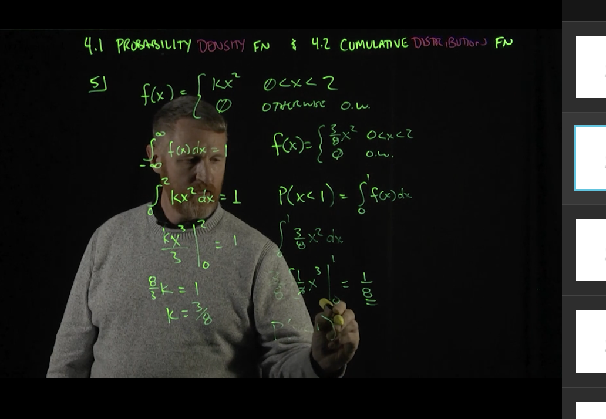

1. in the above problem we first solve for k on the left because we know the pdf under the curve = 1
2. then once we have k, we can solve the integral from 0 to 1 (x = 1). the question is about finding the probability that the professor ends his lecture 1 minute after the hour so x =1 and we find the integral to get the cdf.

A Probability Density Function (PDF) is a function that describes the relative likelihood for a continuous random variable to take on a given value. Unlike discrete random variables, which have a probability mass function that assigns a probability to each value in the sample space, continuous random variables require a density function because the probability of the variable taking on any single exact value is zero (since there are infinitely many possible values).

Here are some key points about PDFs:

Continuous Variables: PDFs are used exclusively with continuous random variables.

Area Under the Curve: The probability of the random variable falling within a particular range is given by the area under the density function for that range. The total area under the PDF over the entire range of possible values is always equal to 1, representing the certainty that the variable will take on a value within the range of possible values.

Non-Negative: A PDF must be non-negative for all possible values of the random variable, meaning it cannot take on negative values.

Integral and Probability: To find the probability that a continuous random variable
X lies between two values b, you would evaluate the integral of the PDF over that range:

## EV of a continuous function

Same thing, we multiply the probability of the function with the value of the function itself which is why we include x in the integral along with the pdf. That's why we multiply them both together.

## Normal distribution

So the standard normal distribution is a normal distribution with u = 0 and sigma = 1. 

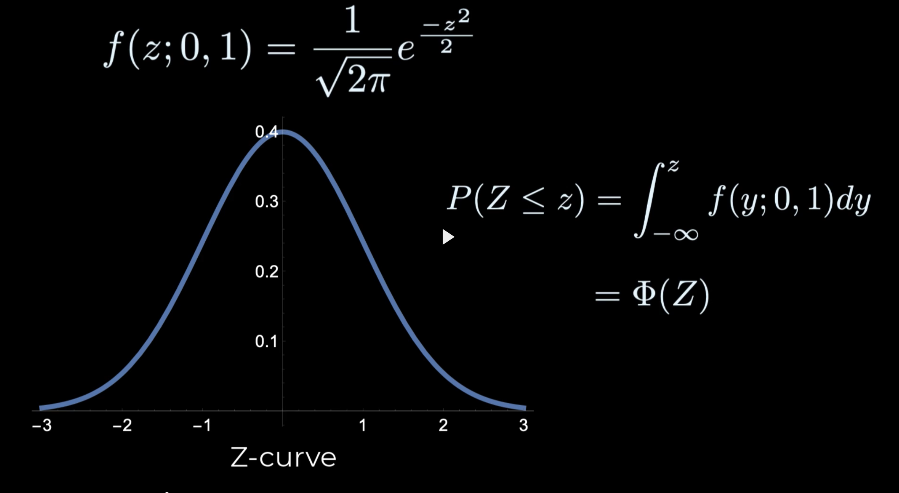

the cdf is on the right side. theta is how you denote the cdf of the standard normal distribution.

Instead, it's a reference distribution that information about other normal distributions can be obtained.

What do you do about normal distributions that are non standard? We standardize them. We take X our random variable and subtract u from it which shifts it to 0. and then we divide it by sigma to make the sigma 1 instead of sigma. (x - u) / sigma.

How would this work?

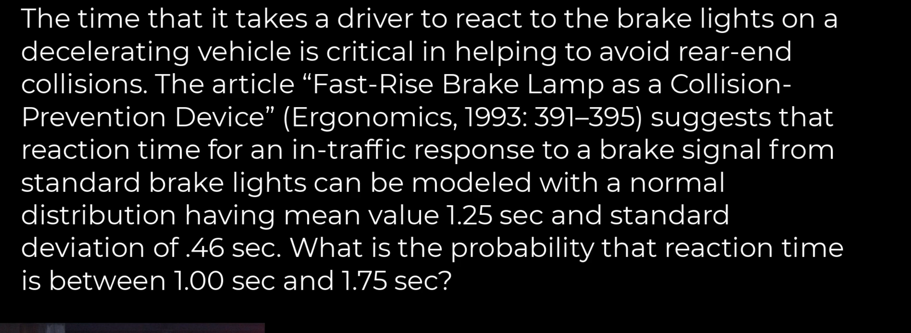

solution:

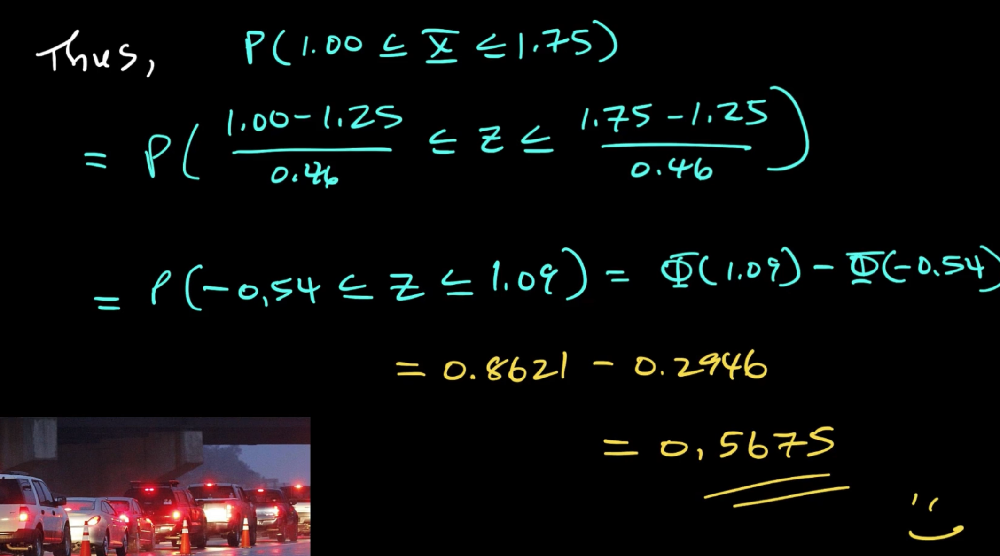

## Approximating discete distributions with normal curves

Because the value on the x-axis are centered in the middle of the discrete bar, we need to adjust by 0.5 when taking the cdf using the normal distribution as an approximation. for example to get area under a discrete distribution from 125, we need to take the area from 125.5 and to the left.

it's the application of the normal distribution to other distributions.

## Exponential functions

takes a single parameter lambda.

We have the pdf and to find the EV we take the value x and mutliply it by the pdf value.

cdf and pdf below and ev and std deviation. we use the exponential distribution for arrival time and they seem to follow exponential distribution. also memoryless property. has to do that exponential distribution depends on a single property. What's the property that we see a customer in 2 minutes. say 2 minutes pass, are we more due to see a customer in the next 2 minutes. memoryless says no. in short P(x > t + t_0 | x > t_0).  they are independent. also used for at bars for homerun.  lightbulbs blowing out follow the exponential distribution. Lots of things can be modeled using the memoryless property.

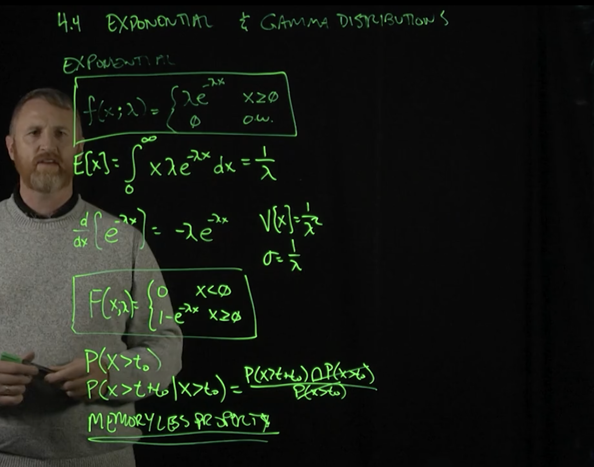

## Gamma distribution

function of variable alpha. we use it for... if alpha > 1 then you can say gamma  of alpha =gamma (alpha - 1)gamma(alpha - 1). all sorts of distuations. but support of gamma function. here's the pdf function, not cdf for gamma function.  Beta and alpha are inputs o pdf. what are alpha and beta?

the cdf for gamma functions we don't need.

exponential is subset of gamma function when alpha = 0 and beta = 1/lambda. exponential is a special case of the gamma distribution when alpha and gamma (inputs to gamma distribution) are specific values.

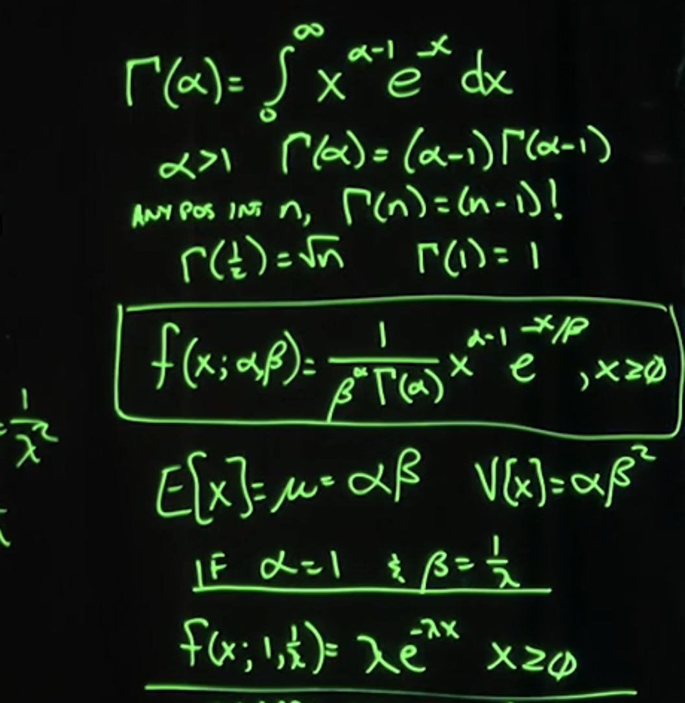

## Chi squared distribution

something about variance of processes like coffee lines or software development processes.

is the variance shorter than the previous process? sometimes less variance is good for processes.

v is the parameter, looks like a v. gamma is in the function.

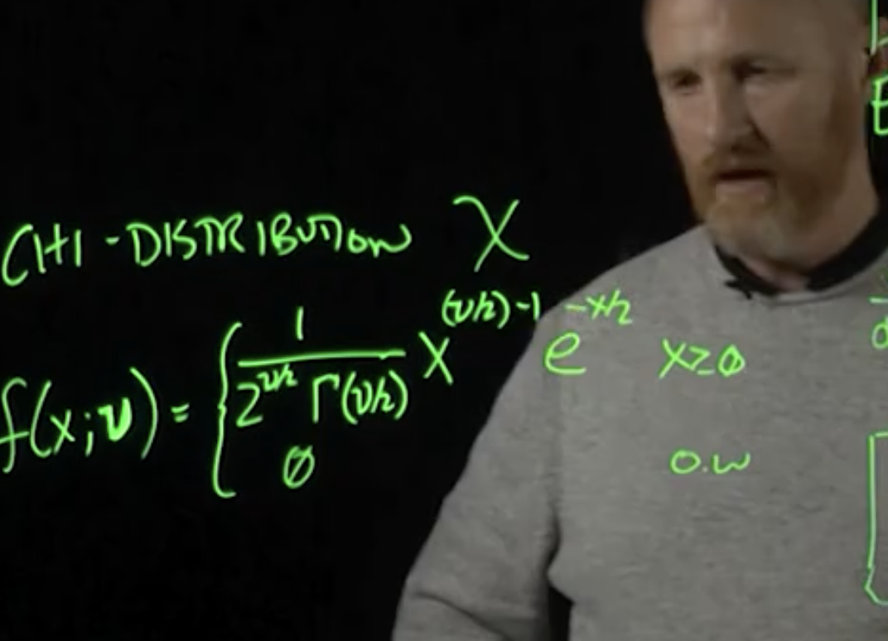

## exponential problems

2 calling plans
first one charges 10 cents per minute
call plan b 99c up to 20 minutes. Assume consumer calls are exponential with parameter lambda. explain intuitive how choice of calling plan should depend on expected duration of call. what if expected duration is 10 minutes? 15 minutes?

Cost of plan A(x) = 0.10 * x
cost of plan B(x) = 0.99 * x
say lambda = 10 minutes.
then EV of cost for plan a = $1.00
EV of cost for plan b = 0.99.

pretty much teh same

what aobut 15 minutes?

ev cost of plan(a) at 15 minutes = 1.50
ev cost of plan(B) at 15 = 0.99
so opt for plan b at 0.99

60. say a kangaroo distance they move x amount of distance away from their home follows an exponential distribution. Remember the cdf formula for exponential above.
 
just plug in values for lambda and use the cdf formula to find P(X<=100)) where that means the probability of the kangaroo moving at most 100 away from their birthsite.

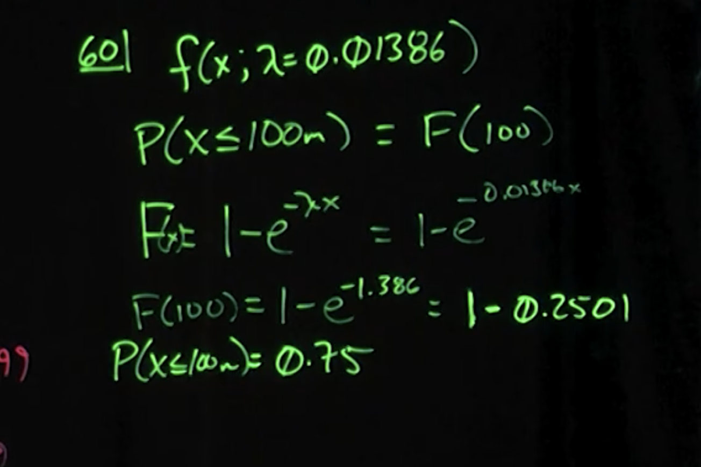

## other distributions for continuous random variable

weibull, lognormal, and the beta distribution.

when normal distribution, exponential, and gamma don't fit the observations, there are others we can use like weibull, lognormal, beta distribution.

weibull can be used for waiting times and failure. alpha and beta are inputs if pdf follows this piecewise function. 

- beta is a scale parameter, compresses or expands on the x parameter.
- alpha is the shape parameter, can make the graph look normal or exponential or log.

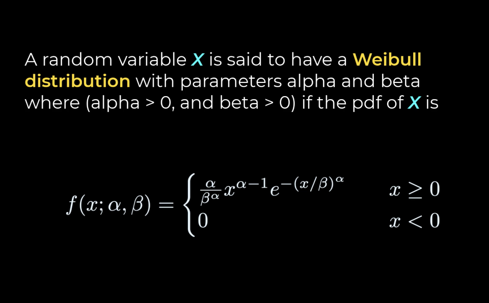

EV and variance of weibull pdf:
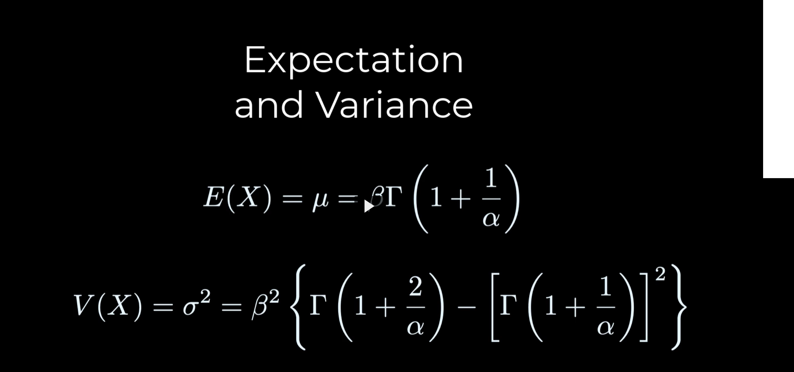

the cdf:

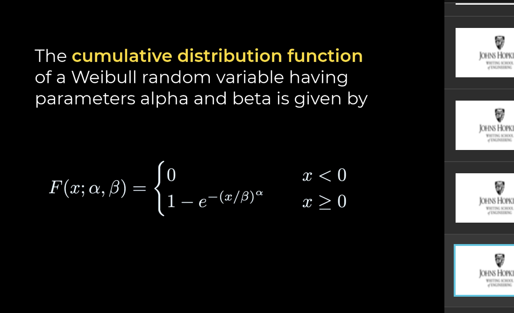

note that gamma function (the upside down L) is in the equation as is alpha and beta (spread and shape)

## weibull problem

## lognormal distribution

remember that mu and sigma are for ln(X) and not of X the random variable.

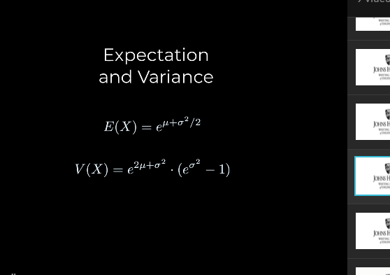
ev and std deviation
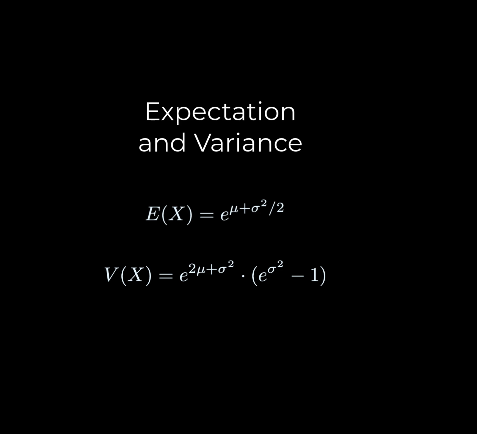

cdf of lognormal:

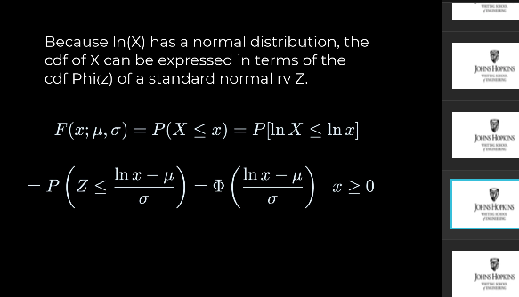

## Probability Plots

In a normal probability plot, the sorted data are plotted versus a theoretical normal distribution in such a way that the points should form an approximate straight line. Departures from this straight line indicate departures from normality.

The points are typically plotted with the data on the y-axis and the theoretical quantiles (which, in a normal distribution, are the z-scores) on the x-axis.

Percentiles are values that divide your data set into 100 equal parts. For example, the 50th percentile (also known as the median) is the value below which 50% of the data lies, and the 90th percentile is the value below which 90% of the data lies.

When calculating percentiles, you might not always have a data point that exactly corresponds to the desired percentile. For example, if you want to find the 25th percentile in a set of 10 data points, you can't simply take the 2.5th data point since only whole data points exist.

To handle this, the text suggests a formula for estimating the ith percentile of an ordered data set, which is given by:

ith sample percentile where i is the actual value

100(i−0.5)/n

Where:
i is the rank order of the data point (not an index, so the first data point is i=1, not i=0)
n is the total number of data points in the set
This formula adjusts the rank of the data point slightly (by subtracting 0.5) before calculating the percentile. This adjustment helps in interpolating between data points for a more accurate percentile calculation.

For example, let's calculate the 25th percentile for a dataset of 10 ordered observations:

First, order the observations from smallest to largest.
Then, apply the formula: the 25th percentile would correspond to
100(i−0.5)/10 = 25
Solving for i gives:
i = 25/100 × 10 + 0.5 = 3
So, the third-smallest value in your ordered dataset is the 25th percentile. However, because we don't have a 2.5th data point, we consider the third data point (i=3) as the 25th percentile after making the adjustment by subtracting 0.5.

