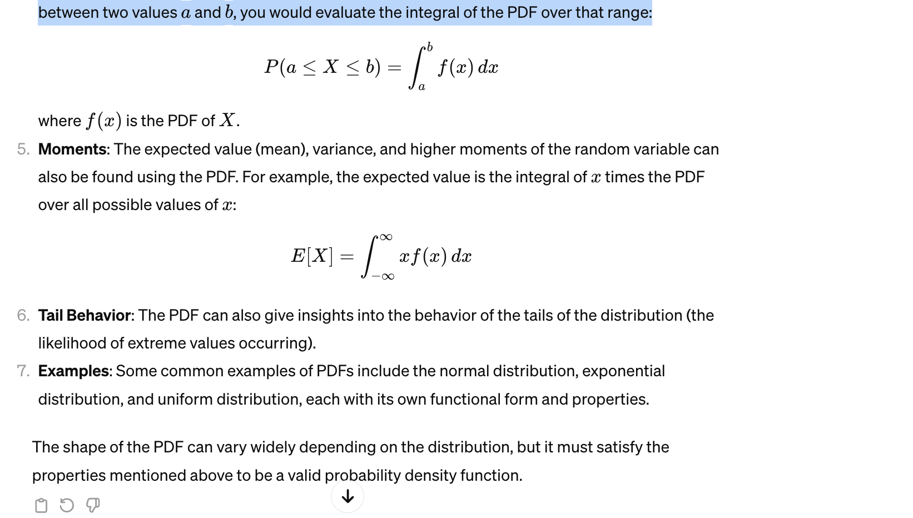
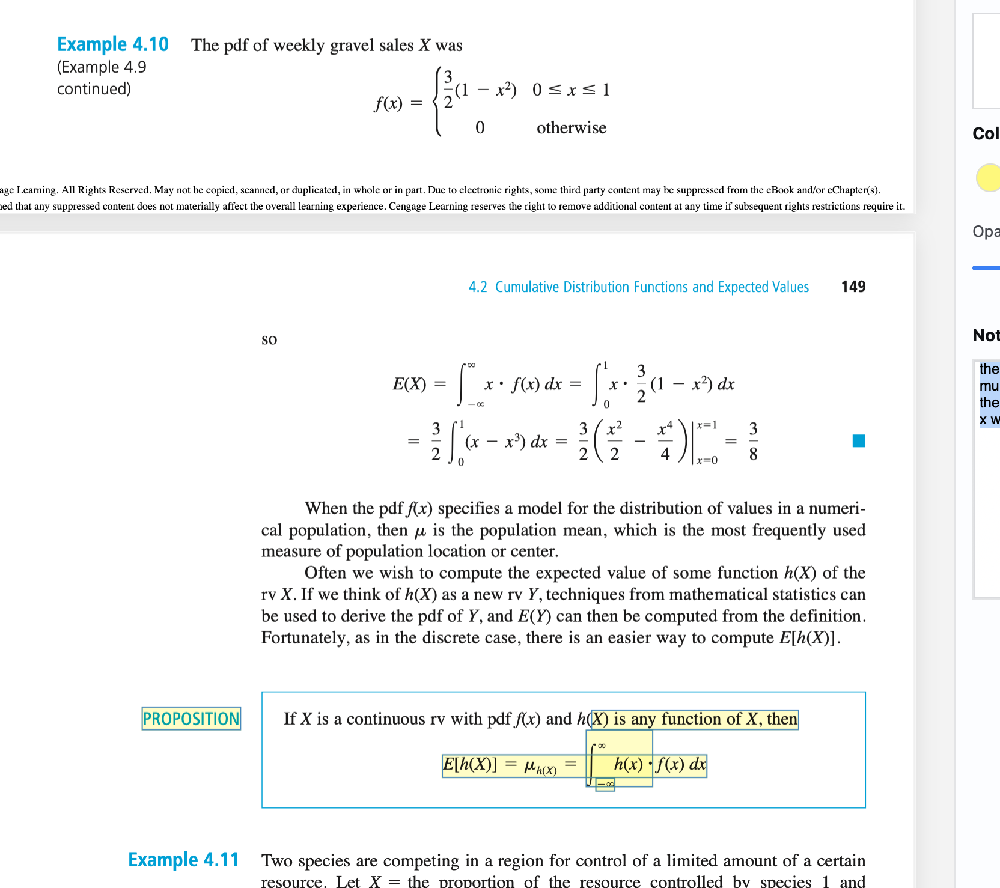

# Topics

- Probability Density Functions

# Notes

## Probability Density functions

A Probability Density Function (PDF) is a function that describes the relative likelihood for a continuous random variable to take on a given value. Unlike discrete random variables, which have a probability mass function that assigns a probability to each value in the sample space, continuous random variables require a density function because the probability of the variable taking on any single exact value is zero (since there are infinitely many possible values).

Here are some key points about PDFs:

Continuous Variables: PDFs are used exclusively with continuous random variables.

Area Under the Curve: The probability of the random variable falling within a particular range is given by the area under the density function for that range. The total area under the PDF over the entire range of possible values is always equal to 1, representing the certainty that the variable will take on a value within the range of possible values.

Non-Negative: A PDF must be non-negative for all possible values of the random variable, meaning it cannot take on negative values.

Integral and Probability: To find the probability that a continuous random variable
X lies between two values b, you would evaluate the integral of the PDF over that range:

## EV of a continuous function

Same thing, we multiply the probability of the function with the value of the function itself which is why we include x in the integral along with the pdf. That's why we multiply them both together.
