1. "When an automobile is stopped by a roving safety patrol, each tire is checked for tire wear, and each headlight is checked to see whether it is properly aimed. Let X denote the number of headlights that need adjustment, and let Y denote the number of defective tires with X and Y independent and p_x(0) = 0.5, p_x(1) = 0.3, p_x(2) = 0.2, and, p_y(0) = 0.6, p_y(1) = 0.1, p_y(2) = p_y(3) = 0.05, and p_y(4) = 0.2. Compute the marginal distribution where P(Y <= 1)."

work:
Given the probabilities for X and Y, we can calculate the marginal distribution of Y by summing the probabilities of Y up to 1. Since X and � Y are independent, the marginal probability distribution of
Y is just the sum of the probabilities P_y(k) for k ≤ 1.

The marginal distribution of Y is the probability distribution of Y ignoring X, and we're specifically interested in P(Y≤1), which is the sum of the probabilities that Y is 0 or 1.

Given:

P_y(0)=0.6
P_y(1)=0.1

The marginal probability
P(Y≤1) is: 0.6 + 0.1 =

answer:
0.7

2. Let X denote the number of Canon digital cameras sold during a particular week by a certain store. The pmf of X is found on page 204 problem number 6. Sixty percent of all customers who purchase these cameras also buy an extended warranty. Let Y denote the number of purchasers during this week who buy an extended warranty. Find p_y(0) using the marginal pmf of Y to four decimal places.

work:
find the joint pmf of x and y and then you can find the marginal pmf of Y. That's the strategy.
we use the binomial probability here to calculate a joint probability.
P(A and B) = P(A) * P(B | A) = P(B) * P(A | B)
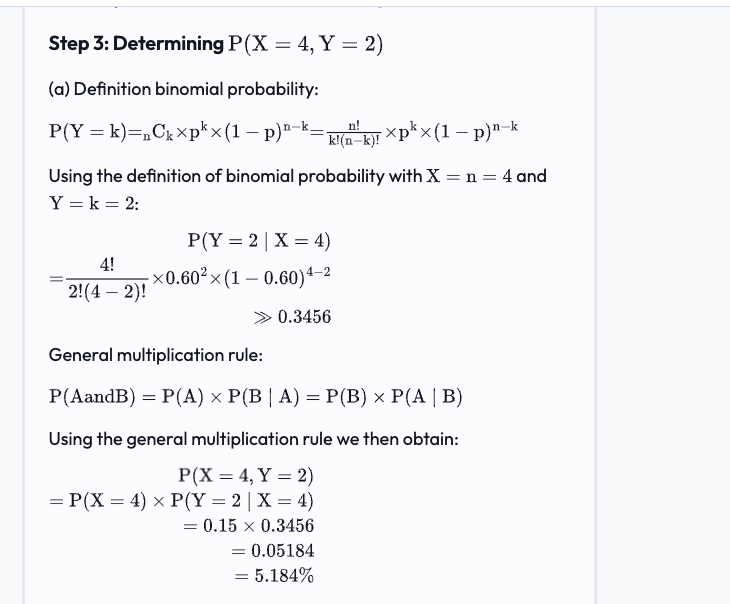

so that's how you do one square.

https://www.vaia.com/en-us/textbooks/math/probability-and-statistics-for-engineering-and-sciences-9th/joint-probability-distributions-and-random-samples/q6e-let-rmx-denote-the-number-of-canon-slr-cameras-sold-duri/
answer:0.2478

3. "When an automobile is stopped by a roving safety patrol, each tire is checked for tire wear, and each headlight is checked to see whether it is properly aimed. Let X denote the number of headlights that need adjustment, and let Y denote the number of defective tires with X and Y independent and p_x(0) = 0.5, p_x(1) = 0.3, p_x(2) = 0.2, and, p_y(0) = 0.6, p_y(1) = 0.1, p_y(2) = p_y(3) = 0.05, and p_y(4) = 0.2. How many elements are in the joint probability table?"

work: 

The joint probability table for two independent discrete random variables,
X and  Y, consists of entries for each possible combination of their values.

Given:
X can take on the values 0, 1, or 2.
Y can take on the values 0, 1, 2, 3, or 4.
Since X and Y are independent, each value of X can occur with each value of Y. To find the total number of elements in the joint probability table, we multiply the number of possible values of X by the number of possible values of
X: 3 possible values (0, 1, 2)
Y: 5 possible values (0, 1, 2, 3, 4)

So, the joint probability table will have 3×5 elements. 

answer: 15

4. "For f(x1,x2,x3) as given on page 201 Example 5.10, compute the joint marginal density function of X1 and X3 alone (by integrating over x2) and use it to determine the probability that rocks of types 1 and 3 together make up at most 50% of the sample to five decimal places."

work: chrome-extension://efaidnbmnnnibpcajpcglclefindmkaj/https://stt.msu.edu/Academics/ClassPages/uploads/US19/351-201/Lecture-08.pdf
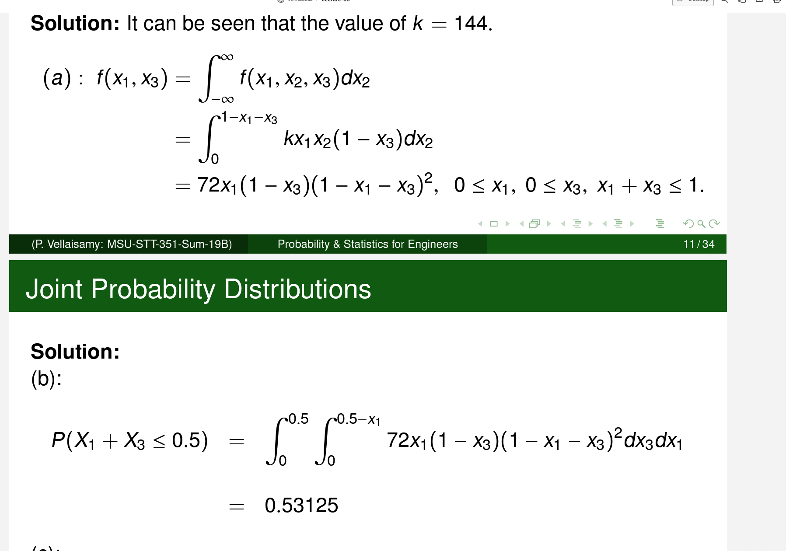
answer:

5. Two components of a minicomputer have the joint pdf listed on page 205 probem number 12 for their useful lifetimes X and Y. Which of the following statements are true.

"f(x,y) is not the product of the marginal pdfs, so the two rvs, X and Y, are not independent."

"f(x,y) is the product of the marginal pdfs, so the two rvs, X and Y, are not independent."

f_X(x) evaluates to (exp) raised to the (-x) power.

f_Y(y) evaluates to 1/(1+y^2)

The limits of integration for the margins of X and Y are the same.

work: https://www.vaia.com/en-us/textbooks/math/probability-and-statistics-for-engineering-and-sciences-9th/joint-probability-distributions-and-random-samples/q12e-two-components-of-a-minicomputer-have-the-following-joi/

6. "There are two traffic lights on a commuters route to and from work. Let X1 be the number of lights at which the commuter must stop on his way to work, and X2 be the number of lights at which he must stop when returning from work. Suppose these two variables are independent, each with pmf given in the table located on page 222 number 38 (so X1, X2 is a random sample of size n = 2). Calculate variance, V[T0], to two decimal places."

work:

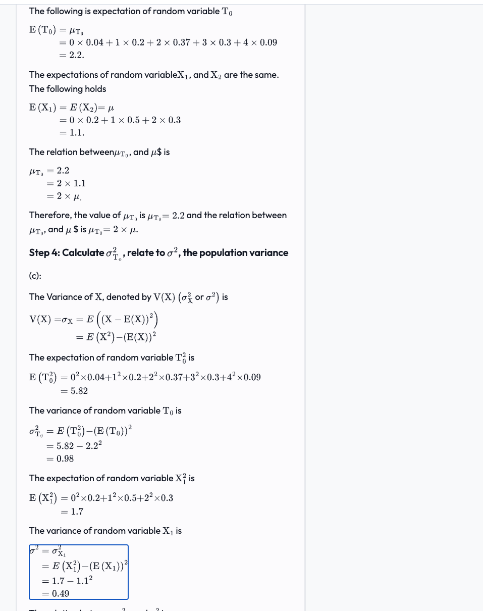

5.82 - 2.2^2

answer:
0.98 is the variance of T_0

7. "The inside diameter of a randomly selected piston ring is a random variable with mean value 12 cm and standard deviation .04 cm. If X is the sample mean diameter for a random sample of n = 16 rings, where the sampling distribution of X is centered at 12 cm, compute the standard deviation of the X distribution to two decimal places."
work:
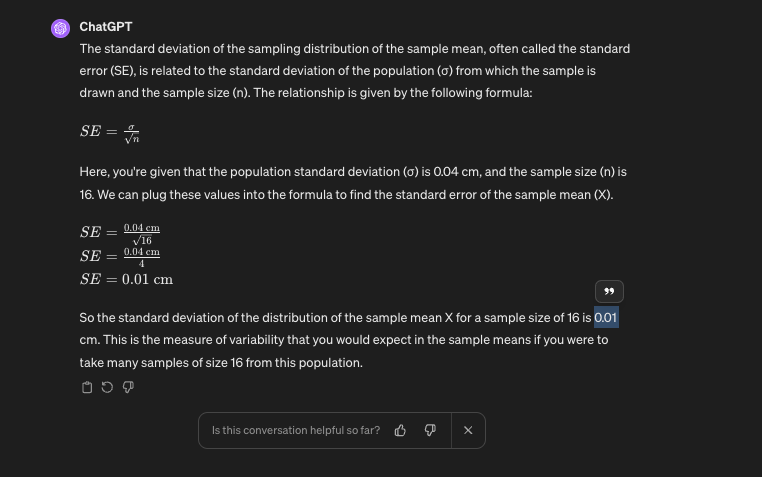
the key part here is that the standard deviation 0.04 is from the population and we are taking a sample of n =16 and so the standard deviation of the X distribution is about the sample

answer: 0.01

8. "When an automobile is stopped by a roving safety patrol, each tire is checked for tire wear, and each headlight is checked to see whether it is properly aimed. Let X denote the number of headlights that need adjustment, and let Y denote the number of defective tires with X and Y independent and p_x(0) = 0.5, p_x(1) = 0.3, p_x(2) = 0.2, and, p_y(0) = 0.6, p_y(1) = 0.1, p_y(2) = p_y(3) = 0.05, and p_y(4) = 0.2. Compute P(X + Y <= 1) to two decimal places."

work:

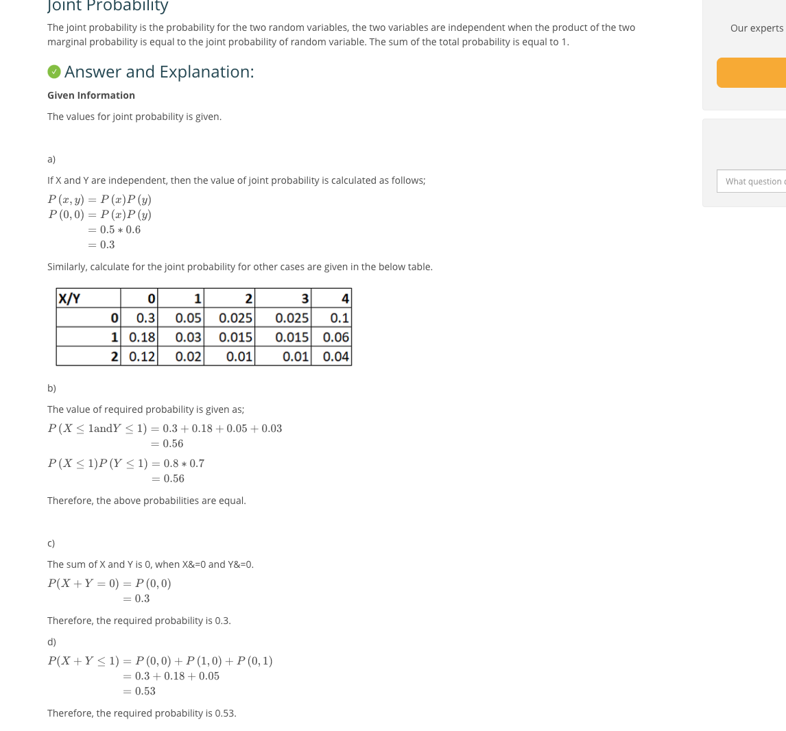
to get the joint, you multiply the disjoint probabilities together. For example, P(0,1) = P(x,y) = 0.5 * 0.1 = 0.05

answer:
0.53

9. "Let X denote the number of Canon digital cameras sold during a particular week by a certain store. The pmf of X is found on page 204 problem number 6. Sixty percent of all customers who purchase these cameras also buy an extended warranty. Let Y denote the number of purchasers during this week who buy an extended warranty. Compute P(X = 4, Y = 2) to four decimal places."

10. Let X denote the number of Canon digital cameras sold during a particular week by a certain store. The pmf of X is found on page 204 problem number 6. Sixty percent of all customers who purchase these cameras also buy an extended warranty. Let Y denote the number of purchasers during this week who buy an extended warranty. Find p_y(1) using the marginal pmf of Y to four decimal places.

11. Let X denote the number of Canon digital cameras sold during a particular week by a certain store. The pmf of X is found on page 204 problem number 6. Sixty percent of all customers who purchase these cameras also buy an extended warranty. Let Y denote the number of purchasers during this week who buy an extended warranty. Find p_y(3) using the marginal pmf of Y to four decimal places.

12. Two components of a minicomputer have the joint pdf listed on page 205 probem number 12 for their useful lifetimes X and Y. Compute the probability that the lifetime X of the first component exceeds 3 to three decimal places.
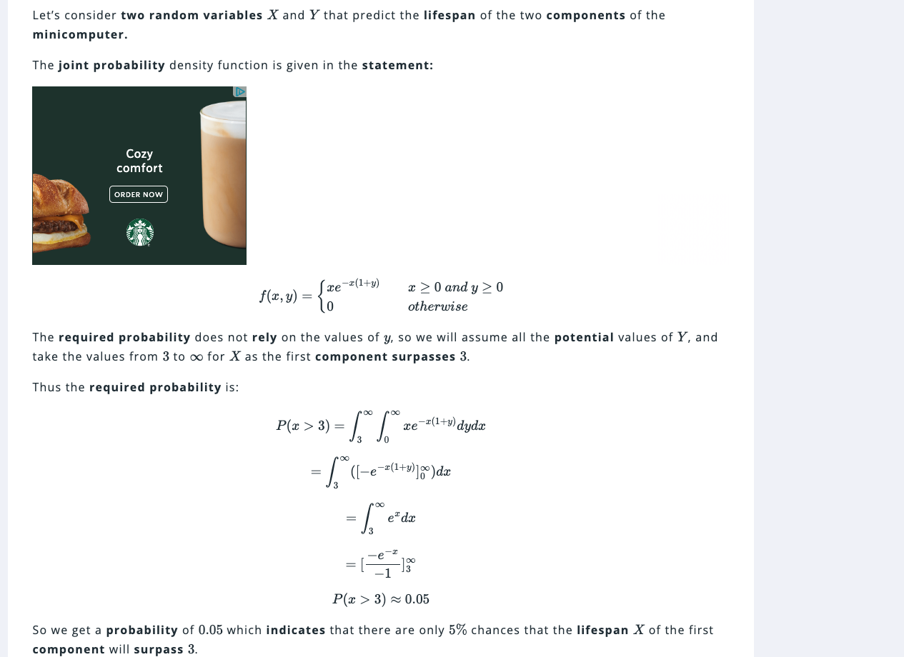
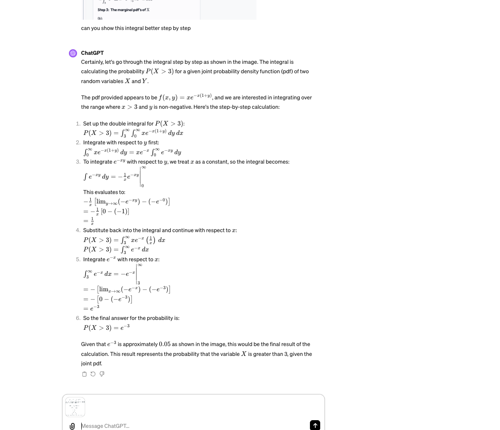
answer: 0.05

13. "Let X1, X2, X3, X4, X5, and X6 denote the number of blue, brown, green, orange, red, and yellow M&M candies, respectively, in a sample of size n. Then these X_i's have a multinomial distribution. According to the M&M Web site, the color proportions are p1 = 0.24, p2 = 0.13, p3 = 0.16, p4 = 0.20, p5 = 0.13, p6 = 0.14. In a sample of 20 M&Ms, compute the probability that the number of candies that are blue, green, or orange is at least 10 to four decimal places."

work:
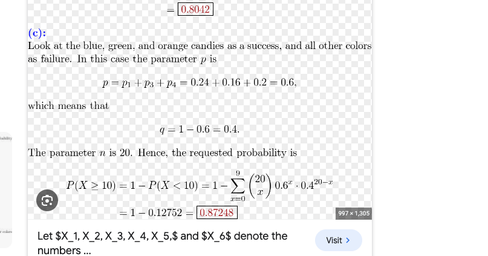
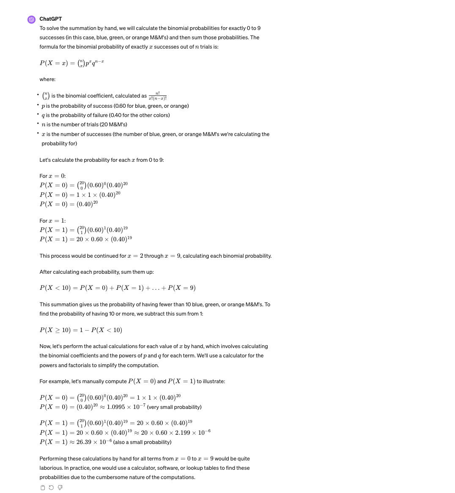

answer:
0.87248

14. "Let X1, X2, X3, X4, X5, and X6 denote the number of blue, brown, green, orange, red, and yellow M&M candies, respectively, in a sample of size n. Then these X_i's have a multinomial distribution. According to the M&M Web site, the color proportions are p1 = 0.24, p2 = 0.13, p3 = 0.16, p4 = 0.20, p5 = 0.13, p6 = 0.14. For n =__ 20, compute the probability that there are at most five orange candies to four decimal places. [Hint: Think of an orange candy as a success and any other color as a failure.]"

work: 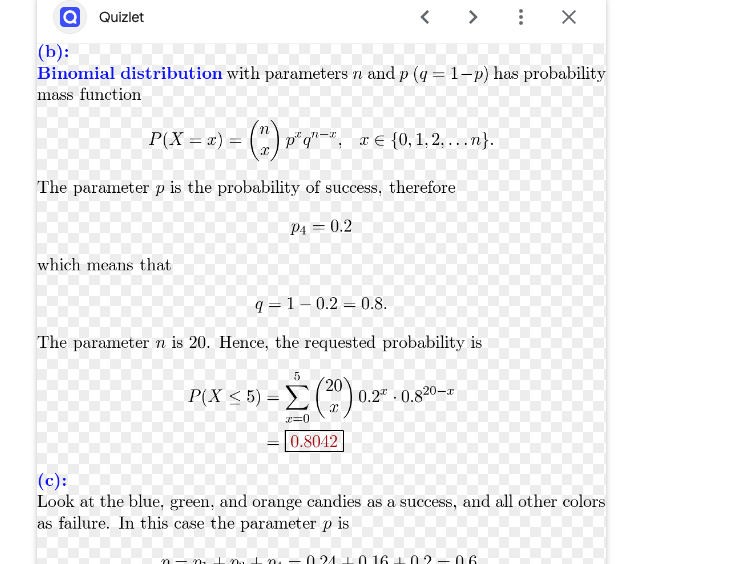

answer: 0.8042

15. "An instructor has given a short quiz consisting of two parts. For a randomly selected student, let X = the number of points earned on the first part and Y the number of points earned on the second part. Suppose that the joint pmf of X and Y is given in the table on page 211 number 22. If the score recorded in the grade book is the total number of points earned on the two parts, compute the expected recorded score E(X + Y) to two decimal places."

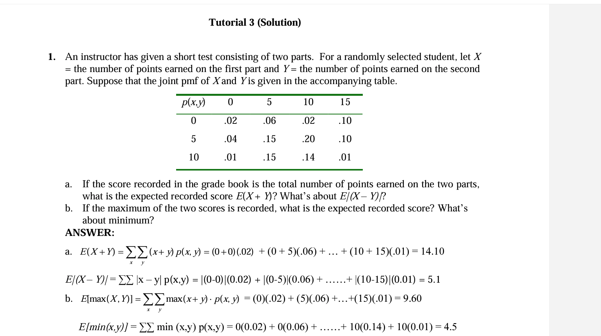

16. "An instructor has given a short quiz consisting of two parts. For a randomly selected student, let X = the number of points earned on the first part and Y = the number of points earned on the second part. Suppose that the joint pmf of X and Y is given in the table on page 211 number 22. Compute rho for X and Y to three decimal places."

work:
https://homework.study.com/explanation/an-instructor-has-given-a-short-quiz-consisting-of-two-parts-for-a-randomly-selected-student-let-x-the-number-of-points-earned-on-the-first-part-and-y-the-number-of-points-earned-on-the-second-part.html
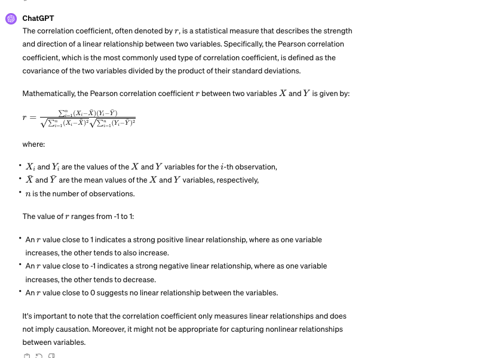
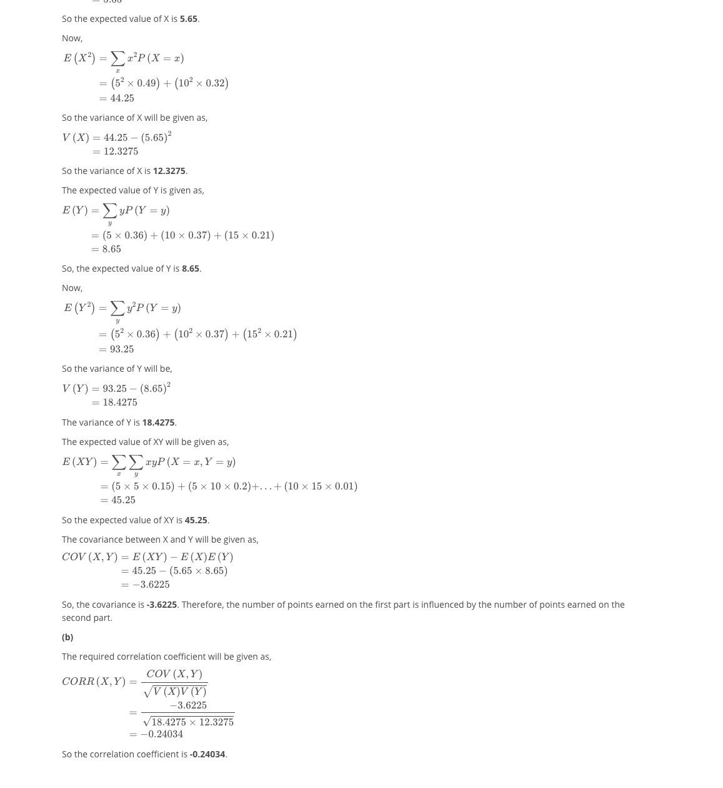
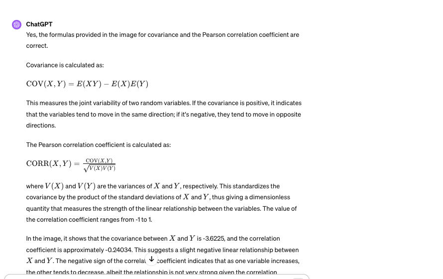

so covariance/standard deviation of the two multiplied

17. 
"There are two traffic lights on a commuters route to and from work. Let X1 be the number of lights at which the commuter must stop on his way to work, and X2 be the number of lights at which he must stop when returning from work. Suppose these two variables are independent, each with pmf given in the table located on page 222 number 38 (so X1, X2 is a random sample of size n = 2).  Find P(T_0 = 3) to two decimal places."

work for 17 18 and 19:
https://wizedu.com/questions/9699/there-are-two-traffic-lights-on-a-commuters-route

18. "There are two traffic lights on a commuters route to and from work. Let X1 be the number of lights at which the commuter must stop on his way to work, and X2 be the number of lights at which he must stop when returning from work. Suppose these two variables are independent, each with pmf given in the table located on page 222 number 38 (so X1, X2 is a random sample of size n = 2).  Find P(T_0 = 1) to two decimal places."

work: 
https://wizedu.com/questions/9699/there-are-two-traffic-lights-on-a-commuters-route

19. "There are two traffic lights on a commuters route to and from work. Let X1 be the number of lights at which the commuter must stop on his way to work, and X2 be the number of lights at which he must stop when returning from work. Suppose these two variables are independent, each with pmf given in the table located on page 222 number 38 (so X1, X2 is a random sample of size n = 2).  Find P(T_0 = 2) to two decimal places."

work: https://wizedu.com/questions/9699/there-are-two-traffic-lights-on-a-commuters-route

20. "Two airplanes are flying in the same direction in adjacent parallel corridors. At time t = 0, the first airplane is 10 km ahead of the second one. Suppose the speed of the first plane (km/hr) is normally distributed with mean 520 and standard deviation 10 and the second plane's speed is also normally distributed with mean and standard deviation 500 and 10, respectively. Compute the probability that the planes are separated by at most 10 km after 2 hr to four decimal places."
work:https://brainly.com/textbook-solutions/q-68-airplanes-flying-direction-adjacent-parallel-corridors-9#q-68-airplanes-flying-direction-adjacent-parallel-corridors-7
work: https://www.vaia.com/en-us/textbooks/math/probability-and-statistics-for-engineering-and-sciences-9th/overview-and-descriptive-statistics/q68e-two-airplanes-are-flying-in-the-same-direction-in-adjac/

The variance of the difference
V(X_2 − X_1) is calculated as V(X_2)+ V(X_1) since the speeds are independent, resulting in 100 + 100 = 200

The standard deviation of the difference is the square root of the variance, sqrt(200) = 14.14 km/hr.
To calculate the probability that X_2 − X_1 ≥ −5, they standardize the difference and calculate the Z-score as 

Z = (−5 − (−20)) / 14.14

The Z-score corresponds to the standardized value where the mean of the distribution is 0 and the standar deviation is 1.

They calculate the Z-score to be approximately 1.77, which indicates the number of standard deviations − 5 −5 km/hr is away from the mean difference of −20 km/hr.

Finally, they use the standard normal distribution to find the probability corresponding to a Z-score of 1.77, which is approximately 0.9616.

The P(X_2 - X_1 < 5) = P((x_2 - X_1) - (-20)/14.4) < P(5 - (-20)/14.4) is a way to write the observed value, away from the mean of -20 normalized by the std deviation. What is the probability that x_2 - X_1 (the distance between the planes) normalized is less than -5 - (-20) / 14.14 which is P(Z of X_1 - X-2 normalized < 1.77). That's a lookup table. 

answer: 0.0623
