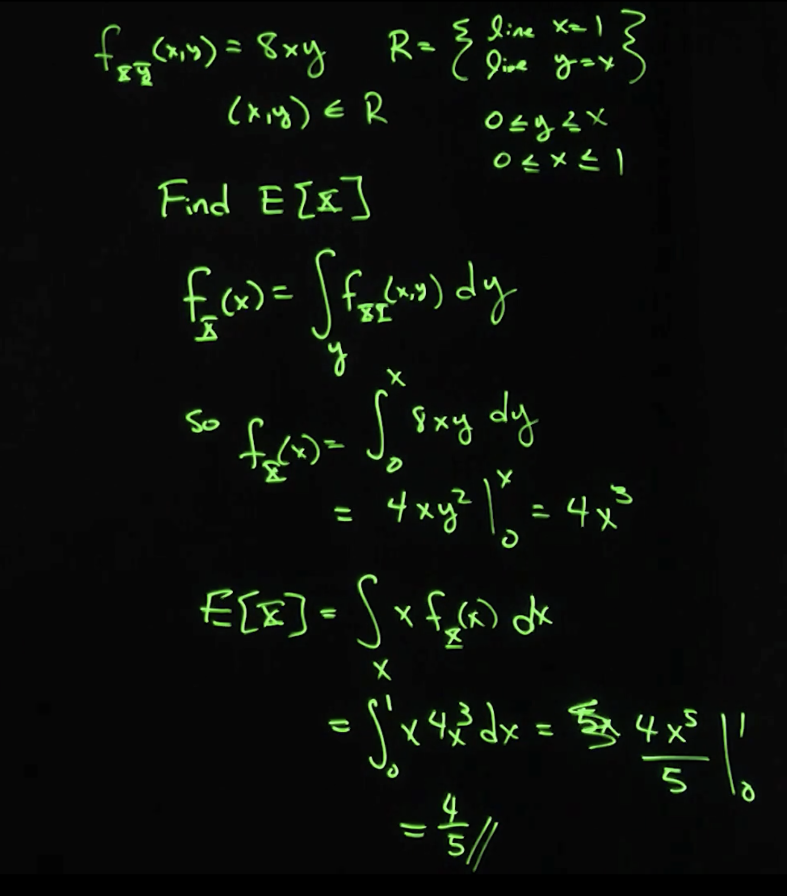
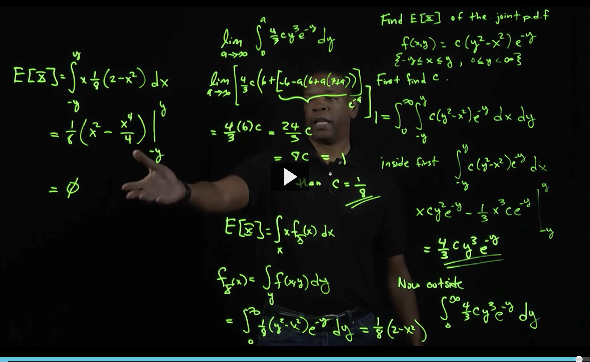
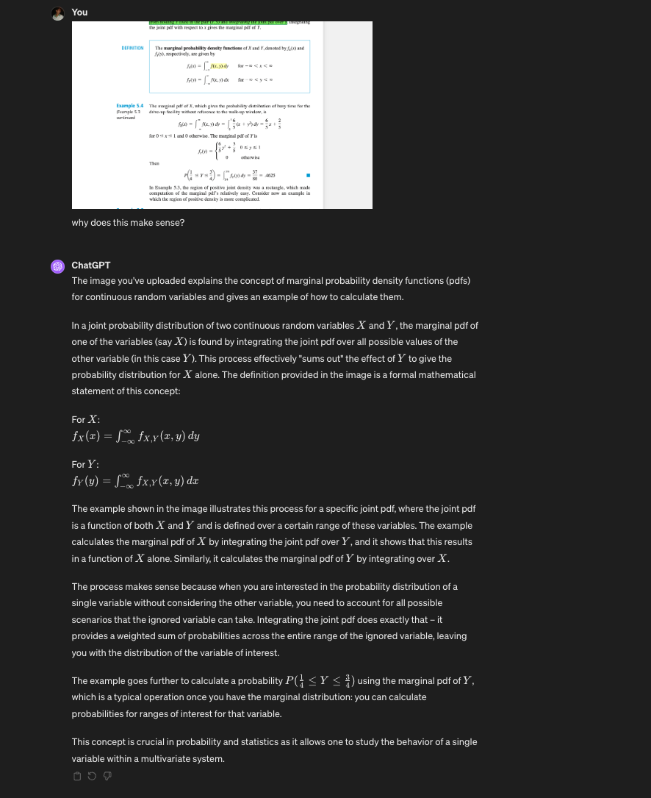
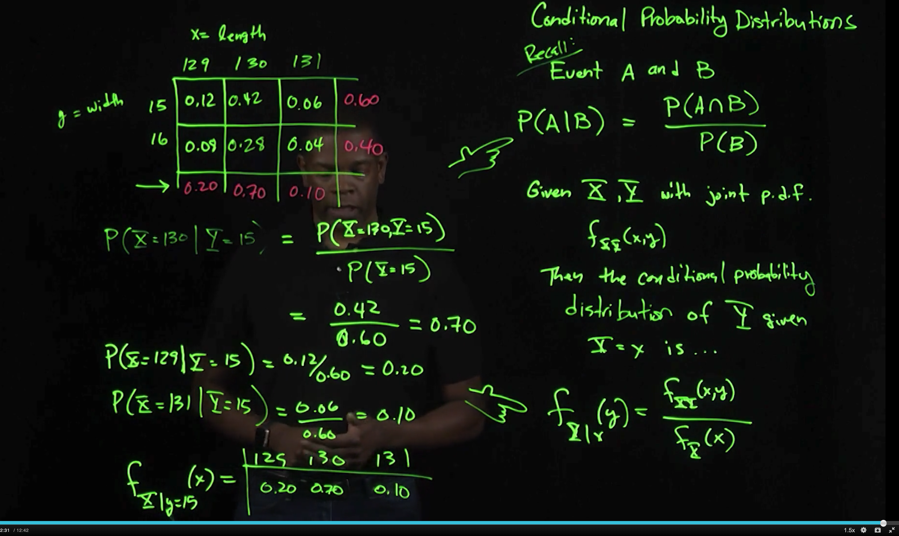
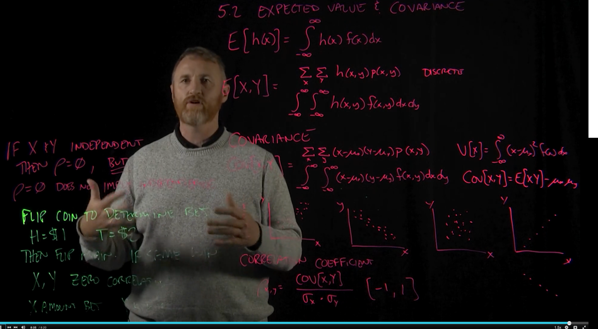

# Topics

Joint Distributions
Covariance and Correlation
Distribution of the Sample Mean
Distribution of Linear Combinations
correlation coefficient
marginal density distribution
joint probability

# review of chap 4

exponential function cdf proof:

# Notes

## Double integrals
The notation for a double integral is:

∬ f(x,y)dA
where R is the region of integration in the xy-plane, and dA represents an infinitesimally small area element within R.

This represents the volume under the surface f(x,y) above the rectangle defined by the limits of integration.

It's hard to see but ... .think of double integration as integrating along one axis (say x, the entire way) and then integrating on the other while keeping x constant so you get something like this:

a problem on page198:

# Notes on chapter 5

## Independence

When are probabilities independent? Each joint probability is the product of the individual marginal probabilities, indicating that X and Y are independent.

When dependent? These joint probabilities do not equal the product of their respective marginal probabilities, which indicates that X and Y are dependent.

For discrete random variables:
p(x,y)=p(X) dot P(Y)
meaning P(x,y) is the joint prob of x and y and P(x) is the joint marginal probability of X, independent of Y.

## Lecture notes

This was a lecture on the battery problem which is for joint probability of a discrete situation.

We then have a joint probability space to help us find the EV of X.
On the image, 3x3 grid is the joint probability space

we use the marginal distribution to find the E(X). 

so the EV of X = 0.3 which is close to 0 meaning the EV of us pulling a new battery is low, close to 0.

### Continuous joint pdf

When doing joint probabilities for continuous, we need to use integration.

in the image above 8xy represents the probability that a point is at x and y. `8xy` is the joint probability density function for a continuous variable.

We integrate to see if it equals 1 to see if it's really a pdf. 

Now to find the probability that x is between 0.5 adn 1 and y is between 0 and 0.5, it's 0.375. We set the limits of integratino appropriately. Notice when we integrate with respect to y, we go up the y axis. that's why the limits are between 0 and 0.5.

To find the EV of x, we first need to find the marginal distribution. instead of a sum like in discrete, we need to integrate with respect to dy because as we move along the y axis, those values give us the placement of x.

## Another example of joint probability density function

First find c because we're told it's a pdf and so that gives us enough information.

first find c.

Next we need a region of integration. We are given -y <= x <= y.  and 0 <= y < infinity

so since it's a pdf 1 equals the double integral.

C = 1/8 so now you can find the EV

We also need the marginal equation too which is what is done after the E(x) formula. Once that's found, you can calculate E(X)

## Marginal prob
In a joint probability distribution of two continuous random variables X and Y, the marginal pdf of one of the variables (say X) is found by integrating the joint pdf over all possible values of the other variable (in this case Y). This process effectively "sums out" the effect of Y to give the probability distribution for X alone.

When finding the marginal probability density function (pdf) for a variable X in a joint distribution with another variable Y, we integrate over `dy` because we want to consider the effect of all possible values of Y on X.

In a joint probability distribution (x,y), the value of the pdf at a specific point (x,y) tells us the density of probability at that point for both variables occurring together. However, if we want to find the probability distribution for X alone, we need to "average out" or "sum over" all possible influences of Y. This is done through integration.

By integrating (x,y) over y (with respect to dy), we are effectively adding up all the probabilities for
X across the entire range of Y, giving us the total probability distribution for X, regardless of the value of Y. This results in the marginal pdf (x), which depends only on X and not on Y.

## Conditional Prob of join distribution

It's the joint probability over the marginal probability.
What is hte prob that the container has a length of 130 given that the width is 15? 0.42/0.60 right?
We're looking for x = 130  and y = 15 given when y = 15 = 0.70

What about the conditional distribution of x given when y = 15?

Let's find the other 2. P(x = 129) and P(x = 131) all given that y = 15

## EV and Covariance
Covariance is variance when there is more than 1 variable.

Correlation coefficient = covariance of x and y / std(x) * std(y). ranges from -1 to 1.

If X and Y are independent, than correlation is 0. BUT correlation of 0 does not imply independence.

# Samples

Say you take 2 samples from the population. YOu know that the samples will likely not be identical. Observations will be diff frmo each sample.... so you can think of the sample as a random variable.

Samples can be random variables too. We can get point estimates from a sample. They can infer characteristics about the population.

a statistic is any value that can be computed from sample data.

Prior to obtaining data, there's uncertainy about what value from the sample this will result. Capital X bar denotes this random variable; it's suggestive of the randomness of the sample statistic. Lowercase x bar is the actual observed value.

- lowercase x with a bar over it is an observed value or calculate value of the statistic.
- uppercase X with a bar over it is a random variable.

The probability distribution of a statistic, it describes how a statistic will vary between samples.
- you can simulate
- or can you calculate using probability rules

