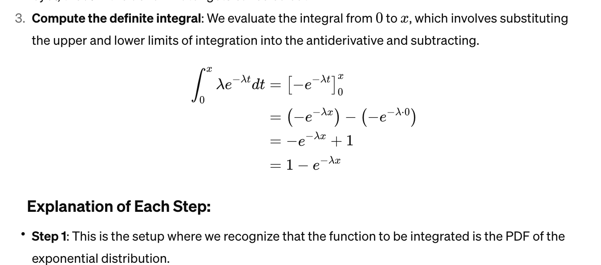
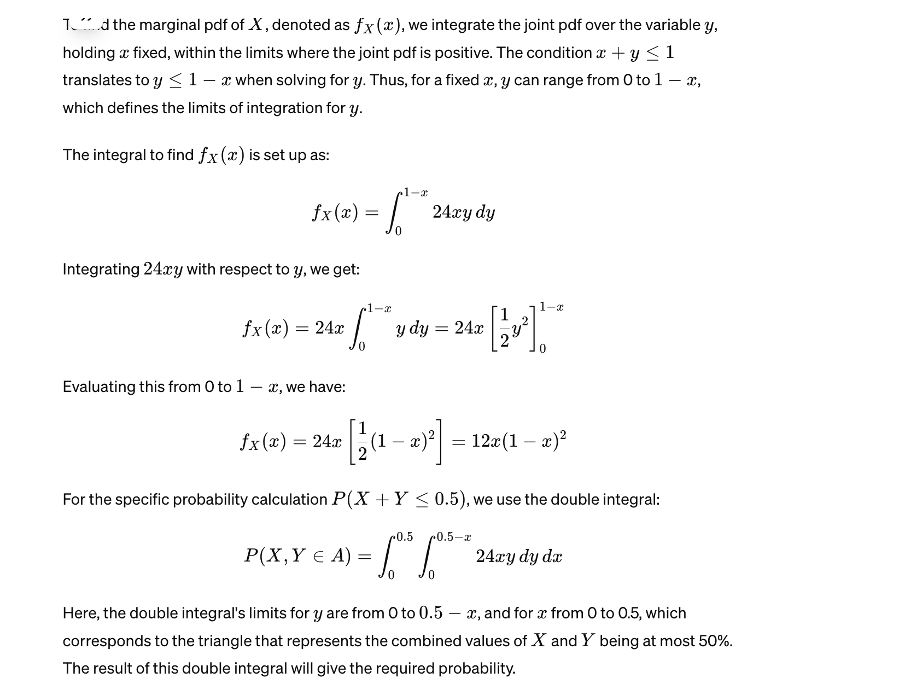
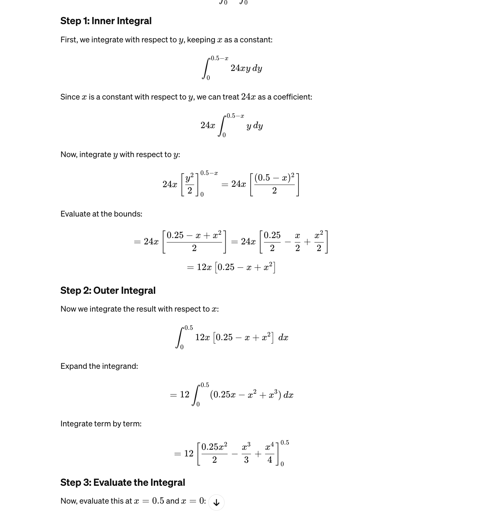
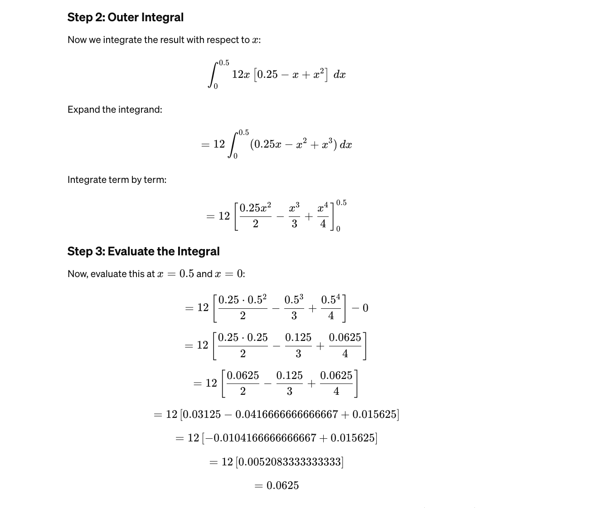
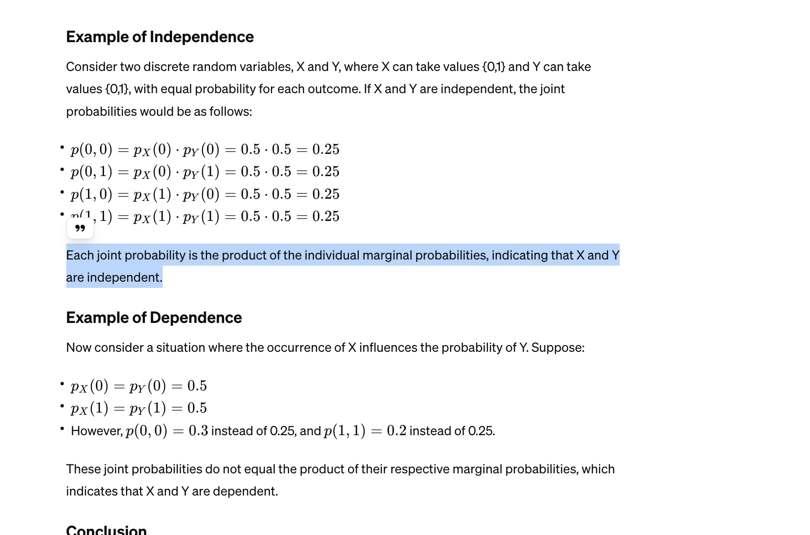
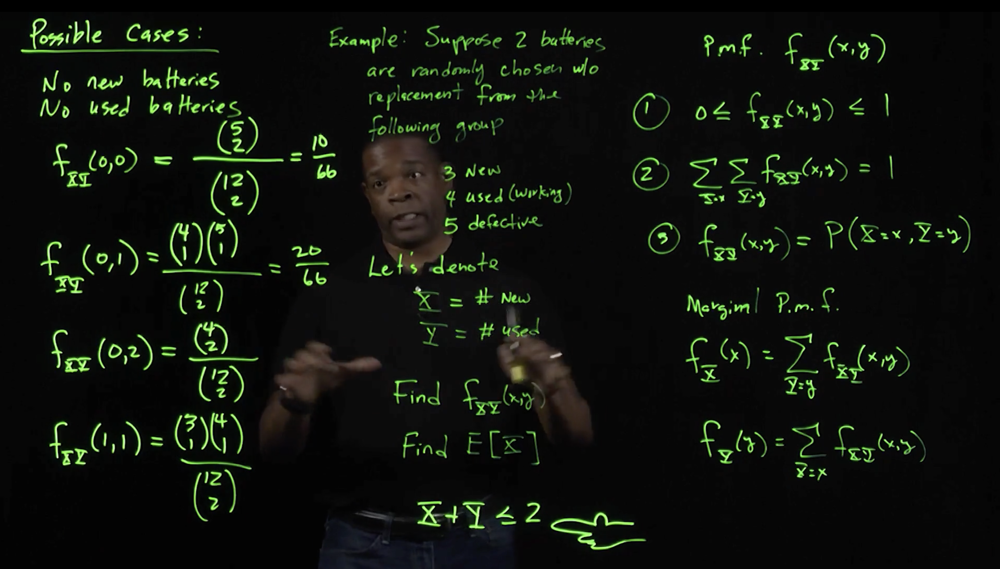
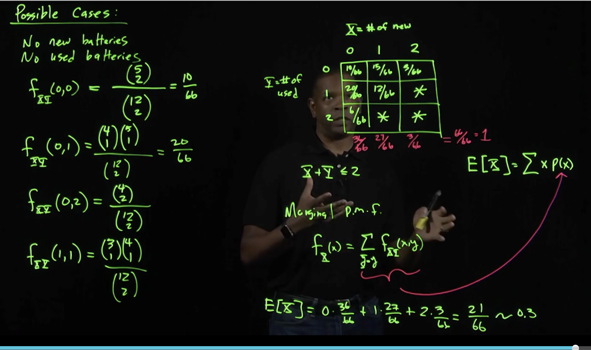
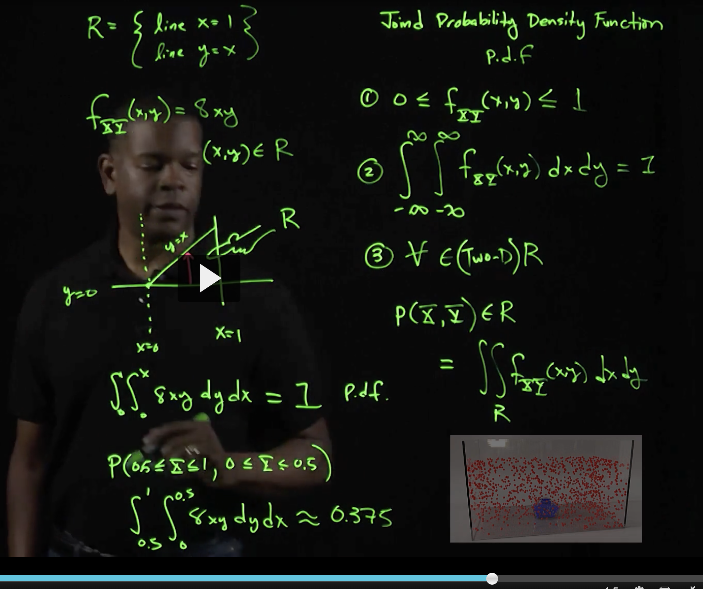

# Topics

Joint Distributions
Covariance and Correlation
Distribution of the Sample Mean
Distribution of Linear Combinations

# review of chap 4

exponential function cdf proof:

# Notes

## Double integrals
The notation for a double integral is:

∬ f(x,y)dA
where R is the region of integration in the xy-plane, and dA represents an infinitesimally small area element within R.

This represents the volume under the surface f(x,y) above the rectangle defined by the limits of integration.

It's hard to see but ... .think of double integration as integrating along one axis (say x, the entire way) and then integrating on the other while keeping x constant so you get something like this:

a problem on page198:

# Notes on chapter 5

## Independence

When are probabilities independent? Each joint probability is the product of the individual marginal probabilities, indicating that X and Y are independent.

When dependent? These joint probabilities do not equal the product of their respective marginal probabilities, which indicates that X and Y are dependent.

For discrete random variables:
p(x,y)=p(X) dot P(Y)
meaning P(x,y) is the joint prob of x and y and P(x) is the joint marginal probability of X, independent of Y.

## Lecture notes

This was a lecture on the battery problem which is for joint probability of a discrete situation.

We then have a joint probability space to help us find the EV of X.
On the image, 3x3 grid is the joint probability space

we use the marginal distribution to find the E(X). 

so the EV of X = 0.3 which is close to 0 meaning the EV of us pulling a new battery is low, close to 0.

### Continuous joint pdf

When doing joint probabilities for continuous, we need to use integration.

in the image above 8xy represents the probability that a point is at x and y. 

We integrate to see if it equals 1 to see if it's really a pdf. 

Now to find the probability that x is between 0.5 adn 1 and y is between 0 and 0.5, it's 0.375. We set the limits of integratino appropriately. Notice when we integrate with respect to y, we go up the y axis. that's why the limits are between 0 and 0.5.
