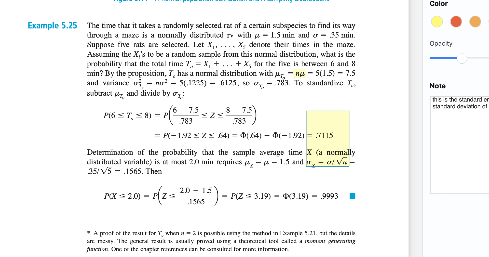
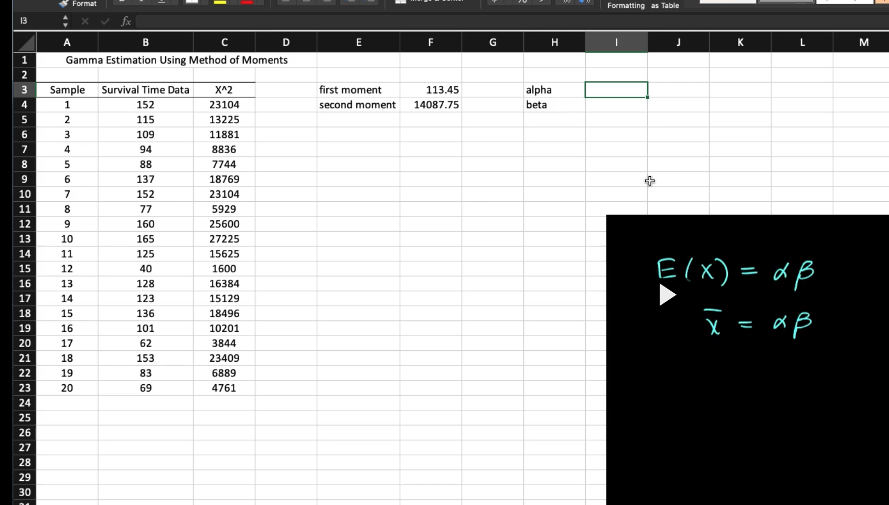
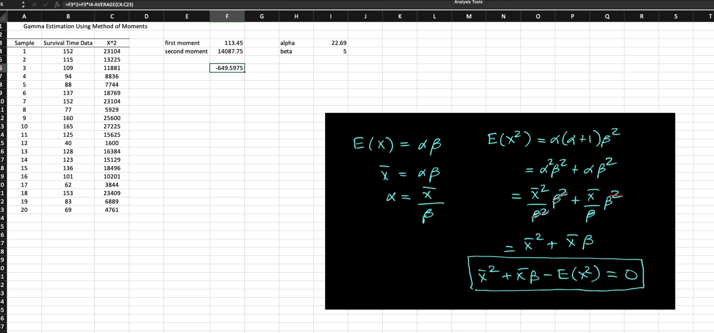
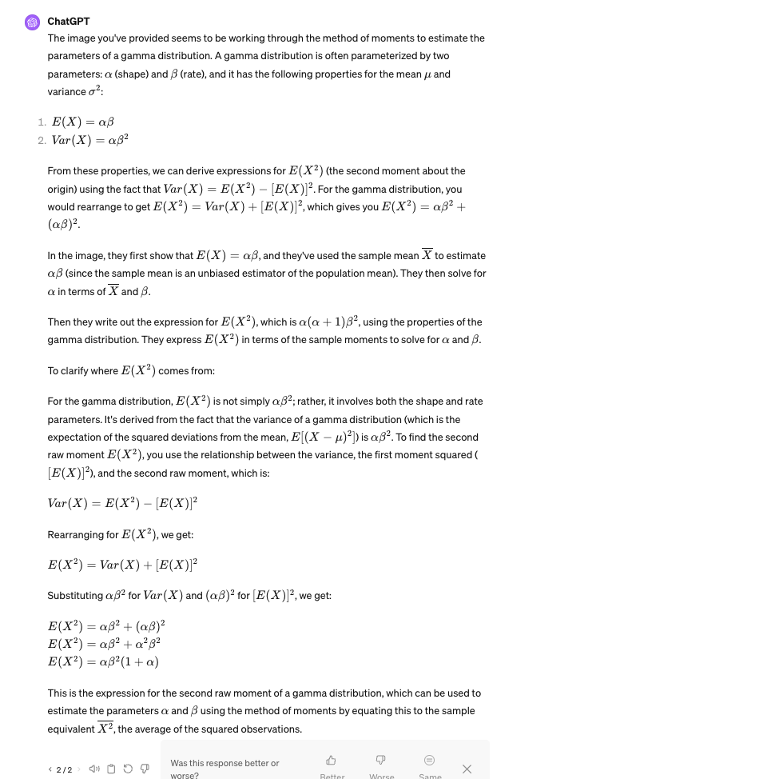
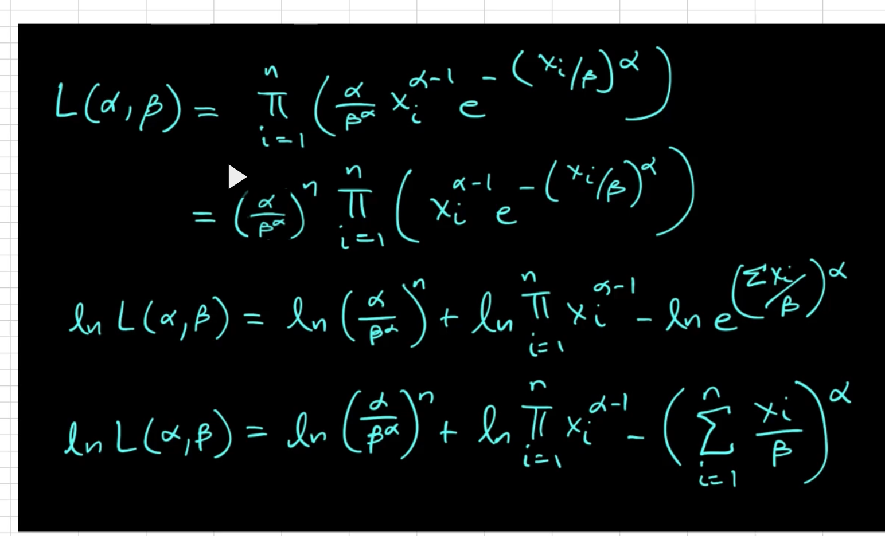
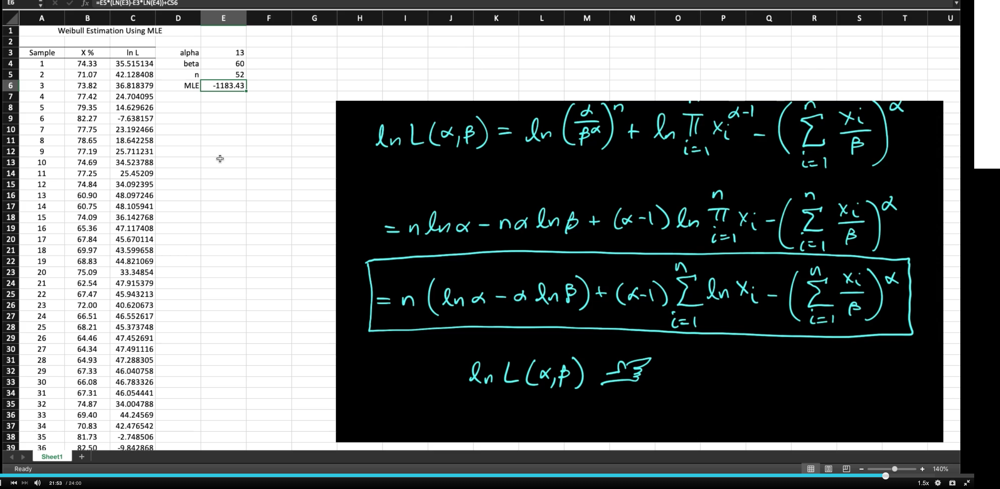

# Topics
Point estimate
bias
central limit theorum
method of moments
method of maximum likelihood

# some review

This is a good example problem. two topics it covers:

- standardization: converting a normal distribution to be standard around the mean so you can then use a ztable to find the probabilities. IT involves subtracting the mean and then dividing by the standard deviation to find the z score.
- standard error = standard deviation of the mean

# Notes

Some notation:

bars are averages, hats are estimates.
If the population mean is mu, and the samples are x_i, then you may reasonably refer to the sample mean either as mu-hat or as x-bar.

## Point estimates

We are familiar with certain distribution parameters already, for example, for the normal distribution, we call µ the population mean and σ the population standard deviation.  For other distributions like the Poisson, the population parameter of interest would be λ.  Because different distributions use different letters to describe that population’s parameter, when we generalize and discuss any population’s parameter, we will use θ. 

Yes, in statistics, θ is often used as a general notation for a parameter of a probability distribution or model. It's a way to generalize different possible parameters. For instance:

- In the context of a normal distribution, θ might represent the mean (\( \mu \)) or the variance (\( \sigma^2 \)).
- In a binomial distribution, θ could represent the probability of success (\( p \)).

It is a variable in the sense that it can take on different values, but it is not a random variable; it's a fixed but unknown value that we aim to estimate or make inferences about. Parameters define the characteristics of a distribution, and different values of θ would imply different distributions.

In inferential statistics, we often talk about estimating θ from sample data because we usually don't know the true parameter value of the entire population. Estimators are random variables because they are calculated from sample data, and samples are subject to variability. Once we calculate an estimate from a specific sample, it becomes a point estimate, which is a fixed number.

bias = point estimate - real value
an unbiased estimator is when the estimate of the point estimate (theta) is = real parameter value.

Unbiasedness is a property of an estimator, not of the parameter itself. An estimator is unbiased if, on average, it produces estimates that are equal to the true parameter value over many samples from the population. Unbiasedness is a desirable property because it means that if you could take an infinite number of samples and calculate the estimate each time, the mean of all those estimates would be the true parameter value.

This property does not depend on the actual value of the parameter being estimated because it's about the long-run behavior of the estimator. Whether the population proportion p is 0.1 or 0.9, for instance, a sample proportion p^ calculated as X/n (where X is the number of successes and n is the number of trials) is an unbiased estimator because the expected value of equals p for any value of p.

In simpler terms, unbiasedness is like saying, "If I use this measuring stick to measure various lengths, on average, I will get the correct length." It doesn't matter what the actual lengths are; what matters is that the measuring stick doesn't systematically overestimate or underestimate them.

## CLT

even if the original population is nonnormal, the samples are! think about it.

basically, pretend it's normal if your sample size is big enough, even if the original population is not normal

## Estimator vs estimate

The image you've provided explains the difference between an estimator and an estimate, which are fundamental concepts in statistics:

- **Estimator**: An estimator is a rule or a formula that tells you how to use sample data to calculate an estimate of a population parameter. It is a statistical procedure or a function of the observed data. For example, the sample mean \( \overline{X} \) (often expressed as \( \hat{\theta} \), where the "hat" symbol represents an estimator) is an estimator of the population mean \( \mu \). The estimator is a random variable because it is calculated from random samples, and therefore its value can vary from sample to sample.

- **Estimate**: An estimate is the actual numerical value obtained when you apply the estimator to your sample data. It is a specific realization of the estimator. Continuing with the same example, if you have a sample of data and you calculate the sample mean to be 5.77, then 5.77 is the estimate of the population mean \( \mu \).

To summarize, the estimator is the formula or procedure (a function), and the estimate is the numerical value (the output of the function when you plug in your data).

As for other unbiased estimators of the mean, here are a few examples:

Weighted Mean: If different observations have different reliabilities (weights), a weighted mean can be an unbiased estimator of μ when the weights are properly assigned based on known reliability.

Trimmed Mean: Sometimes, to minimize the effect of outliers, a certain percentage of the lowest and highest values are removed before calculating the mean. If the trimming is symmetric, this can still be an unbiased estimator of u. 

Winsorized Mean: This is similar to the trimmed mean, but instead of removing the extreme values, they are replaced with the next highest (or lowest) value that wasn't removed. A Winsorized mean can be unbiased under certain conditions.

Median: For some symmetric distributions (like the normal distribution), the sample median can also be an unbiased estimator of the population mean μ.

## Method of moments

equate certain characteristics about the sample to corresponding population expected values. then you solve for the unknown parameter values which yields the estimator. It's in the video
- but essentially you use the sample stat as the population stat
- that allows you to solve for unknown variables in the equation for the population stat. 

In the image, we have sample data. we have a first moment which is = to the mean of the sample data. the second moment is EV of x^2. we're trying to find alpha and beta of the gamma distribution.

What is that E(x^2) equation?

The Method of Moments is a technique in statistics for estimating population parameters (such as mean, variance, etc.) based on sample moments. The basic idea is to use the sample data to generate equations that connect sample moments (like sample mean, sample variance) with population moments (the theoretical expectations of these quantities), and then solve these equations to find estimates for the unknown parameters.

Let's break it down step by step:

1. **Population Moment**: A population moment is a certain kind of "average" of the powers of the variable of interest. For example, the first population moment is the mean (average), the second is related to variance, and so on.

2. **Sample Moment**: A sample moment is the equivalent calculation but done on the sample data. So the first sample moment is the sample mean, the second is related to the sample variance, etc.

3. **Method of Moments Estimation**: The method of moments estimates the parameters by equating sample moments to population moments and solving the resulting equations. 

Here's a "dumb" example for clarity:

Imagine you have a jar full of red and blue marbles. You want to know the average number of blue marbles you'd get if you took many handfuls out of the jar. You don't want to count all the marbles in the jar (the population), so you decide to take a few handfuls (samples) and use them to estimate.

- **First Population Moment (Mean)**: The actual average number of blue marbles per handful in the jar.
- **First Sample Moment (Sample Mean)**: The average number of blue marbles in your sample handfuls.

Using the method of moments, you would take the average number of blue marbles from your sample handfuls and use that as an estimate for the average number in the jar. 

To put this into a mathematical perspective, if you took three handfuls and got 2, 3, and 5 blue marbles respectively, your first sample moment (sample mean) would be \( (2 + 3 + 5) / 3 = 3.33 \). You would then estimate that, on average, you would get about 3.33 blue marbles in any handful from the jar.

This is a simplified example and real-world applications often involve solving systems of equations for multiple parameters, but the fundamental concept is the same: using the data you have to estimate the characteristics of the entire population.

## Another explanation of method of moments

The Method of Moments is a statistical technique for estimating the parameters of a probability distribution by equating sample moments to population moments. Here's a step-by-step explanation with an example to make it clearer:

### Definitions:

- **Population Moment**: A theoretical average of the powers of a random variable from the entire population. For example, the first population moment is the mean of the distribution.
- **Sample Moment**: An empirical average calculated from the sample data, analogous to the population moment. For the first sample moment, you would calculate the mean of your sample data.

### The Process:

1. **Determine Population Moments**: For a given distribution with unknown parameters, determine the first few population moments (e.g., mean, variance) as functions of those parameters.

2. **Calculate Sample Moments**: From your actual data, calculate the corresponding sample moments. For instance, the first sample moment is the average of your data.

3. **Equate Moments**: Equate each sample moment with the corresponding population moment. This creates a system of equations.

4. **Solve for Parameters**: Solve this system of equations to estimate the unknown parameters.

### Example:

Let's say you're rolling a six-sided die and you want to estimate the probability of rolling each number (assuming it may not be a fair die). You roll it 60 times and record the results.

- Your first population moment is the expected value of the roll, which is the average value.
- The first sample moment is the average result of your 60 rolls.

If a fair die has an expected value of 3.5 (because \( \frac{1+2+3+4+5+6}{6} = 3.5 \)), and your sample average (first sample moment) was 4, you might begin to think the die is biased towards higher numbers.

For a fair die, the first population moment (mean) would be \( \mu = 3.5 \). If your first sample moment (sample mean) is \( \overline{x} = 4 \), you would set up the equation:

\[ \mu = \overline{x} \]

Then, by solving this equation, you would estimate that the expected value of a roll \( \mu \) is 4, which suggests the die is not fair.

In your provided definition, for the kth moment, you would calculate it by raising each data point to the kth power, summing them up, and then dividing by the number of data points. If you were to do this for the second moment (which relates to variance), you would square each data point before summing and dividing by the sample size.

The Method of Moments is particularly useful because it's straightforward and only requires solving a system of equations, which can often be done easily, especially with computers. However, it does rely on the assumption that the sample moments are good representatives of the population moments, which may not always be the case, especially for small sample sizes...neat

## Method of maxiumum likelihood (MLE)

Maximizing the Likelihood: The principle of maximum likelihood estimation says that the best estimate for the parameters u and σ are those that maximize the likelihood function, i.e., make the observed data most likely.

When using Maximum Likelihood Estimation (MLE) to estimate the parameters of a distribution, taking the logarithm of the likelihood function, thereby creating the log-likelihood function, is a common and very useful step. Here are the reasons why:

1. **Simplification of Multiplication:** The likelihood function often involves the product of many probability density functions (PDFs) or probability mass functions (PMFs), especially when dealing with independent and identically distributed (i.i.d.) samples. Products can become very small and lead to numerical underflow on computers. Logarithms turn these products into sums, which are easier to work with both analytically and numerically.

2. **Derivative Simplification:** When you take the derivative of a function to find its maximum (as is done in MLE), dealing with sums (as in the log-likelihood) is mathematically more straightforward than dealing with products (as in the likelihood). The logarithm turns the product of derivatives into a sum of derivatives.

3. **Convexity:** The log-likelihood function is concave for many common families of distributions, which guarantees that any local maximum is also a global maximum. This is a desirable property for optimization problems, making it easier to find the maximum using iterative methods.

4. **Numerical Stability:** Logarithms help maintain numerical stability. The likelihood of observing a particular sample can be extremely small, especially with large datasets. Computing the log-likelihood avoids the issue of dealing with extremely small numbers because logarithms map the interval (0,1) to (-∞,0).

5. **Interpretability:** Log-likelihoods can sometimes be interpreted more easily in the context of information theory. For example, the log-likelihood is directly related to concepts like entropy and Kullback-Leibler divergence.

For these reasons, it's standard practice to work with the log-likelihood when applying MLE for parameter estimation. The maximization problem remains the same because the logarithm is a monotonic transformation, meaning it preserves the location of the maximum.

- talked about most often by statisticians to estimate parameter/population values like mean and std-dev
- used when sample size is large. there are some efficiencies.
- first gotta figure out the likelihood function. this is the function that you're going to maximize to find the estimator. it's a point on the density curve where a statistic might reside. if you're looking for the mean, it's the highest likelihood and has the highest point for a value on teh x-axis. lol terribly explained by the lecturer.
- the natural log of the likelihood maximizes to the same point as the likelihood function!
- the point of this is to obtain the alpha and beta.

- the likelihood function can pull out the `alpha/beta^alpha` component and it's raised to the n because we're using the product function.
- we then transform the likelihood function using natural logarithm. page 259 on text. simplifies the hard-to-use likelihood function.

- we then use solver in excel to maximize the MLE. That's the point.

