# Formulas:


# Assignment
1. A CI is desired for the true average stray-load loss mu (watts) for a certain type of induction motor when the line current is held at 10 amps for a speed of 1500 rpm. Assume that stray-load loss is normally distributed with sigma = 3.0. Compute the lower limit of a 95% CI for mu when n = 100 and x_bar = 58.3.

work: similar problem except xbar is 60:

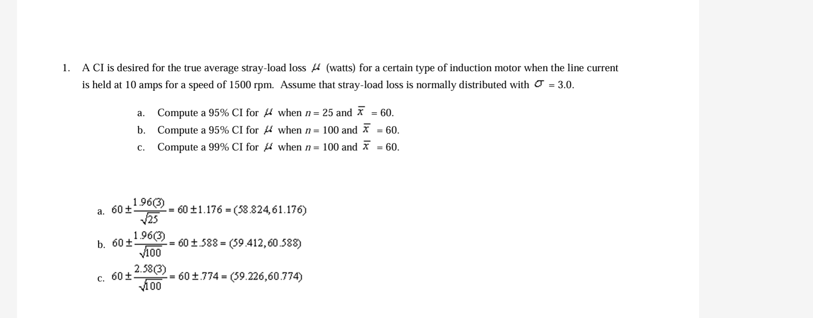

The formula for the 95% CI for the population mean (mu) with a sample size (n) is:
Lower limit = x(bar) - (1.96 * σ / sqrt(n))

Upper limit = x̄ + (1.96 * σ / sqrt(n))

Given that: x̄ = 58.3 (sample mean) σ = 3.0 (population standard deviation) n = 100 (sample size)

Substituting these values into the formula, we get:

Lower limit = 58.3 - (1.96 * 3.0 / sqrt(100)) 
Lower limit = 58.3 - 0.588 Lower limit 
= 57.71

Therefore, the lower limit of the 95% confidence interval for the true average stray-load loss (μ) is 57.71.

It's important to note that this calculation assumes that the stray-load loss is normally distributed, and that the sample size is large enough to be representative of the population. In practice, you may want to perform additional checks to ensure that these assumptions hold true for your specific use case.

solution: 57.71

python solution:
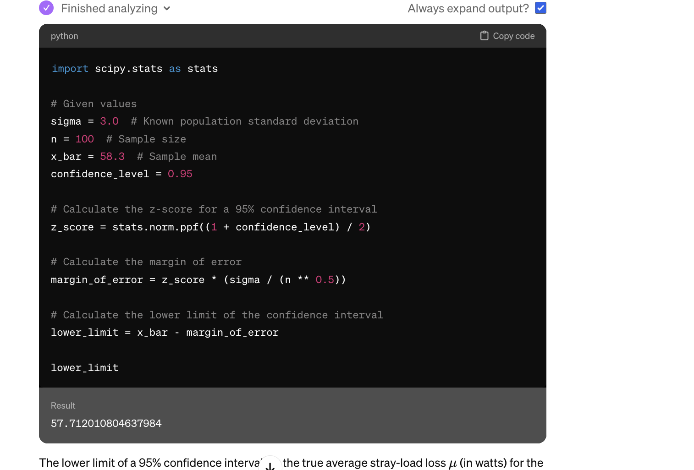


2. A CI is desired for the true average stray-load loss mu (watts) for a certain type of induction motor when the line current is held at 10 amps for a speed of 1500 rpm. Assume that stray-load loss is normally distributed with sigma = 3.0. Compute the lower limit of a 95% CI for mu when n = 25 and x_bar = 58.3.

work:

python code
```python3
# Updated sample size
n = 25  # New sample size

# Recalculate the margin of error with the new sample size
margin_of_error = z_score * (sigma / (n ** 0.5))
(this is the same as the formula seen in book. REmember ** 5 is square root. and the numerator is z score * sigma)

# Calculate the lower limit of the confidence interval with the new sample size
lower_limit = x_bar - margin_of_error
return lower_limit
```

answer: 57.12

3. A CI is desired for the true average stray-load loss mu (watts) for a certain type of induction motor when the line current is held at 10 amps for a speed of 1500 rpm. Assume that stray-load loss is normally distributed with sigma = 3.0. Compute the lower limit of a 99% CI for m when n = 100 and x_bar = 58.3.

work:
```python3
# Updated confidence level for 99% CI
confidence_level = 0.99

# Calculate the z-score for a 99% confidence interval
z_score_99 = stats.norm.ppf((1 + confidence_level) / 2)

# Calculate the margin of error for the 99% CI
margin_of_error_99 = z_score_99 * (sigma / (n ** 0.5))

# Calculate the lower limit of the 99% confidence interval
lower_limit_99 = x_bar - margin_of_error_99

lower_limit_99
```

by hand work:
```
58.3 - (2.576 * 3.0 / sqrt(100))
```

is that right?


answer: 57.52


4. A CI is desired for the true average stray-load loss mu (watts) for a certain type of induction motor when the line current is held at 10 amps for a speed of 1500 rpm. Assume that stray-load loss is normally distributed with sigma = 3.0. Compute the upper limit of an 82% CI for m when n = 100 and x_bar = 58.3.


work: 58.3 + (0.915* 3.0 / sqrt(100))


answer: 58.57

5. On the basis of extensive tests, the yield point of a particular type of mild steel-reinforcing bar is known to be normally distributed with sigma = 100. The composition of bars has been slightly modified, but the modification is not believed to have affected either the normality or the value of sigma. Assuming this to be the case, if a sample of 25 modified bars resulted in a sample average yield point of 8439 lb, compute the lower limit of a 90% CI for the true average yield point of the modified bar.

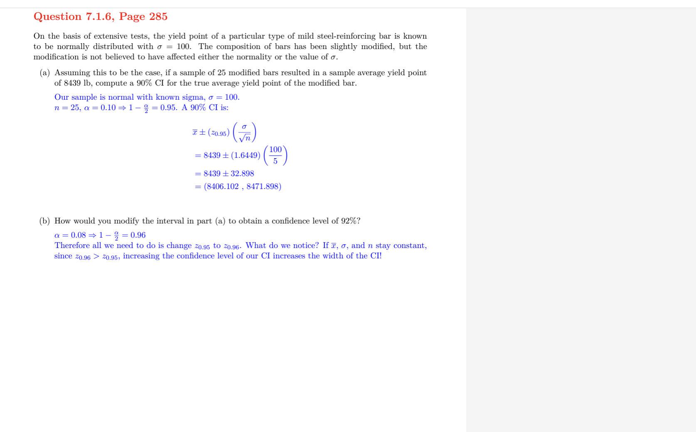

6. A sample of 56 research cotton samples resulted in a sample average percentage elongation of 8.17 and a sample standard deviation of 1.42 (An Apparent Relation Between the Spiral Angle Phi, the Percent Elongation E^1, and the Dimensions of the Cotton Fiber,' Textile Research J., 1978: 407-410). Calculate the upper limit of a 95% large-sample CI for the true average percentage elongation mu. What assumptions are you making about the distribution of percentage elongation?


work: 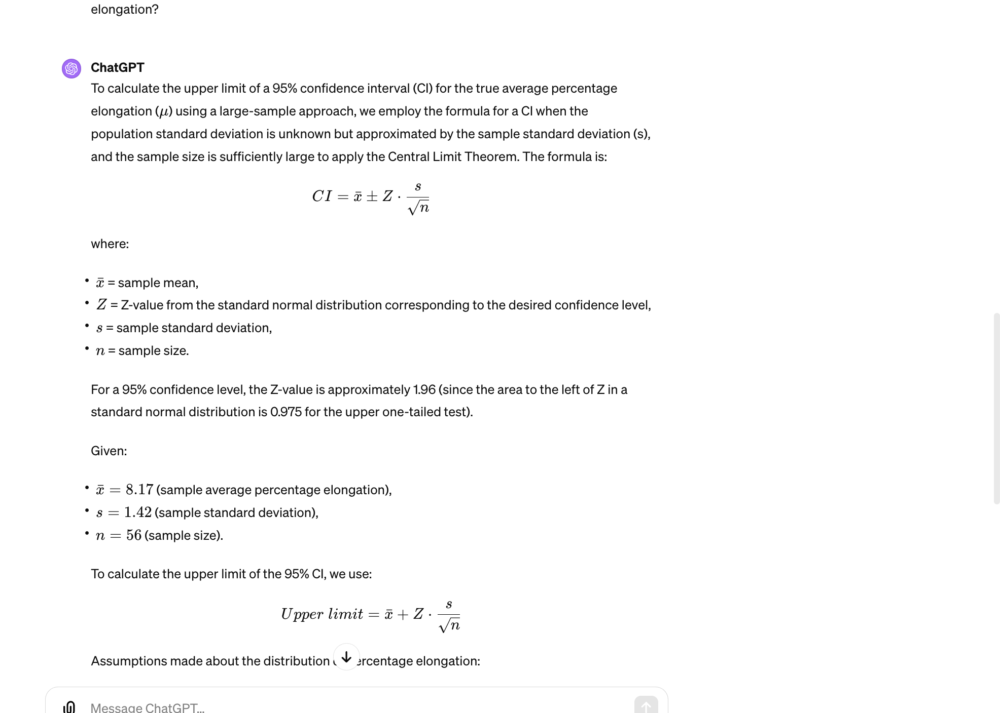
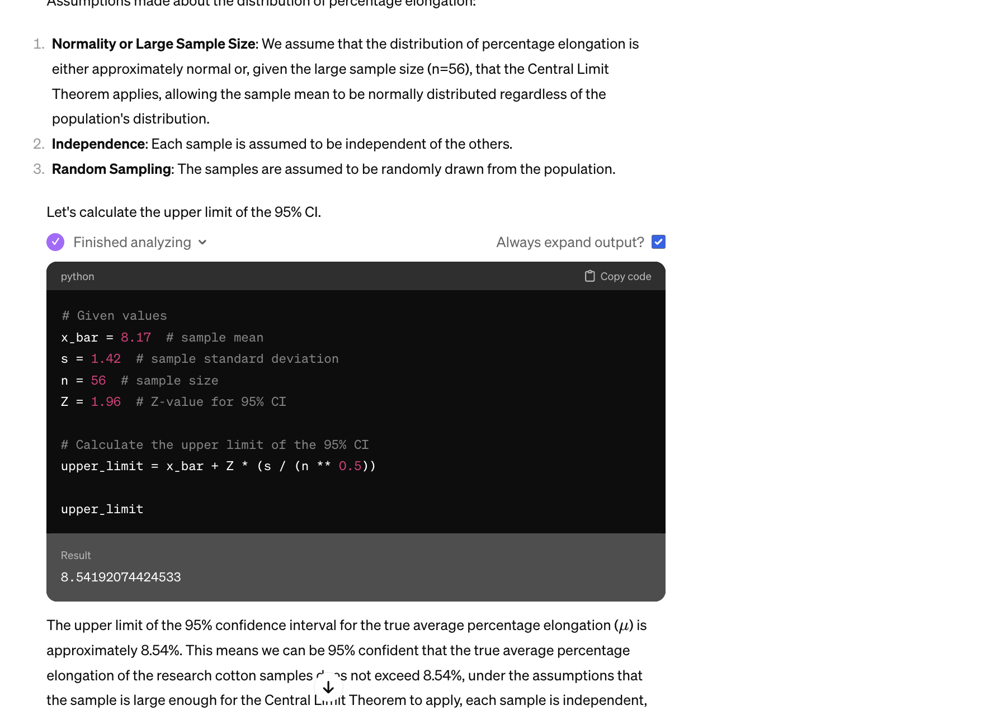

answer: 8.542

7. "Determine the value of the following quantity: t( 0.1, 15)"


For t(0.1, 15), we want to find the t-score that leaves an area of 0.1 to its right with 15 degrees of freedom. In other words, we're looking for a t-score that corresponds to the 90th percentile of the t-distribution because 1 - 0.1 = 0.9, and the table typically provides the area to the left (not right) of the t-score.

The table you have is probably set up to provide values for the area to the left of the t-score, not to the right. So if you're looking for an area of 0.1 to the right, you need to look for 0.9 to the left. You need to find the value that corresponds to the 0.9 area in the table for 15 degrees of freedom.

answer: 1.341

8. "Determine the value of the following quantity: t(0.005, 40)"

9. "Determine the value of the following quantity: t(0.05, 15)"

use the t table in the back or a calculator

10. "Determine the t critical value for a two-sided confidence interval in each of the following situations: Confidence level = 99%, n = 5"

The degrees of freedom (df) are calculated as n - 1. So for n = 5, df = 5 - 1 = 4.

For a two-tailed confidence interval at the 99% confidence level, the area in the tails beyond the t critical values is 1% (100% - 99%), but this is split between the two tails of the distribution. Therefore, each tail will have 0.5% (0.005) of the area.

Typically, t-distribution tables list the area in the one tail to the left of the t critical value. For a two-tailed test, we look up the area to the left that includes the middle 99% plus the lower half of the 1% not included in the interval, which totals 99.5% (0.995).

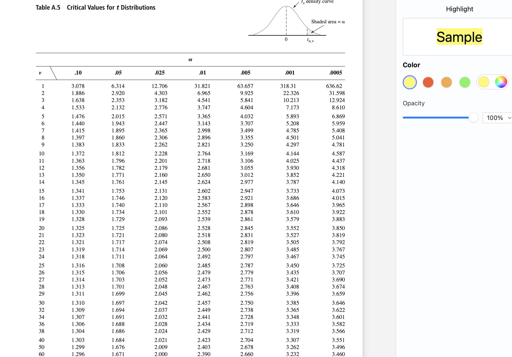

For a 99% confidence level with 4 degrees of freedom (which corresponds to your sample size of n=5), you would look at the column labeled 0.005 α=0.005 for a two-tailed test, since 

α/2 = 0.005 represents the area in each tail (0.5% in each tail for a total of 1% outside the confidence interval).

The value of 4.604 that you've found in the row for 4 degrees of freedom and the  α = 0.005 column is indeed the correct t critical value for this scenario. So when constructing a 99% confidence interval for a sample with n=5, you would use the t critical value of 4.604.

answer: 4.604

11. "Determine the t critical value for a two-sided confidence interval in each of the following situations: Confidence level = 99%, n = 38"
degrees of freedom = n - 1 = 37

using the table, find the value between df = 36 and df = 38


answer: 2.715

12. "Determine the t critical value for a two-sided confidence interval in each of the following situations: Confidence level = 95%, df = 10"

use the table above

answer: 1.372


13. "Determine the value of the following quantity: Chi-Squared(0.1, 25)"

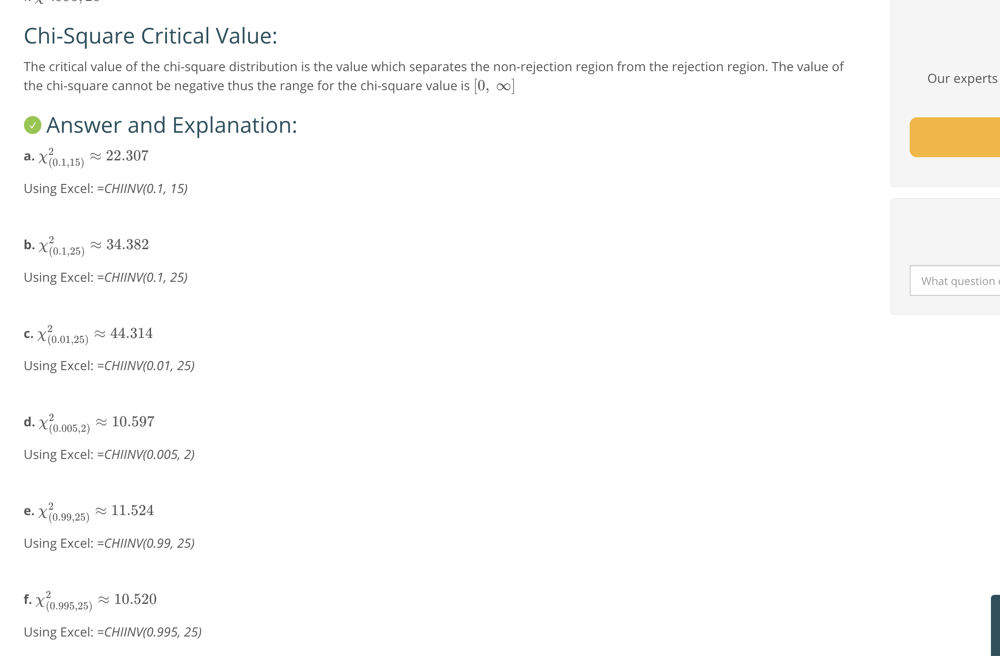

answer: 44.31

14. "Determine the value of the following quantity: Chi-Squared(0.995, 25)"

15. "Determine the value of the following quantity: Chi-Squared(0.005, 25)"

work: https://www.usna.edu/Users/math/hottovy/_files/documents/SM316/SM316_HW7_Solns.pdf

16. The article "Concrete Pressure on Formwork" (Mag. of Concrete Res., 2009: 407-417) gave the following observations on maximum concrete pressure (kN/m^2): (See the table on page 296 exercise #46) Calculate an upper confidence bound with confidence level 95% for the population standard deviation of maximum pressure.


work:
https://www.vaia.com/en-us/textbooks/math/probability-and-statistics-for-engineering-and-sciences-9th/statistical-intervals-based-on-a-single-sample/q46e-the-article-concrete-pressure-on-formwork-mag-of-concre/


so we're estimating the population ci using the sample variance.

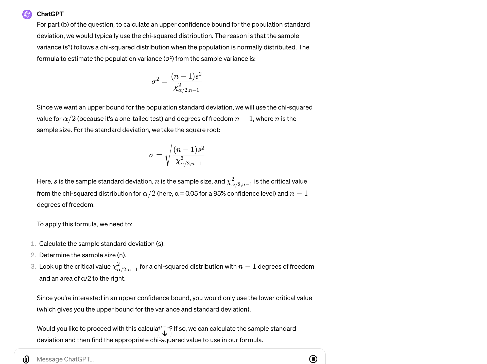
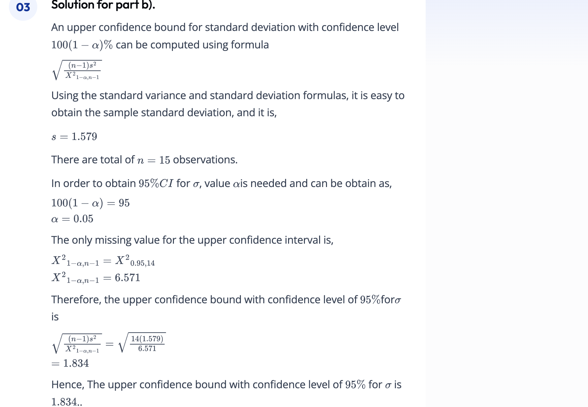


17. A CI is desired for the true average stray-load loss mu (watts) for a certain type of induction motor when the line current is held at 10 amps for a speed of 1500 rpm. Assume that stray-load loss is normally distributed with sigma = 3.0. How large must n be if the width of the 99% interval for mu is to be 1.0?

work:
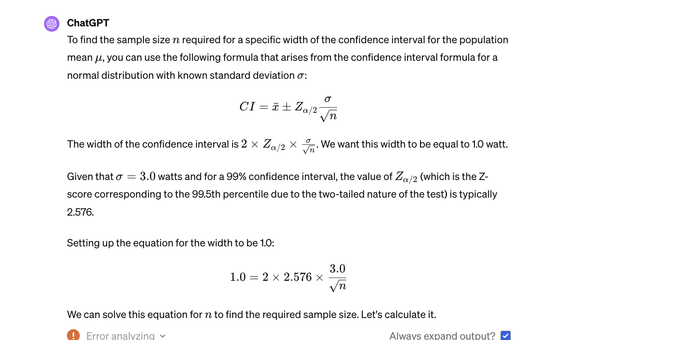
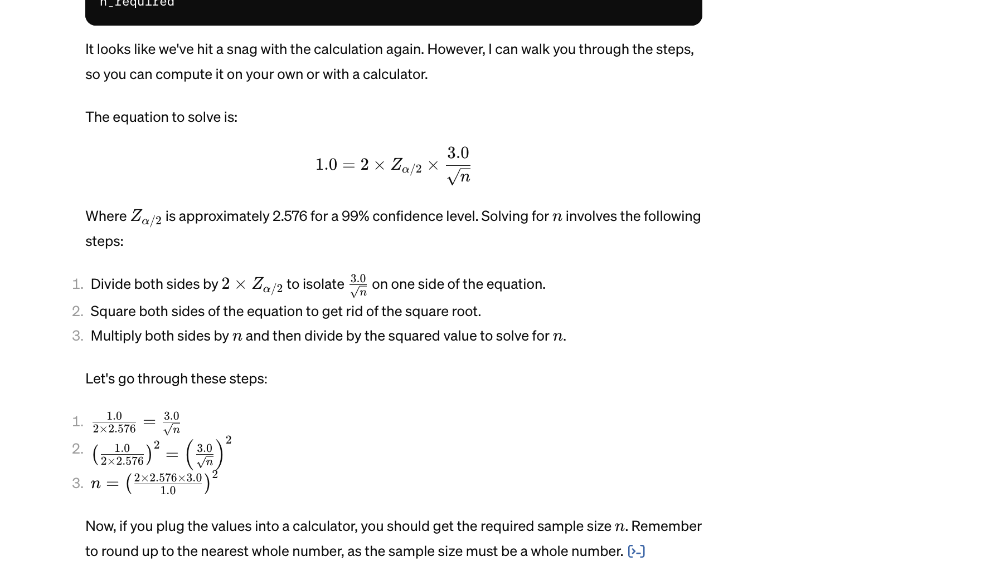


18. A triathlon consisting of swimming, cycling, and running is one of the more strenuous amateur sporting events. The article "Cardiovascular and Thermal Response of Triathlon Performance" (Medicine and Science in Sports and Exercise, 1988: 385-389) reports on a research study involving nine male triathletes. Maximum heart rate (beats/min) was recorded during performance of each of the three events. For swimming, the sample mean and sample standard deviation were 188.0 and 7.2, respectively. Assuming that the heart rate distribution is (approximately) normal, construct a 98% lower CI for true mean heart rate of triathletes while swimming.

work: 
In this case, the sample size is small n = 9. The student t distribution shall be used.

in the back to get the 2.896, we should use t 0.01, and 8 as the degrees of freedom.

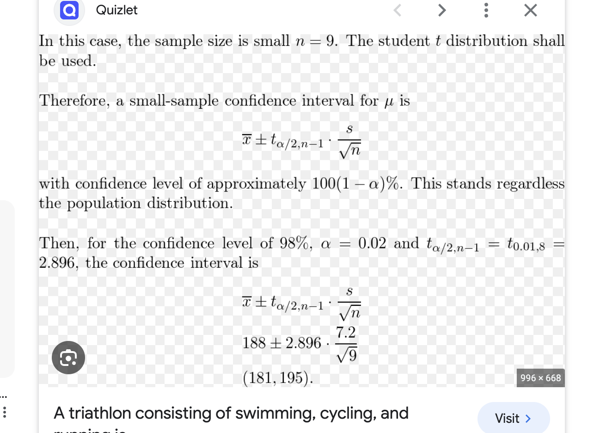

answer: 195
19. "The article 'Ultimate Load Capacities of Expansion Anchor Bolts' (J. of Energy Engr., 1993: 139-158) gave the following summary data on shear strength (kip) for a sample of 3/8-in. anchor bolts: n = 78, x_bar = 4.25, s = 1.30. Calculate a lower confidence bound using a confidence level of 90% for true average shear strength."

Notice that we do not know the distribution of the shear strengths, but we actually don't need to know it.
n = 78 which is quite large, so we can apply the Large-Sample Theory.

use the z table and we get the z score of 1.28
page 283 textbook has an equation.

work:
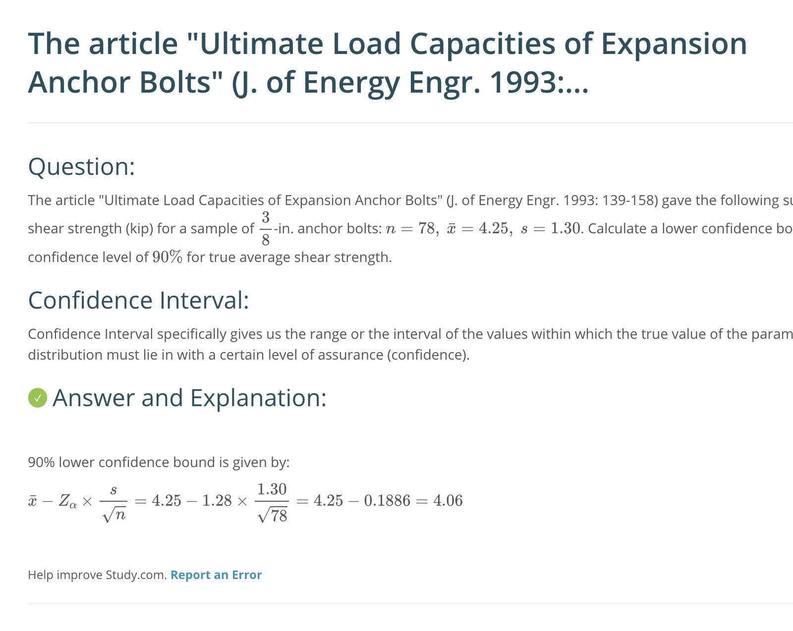
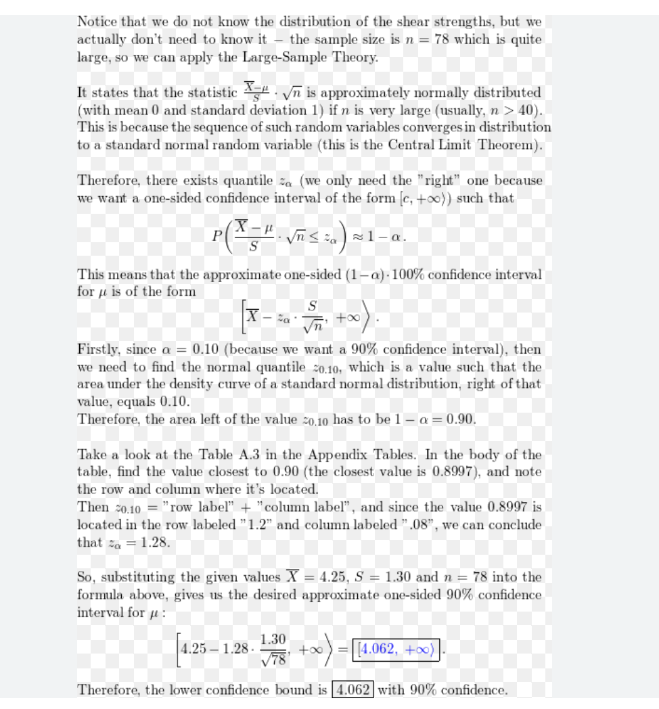

answer: 4.062


20. The article "Concrete Pressure on Formwork" (Mag. of Concrete Res., 2009: 407-417) gave the following observations on maximum concrete pressure (kN/m^2): (See the table on page 296 exercise #46). Mark all statements that are true.

**Group of answer choices**:
Using a normal probability plot, we ascertain that it is plausible that the sample was taken from a normal population distribution.

Using a normal probability plot, we ascertain that it is not plausible that the sample was taken from a normal population distribution.

Using a normal probability plot, we ascertain that it is plausible that the sample was taken from a Weibull population distribution because it is skewed.

Using a normal probability plot, we ascertain that it is plausible that the sample was taken from a Weibull population distribution because it is not skewed.

None of the statements are true.


work: https://www.vaia.com/en-us/textbooks/math/probability-and-statistics-for-engineering-and-sciences-9th/statistical-intervals-based-on-a-single-sample/q46e-the-article-concrete-pressure-on-formwork-mag-of-concre/


