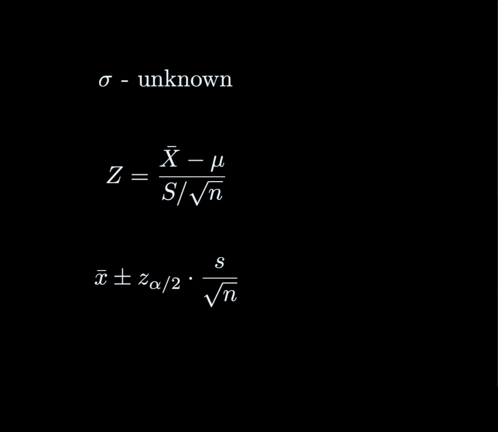
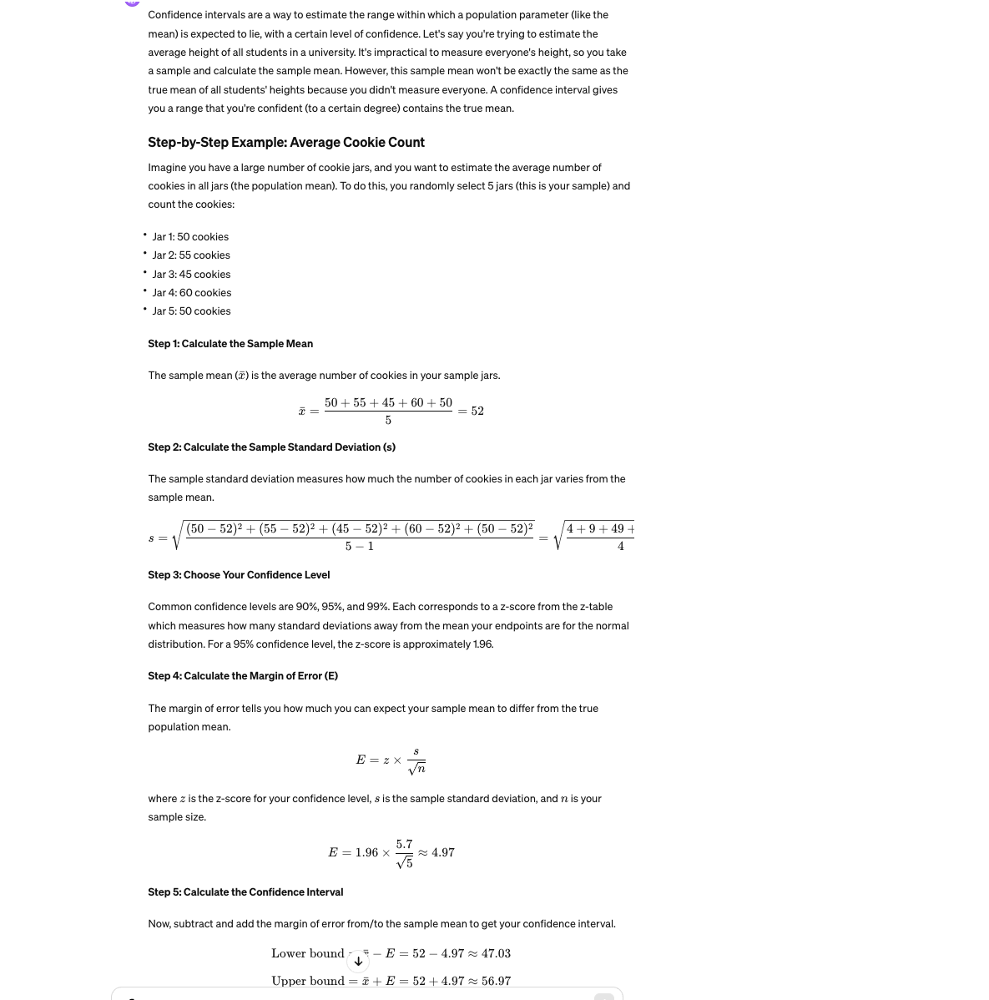
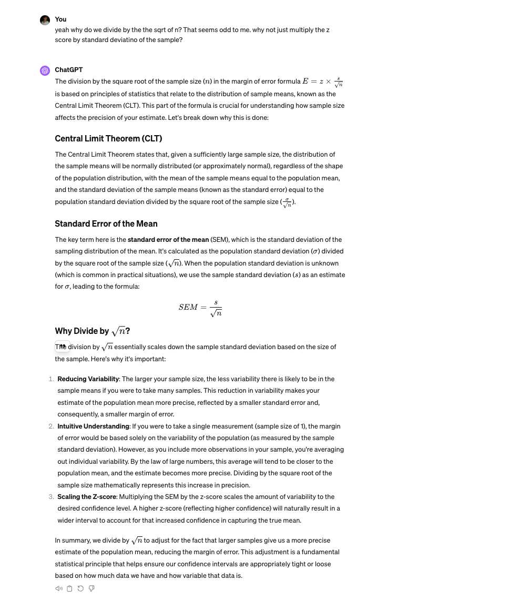
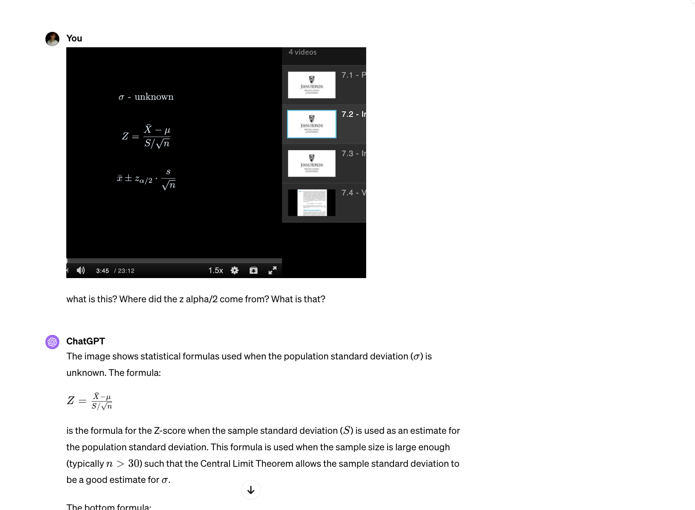
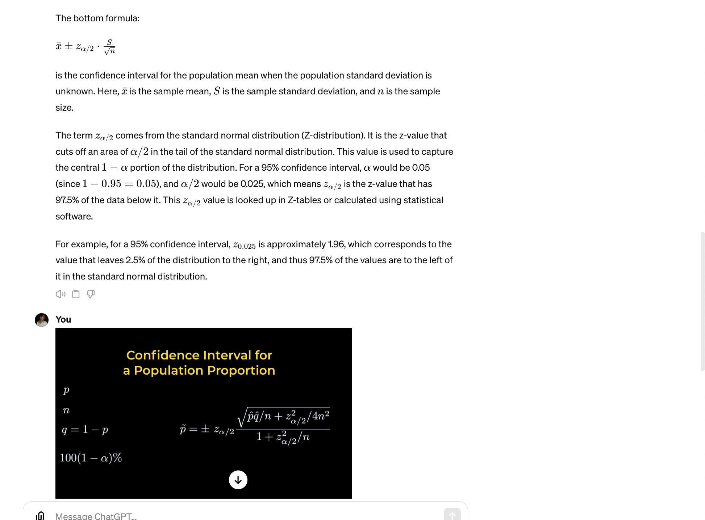
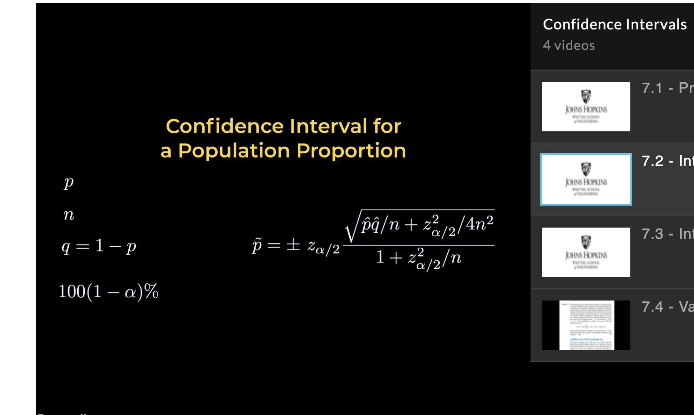
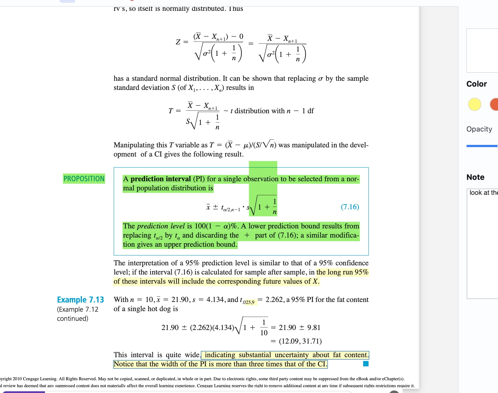

# Topics

- confidence intervals
- standard error

## Formulas

Standard error
When we don't know the population standard deviation, we need to use the sample standard deviation. So we replace the standard deviation with capital S (the sample standard deviation).

If n is sufficiently large, the sigma is replaced with sample standard deviation. n being sufficiently large is a part of the central limit theorem.

- The alpha/2 is because if you want an area of α/2 in the tail of the standard normal distribution. This value is used to capture the central 1−α portion of the distribution. For a 95% confidence interval, α would be 0.05 (since 
`1 − 0.95 = 0.05` and `α/2` would be 0.025, which means α/2 is the z-value that has 97.5% of the data below it.

The Z middle equation is the standard normal distribution when we don't know the standard deviation of the population. We're also using the sample average too.

## Confiidence intervals

By multiplying the z-score by the standard deviation of the sample divided by the square root of the sample size, you're adjusting the amount of standard deviation (variability) in relation to how large your sample is, and then scaling that variability to your desired level of confidence.

This margin of error is then used to create a range around your sample mean. Adding and subtracting the margin of error to/from the sample mean gives you the confidence interval, which is the range in which you're confident the true population mean lies.

This is all because we don't know the standard deviation of the popuolation so we use the std deviation of the sample.

## Confidence interval for population proportion
p is the proportion and q is (1-p).
confidence interval is around the proportion p.

a formula for constructing a confidence interval for a population proportion.

q^  is 1 minus the sample proportion (

zα/2 is the z-score that corresponds to the desired confidence level (found from the standard normal distribution).
n is the sample size.

## T distribution

When n is large, we use the z calculation at the very top. If n is not large, we use the t student distribution. It's the same formula but the reference distribution is flatter and wider when n is small. the scores are different. Why flatter? less precise when n is smaller. rule of thumb is n > 30 for normal inference. if less use t distribution.

## prediction interval

