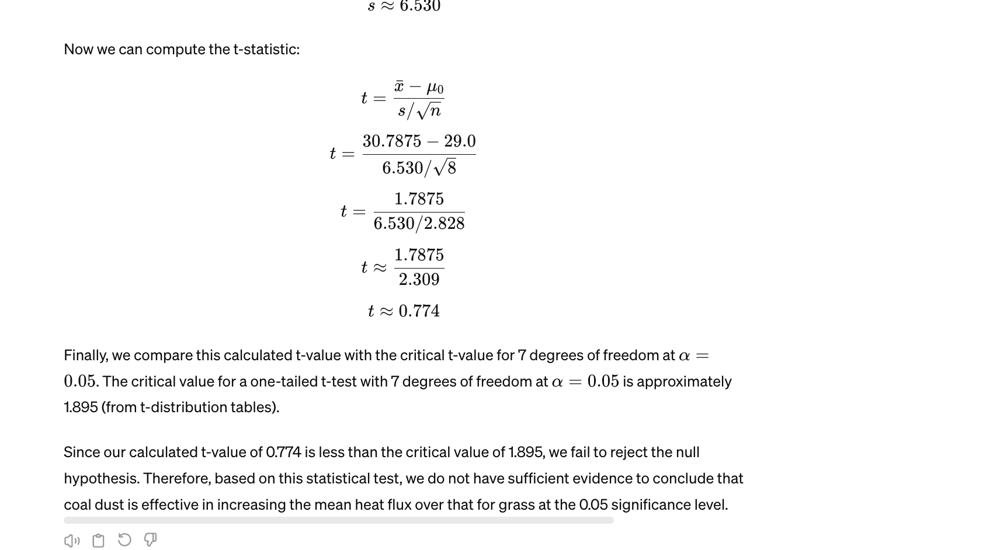

# problem set

1.  A sample of 12 radon detectors of a certain type was selected, and each was exposed to 100 pCi/L of radon. The resulting readings were as follows:
105.6      90.9    91.2      96.9      96.5    91.3
100.1    105.0    99.6    107.7    103.3    92.4

Suppose that prior to the experiment, a value of s = 7.5 had been assumed. How many determinations would then have been appropriate to obtain b = .10 for the alternative m = 95?

I think alpha is 0.05 too

assumed s = 7.5
alpha = 1.96
beta = 1.28

n = (((1.96 + 1.28) * 7.5)/5)^2
n = (4.86)^2 = 23.6196

Since the sample size cannot be fractional, we would round up to the nearest whole number.

answer = 24

2. "With domestic sources of building supplies running low several years ago, roughly 60,000 homes were built with imported Chinese drywall. According to the article ""Report Links Chinese Drywall to Home Problems"" (New York Times, Nov. 24, 2009), federal investigators identified a strong association between chemicals in the drywall and electrical problems, and there is also strong evidence of respiratory difficulties due to the emission of hydrogen sulfide gas. An extensive examination of 51 homes found that 41 had such problems. Suppose these 51 were randomly sampled from the population of all homes having Chinese dry-wall. If it is actually the case that 80% of all such homes have problems, how likely is it that the test of hypotheses using alpha = 0.01, would not conclude that more than 50% do?"

work:
So what's going on here is that we're getting the actual value p and then seeing how likely that the cutoff value p_hat would be IF the real mean was 0.80. The cutoff value p_hat is found by denormalizing which is what we do in the image. We find cp and that's why we do p (null) + z * sqrt(p(1-p) / n) (all using the null hypothesisp)... we're finding the cutoff value here that is needed because we're trying to find Beta (the probiablity that we fail to reject the null given that the null is false). that gives you the cutoff mean boundary of the hypothesis given a cutoff z score of 2.33 (that's determined by the alpha). We're converting z scores to a cutoff mean. And then using that cutoff mean to find the probability of us falling below it GIVEN a different mean. We find that the cutoff mean is -2.44 z scores away from the true or alternative mean making it very unlikely to happen. At 0.80 we would fail to reject the null very infrequently.

answer = 0.73

3. "A random sample of soil specimens was obtained, and the amount of organic matter (%) in the soil was determined for each specimen, resulting in the data found on page 338 exercise #58 (from ""Engineering Properties of Soil,"" Soil Science, 1998: 93-102). The values of the sample mean, sample standard deviation, and (estimated) standard error of the mean are 2.481, 1.616, and 0.295, respectively. Does this data suggest that the true average percentage of organic matter in such soil is something other than 3%? Carry out a test of the appropriate hypotheses at significance level .10 by first determining the P-value. Which of the following statements are true given your analysis."
Group of answer choices

- [] The P-value is 0.0632.
- [] "With n = 30, and assuming normality, we should only consider using the Z test."
- [] The hypotheses for this problem are H_0: mu < 3 vs. H_a: mu > 3.
- [] None of these statements are true.

p value is higher. Look it up in the t table, find the p value for the one-sided test, then double it. Think about why you'd double it. It should make sense.

answer: None

4. "The article ""Orchard Floor Management Utilizing Soil- Applied Coal Dust for Frost Protection"" (Agri. and Forest Meteorology, 1988: 71-82) reports the following values (see page 342 exercise 68) for soil heat flux of eight plots covered with coal dust. The mean soil heat flux for plots covered only with grass is 29.0. Assuming that the heat-flux distribution is approximately normal, does the data suggest that the coal dust is effective in increasing the mean heat flux over that for grass? Test the appropriate hypotheses using alpha = .05 and state which of the following statements are true."
Group of answer choices

- [ ] The t statistic computes to 0.7742.
- [ ] Reject H_0. The data indicates the mean heat-flux for pots covered with coal dust is greater than for pots covered with grass.
- [ ] Fail to reject H_0. The data does not indicates the mean heat-flux for pots covered with coal dust is greater than for pots covered with grass.
- [ ] The rejection region is when t >= 1.895
- [ ] "The sample statndard deviation, s, not needed in this calculation."

work:

x_bar = 30.7875
s of sample = 6.53
t stat = 0.774

5. "With domestic sources of building supplies running low several years ago, roughly 60,000 homes were built with imported Chinese drywall. According to the article ""Report Links Chinese Drywall to Home Problems"" (New York Times, Nov. 24, 2009), federal investigators identified a strong association between chemicals in the drywall and electrical problems, and there is also strong evidence of respiratory difficulties due to the emission of hydrogen sulfide gas. An extensive examination of 51 homes found that 41 had such problems. Suppose these 51 were randomly sampled from the population of all homes having Chinese dry-wall. Does the data provide strong evidence for concluding that more than 50% of all homes with Chinese drywall have electrical/environmental problems? Carry out a test of hypotheses using alpha = .01. Which of the following statements are true. "
Group of answer choices

work:

- [ ] We reject H_0 at the 0.01 significance level.
- [ ] The test statistic is greater than the critical value.
- [ ] We fail to reject H_0 at the 0.01 significance level.
- [ ] The test statistic is less than the critical value.
- [ ] We have compelling evidence that more than 50% of all households with Chinese drywall have electrical/environmental problems.

6. "Have you ever been frustrated because you could not get a container of some sort to release the last bit of its contents? The article ""Shake, Rattle, and Squeeze: How Much Is Left in That Container?"" (Consumer Reports, May 2009: 8) reported on an investigation of this issue for various consumer products. Suppose five 6.0 oz tubes of toothpaste of a particular brand are randomly selected and squeezed until no more toothpaste will come out. Then each tube is cut open and the amount remaining is weighed, resulting in the following data (consistent with what the cited article reported): .53, .65, .46, .50, .37. Does it appear that the true average amount left is less than 10% of the advertised net contents? Carry out a test of the appropriate hypotheses using a significance level of 0.05 and 0.01. Which of the following statements are true."
Group of answer choices

The test statistic should be a t statistic because of the amunt of data present.

We fail to reject H_0 at the 0.05 significance level and reject at the 0.01 significance level.

"There is evidence that the true average content is less than 10% of the original 6 oz. at the the 5% significance level, but not at the 1% significance level."

"There is evidence that the true average content is more than 10% of the original 6 oz. at the the 5% significance level, but not at the 1% significance level."

7. "One method for straightening wire before coiling it to make a spring is called ""roller straightening."" The article ""The Effect of Roller and Spinner Wire Straightening on Coiling Performance and Wire Properties"" (Springs, 1987: 27-28) reports on the tensile properties of wire. Suppose a sample of 16 wires is selected and each is tested to determine tensile strength (N/mm^2). The resulting sample mean and standard deviation are 2160 and 30, respectively. The mean tensile strength for springs made using spinner straightening is 2150 N/mm^2. What hypotheses should be tested to determine whether the mean tensile strength for the roller method exceeds 2150?"
Group of answer choices

None of these

H_0: mu = 2150 vs. H_a: mu < 2150

H_0: mu > 2150 vs. H_a: mu < 2150

H_0: mu < 2150 vs. H_a: mu > 2150

8.A sample of 12 radon detectors of a certain type was selected, and each was exposed to 100 pCi/L of radon. The resulting readings were as follows:
105.6      90.9    91.2      96.9      96.5    91.3
100.1    105.0    99.6    107.7    103.3    92.4

a.    Does this data suggest that the population mean reading under these conditions differs from 100?

Data: x_bar = 98.38, σ = 6.11, n = 12 
Small sample so....use a test statistic (Student t pdf): 
t = (x_bar − µ0)/ s/√n =
(98.38−100) / 6.11/√12 = 
−0.918 

Since t > tα/2;n−1 = 
−t1−0.025;11 =    // the 11 is the degrees of freedom
−2.201, 
then H0 is NOT REJECTED because -.0.918 is > -2.201

Answer:
- [x] The rejection region for the test is any value equal to or greater than 2.201 or any value less than or equal to -2.201.
- [x] Fail to reject H_0. The data does not indicate that these readings differ significantly fromm 100.

9. "One method for straightening wire before coiling it to make a spring is called ""roller straightening."" The article ""The Effect of Roller and Spinner Wire Straightening on Coiling Performance and Wire Properties"" (Springs, 1987: 27-28) reports on the tensile properties of wire. Suppose a sample of 16 wires is selected and each is tested to determine tensile strength (N/mm^2). The resulting sample mean and standard deviation are 2160 and 30, respectively. Assuming that the tensile strength distribution is approximately normal, what test statistic would you use to test the hypotheses of whether the mean tensile strength for the roller method exceeds 2150."
Group of answer choices

t=(xbar-2150)/(s/sqrt(n))

t=(xbar+2150)/(s/sqrt(n-1))

t=(xbar-2150)/(sigma^2/sqrt(n))

t=(xbar-2150)/(sigma^2)

10. "One method for straightening wire before coiling it to make a spring is called ""roller straightening."" The article ""The Effect of Roller and Spinner Wire Straightening on Coiling Performance and Wire Properties"" (Springs, 1987: 27-28) reports on the tensile properties of wire. Suppose a sample of 16 wires is selected and each is tested to determine tensile strength (N/mm^2). The resulting sample mean and standard deviation are 2160 and 30, respectively. For a level .05 test, what conclusion would you reach?"
Group of answer choices

- [ ] H_0 cannot be rejected. The mean tensile strength for springs made using roller straightening is not significantly greater than 2150 N/nm^2.
- [ ] None of these conclusions are correct.
- [ ] H_0 should be rejected. The mean tensile strength for springs made using roller straightening is significantly greater than 2150 N/nm^2.
- [ ] H_0 cannot be rejected. The mean tensile strength for springs made using roller straightening is significantly greater than 2150 N/nm^2.
- [ ] H_0 should be rejected. The mean tensile strength for springs made using roller straightening is not significantly greater than 2150 N/nm^2.

11. "With domestic sources of building supplies running low several years ago, roughly 60,000 homes were built with imported Chinese drywall. According to the article ""Report Links Chinese Drywall to Home Problems"" (New York Times, Nov. 24, 2009), federal investigators identified a strong association between chemicals in the drywall and electrical problems, and there is also strong evidence of respiratory difficulties due to the emission of hydrogen sulfide gas. An extensive examination of 51 homes found that 41 had such problems. Suppose these 51 were randomly sampled from the population of all homes having Chinese dry-wall. Calculate a lower confidence bound using a confidence level of 99% for the percentage of all such homes that have electrical/environmental problems."

12. "Scientists think that robots will play a crucial role in factories in the next several decades. Suppose that in an experiment to determine whether the use of robots to weave computer cables is feasible, a robot was used to assemble 500 cables. The cables were examined and there were 15 defectives. If human assemblers have a defect rate of .035 (3.5%), does this data support the hypothesis that the proportion of defectives is lower for robots than for humans? Use a .01 significance level and mark all statement that are true."
Group of answer choices

- [ ] We should be testing H_0: p = 0.035 vs. H_a: p < 0.035.
- [ ] The rejection region for the z test in this case should be z <= 2.33.
- [ ] H_0 is rejected. Robots have not demonstrated their superiiority.
- [ ] H_0 is not rejected. Robots have not demonstrated their superiiority.
- [ ] Only one of the statements is true.

13. "It is known that roughly 2/3 of all human beings have a dominant right foot or eye. Is there also right-sided dominance in kissing behavior? The article ""Human Behavior: Adult Persistence of Head-Turning Asymmetry"" (Nature, 2003: 771) reported that in a random sample of 124 kissing couples, both people in 80 of the couples tended to lean more to the right than to the left. Does the result of the experiment suggest that the 2/3 figure is implausible for kissing behavior? State and test the appropriate hypotheses and mark all statements that are true."
Group of answer choices

- [ ] We would fail to reject H_0 at the 0.10 significance level.
- [ ] We wish to test H_0: p > 2/3 vs. H_a: p < 2/3.
- [ ] Our test statistic yeilds a critical value of -0.51
- [ ] There is no statistically significant eveidence to suggest that the p = 2/3 figure is implausible for right-leaning kissing behavior.
- [ ] There is statistically significant eveidence to suggest that the p = 2/3 figure is implausible for right-leaning kissing behavior.

14. "Pairs of P-values and significance levels, alpha, are given. For each pair, state whether the observed P-value would lead to rejection of H_0 at the given significance level. P-value = .084, alpha = .05"
Group of answer choices

- [ ] Do Not Reject
- [ ] Reject
- [ ] Not Enough Information

15. "Pairs of P-values and significance levels, alpha, are given. For each pair, state whether the observed P-value would lead to rejection of H_0 at the given significance level. P-value = .003, alpha = .001 "
Group of answer choices

- [ ] Reject
- [ ] Do Not Reject
- [ ] Not Enough Information

16. "Pairs of P-values and significance levels, alpha, are given. For each pair, state whether the observed P-value would lead to rejection of H_0 at the given significance level. P-value = .084, alpha = .10 "
Group of answer choices

- [ ] Reject
- [ ] Do Not Reject
- [ ] Not Enough Information

17. Newly purchased tires of a certain type are supposed to be filled to a pressure of 30lb/in^2. Let mu denote the true average pressure. Find the P-value associated with z = 2.10 for testing H_0: mu = 30 versus H_a: mu is not = 30.

18. Newly purchased tires of a certain type are supposed to be filled to a pressure of 30lb/in^2. Let mu denote the true average pressure. Find the P-value associated with z = -1.75 for testing H_0: mu = 30 versus H_a: mu is not = 30.

19. "Reconsider the paint-drying situation of Example 8.2 (on page 305), in which drying time for a test specimen is normally distributed with sigma = 9. The hypotheses H_0: mu = 75 versus H_a: mu < 75 are to be tested using a random sample of n = 25 observations. If a level .01 test is used with n = 100, what is the probability of a type I error when mu = 76?"
given that alpha = 0.01
n = 100

(none of that matters above)

Type I error is the probability to reject the null hypothesis, when the null hypothesis is true.
The type I error when u = 76 is 0 because the null hypothesis is not true and thus the event of a type I error cannot occur.

answer = 0

20. "Reconsider the paint-drying situation of Example 8.2 (on page 305), in which drying time for a test specimen is normally distributed with sigma = 9. The hypotheses H_0: mu = 75 versus H_a: mu < 75 are to be tested using a random sample of n = 25 observations. What is alpha for the test procedure that rejects H_0 when z <= -2.88?"

I think it's just what is teh alpha or percentage that corresponds to z = -2.88 and I think it's 0.001

answer = 0.001
