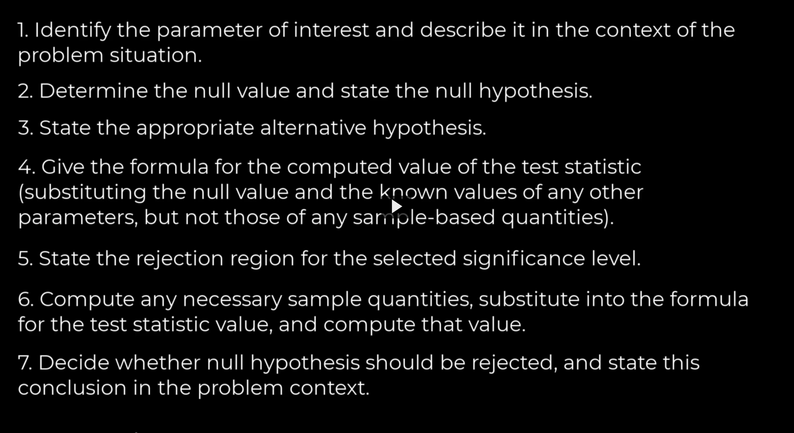

# Topics
- hypothesis testing

# Quick Review

This margin of error is calculated as the product of the critical value from the Z-distribution (which corresponds to the desired confidence level) and the standard error of the sample statistic, which is the sample standard deviation divided by the square root of the sample size (s/sqrt(n)).

The formula in the spreadsheet (Z critical value * s/sqrt(n)) is the calculation of the margin of error. The critical value depends on the desired confidence level — for a 95% confidence interval, the Z critical value is approximately ±1.96. In your case, the critical value seems to be ±1.6448536, which is the critical value for a 90% confidence interval (this doesn't align with the 95% confidence level mentioned). The margin of error is used to calculate the upper and lower bounds of the confidence interval around the sample mean.

# Notes

this is how you have evidence that something is true
data that falls outside the assumption might make us question our assumptions

That's the point of a hypothesis test
- we make an assumption
- we test it against data
- either we reject or accept the assumption/hypothesis

We call the hypothesis a null hypothesis denoted by `H_0`

## Errors
In social sciences, we set an arbitrary value of p is 0.05. So 1/20 times we make a mistake in our assumption and we reject. 

**Type 1 Error** - probability that we reject the assumption given that it's true. 
- The tail probability happens sometimes 1/20 and we conclude the assumption is bad even thoug the data actually did come from the distribution. Also called a false negative

**Type 2 Error** - probability that we don't reject the assumption but it's false. The assumption is actually different but the data did not fall outside of 0.05 of the tails.

If you get a observed value that only has a probability of 0.01 and since 0.01 < 0.05 threshold, then you can say the data didn't come from the distribution assumed, so you can reject the null hypothesis.

If the data is within range, you cannot prove that null hypothesis is correct. All we can do is say the probability is unlikely that the null is true or that the null is false. Can't prove or disprove.
- the 0.05 is arbitrary btw. It's the cutoff to reject.

## Steps to hypothesis test

- define the reference distribution first. proportions? or a large number dist and use a normal dist or a binomial dist? What's the formula?
- general rejection region. Eh, who cares
- do the test

## range of rejection
a prof says it's an outdated way to think about statistics. but he does pay attention to the magnitude of the p value. If it's super small, that does tell you something about the unlikelihood of the null hypothesis.
- don't really use rejection regions anymore in the world.... it's outdated.

## Power and type 1 and type 2

In the context of hypothesis testing, \( \beta \) represents the probability of a Type II error, which occurs when the null hypothesis \( H_0 \) is not rejected even though it is false. \( \beta \) is also related to the power of the test, which is \( 1 - \beta \); the power is the probability of correctly rejecting the null hypothesis when it is false.

The value of \( \beta \) is chosen by the researcher based on how likely they are willing to accept a Type II error. A common choice is \( \beta = 0.2 \), meaning there is a 20% chance of not detecting a difference when one actually exists, and therefore, the power of the test would be 80%.

The z-scores \( z_{\alpha} \) and \( z_{\beta} \) come from the standard normal distribution. \( z_{\alpha} \) is the critical value that corresponds to the significance level \( \alpha \) of the test. For a one-tailed test with \( \alpha = 0.05 \), \( z_{\alpha} \) would be approximately 1.645, which means that the area to the right of \( z_{\alpha} \) under the standard normal curve is 5% of the total area.

The formula for calculating the sample size \( n \) involves both \( z_{\alpha} \) and \( z_{\beta} \) because:

- \( z_{\alpha} \): Adjusts for the risk of Type I error (rejecting a true null hypothesis). It defines the cutoff point on the standard normal distribution beyond which we reject \( H_0 \).
- \( z_{\beta} \): Adjusts for the risk of Type II error. It represents the z-score for the chosen \( \beta \) on the standard normal distribution. For example, if \( \beta = 0.2 \), then \( z_{\beta} \) would be the z-score such that the area to the left of \( z_{\beta} \) under the standard normal curve is 80% (since the power is 80%).

We add \( z_{\alpha} \) to \( z_{\beta} \) in the formula for \( n \) because we are considering the standard normal distribution centered around \( \mu_0 \) under \( H_0 \) (the null hypothesis) and shifting this distribution to where we believe the true mean \( \mu' \) under \( H_a \) (the alternative hypothesis) lies. This shift must account for both types of errors we want to control:

1. Not rejecting \( H_0 \) when we should (Type II error, controlled by \( \beta \)).
2. Rejecting \( H_0 \) when we shouldn't (Type I error, controlled by \( \alpha \)).

To calculate the sample size needed to satisfy both error rates, we use the shifted distributions and their corresponding z-scores to determine how many samples are needed to detect a difference between \( \mu_0 \) and \( \mu' \) with sufficient statistical power. The larger the sample size, the more likely we are to detect a true effect if it exists, and the lower our chances of making a Type II error.

The actual sample size formula, assuming \( \sigma \) is known and the data is normally distributed, can be derived using the properties of the standard normal distribution. The z-scores represent how many standard deviations away from the mean a certain percentile lies. In hypothesis testing, the sample size \( n \) is calculated so that the test statistic will fall in the rejection region with probability \( 1 - \beta \) when \( \mu = \mu' \). This ensures that the test has enough power to detect a difference of practical importance to the researcher.

## Why do we shift?

The formulas you're referring to are for calculating the probability of a Type II error, which is denoted as \( \beta(\mu') \), under different alternative hypotheses in the context of hypothesis testing.

**For the alternative hypothesis \( H_a: \mu > \mu_0 \)**, the formula:
\[ \beta(\mu') = \Phi\left( z_{\alpha} + \frac{\mu_0 - \mu'}{\sigma/\sqrt{n}} \right) \]

**For the alternative hypothesis \( H_a: \mu < \mu_0 \)**, the formula:
\[ \beta(\mu') = 1 - \Phi\left( -z_{\alpha} + \frac{\mu_0 - \mu'}{\sigma/\sqrt{n}} \right) \]

Here's why the shift by \( z_{\alpha} \) makes sense:

When conducting a hypothesis test, you first define a null hypothesis \( H_0 \) (e.g., \( \mu = \mu_0 \)) and an alternative hypothesis \( H_a \). You also set a significance level \( \alpha \), which determines the critical value \( z_{\alpha} \). This critical value is a threshold in the standard normal distribution beyond which you would reject \( H_0 \). If your test statistic falls beyond this critical value, you conclude that there's enough evidence against \( H_0 \).

However, when you're calculating the probability of a Type II error, you're concerned with the scenario where \( H_0 \) is false, and the true mean is actually \( \mu' \). In such cases, the distribution of your test statistic is centered around \( \mu' \), not \( \mu_0 \).

The shift by z_alpha is necessary to adjust the location of this new center. It aligns the distribution so you can find the probability that a test statistic calculated under u' still falls within the non-rejection region of H_0. Essentially, you're finding the probability that the test statistic is less extreme than the critical value, which would lead to a failure to reject H_0, despite it being false—hence, a Type II error.

**The term \( \frac{\mu_0 - \mu'}{\sigma/\sqrt{n}} \)** represents the standardized effect size, that is, how many standard errors the true mean \( \mu' \) is away from the hypothesized mean \( \mu_0 \). It is used to recenter the distribution from \( \mu_0 \) to \( \mu' \) in standard deviation units.

The function \( \Phi \) is the cumulative distribution function (CDF) for the standard normal distribution. It gives the probability that a standard normal random variable is less than or equal to a certain value.

In summary, the shift by \( z_{\alpha} \) aligns the distribution to the new center (if the true mean is \( \mu' \)) so that you can calculate the probability of the test statistic not exceeding the critical value (which would lead to a failure to reject \( H_0 \)). This is crucial in calculating the sample size needed to achieve the desired power \( 1 - \beta \) against a specific alternative \( \mu' \).

## Finding the n to get the right power

The power of the test is the probability that the test correctly rejects a false null hypothesis, which is 1−β, where  β is the probability of a Type II error when the true mean is μ 

Certainly, let's work through an example. Suppose you are conducting a one-tailed upper test and you want to calculate:

1. The critical value for Type I error (α), which we'll set at 5% (0.05).
2. The critical value for Type II error (β), which we'll set at 20% (0.20), meaning you want a test with 80% power.
3. The required sample size \( n \) to achieve this power.

### Part 1: Calculating the critical value for Type I error (\( z_{\alpha} \))
For α = 0.05 in a one-tailed test, the critical value \( z_{\alpha} \) is the z-score that cuts off the upper 5% of the standard normal distribution. You can find this value from the z-table or use a statistical software. It is approximately 1.645.

### Part 2: Calculating the critical value for Type II error (\( z_{\beta} \))
For β = 0.20, the critical value \( z_{\beta} \) is the z-score corresponding to the point where 80% of the distribution lies to its left, which is also the point that cuts off the upper 20% of the standard normal distribution. The z-score for β is approximately 0.84.

### Part 3: Calculating the required sample size \( n \)
Let's assume you have the following additional information:
- The population standard deviation \( \sigma \) is known to be 10 units.
- The minimum effect size you wish to detect is a difference in means of 5 units (\( \mu' - \mu_0 = 5 \)).

To calculate the required sample size \( n \) for an upper-tailed test, you would use the formula:

\[ n = \left( \frac{\sigma(z_{\alpha} + z_{\beta})}{\mu' - \mu_0} \right)^2 \]

Substituting the values into the formula:

\[ n = \left( \frac{10(1.645 + 0.84)}{5} \right)^2 \]

\[ n = \left( \frac{10(2.485)}{5} \right)^2 \]

\[ n = \left( \frac{24.85}{5} \right)^2 \]

\[ n = \left( 4.97 \right)^2 \]

\[ n = 24.7009 \]

Since you can't have a fraction of a participant, you would round up to the next whole number. Therefore, you would need a sample size of 25 to have an 80% chance (power) of detecting a true mean difference of 5 units when the significance level is set at 5%.

This sample size calculation is based on a known population standard deviation and assumes that the sample mean is normally distributed, which is a common assumption when sample sizes are large (central limit theorem). In practice, if the population standard deviation is unknown, you would estimate it using a sample standard deviation and potentially use a t-distribution, especially if the sample size is small.

## When do you use Beta? Why are there 2 z scores in the n equation?

On the other hand, z_beta is used when you are planning your study and trying to determine the necessary sample size to achieve a certain power. It's not used for calculating the test statistic from your sample data; rather, it's used in the context of power analysis before you collect your data. This is because 
zβ is associated with the probability of a Type II error, which is related to the test's ability to detect an actual effect (power = 1−β).

In typical hypothesis testing scenarios where you are analyzing data to make inferences about the population, zα is the value you often see being used to determine the rejection region for the null hypothesis. zβ is less commonly seen because it is more about the design of the experiment or study (i.e., deciding on the sample size in advance to ensure adequate power), and is therefore part of the study planning process rather than the data analysis process.

## When do you use n or n - 1?

Yes, Jeff, that's correct. Let's break it down:

1. **Sample Standard Deviation Calculation (with \( n - 1 \)):**
   - When calculating the sample standard deviation, we divide by \( n - 1 \) instead of \( n \). This adjustment, known as Bessel's correction, corrects the bias in the estimation of the population variance and standard deviation.
   - Essentially, using \( n - 1 \) gives a better estimate of the population standard deviation, especially for small sample sizes, because it compensates for the fact that the sample mean is not a perfect estimate of the population mean.

2. **T-Statistic Calculation (with \( n \)):**
   - The t-statistic is calculated using the sample size \( n \) in the denominator of the standard error formula, which is \( s / \sqrt{n} \). This reflects how the variability of the sample mean decreases with an increasing sample size. The larger the sample, the more reliable the sample mean as an estimate of the population mean.

3. **Degrees of Freedom (with \( n - 1 \)):**
   - In the context of t-tests, the degrees of freedom (df) are typically \( n - 1 \), where \( n \) is the sample size. This concept relates to the number of values in the final calculation of a statistic that are free to vary. The degrees of freedom are used to determine the critical value of the t-distribution for hypothesis testing.

So, in summary:
- You use \( n - 1 \) when calculating the sample standard deviation to provide an unbiased estimate of the population standard deviation.
- The t-statistic itself is calculated using \( n \) as part of the standard error formula to reflect sample size in the variability of the sample mean.
- The degrees of freedom for the test are \( n - 1 \), which influences the shape of the t-distribution used to determine the critical value for hypothesis testing.
