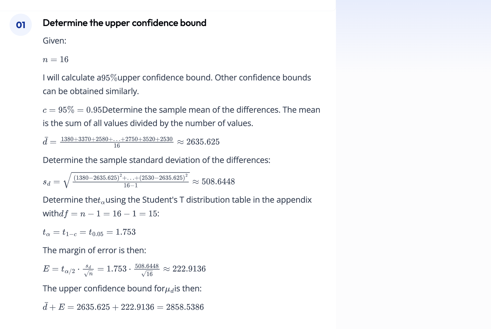
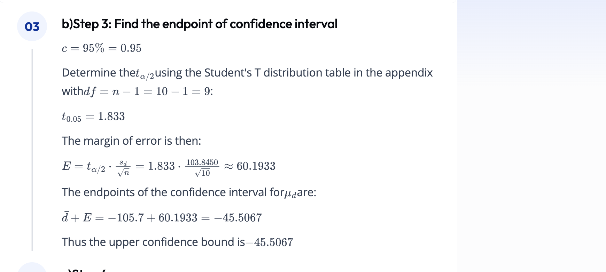
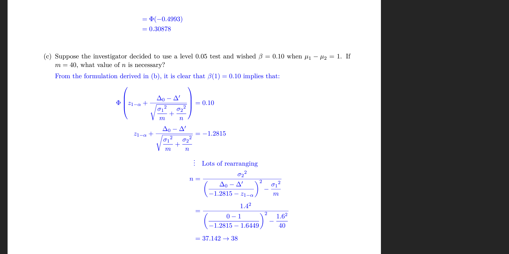
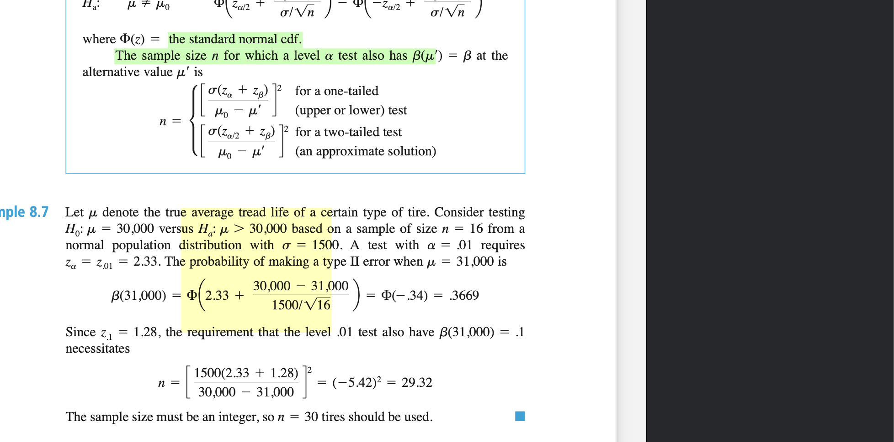
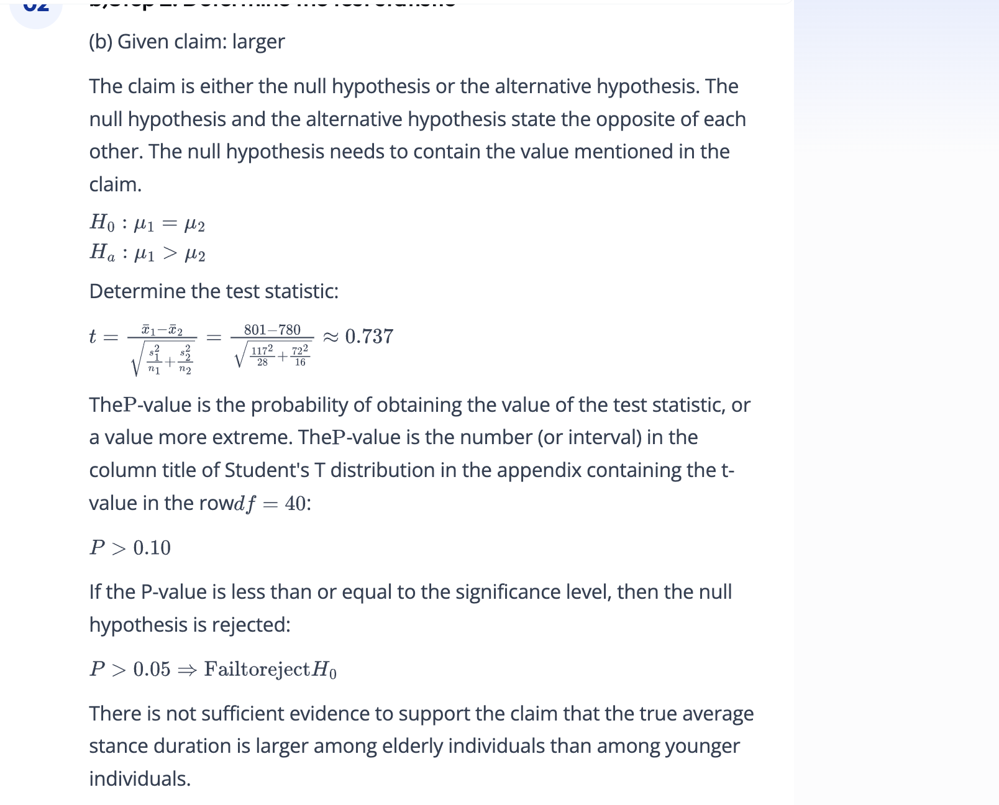

1. The data on the modulus of elasticity obtained 1 minute after loading in a certain configuration. The cited article also gave the values of modulus of elasticity obtained 4 weeks after loading for the same lumber specimens. (See the table on page 374 exercise 46) Calculate and interpret an upper 95% confidence bound for the true average difference between 1-minute modulus and 4-week modulus; first check the plausibility of any necessary assumptions.

work:

answer:
2858.54

2. "Lactation promotes a temporary loss of bone mass to provide adequate amounts of calcium for milk production. The paper ""Bone Mass Is Recovered from Lactation to Post-weaning in Adolescent Mothers with Low Calcium Intakes"" (Amer. J. of Clinical Nutr., 2004: 1322-1326) gave the following data on total body bone mineral content (TBBMC) (g) for a sample both during lactation (L) and in the post-weaning period (P). (See the table on page 373 exercise 40) Calculate an upper confidence bound using a 95% confidence level for the true average difference between TBBMC during post-weaning and during lactation."

work:
first calculate the delta (difference). We're testing the differences between the two samples.

degrees of freedom = 10 - 1 = 9. It's used in calculating the standard error.

The p looked up in the t table for -2.457 and deg freedom of 9 gives us a p of 0.01 < p < 0.025

So we reject the null

Let's calculate the confidence interval

I think the t_alpha/2 is wrong.
For a one-sided test, the critical value should be for the confidence interval corresponding to the level of significance `α`. If you're looking at a 95% confidence interval and the alternative hypothesis is
 < −25, you would use the critical t-value that captures the lower 5% (if it's a lower-tail test) of the t-distribution.

answer:
-45.5067

3. The degenerative disease osteoarthritis most frequently affects weight-bearing joints such as the knee. The article 'Evidence of Mechanical Load Redistribution at the Knee Joint in the Elderly when Ascending Stairs and Ramps' (Annals of Biomed. Engr., 2008: 467-476) presented the following summary data on stance duration (ms) for samples of both older and younger adults. (See the table on page 364 exercise 32) Assume that both stance duration distributions are normal. Calculate a 99% CI upper limit for true average stance duration among elderly individuals.

work:

t test so we need to find the df and the sample sizes are different so there's a formula for this.

Determine the t-value by looking in the row starting with degrees of freedom df = 40

c = 99%

Since we're doing a confidence interval, we need to find the t value that corresponds to 1 - c/2 = t_alpha/2 = 2.704 which has a df of 40.

I did look int hte back, the value is 2.704

answer:
98.09

4. "An experiment to compare the tension bond strength of polymer latex modified mortar (Portland cement mortar to which polymer latex emulsions have been added during mixing) to that of unmodified mortar resulted in x_bar = 18.12 kgf/cm^2 for the modified mortar (m = 40) and y_bar = 16.87 kgf/cm^2 for the unmodified mortar (n = 32). Let mu_1 and mu_2 be the true average tension bond strengths for the modified and unmodified mortars, respectively. Assume the bond strength distribution are both normal. Suppose the investigator decided to use a level .05 test and wished beta = .10 when mu_1 - mu_2 = 1. If m = 40, what value of n is necessary?"

work:

variables we need:
new mean, old mean, z score for alpha, z score for beta (type 2), std_Dev of population, sample size.

Steps:

a. Calculate the value of z_1−α using the standard normal distribution (for a one-sided test at α = 0.05, this is typically 1.645).
b. Calculate the value of β using the standard normal distribution (for
β = 0.10, this is typically 1.28155).
c. Use these z-values along with the given standard deviations and the difference you wish to detect to solve for n. 
d. The final result after solving the equation will give you the required sample size n for the unmodified mortar to achieve the desired power.

book has a different formula for n:

answer:
38

5. Let mu_1 and mu_2 denote true average densities for two different types of brick. Assuming normality of the two density distributions, test H_0: mu_1 - mu_2 = 0 versus H_a: mu_1 - mu_2 does not = 0 using the following data: m = 6 , x_bar = 22.73, s_1 = .164, n = 5, y_bar = 21.95, and s_2 = .240. Select the statements that are true.
Group of answer choices

- [ ] We reject H0 and conclude there is a difference in the densities of the two bricks.
- [ ] The p -value is 0.01.
- [ ] We reject H0 and conclude there is not a difference in the densities of the two bricks.
- [ ] The t statistic is equal to 6.17
- [ ] We do not reject the null hypothesis.

6. An experiment to compare the tension bond strength of polymer latex modified mortar (Portland cement mortar to which polymer latex emulsions have been added during mixing) to that of unmodified mortar resulted in x_bar = 18.12 kgf/cm^2 for the modified mortar (m = 40) and y_bar = 16.87 kgf/cm^2 for the unmodified mortar (n = 32). Let mu_1 and mu_2 be the true average tension bond strengths for the modified and unmodified mortars, respectively. Assume that the bond strength distributions are both normal. Assuming that sigma_1.6 and sigma_2 = 1.4, test H_0: mu_1 - mu_2 = 0 versus H_a: mu_1 - mu_2 > 0 at level .01. Compute the probability of a type II error for the test of when mu_1 - mu_2 = 1.

work:

answer:

7. "The accompanying table gives summary data on cube compressive strength (N/mm^2) for concrete specimens made with a pulverized fuel-ash mix (""A Study of Twenty-Five- Year-Old Pulverized Fuel Ash Concrete Used in Foundation Structures,"" Proc. Inst. Civ. Engrs., Mar. 1985: 149-165): (see the table on page 356 exercise 12) Calculate a 99% upper CI for the difference between true average 7-day strength and true average 28-day strength."

work:

answer:

8. een Court is a juvenile diversion program designed to circumvent the formal processing of first-time juvenile offenders within the juvenile justice system. The article 'An Experimental Evaluation of Teen Courts' (J. of Experimental Criminology, 2008: 137-163) reported on a study in which offenders were randomly assigned either to Teen Court or to the traditional Department of Juvenile Services method of processing. Of the 56 TC individuals, 18 subsequently recidivated (look it up!) during the 18-month follow-up period, whereas 12 of the 51 DJS individuals did so. Does the data suggest that the true proportion of TC individuals who recidivate during the specified follow-up period differs from the proportion of DJS individuals who do so? State and test the relevant hypotheses by obtaining a P-value and then using a significance level of .10. Select the statements that are true.

Group of answer choices

- [ ] The p-value evaluates to 0.518
- [ ] The p-value evaluates to 0.227
- [ ] The test statistic evaluates to 3.5.
- [ ] The test statistic evaluates to 1.2.
- [ ] None of the statements are true

9. Tensile-strength tests were carried out on two different grades of wire rod ('Fluidized Bed Patenting of Wire Rods,' Wire J., June 1977: 56-61), resulting in the accompanying data.(see the table on page 355 exercise 8) Does the data provide compelling evidence for concluding that true average strength for the 1078 grade exceeds that for the 1064 grade by more than 10 kg/mm^2? Test the appropriate hypotheses using the P-value approach. Select the statements that are true.
Group of answer choices

- [ ] We reject H0.
- [ ] We fail to reject H0.
- [ ] The test statistic evaluates to 28.57.
- [ ] This is a lower-tailed test.
- [ ] There is very compelling evidence that the mean tensile strength of the 1078 grade exceeds that of the 1064 by more than 10.

10. Suppose mu_1 and mu_2 are true mean stopping distances at 50 mph for cars of a certain type equipped with two different types of braking systems. Use the two-sample t test at significance level .01 to test H_0: mu_1 - mu_2 = -10 versus H_a: mu_1 - mu_2 < -10 for the following data: m = 6, x_bar = 115.7, s_1 = 5.03, n = 6, y_bar = 129.3, and s_2 = 5.38. Select the statements that are true.

Group of answer choices

- [ ] We will reject the null hypothesis if the test statistic is less than -2.821.
- [ ] We will reject the null hypothesis if the test statistic is less than -1.645.
- [ ] We reject H0.
- [ ] The test statistic for this problem computes to 1.76.
- [ ] None of these answers are true.

11. Is someone who switches brands because of a financial inducement less likely to remain loyal than someone who switches without inducement? Let p_1 and p_2 denote the true proportions of switchers to a certain brand with and without inducement, respectively, who subsequently make a repeat purchase. Test H_0: p_1 - p_2 = 0 versus H_a: p_1 - p_2 < 0 using alpha = .01 and the following data: (see table on page 380 exercise 49). Select the statements that are true.
Group of answer choices

- [ ] We reject H0.
- [ ] We fail to reject H0.
- [ ] The calculated test statistic evaluates to 2.87.
- [ ] The calculated test statistic evaluates to 0.87.
- [ ] The calculated test statistic evaluates to 1.87.

12. The degenerative disease osteoarthritis most frequently affects weight-bearing joints such as the knee. The article 'Evidence of Mechanical Load Redistribution at the Knee Joint in the Elderly when Ascending Stairs and Ramps' (Annals of Biomed. Engr., 2008: 467-476) presented the following summary data on stance duration (ms) for samples of both older and younger adults. (See the table on page 364 exercise 32) Assume that both stance duration distributions are normal. Carry out a test of hypotheses at significance level .05 to decide whether true average stance duration is larger among elderly individuals than among younger individuals. Select the statements that are true.

Group of answer choices

- [ ] We fail to reject the null hypothesis.
- [ ] We reject H0
- [ ] The test statistic evaluates to 1.74.
- [ ] The rejection region is any test statistic value greater than 1.68.
- [ ] None of these answers are true.

work: 

answer:
- [x] We fail to reject the null hypothesis.

13. Given the information about the P-value of the F test in each of the following situation: v_1 = 5, v_2 = 10, upper-tailed test, f = 4.75, select the statements that are true.

Group of answer choices

- [ ] The p-value falls between 0.01 and 0.05
- [ ] The p-value falls between 0.001 and 0.005
- [ ] There is not enough information to calculate a p-value.
- [ ] The lower F critical value is 3.33.
- [ ] The upper F critical value is 2.97.

14. It has been estimated that between 1945 and 1971, as many as 2 million children were born to mothers treated with diethylstilbestrol (DES), a non-steroidal estrogen recommended for pregnancy maintenance. The FDA banned this drug in 1971 because research indicated a link with the incidence of cervical cancer. The article 'Effects of Prenatal Exposure to Diethylstilbestrol (DES) on Hemispheric Laterality and Spatial Ability in Human Males' (Hormones and Behavior, 1992: 62-75) discussed a study in which 10 males exposed to DES, and their unexposed brothers, underwent various tests. This is the summary data on the results of a spatial ability test: x_bar = 12.6 (exposed), y_bar = 13.7, and standard error of mean difference = .5. Test at level .05 to see whether exposure is associated with reduced spatial ability by obtaining the P-value. Select the statements that are true.'

Group of answer choices

- [ ] We reject H0.
- [ ] We fail to reject H0.
- [ ] The calculated test statistic evaluates to -2.2.
- [ ] The P-value evaluates to 0.28.
- [ ] The data supports the idea that exposure to DES reduces spatial ability.

15. Lactation promotes a temporary loss of bone mass to provide adequate amounts of calcium for milk production. The paper 'Bone Mass Is Recovered from Lactation to Post-weaning in Adolescent Mothers with Low Calcium Intakes' (Amer. J. of Clinical Nutr., 2004: 1322-1326) gave the following data on total body bone mineral content (TBBMC) (g) for a sample both during lactation (L) and in the post-weaning period (P). (See the table on page 373 exercise 40) Does the data suggest that true average total body bone mineral content during post-weaning exceeds that during lactation by more than 25 g? State and test the appropriate hypotheses using a significance level of .05. [Note: The appropriate normal probability plot shows some curvature but not enough to cast substantial doubt on a normality assumption.] Select the statements that are true.

Group of answer choices

- [x] We reject H0.
- [ ] We fail to reject H0.
- [ ] The test statistic evaluates to 2.46.
- [ ] The CI includes zero.
- [ ] The true average TBBMC during postweaning does not exceed the average during lactation by more than 25 grams.

Same as question 2.

I think the test stat is -2.46

16. The slant shear test is widely accepted for evaluating the bond of resinous repair materials to concrete; it utilizes cylinder specimens made of two identical halves bonded at 30 degrees. The article 'Testing the Bond Between Repair Materials and Concrete Substrate' (ACI Materials J., 1996: 553-558) reported that for 12 specimens prepared using wire-brushing, the sample mean shear strength (N/mm2) and sample standard deviation were 19.20 and 1.58, respectively, whereas for 12 hand-chiseled specimens, the corresponding values were 23.13 and 4.01. Does the true average strength appear to be different for the two methods of surface preparation? State and test the relevant hypotheses using a significance level of .05. Select the statements that are true.

Group of answer choices

- [ ] The test statistic computes to -3.159
- [ ] We reject H0
- [ ] We do not reject H0.
- [ ] There does not appear to be a difference between the two populations.
- [ ] None of these answers are true.
