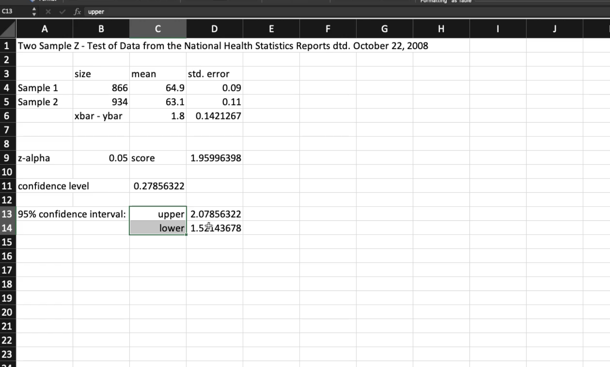

# Topics
- two sample problems

# Notes
This module is all about comparing 2 samples, from 2 different populations. 2 different distributions!

# Example question
And you want to investigate forest deteroriation in acres per year. You want to see if the deterioration is the same, even though several miles apart. We want to see if there is global deterioration of forests

often we might look at **differences** between the two samples. like the difference between 2 sample means.

**magnitude** is an odd concept? It's the sqrt of both of the std errors squared.
**confidence interval** is the z score of the alpha * magnitude.

## Example from vids

true mean height of latina women. The 0.141267 is the magnitude

- paramter of interest is: true mean height is 1 inch higher than for older women.
- null hypothesis: H_0: mu_1 - mu_2 = delta_0
- alternative: H_0: mu_1 - mu_2 > delta_0

We're trying to see if younger women are taller than older women. Those are our 2 samples from 2 different populations. Or are younger women more than 1 inch higher than older women?

The z stat is the difference between the two sample statistics (say the mean) - the delta_ho (we're saying they are only 1 inch apart so we normalize by that). That's the difference between teh 1 inch from delta_0 (what we think they're apart) vs what they're actually apart which gives us the difference over/below 1 inch. Then we divide by the magnitude which is the sqrt of the standard errors squared.

