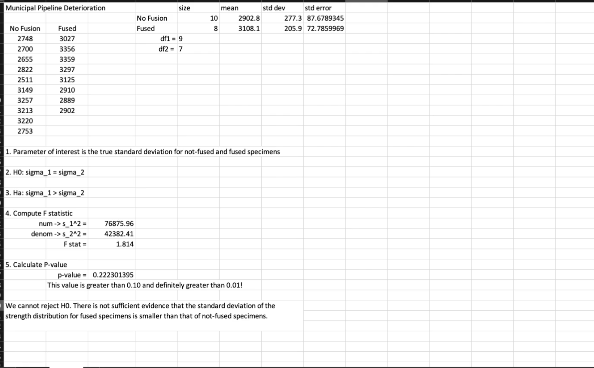

# Topics
- two sample problems

# Review

Why do we add the 2.58?

answer:

# Notes
This module is all about comparing 2 samples, from 2 different populations. 2 different distributions!

The point is to see if the groups are the same or different

# Example question
And you want to investigate forest deteroriation in acres per year. You want to see if the deterioration is the same, even though several miles apart. We want to see if there is global deterioration of forests

often we might look at **differences** between the two samples. like the difference between 2 sample means.

**magnitude** is an odd concept? It's the sqrt of both of the std errors squared.
**confidence interval** is the z score of the alpha * magnitude.

## Example from vids

true mean height of latina women. The 0.141267 is the magnitude

- paramter of interest is: true mean height is 1 inch higher than for older women.
- null hypothesis: H_0: mu_1 - mu_2 = delta_0
- alternative: H_0: mu_1 - mu_2 > delta_0

We're trying to see if younger women are taller than older women. Those are our 2 samples from 2 different populations. Or are younger women more than 1 inch higher than older women?

The z stat is the difference between the two sample statistics (say the mean) - the delta_ho (we're saying they are only 1 inch apart so we normalize by that). That's the difference between teh 1 inch from delta_0 (what we think they're apart) vs what they're actually apart which gives us the difference over/below 1 inch. Then we divide by the magnitude which is the sqrt of the standard errors squared.

## Examples

Often our null hypothesis is that H_0 - H_1 = 0

Notice the T has the magnitude at the bottom. This is used for a 2 sample t- test

reference distribution is t-dist. parameters are the degrees of freedom which is different. It's n_0 + n_1 - 2 because we've used 2 paramters. Odd.

## Next Example

This represents the z-score that cuts off an area of alpha/2 in the tail of the standard normal distribution. For a 95% confidence interval, alpha is 0.05 (which is 100% - 95%), so alpha/2 is 0.025. The z-score that cuts off the top 2.5% of the standard normal distribution is approximately 1.96. This is because the area between -1.96 and 1.96 in the standard normal distribution is approximately 95%, leaving 5% in the tails (2.5% in each tail). The z-score value of 1.96 is correct for a 95% confidence level, as it corresponds to the critical value for a standard normal distribution that leaves 2.5% in each tail. 

# Proportion difference

# Comparing standard deviations between 2 samples

The hypothesis test is about the std deviations, not the mean. Do the samples have the same volatility?

This is an f statistic for some reason. So we use the F distribution which is skewed. It's skewed right. and is greater than 0. parameters are degress of freedom. pairs of values for degrees of freedom. 

Why are we using a f distribution when comparing variances? Why is this coures so shitty. It doesn't even explain the intuition here. God I hate hopkins.

is the fused smaller than the non-fused for the std deviation? Notice degrees of freedom for each sample is 1 less the n size for each sample. We need both to calculate the f statistic.

To compute the F stat, it seems like we need to square both sample std deviations and then divide them by each other.
