1. Consider the accompanying observations on stream flow (1000s of acre-feet) recorded at a station in Colorado for the period April 1 - August 31 over a 31-year span (from an article in the 1974 volume of Water Resources Research). (See table on page 253 exercise #6) An appropriate probability plot supports the use of the lognormal distribution (see Section 4.5) as a reasonable model for stream flow. Estimate the  sigma^2 parameter of the distribution. [Hint: Remember that X has a lognormal distribution with parameters mu and sigma^2 if ln(X) is normally distributed with mean mu and variance sigma^2.] (4 decimal places)

topic: lognormal distribution

The lognormal distribution is a function of normal distribution. If X is the random variable such that lnX follows normal distribution with parameters u and sigma^2, then it is said that X follows lognormal distribution with parameters mu and sigma^2.

work: https://homework.study.com/explanation/consider-the-accompanying-observations-on-stream-flow-1000s-of-acre-feet-recorded-at-a-station-in-colorado-for-the-period-april-1-august-31-over-a-31-year-span-210-07-200-19-330-33-262-09-192-24-1.html

answer: 0.2580

2. "In a random sample of 80 components of a certain type, 12 are found to be defective. Give a point estimate of the proportion of all such components that are not defective. (2 decimal places)"

work: 

To find the point estimate of the proportion of all such components that are not defective, we first need to understand what a point estimate is. A point estimate provides an estimated value of a population parameter based on sample data. In this case, the population parameter we're interested in is the proportion of components that are not defective.

Given that 12 components are found to be defective in a random sample of 80 components, we can calculate the proportion of defective components in the sample and then subtract this proportion from 1 to find the proportion of components that are not defective.

Let's denote:
- \(D\) as the number of defective components,
- \(N\) as the total number of components in the sample,
- \(p\) as the proportion of defective components in the sample, and
- \(p'\) as the proportion of non-defective components in the sample.

The proportion of defective components in the sample, \(p\), is calculated as:
\[p = \frac{D}{N}\]

The proportion of non-defective components in the sample, \(p'\), is then:
\[p' = 1 - p\]

Given \(D = 12\) and \(N = 80\), let's calculate \(p'\).

The point estimate of the proportion of all such components that are not defective is \(0.85\) or \(85\%\), rounded to two decimal places. This means that based on the sample, we estimate that 85% of all such components are not defective.

answer: 0.85

3. "A sample of 20 students who had recently taken elementary statistics yielded the following information on the brand of calculator owned (T = Texas Instruments, H = Hewlett Packard, C = Casio, S = Sharp): (see table on page 253 exercise #2) Of the 10 students who owned a TI calculator, 4 had graphing calculators. Estimate the proportion of students who do not own a TI graphing calculator. (2 decimal places)"

work: 4 students own a graphing calculator out of 20 students who own a calculator. 20-4 = 16 so 16/20 = 0.8 don't own a TI graphing calculator.

answer: 0.8

4. "A sample of 20 students who had recently taken elementary statistics yielded the following information on the brand of calculator owned (T = Texas Instruments, H = Hewlett Packard, C = Casio, S = Sharp): (see table on page 253 exercise #2) Estimate the true proportion of all such students who own a Texas Instruments calculator. (2 decimal places)"

work: 10/20

answer: 0.50

5. A diagnostic test for a certain disease is applied to n individuals known to not have the disease. Let X = the number among the n test results that are positive (indicating presence of the disease, so X is the number of false positives) and p the probability that a disease-free individual’s test result is positive (i.e., p is the true proportion of test results from disease-free individuals that are positive). Assume that only X is available rather than the actual sequence of test results. If n = 20 and x = 3, what is the mle of the probability (1 - p)^5 that none of the next five tests done on disease-free individuals are positive?

work:
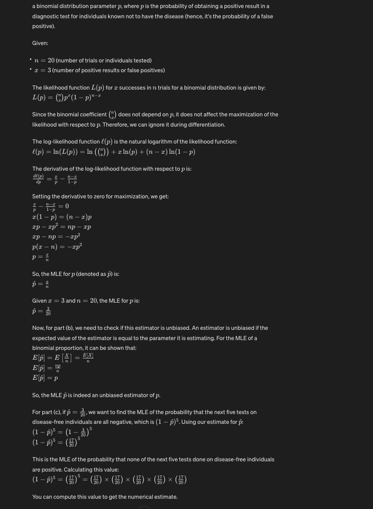
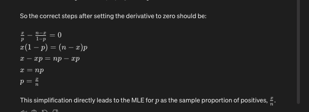

answer: 0.4437

6. "Let X denote the proportion of allotted time that a randomly selected student spends working on a certain aptitude test. Suppose the pdf of X is (see diagram on page 264 exercise #22) Use the method of moments to obtain an estimator of theta, and then compute the estimate for this data."

work: https://www.vaia.com/en-us/textbooks/math/probability-and-statistics-for-engineering-and-sciences-9th/point-estimation/q22e-let-rmx-denote-the-proportion-of-allotted-time-that-a-r/

the idea here is that we're taking the population theta and setting it equal to the sample theta and solving  for unknown parameters like theta which is a variable used to calculate the pdf of the population in the problem.

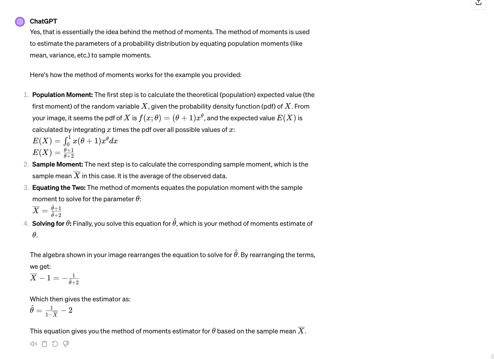

the integration is this:
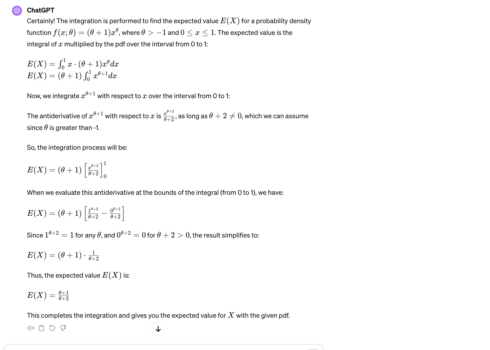

answer: 3

7. A diagnostic test for a certain disease is applied to n individuals known to not have the disease. Let X = the number among the n test results that are positive (indicating presence of the disease, so X is the number of false positives) and p the probability that a disease-free individual’s test result is positive (i.e., p is the true proportion of test results from disease-free individuals that are positive). Assume that only X is available rather than the actual sequence of test results. Derive the maximum likelihood estimator of p, and if n = 20 and x = 3, what is the estimate to 2 decimal places?

work: 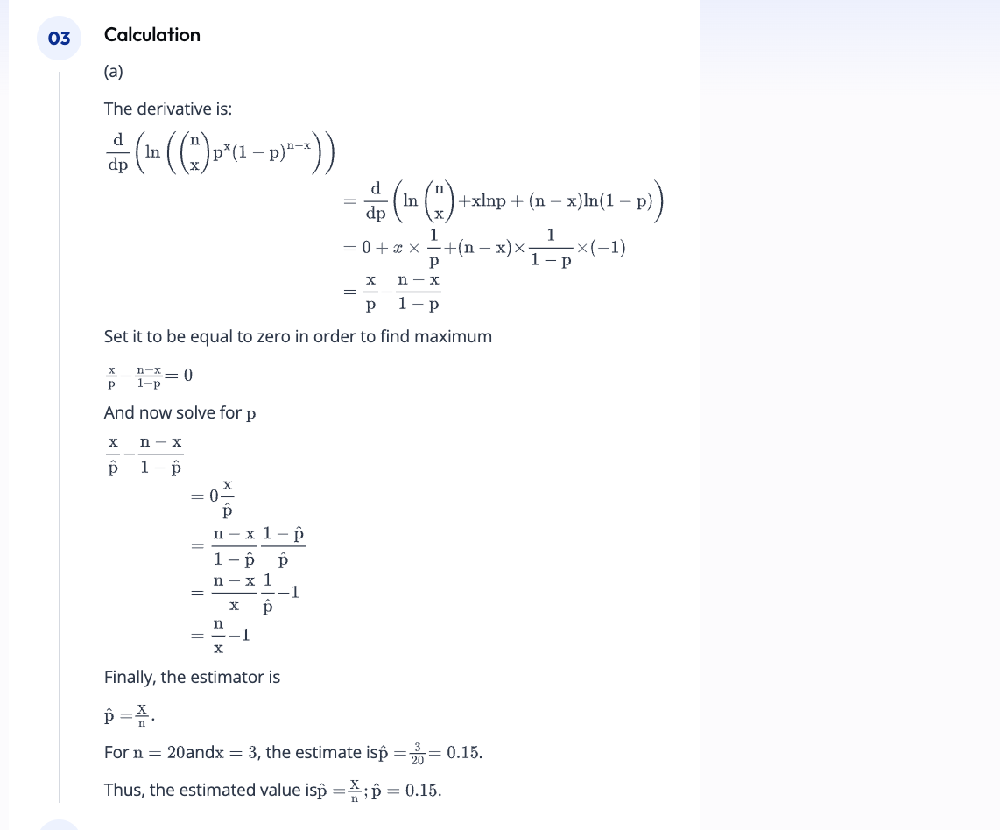

answer: 0.15

8. Manufacture of a certain component requires three different machining operations. Machining time for each operation has a normal distribution, and the three times are independent of one another. The mean values are 15, 30, and 20 min, respectively, and the standard deviations are 1, 2, and 1.5 min, respectively. What is the probability that it takes at most 1 hour of machining time to produce a randomly selected component? Compute your answer to 4 decimal places.

work:https://www.vaia.com/en-us/textbooks/math/probability-and-statistics-for-engineering-and-sciences-9th/joint-probability-distributions-and-random-samples/q62e-the-manufacture-of-a-certain-component-requires-three-d/

answer: 0.0314

9. "The shear strength of each of ten test spot welds is determined, yielding the following data (psi):(found on page 264 exercise #25) Assuming that shear strength is normally distributed, estimate the standard deviation of shear strength using the method of maximum likelihood. (2 decimal places)"

work: https://www.vaia.com/en-us/textbooks/math/probability-and-statistics-for-engineering-and-sciences-9th/point-estimation/q25e-the-shear-strength-of-each-of-ten-test-spot-welds-is-de/

answer: 18.86

10. "The shear strength of each of ten test spot welds is determined, yielding the following data (psi):(found on page 264 exercise #25) Again assuming a normal distribution, estimate the strength value below which 95% of all welds will have their strengths. [Hint: What is the 95th percentile in terms of mu and sigma? Now use the invariance principle.] (2 decimal places)"

work: https://www.vaia.com/en-us/textbooks/math/probability-and-statistics-for-engineering-and-sciences-9th/point-estimation/q25e-the-shear-strength-of-each-of-ten-test-spot-welds-is-de/

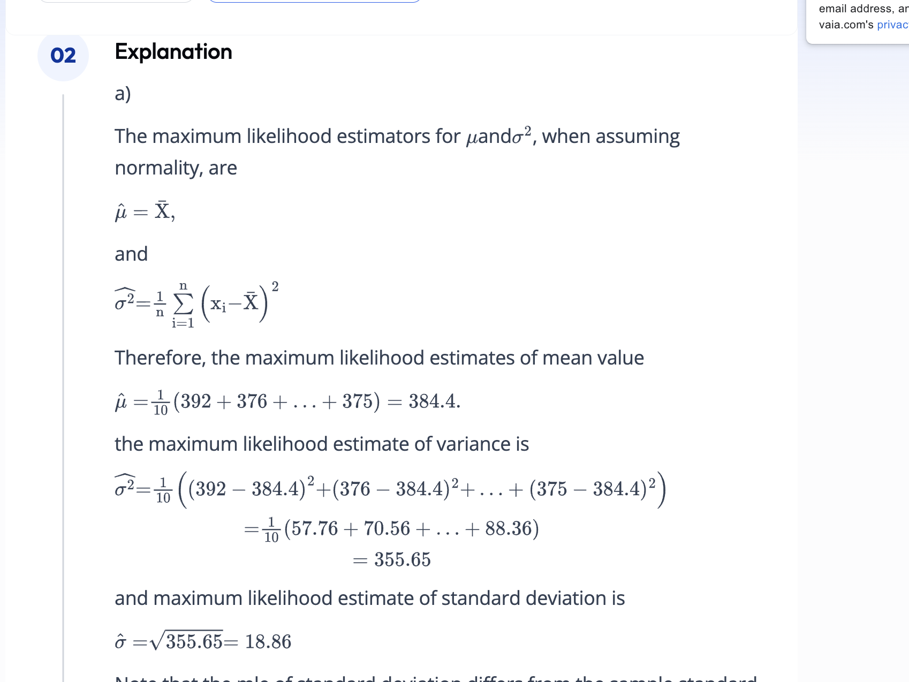
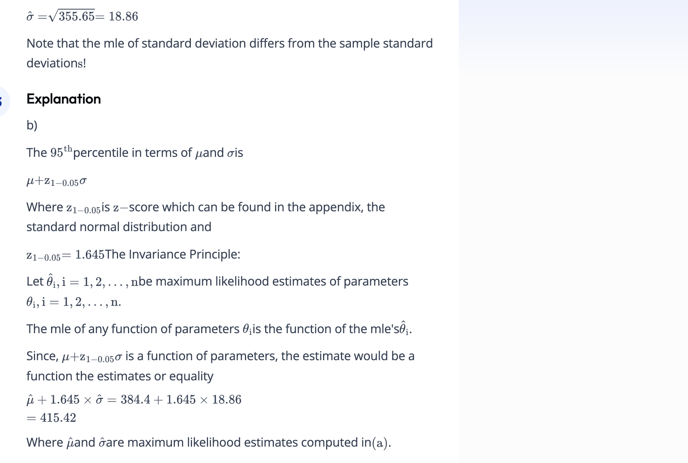

the z score in the back is 1.645 because that splits the middle and gets you the 95% percentile. unsure why the text picture says -0.05

answer: 415.42

11. "At time t = 0, 20 identical components are tested. The lifetime distribution of each is exponential with parameter lambda. The experimenter then leaves the test facility unmonitored. On his return 24 hours later, the experimenter immediately terminates the test after noticing that y = 15 of the 20 components are still in operation (so 5 have failed). Derive the mle of lambda. [Hint: Let Y = the number that survive 24 hours. Then Y ~ Bin(n, p). What is the mle of p? Now notice that p = P(X_I >= 24), where X_I is exponentially distributed. This relates lambda to p, so the former can be estimated once the latter has been.] (4 decimal places)"

topic: mLE and invariance

The invariance principle is used in the example you've provided because it allows the experimenter to estimate the parameter λ of the exponential distribution indirectly through another parameter that is more directly observable from the experiment.

The invariance principle in the context of statistical estimation, particularly with regard to Maximum Likelihood Estimation (MLE), is an important concept. It states that if you have an estimator that is derived from a certain method, like MLE, then any transformation of this estimator will also be the best estimator of the transformation of the parameter under the same criteria.

More formally, if \( \hat{\theta} \) is the MLE of \( \theta \), and if there is a function \( g(\cdot) \), then \( g(\hat{\theta}) \) is the MLE of \( g(\theta) \). The principle asserts that the process of estimation commutes with the process of transformation. This means that you can either transform the parameter and then estimate, or estimate the parameter and then transform, and you should get the same result.

This is particularly useful because it allows us to find MLEs for parameters that are functions of the parameters of the underlying distribution without having to derive the likelihood function from scratch for the transformed parameters.

For example, if \( \hat{\lambda} \) is the MLE of the parameter \( \lambda \) in an exponential distribution, and you are interested in the MLE of the mean lifetime \( \mu = 1/\lambda \) of the components (since the mean of an exponential distribution is the inverse of its rate parameter), then by the invariance principle, \( 1/\hat{\lambda} \) will be the MLE of \( \mu \). You do not need to derive a new MLE specifically for \( \mu \); you can simply take the reciprocal of the MLE of \( \lambda \).

No, the invariance principle is not the reason why we take the logarithm when finding the maximum likelihood estimator (MLE). Instead, the reasons for taking the logarithm, as explained earlier, are to simplify the product into a sum, to make the derivative easier to work with, to avoid numerical underflow, and to ensure that the optimization problem is concave, which guarantees that any local maximum is a global maximum.

The invariance principle comes into play after we have found the MLE. It tells us that if we want to estimate a function of the parameter, we can safely apply this function to our MLE of the parameter. For example, if we have found the MLE of \( \lambda \) and we want to find the MLE of \( \theta = 1/\lambda \), we can simply take the reciprocal of the MLE of \( \lambda \) to get the MLE of \( \theta \).

So, while the log transformation is a computational and mathematical convenience in the process of finding the MLE, the invariance principle is a property that allows us to extend our MLE findings to functions of the estimated parameters.

work: https://www.vaia.com/en-us/textbooks/math/probability-and-statistics-for-engineering-and-sciences-9th/point-estimation/q30e-at-time-rmt-0-20-identical-components-are-tested-the-li/

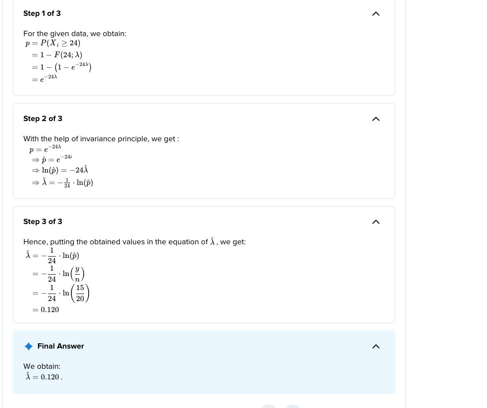

12. "Let X denote the proportion of allotted time that a randomly selected student spends working on a certain aptitude test. Suppose the pdf of X is (see diagram on page 264 exercise #22) Obtain the maximum likelihood estimator of theta, and then compute the estimate for the given data. (2 decimal places)"

work: https://www.vaia.com/en-us/textbooks/math/probability-and-statistics-for-engineering-and-sciences-9th/point-estimation/q22e-let-rmx-denote-the-proportion-of-allotted-time-that-a-r/

also chat gpt:
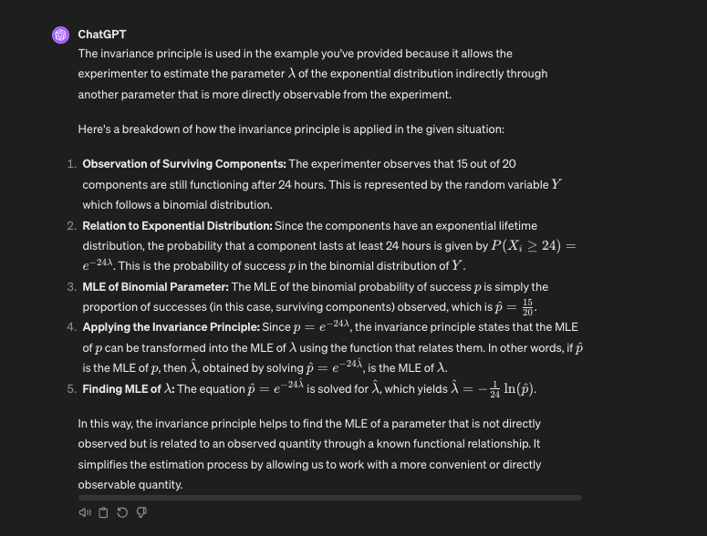

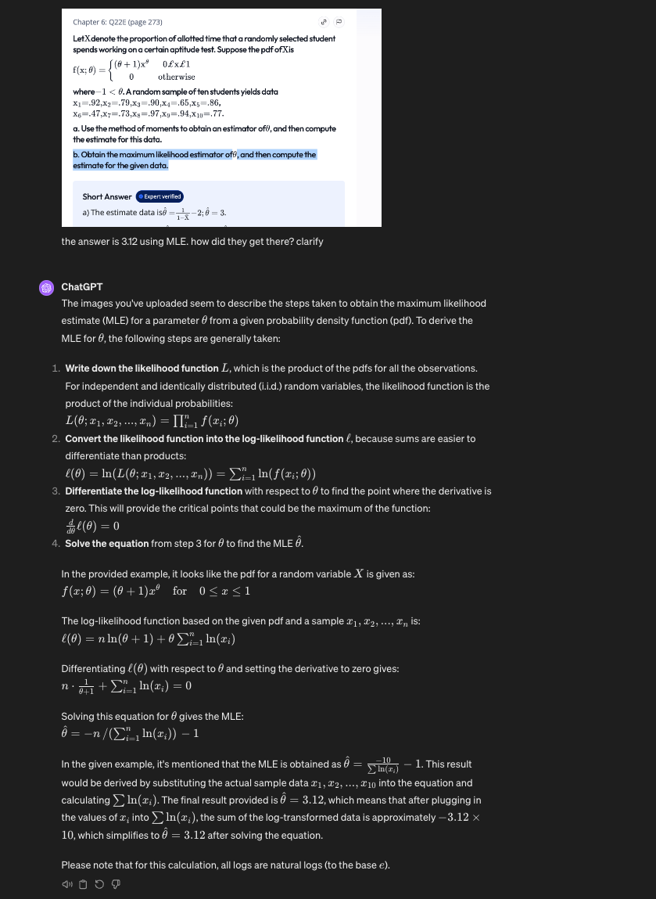
answer: 3.12

13. "A random sample of 10 houses in a particular area, each of which is heated with natural gas, is selected and the amount of gas (therms) used during the month of January is determined for each house. The resulting observations are 103, 156, 118, 89, 125, 147, 122, 109, 138, 99. Let m denote the average gas usage during January by all houses in this area. Compute a point estimate of m. (2 decimal places)"

work:
https://homework.study.com/explanation/a-random-sample-of-ten-homes-in-a-particular-area-each-heated-with-natural-gas-is-selected-and-the-amount-of-gas-in-therms-used-during-january-is-determined-for-each-home-the-resulting-observati.html

14. A random sample of 10 houses in a particular area, each of which is heated with natural gas, is selected and the amount of gas (therms) used during the month of January is determined for each house. The resulting observations are 103, 156, 118, 89, 125, 147, 122, 109, 138, 99. Give a point estimate of the population median usage (the middle value in the population of all houses).

work: https://homework.study.com/explanation/a-random-sample-of-ten-homes-in-a-particular-area-each-heated-with-natural-gas-is-selected-and-the-amount-of-gas-in-therms-used-during-january-is-determined-for-each-home-the-resulting-observati.html

15. A random sample of 10 houses in a particular area, each of which is heated with natural gas, is selected and the amount of gas (therms) used during the month of January is determined for each house. The resulting observations are 103, 156, 118, 89, 125, 147, 122, 109, 138, 99. Give a point estimate of the population median usage (the middle value in the population of all houses).

To estimate the population median usage of gas for all houses in the area from the sample provided, we can calculate the sample median. The sample median is a robust estimator of the population median, particularly when the sample size is small.

Here is how to calculate the sample median:

1. Arrange the data in ascending order.
2. If the number of observations (n) is odd, the median is the middle number.
3. If n is even, the median is the average of the two middle numbers.

Given the sample data (n=10, which is even), the observations in ascending order are:

\[ 89, 99, 103, 109, 118, 122, 125, 138, 147, 156 \]

Since the number of observations is even (10 in this case), we take the average of the 5th and 6th values, which are the two middle numbers after sorting the data.

So, the sample median is:

\[ \text{Median} = \frac{118 + 122}{2} = \frac{240}{2} = 120 \]

Thus, a point estimate of the population median usage of gas for all houses would be 120 therms.

16. "In a random sample of 80 components of a certain type, 12 are found to be defective. A system is to be constructed by randomly selecting two of these components and connecting them in series, as shown in diagram on page 254 exercise #8b. The series connection implies that the system will function if and only if neither component is defective (i.e., both components work properly). Estimate the proportion of all such systems that work properly. [Hint: If p denotes the probability that a component works properly, how can P(system works) be expressed in terms of p?] (3 decimal places)"

work: chrome-extension://efaidnbmnnnibpcajpcglclefindmkaj/https://stt.msu.edu/Academics/ClassPages/uploads/US19/351-101/Lecture-10.pdf

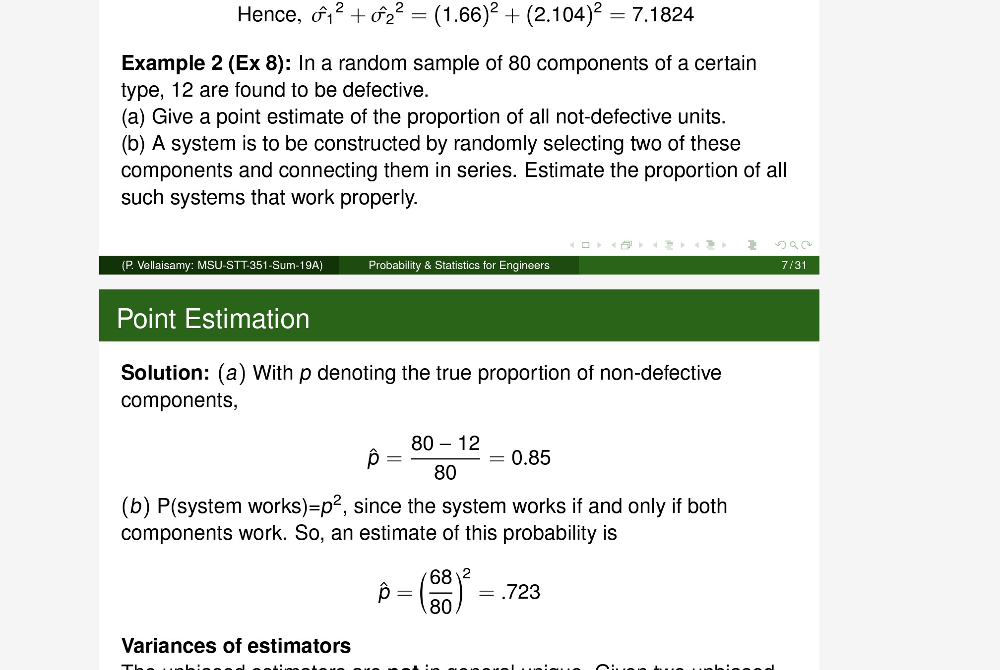

17. "Suppose there are 10,000 houses in an area that use natural gas for heating. Let Greek letter 'tau' denote the total amount of gas used by all 10,000 of these houses during January. Estimate mu_hat using the average gas usage of data points, {103, 156, 118, 89, 125, 147, 122, 109, 138, 99}, times 'tau'

answer: 120.6

18. Refer to Exercise 25. Suppose we decide to examine another test spot weld. Let X = shear strength of the weld. Use the given data to obtain the mle of P(X <= 400). [Hint: P(X <= 400) = Phi((400 - mu)/sigma).] (4 decimal places)

work: https://www.vaia.com/en-us/textbooks/math/probability-and-statistics-for-engineering-and-sciences-9th/point-estimation/q25e-the-shear-strength-of-each-of-ten-test-spot-welds-is-de/

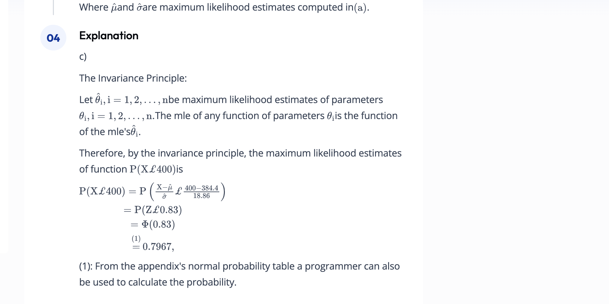

why do we use the sample mean?
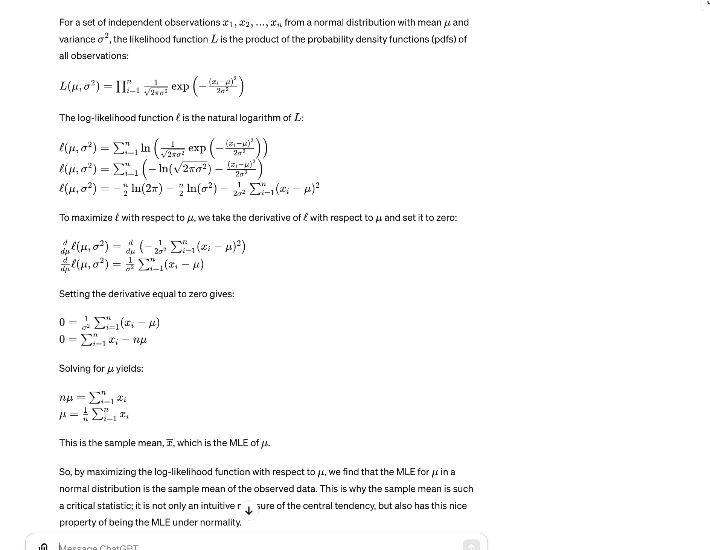

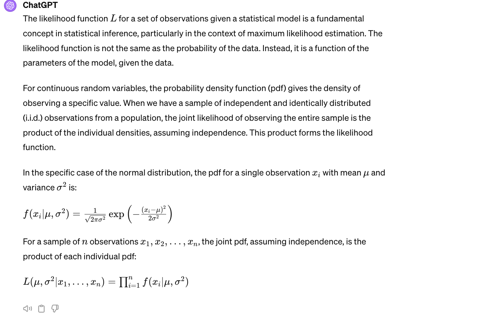

answer: 0.7967

19. Consider the accompanying observations on stream flow (1000s of acre-feet) recorded at a station in Colorado for the period April 1 - August 31 over a 31-year span (from an article in the 1974 volume of Water Resources Research). (See table on page 253 exercise #6) An appropriate probability plot supports the use of the lognormal distribution (see Section 4.5) as a reasonable model for stream flow. Use the estimates of mu = 5.102 and sigma = 0.4961 to calculate an estimate of the expected value of stream flow. [Hint: What is E(X)?] (2 decimal places)

work: https://homework.study.com/explanation/consider-the-accompanying-observations-on-stream-flow-1000s-of-acre-feet-recorded-at-a-station-in-colorado-for-the-period-april-1-august-31-over-a-31-year-span-210-07-200-19-330-33-262-09-192-24-1.html

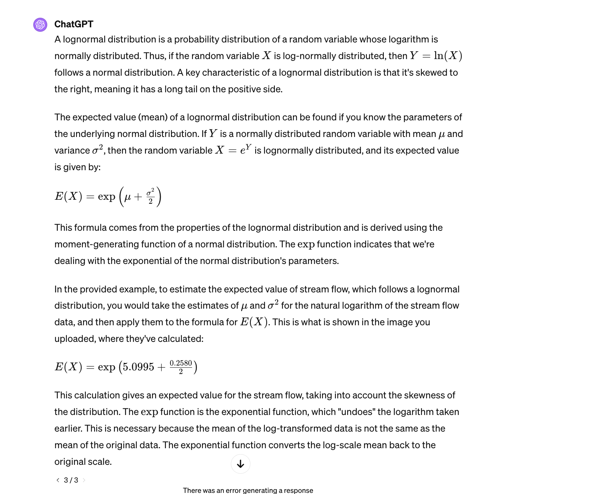

so we're using the sample data to measure the population data.
we use the estimates of the parameters, derived from the sample data to estimate population data.

answer: 186.51

20. Suppose the proportion of rural voters in a certain state who favor a particular gubernatorial candidate is 0.45 and the proportion of suburban and urban voters favoring the candidate is 0.60. If a sample of 200 rural voters and 300 urban and suburban voters is obtained, what is the approximate probability to four decimal places that at least 250 of these voters favor this candidate?
work: https://www.vaia.com/en-us/textbooks/math/probability-and-statistics-for-engineering-and-sciences-9th/joint-probability-distributions-and-random-samples/q82se-suppose-the-proportion-of-rural-voters-in-a-certain-st/
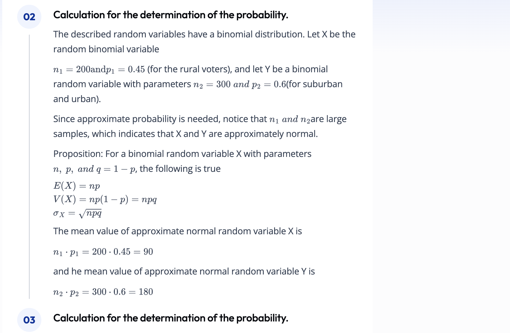
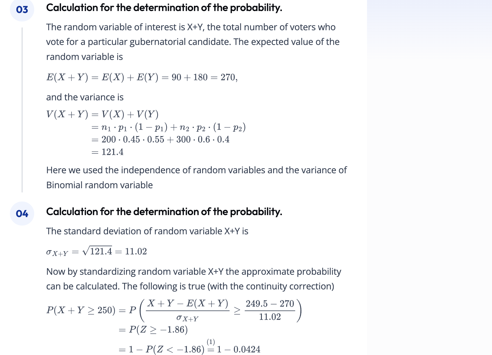
and that equals 0.9686 using a z table.

answer: 0.9686
