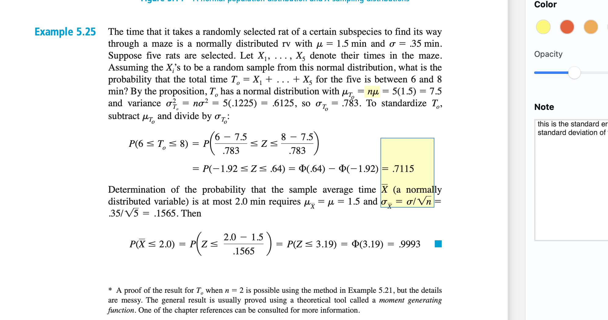

# Topics
Point estimate
bias

# some review

This is a good example problem. two topics it covers:

- standardization: converting a normal distribution to be standard around the mean so you can then use a ztable to find the probabilities. IT involves subtracting the mean and then dividing by the standard deviation to find the z score.
- standard error = standard deviation of the mean

# Notes

## Point estimates

Yes, in statistics, \( \theta \) (theta) is often used as a general notation for a parameter of a probability distribution or model. It's a way to generalize different possible parameters. For instance:

- In the context of a normal distribution, \( \theta \) might represent the mean (\( \mu \)) or the variance (\( \sigma^2 \)).
- In a binomial distribution, \( \theta \) could represent the probability of success (\( p \)).

It is a variable in the sense that it can take on different values, but it is not a random variable; it's a fixed but unknown value that we aim to estimate or make inferences about. Parameters define the characteristics of a distribution, and different values of \( \theta \) would imply different distributions.

In inferential statistics, we often talk about estimating \( \theta \) from sample data because we usually don't know the true parameter value of the entire population. Estimators are random variables because they are calculated from sample data, and samples are subject to variability. Once we calculate an estimate from a specific sample, it becomes a point estimate, which is a fixed number.

bias = point estimate - real value
an unbiased estimator is when the estimate of the point estimate (theta) is = real parameter value.

