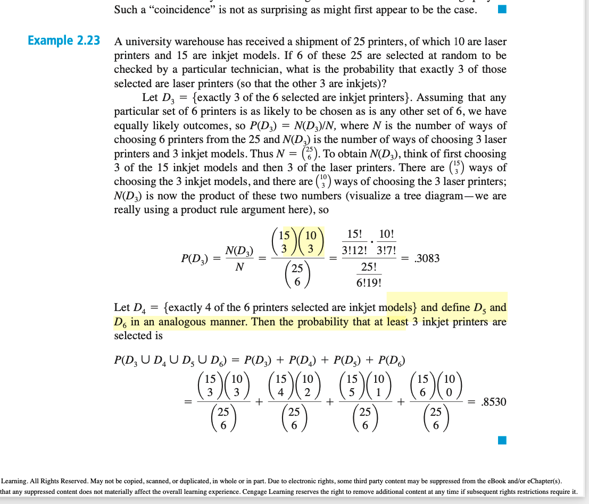

# Terms to Review
- Sample Space
- Events

# Example problems to review.

1. Example 2.23

- the word "least" should suggest to you that you need to add up the probabilities.

2. Non intuitive at first but it makes sense

You might ask why does the 2nd way of calculating this make sense. Why is it 95_c_5 on top?
- but why is it just 95C9/100C10? IF you think about it hard, it makes sense. if you add up all the ways you can do 95C9 for the last 9 beatles songs after the first 5 are chosen (and there’s only 1 way for this to happen) you should get the probability of the 5th song being a beatles song. It kind of makes sense. If you take into account all the ways 95C9 occurs, and there’s only 1 way for the last beatles song to be the 5th, and you divide it by the 100C10, you should get the probability that the last beatles song is 5th.
